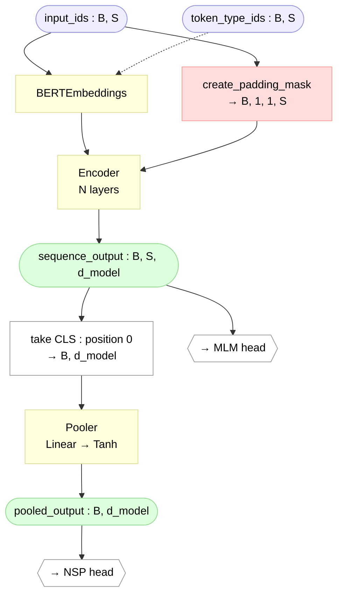

# BERT Model (`bert.py`)

> Module: [`BERT/models/bert.py`](../../models/bert.py) — `BERTModel`
> Paper: Devlin et al. 2019, [*BERT*](https://arxiv.org/abs/1810.04805), §3 (Model Architecture)

`bert.py` is the **top-level assembly** — the file that glues the pieces together
into the full pre-training body:

```
embeddings → encoder → (sequence_output, pooled_output)
```

It owns no new "math" of its own; the embeddings, the encoder block, the attention,
and the masks are all documented elsewhere (and several are *reused* from
`transformer/`). This page covers what `bert.py` itself adds: the **two outputs**, the
**pooler**, the **weight initialization**, and how the **padding mask** is built.

Throughout, **B** = batch size, **S** = sequence length, **d_model** = hidden dimension
(768 for BERT-base).

## Contents

- [What this file assembles](#what-this-file-assembles)
- [Forward pass](#forward-pass)
- [The two outputs: `sequence_output` & `pooled_output`](#the-two-outputs-sequence_output--pooled_output)
- [The pooler](#the-pooler)
- [Weight initialization](#weight-initialization)
- [The padding mask (reused)](#the-padding-mask-reused)
- [Sizes](#sizes)
- [References](#references)

---

## What this file assembles

| Piece | Where it lives | Reused? |
|---|---|---|
| `BERTEmbeddings` | local [`embeddings.py`](../../models/modules/embeddings.py) | BERT-local |
| `Encoder` (N layers) | local [`encoder.py`](../../models/encoder.py) | BERT-local (but its MHA + LayerNorm are imported from `transformer/`) |
| `create_padding_mask` | [`transformer/utils/mask_utils.py`](../../../transformer/utils/mask_utils.py) | **reused unchanged** |
| Pooler (`Linear` + `Tanh`) | defined here in `bert.py` | new |
| `_init_weights` | defined here in `bert.py` | new |

The mask reuse matters: BERT is **encoder-only**, so it only ever needs the *padding*
mask (no causal mask). `create_padding_mask` already returns the exact `(B, 1, 1, S)`
tensor the attention expects — so there is nothing to re-write.

## Forward pass



`forward(input_ids, token_type_ids=None)`:

1. Build the padding mask from `input_ids` (positions equal to `pad_idx` → 0).
2. `embeddings(input_ids, token_type_ids)` → `(B, S, d_model)`.
3. `encoder(embeddings, mask)` → `sequence_output` `(B, S, d_model)`.
4. Pool the `[CLS]` token (position 0) → `pooled_output` `(B, d_model)`.

The model takes **no `attention_mask` argument** — it derives the mask internally from
`input_ids`, matching how `transformer/` builds its own masks. (This is the one place we
deliberately differ from HF, which exposes a caller-supplied `attention_mask`.)

## The two outputs: `sequence_output` & `pooled_output`

| Output | Shape | Paper notation | Consumed by |
|---|---|---|---|
| `sequence_output` | `(B, S, d_model)` | `T₁ … T_N` (per-token final states) | **MLM head** — predicts the original token at masked positions |
| `sequence_output[:, 0]` | `(B, d_model)` | `C` (raw `[CLS]` final state) | — |
| `pooled_output` | `(B, d_model)` | `C` *after* the pooler | **NSP / classification head** |

So the two pre-training objectives read from different places: MLM looks at the
**per-token** states (specifically the masked positions), NSP looks at the single
**`[CLS]`** vector. Returning both matches HF's `BertModel`.

> Nuance: the paper's `C` is strictly the **raw** `[CLS]` final hidden state
> (`sequence_output[:, 0]`). `pooled_output` is that `C` passed through the pooler. The
> pooler is an implementation detail (Google's `modeling.py`), not in the paper's
> notation — but it's what the NSP head actually consumes.

## The pooler

```python
self.pooler = nn.Linear(d_model, d_model)
self.pooler_activation = nn.Tanh()
...
pooled_output = self.pooler_activation(self.pooler(sequence_output[:, 0]))
```

- **Position 0 only.** `sequence_output[:, 0]` selects the `[CLS]` token's `(B, d_model)`
  vector. By the time it reaches the pooler, self-attention inside the encoder has
  already let `[CLS]` absorb information from every token — so it's a whole-sequence
  summary. (No attention happens *in* the pooler; it's a plain feed-forward layer.)
- **`Linear(768→768) + Tanh`.** A learned projection (~0.6M trainable params) plus a
  bounded non-linearity. It's trained during pre-training via the NSP head's gradient,
  so `[CLS]` *learns* to be a good summary.
- **Where it comes from:** Google's `modeling.py` (`tf.layers.dense(..., activation=tf.tanh)`
  in the `"pooler"` scope) and HF's `BertPooler`. It is **not** in the paper text — an
  implementation convention.

> Honest caveat: this pooler is famously not very useful on its own; raw `[CLS]` or
> mean-pooling often work as well downstream. It exists mainly because NSP needed *some*
> fixed sentence vector during pre-training. We keep it for faithfulness.

## Weight initialization

Every weight is drawn from a **Truncated Normal(0, 0.02)** cut at **±2σ**:

```python
def _init_weights(self, module):
    std = self.initializer_range            # 0.02
    if isinstance(module, nn.Linear):
        nn.init.trunc_normal_(module.weight, mean=0.0, std=std, a=-2*std, b=2*std)
        if module.bias is not None:
            nn.init.zeros_(module.bias)
    elif isinstance(module, nn.Embedding):
        nn.init.trunc_normal_(module.weight, mean=0.0, std=std, a=-2*std, b=2*std)
        if module.padding_idx is not None:
            module.weight.data[module.padding_idx].zero_()
```

Several points we settled on:

- **`0.02` is not in the paper.** The paper's hyperparameter list (§A.2) never mentions
  initialization. `initializer_range = 0.02` is the **default in Google's TF BERT
  `modeling.py`** (`BertConfig`), inherited from OpenAI GPT. It's an empirical small std,
  not a derived value.
- **Truncated, not plain, normal — to match Google.** Google's `modeling.py` uses
  `truncated_normal_initializer(stddev=0.02)`, which TF hardcodes to truncate at ±2σ
  (here `[-0.04, +0.04]`). We mirror that. HF instead uses a **plain** `normal_` — so
  this is a deliberate faithfulness choice, consistent with our GELU decision in
  [`feed_forward.md`](../modules/feed_forward.md). The practical difference at std=0.02 is
  negligible.
- **PyTorch gotcha:** `trunc_normal_`'s default bounds `a=-2, b=2` are **absolute**, not
  "2σ" — so we pass `a=-2*std, b=2*std` explicitly.
- **`self.apply(self._init_weights)` must be the last line of `__init__`.** `apply()`
  recurses over *every* submodule and **overrides each one's own init** — including the
  imported MHA's `xavier_uniform_`. So in BERT, the attention's xavier init is thrown
  away and replaced by `0.02`; the same MHA keeps its xavier in `transformer/`, which has
  no such global override. Any module constructed *after* this line would keep its
  default init and miss the override.
- **`[PAD]` row re-zeroed.** `trunc_normal_` re-randomizes the *whole* embedding table,
  including the `[PAD]` row that `nn.Embedding(padding_idx=…)` had zeroed at
  construction — so we zero it again. Because `padding_idx` freezes that row's gradient,
  it then stays zero through training.
- **LayerNorm** needs no handling: the transformer's `LayerNorm` already constructs
  `γ = 1`, `β = 0`.

## The padding mask (reused)

```python
src_mask = create_padding_mask(input_ids, self.pad_idx)   # (B, 1, 1, S)
```

Sequences in a batch are padded to a common length `S`, so the mask tells attention
which positions are real (1) vs padding (0). The shape `(B, 1, 1, S)` broadcasts against
the attention score grid `(B, num_heads, S, S)`: the two `1`s stand in for `num_heads`
and the query axis (the mask is the same across both), and the final `S` flags each
**key** position. Inside attention, `masked_fill(mask == 0, -inf)` then sends pad columns
to `-inf`, so after softmax their weight is exactly 0 and padding contributes nothing.

This is the *only* mask BERT needs — no causal mask anywhere, which is exactly what makes
it bidirectional (see [`encoder.md`](encoder.md#bidirectional--special-block)).

## Sizes

| | layers (N) | d_model | heads | d_ff | params |
|---|---|---|---|---|---|
| BERT-base | 12 | 768 | 12 | 3072 | ~110M |
| BERT-large | 24 | 1024 | 16 | 4096 | ~340M |

Where BERT-base's ~110M lives (see [`encoder.md`](encoder.md#sizes) for the per-layer
encoder derivation):

| Part | Built in | Params |
|---|---|---|
| Encoder body — 12 layers | [`encoder.py`](../../models/encoder.py) | 85,054,464 |
| Token table — 30522 × 768 | [`embeddings.py`](../../models/modules/embeddings.py) | 23,440,896 |
| Position (512×768) + segment (2×768) + embed LayerNorm | [`embeddings.py`](../../models/modules/embeddings.py) | ~0.4M |
| Pooler — Linear 768×768 + bias | `bert.py` | 590,592 |
| **Total** | assembled here | **~109.5M ≈ 110M** |

## References

- **Paper:** Devlin et al. 2019, [*BERT*](https://arxiv.org/abs/1810.04805) — §3 (architecture), §A.2 (pre-training hyperparameters; note: no init mentioned)
- **Official Google BERT (TF):** [`modeling.py`](https://github.com/google-research/bert/blob/master/modeling.py) — `BertModel` (pooler), `BertConfig` (`initializer_range=0.02`), `truncated_normal_initializer`
- **HF Transformers (PyTorch), pinned to v5.12.0:** [`modeling_bert.py`](https://github.com/huggingface/transformers/blob/v5.12.0/src/transformers/models/bert/modeling_bert.py) — `BertModel`, `BertPooler`; the `normal_` init lives in the base [`PreTrainedModel._init_weights`](https://github.com/huggingface/transformers/blob/v5.12.0/src/transformers/modeling_utils.py) (plain, untruncated normal)
- **Encoder block (full mechanics):** [`encoder.md`](encoder.md)
- **Embeddings (the three tables):** [`embeddings.md`](../modules/embeddings.md)
- **Feed-forward (the GELU change):** [`feed_forward.md`](../modules/feed_forward.md)
