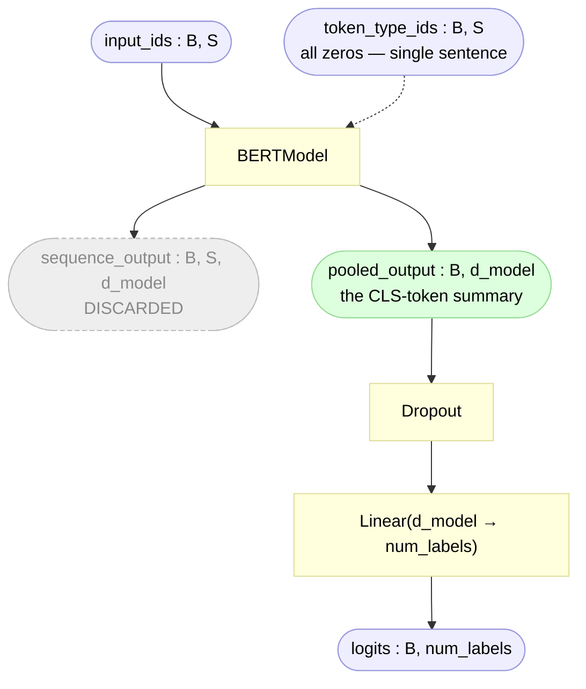

# BERT For Sequence Classification (`bert_for_classification.py`)

> Module: [`BERT/models/bert_for_classification.py`](../../models/bert_for_classification.py) — `BERTForSequenceClassification`
> Paper: Devlin et al. 2019, [*BERT*](https://arxiv.org/abs/1810.04805), §4.1 (single-sentence classification) & §3.5 (fine-tuning)

`bert_for_classification.py` is the **top assembly for fine-tuning**. Like its pre-training
sibling ([`bert_for_pretraining.py`](bert_for_pretraining.md)) it owns nothing new
architecturally — it keeps the encoder body and bolts on a single classification layer:

```
input_ids ─► BERTModel (body) ─► pooled_output ([CLS]) ─► dropout ─► Linear(d_model → num_labels) ─► logits
```

The body is [`bert.py`](bert.md). The pre-training heads (MLM/NSP) are **gone** — they were
task-specific scaffolding, dropped at the [transplant](../scripts/finetune.md#the-transplant).
§3.5 pins down exactly what's new: *"the only new parameters introduced during fine-tuning
are classification layer weights W ∈ R^(K×H)"* — that's this file's `self.classifier`.

Throughout, **B** = batch size, **S** = sequence length, **d_model** = hidden dimension
(256 in our base run), **K** = `num_labels` (6 for `sna.bn`).

## Contents

- [What this file assembles](#what-this-file-assembles)
- [Forward pass](#forward-pass)
- [Why the pooled `[CLS]`, not the sequence](#why-the-pooled-cls-not-the-sequence)
- [The init ordering problem — simpler than pre-training's](#the-init-ordering-problem--simpler-than-pre-trainings)
- [Why the loss lives elsewhere](#why-the-loss-lives-elsewhere)
- [Sizes](#sizes)
- [References](#references)

---

## What this file assembles

| Piece | Where it lives | Role here |
|---|---|---|
| `BERTModel` | [`bert.py`](../../models/bert.py) | the body — embeddings + encoder + **pooler** |
| `nn.Dropout` | this file | regularizes the pooled `[CLS]` before the head |
| `nn.Linear(d_model, num_labels)` | this file | the **only new params** — the K-way classifier |
| classifier init | this file | applies BERT's `0.02` scheme to the fresh layer |

No new math, no attention, no custom layers — just the body plus a two-line head. The wrapper
exists so the pipeline (data → model → loss → optimizer) has a **single object** to call, and
so the one seam that matters (initializing the fresh classifier the same way as the body) is
handled in one place.

Contrast with [`bert_for_pretraining.py`](bert_for_pretraining.md): pre-training assembled
**two** heads (MLM + NSP) and had to manage a *weight tie* to the token table. Classification
has **one** head and **no tie** — strictly simpler.

## Forward pass



```python
def forward(self, input_ids, token_type_ids=None):
    _, pooled_output = self.bert(input_ids, token_type_ids)   # keep pooled, drop sequence
    return self.classifier(self.dropout(pooled_output))       # (B, num_labels)
```

Two things to notice:

- **`forward` returns only logits** — no label, no loss (same separation as pre-training). The
  label enters only at the [loss](#why-the-loss-lives-elsewhere), outside the model.
- **The `_` throws away `sequence_output`.** The per-token states `(B, S, d_model)` aren't needed
  for whole-sentence classification — only the single pooled vector is.

## Why the pooled `[CLS]`, not the sequence

`BERTModel` returns two things (see [`bert.md`](bert.md)):

| output | shape | meaning | used here? |
|---|---|---|---|
| `sequence_output` | `(B, S, d_model)` | one vector **per token** | ✗ (token-level tasks need this) |
| `pooled_output` | `(B, d_model)` | `Linear+Tanh` over the **`[CLS]`** row | ✓ |

§4.1: *"we take the final hidden state ... of the first token ([CLS]) as the aggregate
representation."* The pooler (`Linear(d_model, d_model) + Tanh`, built inside the body) already
transforms `sequence_output[:, 0]` into `pooled_output` — so the classifier consumes one clean
`(B, d_model)` summary per sentence and maps it to K class scores. For `sna.bn` that's
`(B, 256) → (B, 6)`.

## The init ordering problem — simpler than pre-training's

Same root cause as [pre-training](bert_for_pretraining.md#the-init-ordering-problem), one-third
the fix. [`bert.py`](bert.md#weight-initialization) runs `self.apply(self._init_weights)` as the
**last line of its own `__init__`**, so when `BERTModel(...)` returns, the whole body is already
at BERT's `0.02` truncated-normal. But `self.classifier` is built **after** that, here — so it
still sits at PyTorch's default `kaiming_uniform_`. We fix exactly that one module, reusing the
body's own init so the formula stays single-sourced:

```python
self.dropout = nn.Dropout(dropout)
self.classifier = nn.Linear(d_model, num_labels)
self.bert._init_weights(self.classifier)     # apply BERT's 0.02 scheme to the fresh head
```

No weight tie to preserve, no shared token table to avoid re-randomizing (pre-training's two
gotchas) — dropout has no params, and the classifier is a plain standalone `Linear`. One call, done.

> **Why not let the classifier keep PyTorch's default init?** Consistency and reproducibility:
> BERT's `0.02` scheme is a *global* convention defined once in `bert._init_weights`. Initializing
> the head the same way keeps the whole model single-sourced and makes runs comparable.

## Why the loss lives elsewhere

`forward` returns logits, not loss — the same separation the [transformer](../../../transformer/utils/loss.py)
and [`bert_for_pretraining.py`](bert_for_pretraining.md#why-the-loss-lives-elsewhere) already use.
The classification loss is a plain `nn.CrossEntropyLoss`, **built in
[`finetune.py`](../scripts/finetune.md)** and **called in
[`finetune_utils.py`](../utils/finetune_utils.md)**:

```python
logits = model(input_ids, token_type_ids)     # architecture (this file) — no label
loss   = criterion(logits, labels)            # training only (finetune_utils.py)
loss.backward()
```

The model never sees a label, never knows `num_labels` reaches the loss (CrossEntropyLoss reads
the class count from the logits' last dim), and stays a clean `ids → logits` function usable at
inference. Three concerns — **architecture** (here), **loss** (`finetune_utils.py`),
**optimizer/backward** ([`finetune.py`](../scripts/finetune.md)) — stay in three places.

## Sizes

The fine-tune model is **body + one Linear**. It's *smaller* than the pre-training model, because
the classifier is far lighter than the discarded MLM/NSP heads:

| Part | Built in | Params (base config) |
|---|---|---|
| Body — embeddings + encoder + pooler | [`bert.py`](bert.md#sizes) | 7,496,448 |
| Classifier — `Linear(256 → 6)` | this file | `256×6 + 6` = 1,542 |
| **Fine-tune total** | assembled here | **7,497,990** |

```
body (transplanted, "our BERT-tiny")   7,496,448
+ classifier  (256×6 + 6)                   1,542
────────────────────────────────────────────────
fine-tune model                         7,497,990   ✓  (matches the run log)
```

Compare the head swap:

```
pre-training heads (MLM transform + V-row bias + NSP)   ~76,818   ← discarded
classification head (Linear 256→6)                        1,542   ← added
```

The body is **identical** to what pre-training trained (that's the whole point of transfer). Only
the head changed, and the K-way head is tiny — §3.5's *"only new parameters"* made concrete: with
K=6, exactly **1,542** new numbers on top of the 7.496M inherited ones. How those 103 `bert.*`
tensors get copied in (and the 8 head tensors dropped) is the [transplant](../scripts/finetune.md#the-transplant).

## References

- **Paper:** Devlin et al. 2019, [*BERT*](https://arxiv.org/abs/1810.04805) — §4.1 (single-sentence classification), §3.5 (only new params = classifier `W`)
- **HF Transformers (PyTorch), pinned to v5.12.0:** [`modeling_bert.py`](https://github.com/huggingface/transformers/blob/v5.12.0/src/transformers/models/bert/modeling_bert.py) — `BertForSequenceClassification` (the equivalent wrapper; note HF computes loss inside its `forward`, we keep it separate)
- **Model body:** [`bert.md`](bert.md) — the pooler that produces `pooled_output`
- **Pre-training sibling:** [`bert_for_pretraining.md`](bert_for_pretraining.md) — the two-head version with weight tie
- **The fine-tune data:** [`finetune_data.md`](../utils/finetune_data.md) · **the loop:** [`finetune_utils.md`](../utils/finetune_utils.md) · **the runbook:** [`finetune.md`](../scripts/finetune.md)
