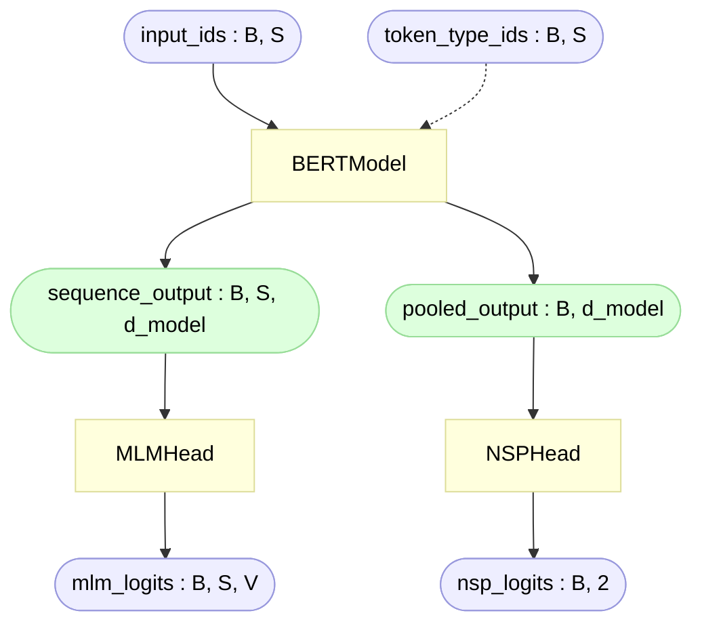

# BERT For Pre-training (`bert_for_pretraining.py`)

> Module: [`BERT/models/bert_for_pretraining.py`](../../models/bert_for_pretraining.py) — `BERTForPreTraining`
> Paper: Devlin et al. 2019, [*BERT*](https://arxiv.org/abs/1810.04805), §3.1 (Pre-training BERT)

`bert_for_pretraining.py` is the **top assembly for pre-training**. It owns nothing new
architecturally — it just glues the two halves that already exist:

```
input_ids ─► BERTModel (body) ─► (sequence_output, pooled_output) ─► BERTPreTrainingHeads ─► (mlm_logits, nsp_logits)
```

The body is [`bert.py`](bert.md); the heads are [`heads.py`](heads.md). This page covers
only what the wrapper itself adds: the **composition**, the **init ordering** (why the tie
and head-init have to happen *here*), and the deliberate decision to keep **loss out**.

Throughout, **B** = batch size, **S** = sequence length, **d_model** = hidden dimension
(768 for BERT-base), **V** = vocab size (30522 for BERT-base).

## Contents

- [What this file assembles](#what-this-file-assembles)
- [Forward pass](#forward-pass)
- [The init ordering problem](#the-init-ordering-problem)
- [Why the loss lives elsewhere](#why-the-loss-lives-elsewhere)
- [Sizes](#sizes)
- [References](#references)

---

## What this file assembles

| Piece | Where it lives | Role here |
|---|---|---|
| `BERTModel` | [`bert.py`](../../models/bert.py) | the body — embeddings + encoder + pooler |
| `BERTPreTrainingHeads` | [`heads.py`](../../models/heads.py) | MLM head + NSP head |
| weight tie + head init | this file | wires the two together correctly |

That's it — no new layers, no new math. The wrapper exists so the rest of the pipeline
(data → model → loss → optimizer) has a **single object** to call, and so the two tricky
seams between body and heads (the tie, and the head's own init) are handled in one place.

## Forward pass



```python
def forward(self, input_ids, token_type_ids=None):
    sequence_output, pooled_output = self.bert(input_ids, token_type_ids)
    mlm_logits, nsp_logits = self.heads(sequence_output, pooled_output)
    return mlm_logits, nsp_logits
```

`forward` returns **only logits** — no labels, no loss. That keeps the wrapper usable for
inference (predicting masked tokens, scoring IsNext) and pushes loss to the training side
(see [below](#why-the-loss-lives-elsewhere)).

## The init ordering problem

This is the one subtle thing the wrapper has to get right. [`bert.py`](bert.md#weight-initialization)
runs `self.apply(self._init_weights)` as the **last line of its own `__init__`** — so by the
time `BERTModel(...)` returns, the whole body is already initialized. But the heads are
built **after** that, *here*, so two things need fixing up at the wrapper level:

**1. The tie — handled inside the heads' constructor.**

```python
self.heads = BERTPreTrainingHeads(
    d_model=d_model,
    embedding_weight=self.bert.embeddings.token_embedding.weight,  # already-init'd table
    layer_norm_eps=layer_norm_eps
)
```

We hand the heads the body's *already-initialized* token table, and `MLMHead` ties its
un-embedding `decoder.weight` to it (see [`heads.md`](heads.md#weight-tying)). Tying after
the body's init is what makes the two layers share one live tensor — re-running `apply`
over everything at this level would re-randomize that shared table and undo the tie.

**2. The head's own params — they missed the body's init.**

`dense` and `classifier` were constructed after `BERTModel`'s `apply` already ran, so they
sit at PyTorch's default `kaiming_uniform_`, **not** BERT's `0.02` truncated-normal. We fix
exactly those two modules — reusing the body's own init function so the formula stays
single-sourced:

```python
self.bert._init_weights(self.heads.mlm.dense)
self.bert._init_weights(self.heads.nsp.classifier)
```

Two things are **deliberately not** in that list:

| Skipped | Why |
|---|---|
| `mlm.decoder` (the tied un-embedding) | its weight *is* the token table — re-initing would re-randomize the shared table and **un-zero the `[PAD]` row** ([bert.py](../../models/bert.py)) |
| `mlm.bias` (the output bias) | it's a bare `nn.Parameter`, not a module, so `_init_weights` never sees it — it correctly keeps its `torch.zeros` init (the per-token frequency prior, see [`heads.md`](heads.md#the-separate-bias)) |

> **Why not just let the heads init themselves?** Because BERT's `0.02` scheme is a
> *global* convention defined once in `bert._init_weights`. Letting `heads.py` self-init
> would duplicate that formula (two places to keep in sync) and force the heads to know
> about — and carefully skip — the tied decoder. The owning wrapper is the natural place to
> apply the body's scheme to the head's own params. The heads stay **pure architecture**.

## Why the loss lives elsewhere

`forward` returns logits, not loss — the same separation [`transformer/`](../../../transformer/utils/loss.py)
already uses (model emits logits; a separate module turns logits + targets into a number).
The combined MLM + NSP loss belongs in [`BERT/utils/loss.py`](../utils/loss.md):

```python
mlm_logits, nsp_logits = model(input_ids, token_type_ids)          # architecture
loss, mlm_loss, nsp_loss = criterion(mlm_logits, nsp_logits,       # training only
                                     mlm_labels, nsp_labels)
loss.backward()
```

Keeping loss out of the model means the wrapper has no idea about `-100`, label tensors, or
how MLM and NSP combine — so the same object works at inference time and stays a clean
`ids → logits` function. The three concerns — **architecture** (here), **loss**
([`utils/loss.py`](../utils/loss.md)), **optimizer/backward** ([`scripts/pretrain.py`](../scripts/pretrain.md)) —
stay in three separate places.

## Sizes

The pre-training model is just **body + heads**:

| Part | Built in | Params (BERT-base) |
|---|---|---|
| Body — embeddings + encoder + pooler | [`bert.py`](bert.md#sizes) | ~109.5M ≈ 110M |
| Heads — MLM transform + bias + NSP | [`heads.py`](heads.md#sizes) | ~0.6M |
| **Pre-training total** | assembled here | **~110.1M** |

```
body (kept, = "BERT-base 110M")   ~109.5M
+ heads (discarded after training)   ~0.6M
─────────────────────────────────────────
pre-training model                ~110.1M
```

The wrapper adds **zero** params of its own — it only references the body and heads. The
tied un-embedding is counted **once** (it's the token table already in the 110M), which
`model.parameters()` handles automatically by de-duplicating shared tensors. After
pre-training you drop `self.heads` and keep `self.bert` (then bolt on a fresh task head for
fine-tuning — see [`heads.md`](heads.md#sizes)).

## References

- **Paper:** Devlin et al. 2019, [*BERT*](https://arxiv.org/abs/1810.04805) — §3.1 (pre-training objectives)
- **HF Transformers (PyTorch), pinned to v5.12.0:** [`modeling_bert.py`](https://github.com/huggingface/transformers/blob/v5.12.0/src/transformers/models/bert/modeling_bert.py) — `BertForPreTraining` (the equivalent wrapper; note HF computes loss inside its `forward`, we keep it separate)
- **Model body:** [`bert.md`](bert.md)
- **The heads (MLM + NSP):** [`heads.md`](heads.md)
- **The combined loss:** [`loss.md`](../utils/loss.md)
