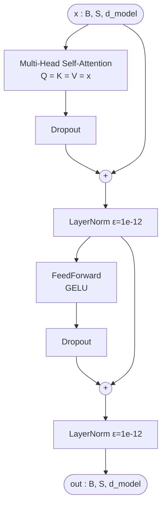

# BERT Encoder

> Module: [`BERT/models/encoder.py`](../../models/encoder.py) — `EncoderLayer`, `Encoder`
> Paper: Devlin et al. 2019, [*BERT*](https://arxiv.org/abs/1810.04805), §3 (Model Architecture)

BERT's body **is** the original Transformer encoder stack. The full block mechanics
(scaled dot-product attention, multi-head split, residual + post-LN, the Add & Norm
pattern) are already documented for our Transformer — see
[`transformer/docs/architecture/encoder.md`](../../../transformer/docs/architecture/encoder.md).
This page only covers **what BERT changes**.

## Contents

- [What's reused vs. what changes](#whats-reused-vs-what-changes)
- [One layer (post-LN)](#one-layer-post-ln)
- [Bidirectional ≠ special block](#bidirectional--special-block)
- [Sizes](#sizes)
- [References](#references)

---

## What's reused vs. what changes

| Component | Source | BERT-specific? |
|---|---|---|
| `MultiHeadAttention` | imported from `transformer/` | reused unchanged |
| `LayerNorm` | imported from `transformer/` | reused, but **ε = 1e-12** (not 1e-5) |
| Feed-forward network | local [`feed_forward.py`](../modules/feed_forward.md) | **GELU** instead of ReLU |
| Block structure (post-LN) | same as Transformer | no |
| Masking | padding mask only | no — see below |

So inside the encoder there is exactly **one architectural change** — ReLU → GELU in the
FFN ([§A.2](../modules/feed_forward.md#2-the-only-real-change-relu--gelu)) — plus one
implementation detail, the LayerNorm ε of `1e-12` threaded through to match
[`BERTEmbeddings`](../modules/embeddings.md).

## One layer (post-LN)

where **B** = batch size, **S** = sequence length, **d_model** = hidden dimension (768 for
BERT-base). Each sub-layer is `LayerNorm(x + Dropout(Sublayer(x)))`. Shape `(B, S, d_model)`
is preserved end to end, which is what lets the residual connections work and what lets `N`
of these stack.

## Bidirectional ≠ special block

The self-attention here is `Q = K = V = src` with a **padding mask only** — every token
attends to every other token in both directions. This is identical to the Transformer
*encoder*; it is **not** a BERT invention.

What makes BERT "bidirectional" is that it is **encoder-only**: no layer anywhere applies
a causal mask. The contrast is with **GPT** / the Transformer *decoder*, which mask future
tokens so each position only sees the past. BERT drops the decoder entirely, so context
flows both ways at every layer — the property the MLM objective is built to exploit.

## Sizes

| | layers (N) | d_model | heads | d_ff |
|---|---|---|---|---|
| BERT-base | 12 | 768 | 12 | 3072 |
| BERT-large | 24 | 1024 | 16 | 4096 |

Embeddings (token + segment + position) are applied **before** the stack; this module only
runs the `N` layers. The encoder body alone is ~85M parameters for BERT-base (~110M total
once embeddings are included).

## References

- **Paper:** Devlin et al. 2019, [*BERT*](https://arxiv.org/abs/1810.04805) — §3 (architecture), §A.2 (GELU)
- **Transformer encoder (full mechanics):** [`transformer/docs/architecture/encoder.md`](../../../transformer/docs/architecture/encoder.md)
- **Feed-forward (the GELU change):** [`feed_forward.md`](../modules/feed_forward.md)
- **Embeddings (the ε=1e-12 source):** [`embeddings.md`](../modules/embeddings.md)
