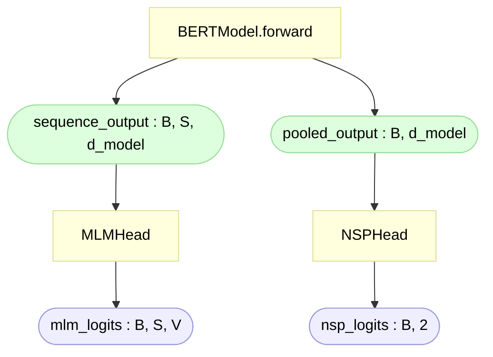

# BERT Pre-training Heads (`heads.py`)

> Module: [`BERT/models/heads.py`](../../models/heads.py) — `MLMHead`, `NSPHead`, `BERTPreTrainingHeads`
> Paper: Devlin et al. 2019, [*BERT*](https://arxiv.org/abs/1810.04805), §3.1 (Pre-training BERT)

`heads.py` sits **on top of** the model body. The encoder gives back two outputs
(see [`bert.md`](bert.md#the-two-outputs-sequence_output--pooled_output)); the heads
turn those into the two pre-training **predictions**:

```
sequence_output (B, S, d_model) ─► MLMHead ─► vocab logits (B, S, vocab)
pooled_output   (B, d_model)    ─► NSPHead ─► 2 logits    (B, 2)
```

The body (embeddings + encoder) is kept forever; **the heads are pre-training scaffolding
and are thrown away afterward** — you fine-tune the body with a *new* task head. That
disposability is the key to understanding why the MLM head looks the way it does.

Throughout, **B** = batch size, **S** = sequence length, **d_model** = hidden dimension
(768 for BERT-base), **V** = vocab size (30522 for BERT-base).

## Contents

- [What this file adds](#what-this-file-adds)
- [Where the inputs come from](#where-the-inputs-come-from)
- [MLM head](#mlm-head)
  - [The two stages](#the-two-stages)
  - [Why the transform exists (the river/bank example)](#why-the-transform-exists-the-riverbank-example)
  - [Weight tying](#weight-tying)
  - [The separate bias](#the-separate-bias)
  - [Logits for every position](#logits-for-every-position)
- [NSP head](#nsp-head)
- [Sizes](#sizes)
- [References](#references)

---

## What this file adds

| Piece | What it does | Reads | Outputs |
|---|---|---|---|
| `MLMHead` | predict the original token at masked positions | `sequence_output` | `(B, S, V)` |
| `NSPHead` | IsNext vs NotNext, 2-way | `pooled_output` | `(B, 2)` |
| `BERTPreTrainingHeads` | bundles both, calls them in one go | both outputs | both logits |

`gelu` (tanh form) and `LayerNorm` are **reused** — the same ones the encoder uses
(imported from [`feed_forward.py`](../../models/modules/feed_forward.py) and `transformer/`),
so the MLM transform is consistent with the rest of BERT (GELU per §A.2, ε = 1e-12).

## Where the inputs come from

Both heads read the two return values of [`bert.py`](../../models/bert.py)'s `forward`:



The two heads read **different slices of the same forward pass** — MLM the per-token
states, NSP the `[CLS]` summary. `[CLS]` is just position 0 of `sequence_output`;
`pooled_output` is that row after the pooler's Linear+Tanh.

Each row of `sequence_output` is a **contextual** vector — the meaning of that token
*in this sentence*. Same input token, different sentence → different vector:

```
"river bank"   → "bank" vector leans toward {water, shore, land}
"savings bank" → "bank" vector leans toward {money, account, loan}
```

This is what the encoder produces and what the heads consume.

## MLM head

### The two stages

```python
# Stage 1 — transform (shape-preserving)
x = self.dense(sequence_output)   # (B, S, 768) → (B, S, 768)   learned rotation
x = gelu(x)                       # (B, S, 768)                 non-linearity
x = self.layer_norm(x)            # (B, S, 768)                 stabilize scale
# Stage 2 — un-embedding
logits = self.decoder(x) + self.bias   # (B, S, 768) → (B, S, V)
```

| Stage | Layer | Shape | Trainable? | Free or tied? |
|---|---|---|---|---|
| transform | `dense` (768→768) + GELU + LayerNorm | `(B,S,768)` → `(B,S,768)` | yes | **free** |
| un-embedding | `decoder` (768→V) | `(B,S,768)` → `(B,S,V)` | yes | **tied** to embeddings |
| bias | `self.bias` (V,) | broadcast over logits | yes | **free** |

Stage 1 never changes the shape — `(B, S, 768)` in and out. Only stage 2 widens to
vocab size.

> **Note on the name `decoder`.** BERT is **encoder-only** — there is *no* Transformer
> decoder here (no cross-attention, no causal mask). Stage 2 is a single linear that
> "un-embeds": it maps a 768-vector back to vocab logits, the reverse of the embedding
> lookup. The variable is called `decoder` only because that's the conventional name for
> this un-embedding projection.

### Why the transform exists (the river/bank example)

This is the subtle part. **Why not un-embed `sequence_output` directly?** Because the
contextual vector naturally points at the **context**, not at the **answer**.

Worked example with `d_model = 2` so we can see the vectors. Tiny vocab, with the table
that is *also* the tied un-embedding matrix:

```
river = [0.0, 1.0]
bank  = [1.0, 0.0]
money = [0.9, 0.2]
```

Sentence **`"river [MASK]"`**, correct answer **`bank`**. The encoder, having attended to
`river`, produces a `[MASK]` vector that leans *river-ward*:

```
h = sequence_output at [MASK] = [0.15, 0.95]   ← river-direction
```

**Without the transform** — dot `h` against every row (`h @ embedding_weight.T`):

```
logit(river) = 0.15·0.0 + 0.95·1.0 = 0.95   ← HIGHEST  ❌ predicts "river"
logit(money) = 0.15·0.9 + 0.95·0.2 = 0.33
logit(bank)  = 0.15·1.0 + 0.95·0.0 = 0.15
```

It predicts the **context word** `river`, because that's the direction `h` points. "What
does the context look like" ≠ "what word goes here" — and a raw tied dot-product can only
answer the first.

**With the transform** — `dense` is a free learned matrix that rotates *context-direction
→ target-word direction*:

```
x = layer_norm(gelu(dense(h))) ≈ [0.97, 0.02]   ← now bank-direction

logit(bank)  = 0.97·1.0 + 0.02·0.0 = 0.97   ← HIGHEST  ✅ predicts "bank"
logit(money) = 0.97·0.9 + 0.02·0.2 = 0.88   ← sensible runner-up
logit(river) = 0.97·0.0 + 0.02·1.0 = 0.02
```

So the transform's whole job: convert **"what the context looks like" → "what word belongs
here."**

**Why the encoder can't just do this itself:**

1. **Tying creates a conflict.** The embedding table is used as **input vectors** *and*
   **output targets**. As input, `river = [0,1]` must sit where the encoder can use it for
   context; as output, the masked vector must point at `bank`. One shared, locked table
   can't be freely bent to satisfy both — so the head needs **one free, unshared layer**
   (`dense`) to do the bridging. The table stays locked; `dense` adapts.
2. **`sequence_output` is shared.** It also feeds NSP and (after pre-training) every
   fine-tuning task. Forcing it to point at MLM targets would wreck it for everything
   else. `dense` is **MLM-only and discarded** after pre-training, so the rotation lives
   in the disposable head and the encoder stays general.

`gelu` makes `dense` more than a plain rotation; `layer_norm` keeps the logit scale stable
for softmax. This `dense → GELU → LayerNorm` matches Google's `get_masked_lm_output` and
HF's `BertPredictionHeadTransform` exactly. **Dropping it still trains** — just slightly
worse (the model must contort the shared encoder to compensate) and less faithful.

### Weight tying

"Tie" = two layers **share the exact same weight tensor** — not a copy, the literal same
object. Update one, the other updates too.

```python
self.decoder = nn.Linear(d_model, vocab_size, bias=False)
self.decoder.weight = embedding_weight    # the token table itself — (V, 768)
```

One matrix does both directions:

```
embedding table (V × d_model), e.g. vocab [the, cat, sat, mat], d_model = 3:
  the → [0.2, 0.9, 0.1]
  cat → [0.7, 0.1, 0.5]
  sat → [0.3, 0.4, 0.8]
  mat → [0.6, 0.2, 0.3]

forward  (embedding):    id 1  → row 1            = [0.7, 0.1, 0.5]
reverse  (un-embedding): h=[0.7,0.1,0.5] · every row →
   logit(the)=0.28  logit(cat)=0.75 ←  logit(sat)=0.65  logit(mat)=0.59
```

A hidden vector close to the `cat` row scores highest on `cat`. Why tie:

- **The same job, reversed** — the table that knows what `cat` *looks like* is exactly the
  one to ask "does this vector look like `cat`?" Keeps input/output token spaces consistent.
- **~23M fewer params** (a second `V × d_model` = 30522×768 ≈ 23.4M matrix) — without
  tying the MLM head would learn its own copy from scratch; with tying, one table serves
  both directions.
- **Faithful** — original Transformer §3.4, Google's `get_masked_lm_output`, HF.

This is also why `vocab_size = embedding_weight.size(0)`: the head reuses that table, so it
reads V (= the table's row count) straight off it instead of taking a separate argument —
the output dimension is *forced* to match the table.

### The separate bias

The decoder `Linear` is built with `bias=False`, then a bias is added by hand:

```python
self.decoder = nn.Linear(d_model, vocab_size, bias=False)  # no bias here
...
self.bias = nn.Parameter(torch.zeros(vocab_size))          # OUR bias, (V,)
...
logits = self.decoder(x) + self.bias
```

- **Not "no bias."** MLM *has* a bias — it's just created by us, not by `nn.Linear`. We use
  `bias=False` because we're replacing the Linear's weight with the tied table; we don't
  want it also auto-creating a weight/bias we'd discard.
- **Why separate:** the **weight** is tied (shared with embeddings), but the **bias is tied
  to nothing** — it's the head's own per-token offset. Keeping it as its own `nn.Parameter`
  makes that ownership explicit.
- **`zeros` is the *initial* value, not "off."** Because it's an `nn.Parameter`, it trains.
  It starts at 0 and learns a per-token **frequency prior**:

  ```
  init     :  bias = [0.0, 0.0,  0.0,  0.0]      # the/cat/sat/mat
  after 1k :  bias = [1.2, 0.4, -0.3, -0.1]      # 'the' is common → boosted
  ```

  The weight handles "does `h` match this word's vector"; the bias handles "how common is
  this word overall."

### Logits for every position

`forward` runs on the **whole** sequence, so `logits` is `(B, S, V)` — computed for every
position, including `[CLS]`, `[SEP]`, and unmasked tokens:

```
position 0  → [CLS]   → V logits   ← computed, but ignored by the loss
position 2  → [MASK]  → V logits   ← this is what MLM trains on
position 4  → [SEP]   → V logits   ← computed, but ignored
```

Only **masked positions** count: during data prep ~15% of tokens are masked and every
*other* label is set to `-100` (`ignore_index` in `CrossEntropyLoss`), so non-masked
positions contribute nothing. We still compute them all because one big matmul over
`(B, S, 768)` is cheaper than gathering masked rows first; `ignore_index` discards the
rest. (Google's `get_masked_lm_output` gathers first to save compute; same gradients.)

## NSP head

```python
self.classifier = nn.Linear(d_model, 2)
...
return self.classifier(pooled_output)     # (B, d_model) → (B, 2)
```

A bare `Linear(768 → 2)` — IsNext (0) vs NotNext (1). It's this simple because the
**pooler already did the work**: `pooled_output` is `[CLS]` after a Linear+Tanh
(see [`bert.md`](bert.md#the-pooler)), so the head only needs the final 2-way projection.
Matches Google's `get_next_sentence_output` and HF's `BertOnlyNSPHead`.

`BERTPreTrainingHeads` just bundles the two so the pre-training model calls them together:
MLM on `sequence_output`, NSP on `pooled_output`, returning `(mlm_logits, nsp_logits)`.

## Sizes

BERT-base (`d_model = 768`, `V = 30522`):

| Part | Formula | Params |
|---|---|---|
| MLM `dense` (768→768) + bias | 768×768 + 768 | 590,592 |
| MLM transform LayerNorm (γ, β) | 768 + 768 | 1,536 |
| MLM `decoder` weight | **tied — 0 new params** | 0 |
| MLM output bias | V | 30,522 |
| NSP `classifier` (768→2) + bias | 768×2 + 2 | 1,538 |
| **Total new (heads)** | | **~624k** |

The un-embedding is "free" parameter-wise because it reuses the 23.4M-param token table —
that's the whole point of tying. The heads add only ~0.6M, almost all in the MLM transform.

> **These ~624k are NOT part of the famous "110M".** The 110M figure is the **body** —
> embeddings + encoder + pooler — counted in [`bert.md`](bert.md#sizes). That's the model
> you ship and fine-tune. The heads sit *on top* during pre-training only and are **thrown
> away** afterward:
>
> ```
> body (kept, = "BERT-base 110M")   ~109.5M
> + heads (discarded after training)   ~0.6M
> ─────────────────────────────────────────
> pre-training model                ~110.1M
> ```
>
> So `heads.py` does **not** grow the 110M — the model was already complete at
> [`bert.py`](../../models/bert.py). The heads are temporary scaffolding that exist only to
> produce the MLM/NSP loss; once pre-training ends you drop them and keep the 110M body
> (then attach a fresh task head for fine-tuning). The tied un-embedding is what keeps this
> scaffolding so cheap — its big `V × 768` matrix is *already* the token table, counted in
> the 110M, not added again here.

## References

- **Paper:** Devlin et al. 2019, [*BERT*](https://arxiv.org/abs/1810.04805) — §3.1 (MLM + NSP objectives)
- **Weight tying:** Vaswani et al. 2017, [*Attention Is All You Need*](https://arxiv.org/abs/1706.03762) — §3.4 (shared embedding / pre-softmax weights)
- **Official Google BERT (TF):** [`modeling.py`](https://github.com/google-research/bert/blob/master/modeling.py) — `get_masked_lm_output` (transform + tied output), `get_next_sentence_output`
- **HF Transformers (PyTorch), pinned to v5.12.0:** [`modeling_bert.py`](https://github.com/huggingface/transformers/blob/v5.12.0/src/transformers/models/bert/modeling_bert.py) — `BertLMPredictionHead`, `BertPredictionHeadTransform`, `BertOnlyNSPHead`, `BertPreTrainingHeads`
- **Model body & the two outputs:** [`bert.md`](bert.md)
- **The GELU / ε reused here:** [`feed_forward.md`](../modules/feed_forward.md)
