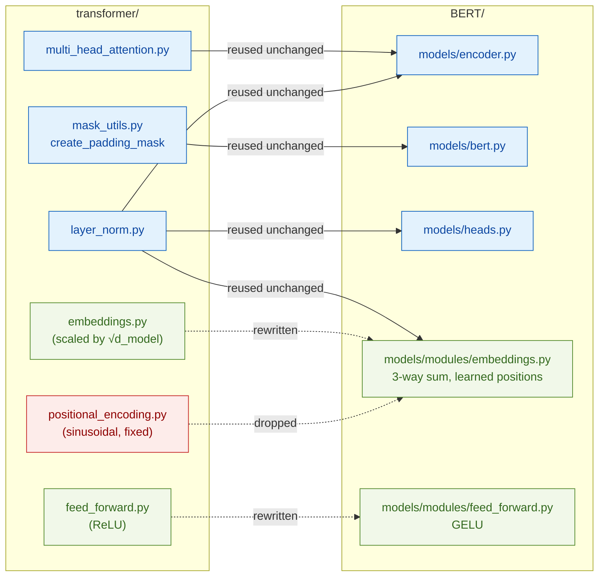

# Reused from `transformer/` — module provenance

> Modules (all in the sibling replication, imported unchanged):
> [`transformer/models/modules/multi_head_attention.py`](../../../transformer/models/modules/multi_head_attention.py) — `MultiHeadAttention`
> [`transformer/models/modules/layer_norm.py`](../../../transformer/models/modules/layer_norm.py) — `LayerNorm`
> [`transformer/utils/mask_utils.py`](../../../transformer/utils/mask_utils.py) — `create_padding_mask`

BERT's encoder layer **is** the Transformer encoder layer (Devlin et al. 2019, §3: "based on the
original implementation described in Vaswani et al. (2017)"), so this replication doesn't rewrite
what the paper didn't change. That's why [`BERT/models/modules/`](../../models/modules/) holds only
**two** files where `transformer/models/modules/` has five — the rest is imported straight from
`transformer/`, and this page is the ledger of what came from where.

## Reused unchanged

| module | imported by | its doc |
|---|---|---|
| `MultiHeadAttention` | [`encoder.py`](../../models/encoder.py) | [`multi_head_attention.md`](../../../transformer/docs/modules/multi_head_attention.md) |
| `LayerNorm` | [`encoder.py`](../../models/encoder.py) · [`heads.py`](../../models/heads.py) · [`embeddings.py`](../../models/modules/embeddings.py) | [`layer_norm.md`](../../../transformer/docs/modules/layer_norm.md) (+ [the math](../../../transformer/docs/modules/layer_norm_math.md)) |
| `create_padding_mask` | [`bert.py`](../../models/bert.py) | [`mask_utils.md`](../../../transformer/docs/utils/mask_utils.md) |

Why unchanged is *correct*, not lazy:

- **Attention doesn't know about direction.** Scaled dot-product + multi-head projection is the
  same math in both models; BERT's *bidirectionality* lives entirely in **which mask** you pass.
  The transformer's decoder passes a look-ahead mask; BERT passes only the padding mask — so the
  same `MultiHeadAttention` attends both ways with zero code change.
- **`create_padding_mask` already returns the right shape** — a `(B, 1, 1, S)` keep-mask (1 = real
  token, 0 = pad) that broadcasts over heads and query positions. BERT needs nothing else: the
  look-ahead half of `mask_utils.py` is simply never imported.
- **`LayerNorm` is arithmetic** — normalize, scale by γ, shift by β. Identical in both papers.

> **One caveat — init.** Reusing the *code* doesn't mean reusing the *init policy*: BERT's
> weight-init sweep re-initializes every `Linear`/embedding to `normal(std=0.02)`, overwriting the
> xavier init the MHA gave itself in `__init__` (the same module keeps its xavier when used inside
> `transformer/`). `LayerNorm` needs no handling — its γ=1/β=0 construction is what both models
> want. Details in [`bert.md`](../architecture/bert.md).

## Rewritten locally (the two files in `BERT/models/modules/`)

| module | what changed vs `transformer/` | why |
|---|---|---|
| [`embeddings.py`](embeddings.md) | token embedding → **sum of three tables** (token + segment + **learned** position), **no √d_model scaling**, + LayerNorm/dropout after | §3.1, Figure 2: BERT's input is the 3-way sum; segments feed NSP; Google's `modeling.py` feeds the raw sum (unscaled) into LayerNorm |
| [`feed_forward.py`](feed_forward.md) | ReLU → **GELU** (tanh approximation) | §A.2 mandates gelu; the tanh form matches Google's TF `modeling.py` exactly |

## Dropped

- **`positional_encoding.py`** (sinusoidal, fixed) — BERT **learns** its position table instead;
  it's one of the three tables inside `BERTEmbeddings`, so no standalone module exists.
- **The look-ahead (causal) mask** — never imported. Masking *future* tokens is what makes a
  decoder unidirectional; BERT's whole point (§1) is conditioning on both directions at once.

## References

- Paper: Devlin et al. 2019, [*BERT*](https://arxiv.org/abs/1810.04805) — §3 ("based on the original implementation"), §3.1 (input representation), §A.2 (gelu)
- Origin: Vaswani et al. 2017, [*Attention Is All You Need*](https://arxiv.org/abs/1706.03762) — the modules being reused
- Sibling docs: [`bert.md`](../architecture/bert.md) (reuse table + init sweep) · [`encoder.md`](../architecture/encoder.md) (how the reused MHA/LayerNorm assemble)
- Local rewrites: [`embeddings.md`](embeddings.md) · [`feed_forward.md`](feed_forward.md)
