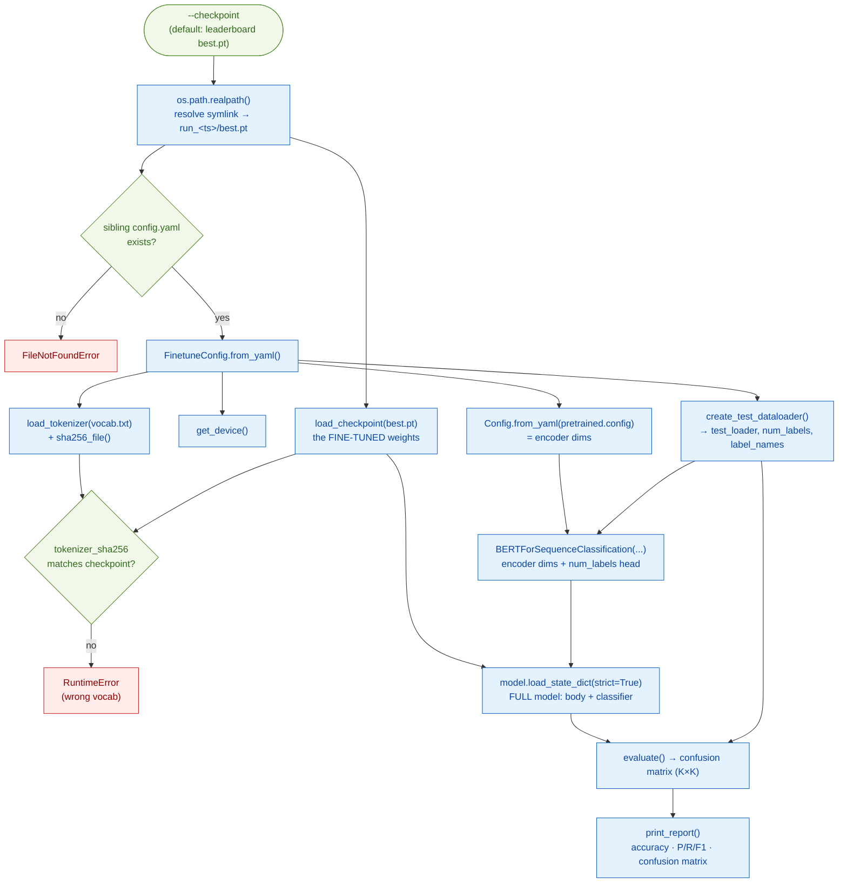

# BERT Evaluation Runbook (`evaluate.py`)

> Modules:
> [`BERT/scripts/evaluate.py`](../../scripts/evaluate.py) — the entrypoint
> [`BERT/scripts/_common.py`](../../scripts/_common.py) — `load_checkpoint` (shared with pretrain/finetune)
> [`BERT/utils/finetune_data.py`](../../utils/finetune_data.py) — `create_test_dataloader` (the held-out split)
> Paper: Devlin et al. 2019, [*BERT*](https://arxiv.org/abs/1810.04805), §4.1 (classification) & the GLUE metric convention (Table 1 footnote)

This is the **scoring layer** — it takes the classifier [`finetune.py`](finetune.md) produced and
measures it on data it has **never seen**. Fine-tuning *picked* a winner using the validation split;
evaluation *reports* that winner's honest number on the **test** split.

The whole job is one idea: run the model over the test set, tally a **confusion matrix**, and read
every metric off it.

| script | input | output |
|---|---|---|
| [`finetune.py`](finetune.md) | train + val splits (**labelled**) | a trained `best.pt` (picked by val accuracy) |
| **`evaluate.py`** (this) | **test** split (**labelled, held out**) | accuracy, per-class P/R/F1, confusion matrix |
| [`inference.py`](inference.md) | any sentence (**no label**) | a predicted topic |

Throughout: **B** = batch size (32), **K** = `num_labels` (6 for `sna.bn`), **step** = one batch.

## Contents

- [The end-to-end flow](#the-end-to-end-flow)
- [Which checkpoint — and why `strict=True`](#which-checkpoint--and-why-stricttrue)
- [Why the test split (not validation)](#why-the-test-split-not-validation)
- [`evaluate()` — building the confusion matrix](#evaluate--building-the-confusion-matrix)
  - [The device dance (CPU vs mps)](#the-device-dance-cpu-vs-mps)
- [`print_report()` — matrix → metrics](#print_report--matrix--metrics)
  - [A worked example (toy 3-class)](#a-worked-example-toy-3-class)
- [Accuracy is the reported metric (not F1)](#accuracy-is-the-reported-metric-not-f1)
- [Our results — the 5e-5 winner on test](#our-results--the-5e-5-winner-on-test)
  - [Is it overfitted? No.](#is-it-overfitted-no)
  - [Reading the confusion matrix — the `international` weakness](#reading-the-confusion-matrix--the-international-weakness)
- [How 86.5% compares — the IndicGLUE `sna.bn` numbers](#how-865-compares--the-indicglue-snabn-numbers)
- [Improving the minority class — the class-weighting experiment](#improving-the-minority-class--the-class-weighting-experiment)
- [Running it](#running-it)
- [References](#references)

---

## The end-to-end flow

One `python -m BERT.scripts.evaluate` invocation runs this pipeline. Notice it's a **trimmed**
finetune flow: same config resolution, tokenizer preflight, and model rebuild — but no optimizer,
no loss, no training loop. Just load → forward → count → report.



The config comes from the **checkpoint's own sibling `config.yaml`** (the snapshot `finetune.py`
saved into the run dir), so `evaluate.py` needs **no config flag** — point `--checkpoint` at a
`best.pt` and everything (dataset, tokenizer, encoder dims) follows from beside it.

---

## Which checkpoint — and why `strict=True`

`evaluate.py` loads a **fine-tuning** checkpoint (a finetune run's `best.pt`), *not* a pre-training
one. Don't confuse the two:

| script | loads | contains | how |
|---|---|---|---|
| [`finetune.py`](finetune.md#the-transplant) | *pre-training* best.pt | body useful (`bert.*`); MLM/NSP heads dropped | `strict=False`, filtered |
| **`evaluate.py`** (this) | *fine-tuning* best.pt | **full** model: `bert.*` **+** `classifier.*` | **`strict=True`** |

```python
model.load_state_dict(checkpoint["model_state_dict"])   # strict=True — full fine-tuned state
```

`strict=True` (the default) is deliberate: at eval time we want **every** fine-tuned weight,
including the trained classifier — a missing or unexpected key here would mean the checkpoint
doesn't match the model, which *should* raise. Contrast the transplant in `finetune.py`, which
*expects* a partial load (`strict=False`) because the classifier is still random there. The
fine-tune `best.pt` carries **105 tensors** (103 `bert.*` + `classifier.weight` + `classifier.bias`).

The `--checkpoint` default is the **leaderboard symlink**
`BERT/checkpoints/finetune/sna_bn/best.pt` → the global-best run. `os.path.realpath` resolves it to
the real `run_<ts>/best.pt`, whose sibling `config.yaml` drives the rest.

## Why the test split (not validation)

`create_test_dataloader` pins the `"test"` split — the one **training never touched**.
[`create_finetune_dataloaders`](../utils/finetune_data.md) resolved *its* val to `"validation"`
(sna.bn ships train + validation + test), leaving test pristine precisely so it can be scored here,
once, as the reportable number:

| split | who used it | role |
|---|---|---|
| train (11,284) | `finetune.py` | fit the weights |
| validation (1,411) | `finetune.py` | **pick** the best epoch / lr (`best.pt`) |
| **test (1,411)** | **`evaluate.py`** | **report** — the number you cite |

Using the validation split here would be circular — you'd report the number you *optimized against*.
The val accuracy (0.8533) only selected the winner; **test** is the unbiased estimate.

## `evaluate()` — building the confusion matrix

The core loop. `@torch.no_grad()` + `model.eval()` (dropout off), forward each batch, and tally a
`K×K` matrix where `confusion[t, p]` = "# examples whose **true** class was `t` but were
**predicted** as `p`":

```python
@torch.no_grad()
def evaluate(model, loader, device, num_labels):
    model.eval()                                            # dropout OFF → deterministic
    confusion = torch.zeros(num_labels, num_labels, dtype=torch.long)   # CPU tensor
    for batch in loader:
        ...
        preds = model(input_ids, token_type_ids).argmax(dim=-1).cpu()   # (B,) top class/row
        for t, p in zip(labels, preds):
            confusion[t, p] += 1                            # every example → one cell
    return confusion
```

The key intuition: **every** example gets a `+1`, right or wrong — the *cell* it lands in encodes
correctness.

- **Correct** (`t == p`) → lands on the **diagonal**.
- **Wrong** (`t ≠ p`) → lands **off-diagonal** (e.g. `confusion[3,5]` = true `sports`, called
  `international`).

So the **whole matrix** sums to `len(test)` (every example counted once), and the **diagonal** sums
to `#correct`. That's the entire result — `print_report` just reads numbers off it.

### The device dance (CPU vs mps)

Three lines that trip people up. `confusion` is created with **no `device=`**, so it lives on **CPU**
(it doesn't inherit mps from the model). The `for t, p in zip(...)` loop uses `t`/`p` as **indices
into `confusion`**, so they must be on the same device:

| tensor | device | why |
|---|---|---|
| `confusion` | **CPU** (`torch.zeros(...)`, no `device=`) | tiny `6×6` tally, indexed in a Python loop |
| `labels` | **CPU** (never `.to(device)`) | only used to index `confusion` |
| `preds` | mps → `.cpu()` | `model(...)` runs on mps; `.cpu()` brings it back to match |

You *could* build `confusion` on mps (`torch.zeros(..., device=device)`) and keep `labels`/`preds`
there — but don't. The element-by-element `zip` loop would force a tiny CPU↔GPU sync **per example**
(1,411 stalls), and a `6×6` matrix has no compute to accelerate. CPU is the right call. (Note too:
`print_report`'s `.numpy()` requires a CPU tensor — an mps `confusion` would need `.cpu()` there
anyway.)

## `print_report()` — matrix → metrics

Everything is read off the same matrix `C` (rows = true, cols = pred) along **three axes**:

```python
tp       = np.diag(C)      # diagonal   → correct per class
support  = C.sum(axis=1)   # row totals → # TRUE per class
pred_tot = C.sum(axis=0)   # col totals → # PREDICTED per class
```

then:

| metric | formula | reads as |
|---|---|---|
| **recall** | `tp / support` | of the true X, how many did we **catch**? (per **row**) |
| **precision** | `tp / pred_tot` | of what we **called** X, how many were right? (per **column**) |
| **F1** | `2·P·R / (P+R)` | harmonic mean of the two |
| **accuracy** | `tp.sum() / total` | overall correct — the diagonal / everything |

The `np.where(... > 0, ..., 0.0)` guards a `0/0`: a class never predicted has `pred_tot = 0`
(precision), a class absent from test has `support = 0` (recall) — both resolve to `0.0`, not `NaN`.
`macro avg` is the plain mean over classes (each class equal); `weighted avg` weights by `support`
(bigger classes count more, so it tracks accuracy). They **diverge when classes are imbalanced** —
exactly what our results show.

### A worked example (toy 3-class)

Five sentences, classes `0=sports, 1=politics, 2=tech`. `preds = [0,1,0,1,2]` vs `labels =
[0,1,2,0,2]` (C and D wrong):

**Confusion matrix**

| true ↓ / pred → | sports | politics | tech | support |
|---|---|---|---|---|
| **sports** | 1 | 1 | 0 | 2 |
| **politics** | 0 | 1 | 0 | 1 |
| **tech** | 1 | 0 | 1 | 2 |
| **col total** | 2 | 2 | 1 | **5** |

**Read off it**

| | precision | recall | f1 |
|---|---|---|---|
| sports | 1/2 = .500 | 1/2 = .500 | .500 |
| politics | 1/2 = .500 | 1/1 = 1.000 | .667 |
| tech | 1/1 = 1.000 | 1/2 = .500 | .667 |
| **accuracy** | | | **3/5 = .600** |
| macro avg | .667 | .667 | .611 |
| weighted avg | (2·.5+1·.5+2·1)/5 = **.700** | .600 | .600 |

This is the exact trace verified in `check.ipynb` — scale it from `3×3`/5 examples to `6×6`/1411 and
it's the real `sna.bn` report below.

## Accuracy is the reported metric (not F1)

The GLUE convention (BERT paper, Table 1 footnote): *"F1 scores are reported for QQP and MRPC,
Spearman correlations are reported for STS-B, and **accuracy scores are reported for the other
tasks**."* `sna.bn` is single-sentence 6-way topic classification — an "other task" — so **accuracy
is the headline**. F1 is reserved for the paraphrase pairs (QQP/MRPC), which are class-imbalanced
binary tasks where F1 matters more.

So in our report, **accuracy (0.865) is the number to cite.** The per-class precision/recall/F1
table is kept as a **diagnostic** — it's free (all derived from the same confusion matrix) and
invaluable for spotting a weak class, but it isn't the reported result.

## Our results — the 5e-5 winner on test

Scoring the sweep winner (`run_2026-07-11_23-46-39`, lr 5e-5, val_acc 0.8533) on the held-out test
split:

```
class            prec recall     f1  support
kolkata         0.954  0.951  0.952      569
state           0.822  0.846  0.834      279
national        0.680  0.789  0.730      175
sports          0.932  0.927  0.930      192
entertainment   0.827  0.846  0.837      130
international    0.600  0.273  0.375       66
---------------------------------------------
accuracy                      0.865     1411
macro avg       0.803  0.772  0.776     1411
weighted avg    0.863  0.865  0.861     1411
```

**Confusion matrix** (rows = true, cols = pred):

| true ↓ / pred → | kolkata | state | national | sports | ent. | int'l |
|---|---|---|---|---|---|---|
| **kolkata** | **541** | 19 | 2 | 3 | 2 | 2 |
| **state** | 18 | **236** | 17 | 1 | 5 | 2 |
| **national** | 3 | 24 | **138** | 3 | 2 | 5 |
| **sports** | 0 | 6 | 5 | **178** | 3 | 0 |
| **entertainment** | 2 | 2 | 10 | 3 | **110** | 3 |
| **international** | 3 | 0 | **31** | 3 | 11 | **18** |

Headline: **86.5% test accuracy** — and it runs in ~7 seconds (inference only: one forward sweep
over 1,411 examples, no gradients, no backward). The fast wall-clock is expected, not suspicious.

### Is it overfitted? No.

The tell for overfitting is **test ≪ train/val**. Ours are tightly clustered:

| split | accuracy |
|---|---|
| train | 0.861 |
| val | 0.853 |
| **test** | **0.865** |

Test is *slightly above* val — the model generalizes cleanly to unseen data. An overfit model would
read train ~0.95 / test ~0.70. This is textbook healthy, and matches the TensorBoard curves (val
loss fell every epoch — see [`finetune.md`](finetune.md#tensorboard--the-sweep-visualized)).

### Reading the confusion matrix — the `international` weakness

The real finding is **per-class, not overfitting**. `international` is the one soft spot:

```
international   prec 0.600  recall 0.273  f1 0.375  support 66     ← weak

international row (from Confusion matrix):   3   0   31   3   11   18
                                                      ↑             ↑
                                                  31 → national     only 18 correct
```

Of 66 `international` articles, **31 were misclassified as `national`** and only 18 were right
(recall 27%). This is **class imbalance + semantic overlap**, not a bug:

- `international` is the **smallest** class (66 test / 526 train, vs `kolkata`'s 569 / 4603) — the
  model saw the fewest examples of it.
- International vs national news genuinely **overlaps** in Bengali text — so the model defaults to
  the bigger, more-similar class (`national`).

This is also why **macro-F1 (0.776) < weighted-F1 (0.861)**: macro treats `international` equally, so
its weak 0.375 drags the unweighted mean down; weighted counts it by its tiny support (66/1411), so
it barely dents accuracy. The strong classes are `kolkata` (F1 0.952) and `sports` (0.930) — big,
distinctive, well-separated.

## How 86.5% compares — the IndicGLUE `sna.bn` numbers

`sna.bn` is IndicGLUE's **Soham Bengali News** task — 6 classes, 11,284 train / 1,411 test, the exact
dataset and splits we fine-tuned on — so the IndicNLPSuite paper's published numbers (Kakwani et al.
2020, Tables 4 & 9) are directly comparable to ours. The full ladder, worst to best:

| approach | params | `sna.bn` test acc |
|---|---|---|
| IndicFT word embeddings + k-NN (no fine-tuning) | — | 71.82 |
| IndicBERT base, fine-tuned (ALBERT, 11 langs) | 12M | 78.45 |
| mBERT, fine-tuned (104 langs) | 110M | 80.23 |
| **this replication, fine-tuned (from scratch, Bengali only)** | **~7.5M** | **86.5** |
| XLM-R base, fine-tuned (100 langs) | 125M | **87.60** |

**Our from-scratch BERT beats IndicBERT by ~8 points and mBERT by ~6, and lands ~1.1 under XLM-R —
the only model above us, at ~17× our size.** Second place among the five real systems, against
published multilingual SOTA. For a 7.5M-parameter model pretrained on a laptop, that is the
replication's headline result.

What each fine-tuned model **cost to pre-train** is what makes the ranking striking. Params and
train-token rows are the IndicNLPSuite paper's own comparison (its Table 14), so every reference
number traces to the same source as the accuracies:

| | this replication | IndicBERT base | mBERT | XLM-R base |
|---|---|---|---|---|
| `sna.bn` test acc | **86.5** | 78.45 | 80.23 | **87.60** |
| params (Table 14) | **~7.5M** (6L, 256d) | 12M (ALBERT, shared layers) | 110M | 125M† |
| languages | **1 — Bengali only** | 11 | 104 | 100 |
| pre-train data | Bengali Wikipedia slice (114 MB) | IndicCorp (bn share: 836M words) | Wikipedia, 104 langs | CommonCrawl (CC-100), >2 TB |
| train tokens — total | **~11.8M** WordPiece (6.7M words) | 8.93B | 18.2B* | 295B |
| train tokens — Indic share | **~11.8M — all of it** | 7.59B | 184M* | 3.99B |
| pre-train compute | **~28 h · one Mac (mps)** | 6 days · a TPU v3 | not stated (English BERT-base: 4 days · 4 Cloud TPUs) | not stated for base (its large sibling: 500× 32GB V100) |

> \* = estimated (Table 14's own caption). † Table 14 lists XLM-R at 125M — the transformer-body
> count; the released `xlm-roberta-base` checkpoint totals ~270M once its 250k-vocab embedding table
> is included. Other sources: our column from this repo's logs/configs; IndicCorp's bn share from the
> paper's Table 1; IndicBERT compute from its §6.1; XLM-R corpus/compute from Conneau et al. 2020
> ("more than two terabytes of filtered CommonCrawl data"; 500× V100 is stated for the 24-layer
> XLM-R-large — base unspecified); mBERT's own release notes state no pre-training compute — the
> parenthetical is the English BERT-base figure from Devlin et al. 2019, §A.2.

Every resource row is lopsided. On **Indic text alone**, IndicBERT pretrained on **~640× our data**
(7.59B vs 11.8M tokens), XLM-R on ~340×, and even mBERT's estimated Indic share is ~16× ours —
while IndicCorp's *Bengali* share by itself (836M words) is ~125× our whole corpus. Our 28
laptop-hours sit against TPU-days and a GPU cluster. Yet the accuracy column is nearly flat at the
top — and the model that barely saw Indic text (mBERT: 184M of 18.2B tokens, ~1%) sits **6 points
below us** despite 15× our parameters.

Why can a tiny monolingual model compete here? Two reasons the task suits it: (1) **capacity
concentration** — all 7.5M parameters serve Bengali, while the giants split theirs across 11–100
languages; (2) news-topic classification is **surface-cue-heavy** (each topic has distinctive
vocabulary), so a small encoder captures most of the signal. The giants' scale buys cross-lingual
transfer and harder tasks (QA, NLI) — advantages `sna.bn` never stresses. Two honest notes: the
1.1-point gap to XLM-R is within single-run noise (in either direction), and our Wikipedia
pretraining shares register with news text — but the 6–8 point margins over mBERT and IndicBERT are
well outside noise.

> **One dataset caveat.** `sna.bn` is the **Soham** set (public — the paper's Table 9). Don't confuse
> it with IndicGLUE's separate *News Category* set (Table 8, bn 98.29): a different, easier task
> (7 classes auto-labeled from article URLs) that isn't even published as a Bengali config on HF.
> **87.60 is the real published ceiling for `sna.bn`.**

## Improving the minority class — the class-weighting experiment

If you want to lift `international`, the lever is the class imbalance, not regularization. The
train distribution and inverse-freq ("balanced") weights:

| class | train count | weight `total/(K·count)` |
|---|---|---|
| kolkata | 4603 | 0.409 |
| state | 2245 | 0.838 |
| national | 1435 | 1.311 |
| sports | 1289 | 1.459 |
| entertainment | 1186 | 1.586 |
| **international** | **526** | **3.575** ← biggest |

The cheapest change is **class weighting** — `CrossEntropyLoss(weight=class_weights)`, so each
`international` mistake costs ~8.7× a `kolkata` one. This is now a config flag
(`training.class_weighting: true` — see
[`finetune.md`](finetune.md#the-loss--optional-class-weighting) for the mechanics), and **we ran
the experiment** (`run_2026-07-15_21-12-55`, everything else identical to the winner). Val acc
came out **0.8242** (vs 0.8533 unweighted — `best.pt` never moved), and on the held-out test split:

```
class            prec recall     f1  support
kolkata         0.988  0.882  0.932      569
state           0.772  0.860  0.814      279
national        0.708  0.680  0.694      175
sports          0.942  0.932  0.937      192
entertainment   0.836  0.862  0.848      130
international   0.490  0.742  0.590       66
---------------------------------------------
accuracy                      0.851     1411
macro avg       0.789  0.826  0.803     1411
weighted avg    0.867  0.851  0.856     1411
```

Side by side with the unweighted winner, the trade is textbook:

| | unweighted (`best.pt`) | weighted | change |
|---|---|---|---|
| **accuracy** | **0.865** | 0.851 | −1.4 pt |
| international recall | 0.273 | **0.742** | 18 → **49** of 66 caught |
| international precision | 0.600 | 0.490 | more false alarms |
| kolkata recall | 0.951 | 0.882 | 541 → 502 correct |
| macro-F1 | 0.776 | **0.803** | +2.7 pt |
| weighted-F1 | 0.861 | 0.856 | −0.5 pt |

**Confusion matrix, weighted run** (rows = true, cols = pred):

| true ↓ / pred → | kolkata | state | national | sports | ent. | int'l |
|---|---|---|---|---|---|---|
| **kolkata** | **502** | 48 | 10 | 2 | 4 | 3 |
| **state** | 5 | **240** | 20 | 1 | 4 | 9 |
| **national** | 1 | 17 | **119** | 3 | 6 | 29 |
| **sports** | 0 | 4 | 3 | **179** | 4 | 2 |
| **entertainment** | 0 | 2 | 5 | 3 | **112** | 8 |
| **international** | 0 | 0 | **11** | 2 | 4 | **49** |

The mechanism is visible in the two matrices: unweighted, 31 of 66 `international` articles leaked
into `national`; weighted, that leak shrinks to **11** — but `kolkata` (weight 0.41, its mistakes
now cheap) starts bleeding **48** articles into `state` (19 before). Rare class fixed, big class
taxed.

**Verdict: measured, and rejected for the headline.** Weighting did exactly what it promises —
macro-F1 up 2.7 points, minority recall nearly tripled — but the reported `sna.bn` metric is
**accuracy**, which dropped 1.4 points because the test set carries the same imbalance as train:
down-weighting `kolkata` hurts on exactly the examples that dominate the score. It's also a
**deviation from the paper**: neither Google's reference `run_classifier.py` (plain mean of
per-example CE) nor HuggingFace's `BertForSequenceClassification` (`CrossEntropyLoss()` with no
`weight=`) weights the loss. So the flag ships off and the unweighted run stays the winner — if
your deployment cares about macro-F1 (every class equally important), flip it back on: same one-line
config change. (Untried alternative: a `WeightedRandomSampler` to oversample the minority instead
of re-weighting the loss.)

## Running it

From the **repo root** (so `from common.run_utils import …` resolves):

```bash
# default — scores the leaderboard best.pt (global-best run) on the test split
uv run --active python -m BERT.scripts.evaluate

# a specific run's checkpoint
uv run --active python -m BERT.scripts.evaluate \
    --checkpoint BERT/checkpoints/finetune/sna_bn/run_2026-07-11_23-46-39/best.pt
```

Must be the **module** form (`python -m BERT.scripts.evaluate`), not `python BERT/scripts/evaluate.py`,
so the `common.` / `..models.` imports resolve. Expected log landmarks: `Checkpoint: …/best.pt` →
`Using device: mps` → `Test split: 1411 examples, 6 labels` → `val_acc at save: 0.8533` → the report
table. First run downloads `sna.bn` from HuggingFace (cached after).

## References

- Paper: Devlin et al. 2019, [*BERT*](https://arxiv.org/abs/1810.04805) — §4.1 (classification), Table 1 footnote (accuracy for single-sentence tasks; F1 only for QQP/MRPC)
- Benchmark: IndicGLUE — Kakwani et al. 2020, [*IndicNLPSuite: Monolingual Corpora, Evaluation Benchmarks and Pre-trained Multilingual Language Models for Indian Languages*](https://aclanthology.org/2020.findings-emnlp.445.pdf) (Findings of EMNLP 2020) — introduces IndicGLUE + IndicBERT · dataset: [`ai4bharat/indic_glue`](https://huggingface.co/datasets/ai4bharat/indic_glue) (the `sna.bn` Soham Bengali News task)
- Reference models: XLM-R — Conneau et al. 2020, [*Unsupervised Cross-lingual Representation Learning at Scale*](https://aclanthology.org/2020.acl-main.747/) (CC-100: "more than two terabytes of filtered CommonCrawl data"; 500× V100 stated for the large model) · mBERT — Google's [multilingual README](https://github.com/google-research/bert/blob/master/multilingual.md) ("12-layer, 768-hidden, 12-heads, 110M parameters", 104 langs, Wikipedia; no pre-train compute stated) + [Devlin et al. 2019](https://arxiv.org/abs/1810.04805) §A.2 (English BERT-base: 4 days · 4 Cloud TPUs)
- Sibling docs: [`finetune.md`](finetune.md) (produces the checkpoint) · [`finetune_data.md`](../utils/finetune_data.md) (`create_test_dataloader`) · [`finetune_utils.md`](../utils/finetune_utils.md) (val vs test) · [`bert_for_classification.md`](../architecture/bert_for_classification.md) (the model)
- Next step: [`inference.md`](inference.md) — same model, unlabelled input, a single prediction
- Source: [`evaluate.py`](../../scripts/evaluate.py) · [`_common.py`](../../scripts/_common.py)
