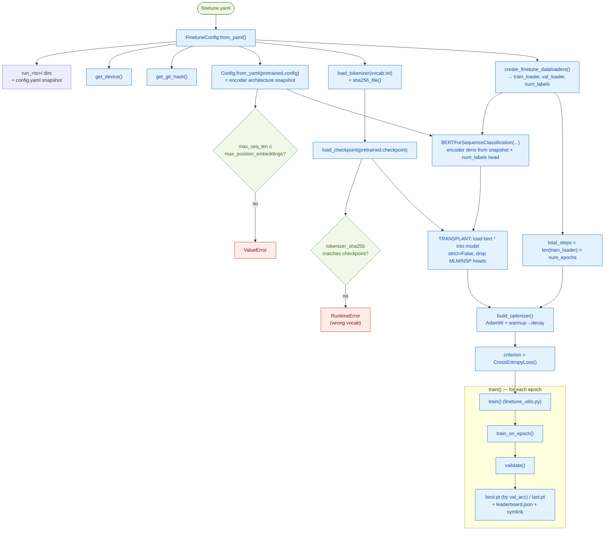
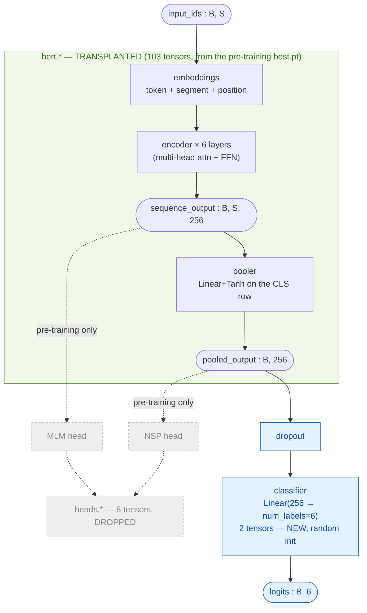
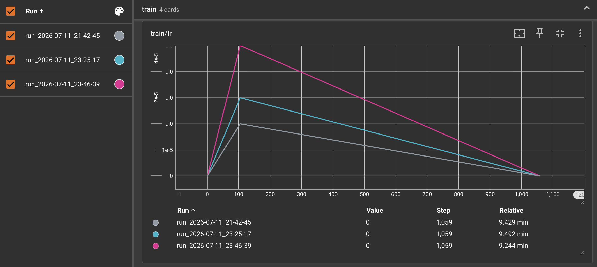
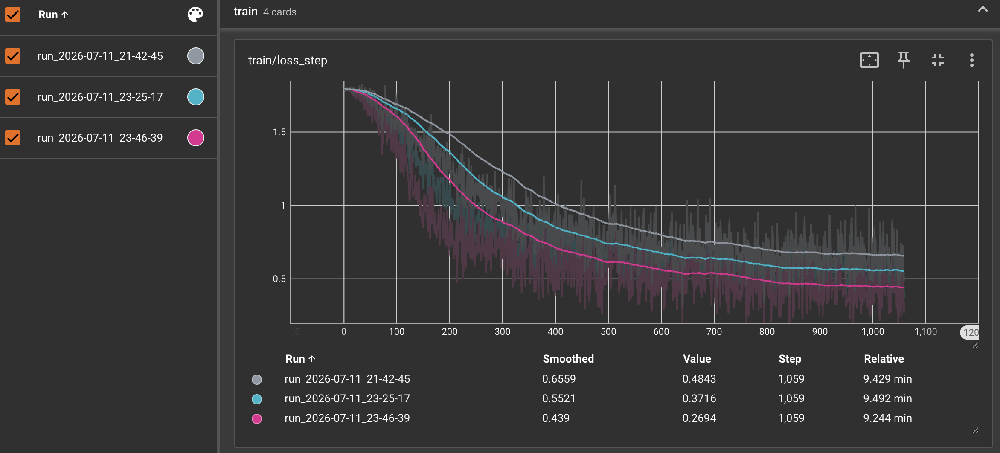
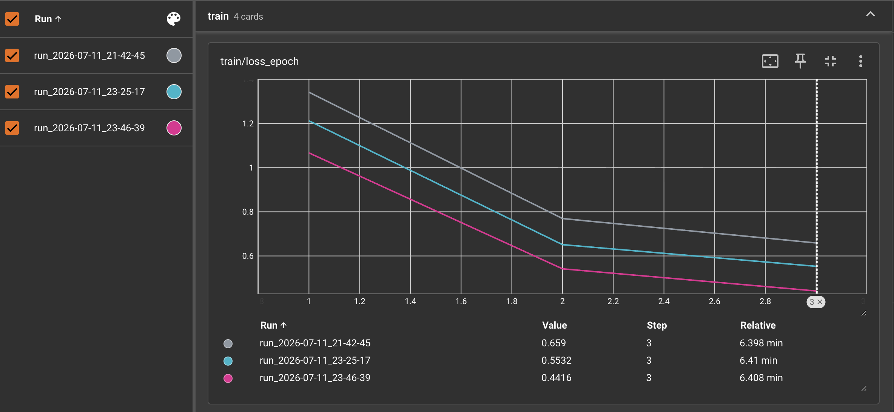
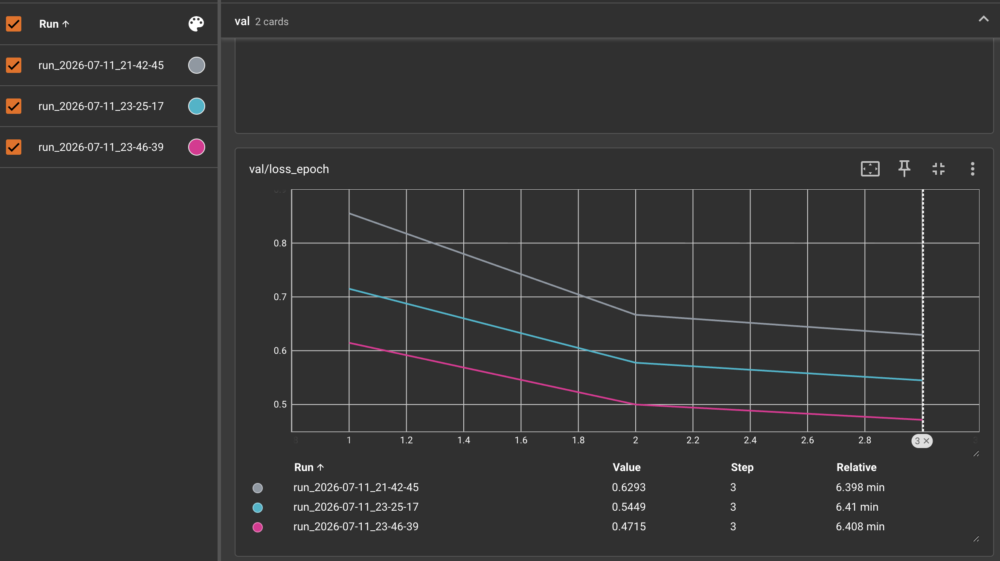
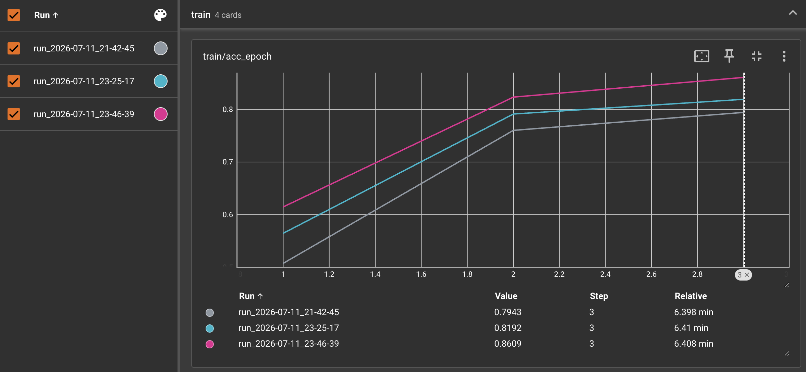
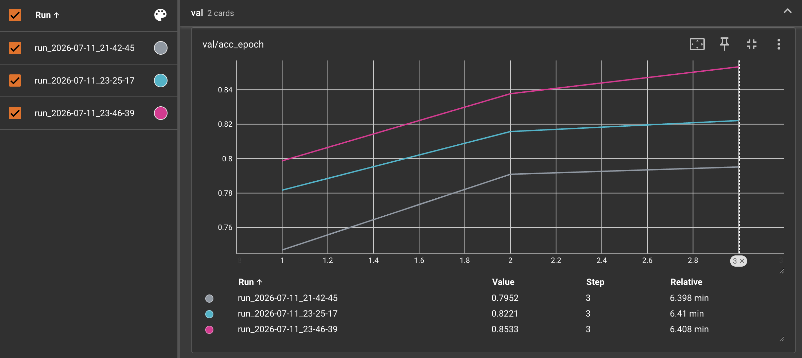

# BERT Fine-tuning Runbook (`finetune.py`)

> Modules:
> [`BERT/scripts/finetune.py`](../../scripts/finetune.py) — the entrypoint
> [`BERT/scripts/_common.py`](../../scripts/_common.py) — `load_checkpoint` (shared with pretrain)
> [`BERT/utils/finetune_utils.py`](../../utils/finetune_utils.py) — the train/validate loop
> Paper: Devlin et al. 2019, [*BERT*](https://arxiv.org/abs/1810.04805), §4.1 (classification) & §A.3 (hyperparameters)

This is the **fine-tuning layer** — everything that turns a *pre-trained encoder* + a labelled
dataset into a trained classifier. It's the downstream counterpart of the
[pre-training runbook](pretrain.md): pre-training built the encoder from a corpus; fine-tuning
transplants that encoder, bolts on a fresh head, and trains on `sna.bn`.

| file | role | you call it? |
|---|---|---|
| [`finetune.py`](../../scripts/finetune.py) | **entrypoint** — reads config, verifies tokenizer, builds data → model → loss → optimizer, **transplants** the encoder, calls `train()` | **yes** — `python -m BERT.scripts.finetune` |
| [`finetune_data.py`](../utils/finetune_data.md) | the data pipeline: `load_dataset` → tokenize → `[CLS] … [SEP]` → dynamic-pad loaders | no (imported) |
| [`finetune_utils.py`](../utils/finetune_utils.md) | the **loop**: `train_on_epoch`, `validate`, `train` (best-by-val-acc) | no (imported) |
| [`bert_for_classification.py`](../architecture/bert_for_classification.md) | the model: encoder body + `Linear(d_model, num_labels)` head | no (imported) |

Throughout: **B** = batch size (32), **S** = sequence length, **step** = one batch.

## Contents

- [The end-to-end flow](#the-end-to-end-flow)
- [Prerequisite: a pre-trained checkpoint](#prerequisite-a-pre-trained-checkpoint)
- [The tokenizer preflight](#the-tokenizer-preflight)
- [The fine-tune architecture](#the-fine-tune-architecture)
- [The transplant](#the-transplant)
- [`total_steps` & warmup](#total_steps--warmup)
- [Per-run directories](#per-run-directories)
- [The lr sweep](#the-lr-sweep)
- [TensorBoard — the sweep visualized](#tensorboard--the-sweep-visualized)
- [Reproducing our run](#reproducing-our-run)
- [What's deliberately absent](#whats-deliberately-absent)
- [References](#references)

---

## The end-to-end flow

One `python -m BERT.scripts.finetune` invocation runs this pipeline:



Prerequisite: a **pre-trained checkpoint** must already exist ([`pretrain.py`](pretrain.md) writes
it). Fine-tuning runs **many** times (an lr sweep) against **one** pre-training run.

---

## Prerequisite: a pre-trained checkpoint

`finetune.yaml`'s `pretrained` block points at a **specific pre-training run dir**, not the
top-level symlink — because the encoder's architecture snapshot (`config.yaml`) lives *inside* that
run dir:

```yaml
pretrained:
  checkpoint: "BERT/checkpoints/base/run_2026-06-30_23-05-21/best.pt"
  config:     "BERT/checkpoints/base/run_2026-06-30_23-05-21/config.yaml"
```

Two files, two jobs:
- **`checkpoint`** → the weights to transplant (`best.pt`'s `model_state_dict`).
- **`config`** → the encoder's dims (`d_model`, `num_heads`, `d_ff`, `num_layers`, …). The model
  must be **rebuilt at the exact shape** the checkpoint was trained at, or `load_state_dict` fails.
  `finetune.py` reads this via `Config.from_yaml(config.pretrained.config)`.

Both are checked to exist up front — a missing snapshot errors with the fix (point it at the run
dir's `config.yaml`).

## The tokenizer preflight

The encoder's embedding rows are indexed by a **specific vocab**. Fine-tune with a *different*
tokenizer and every token id silently misaligns — you'd train on garbage and never crash. So
`finetune.py` hashes the current vocab and compares it against the hash stored in the checkpoint:

```python
tokenizer_sha256 = sha256_file(vocab_path)
ckpt_tok_hash = checkpoint.get("tokenizer_sha256")
if ckpt_tok_hash in (None, "unknown"):
    logger.warning("... cannot verify tokenizer. Continuing.")     # old checkpoint, no hash
elif ckpt_tok_hash != tokenizer_sha256:
    raise RuntimeError("Tokenizer mismatch ...")                   # HARD fail — wrong vocab
```

Our run logs `Tokenizer sha256: 981e888d4972... (vocab 10000)` — the same hash pre-training pinned,
so the check passes silently. There's also a shape guard: `max_seq_len` (128) must be
`≤ max_position_embeddings` (512) — you can't feed the encoder positions it never learned.

## The fine-tune architecture

Fine-tuning reuses the **entire pre-trained body** (embeddings + encoder + pooler) and swaps the
pre-training heads for one small classification layer. §3.5: *"the only new parameters introduced
during fine-tuning are classification layer weights W ∈ R^(K×H)."* Same body, different head:



| block | tensors | in fine-tuning |
|---|---|---|
| embeddings + encoder×6 + pooler (`bert.*`) | **103** | **transplanted** — carries all the language knowledge from pre-training |
| MLM + NSP heads (`heads.*`) | **8** | **dropped** — task-specific scaffolding, useless for classification |
| classifier `Linear(256 → 6)` | **2** | **new** — random-init, the only thing learned from scratch (§3.5) |

The exact tensor names (as they appear in the checkpoints' `model_state_dict`):

```text
DROPPED — heads.* (8)                          NEW — classifier.* (2)
  heads.mlm.bias                (10000,)         classifier.weight   (6, 256)
  heads.mlm.dense.weight        (256, 256)       classifier.bias     (6,)
  heads.mlm.dense.bias          (256,)
  heads.mlm.layer_norm.gamma    (256,)
  heads.mlm.layer_norm.beta     (256,)
  heads.mlm.decoder.weight      (10000, 256)   ← tied to token embedding
  heads.nsp.classifier.weight   (2, 256)
  heads.nsp.classifier.bias     (2,)
```

The forward path in fine-tuning ignores `sequence_output` entirely (`_,` in the code) — a
single-sentence label needs only the one pooled `[CLS]` vector, not per-token states. Full
architecture detail: [`bert_for_classification.md`](../architecture/bert_for_classification.md).

## The transplant

The heart of fine-tuning: copy the pre-trained **encoder body** into a fresh classification model,
**dropping** the pre-training heads. The classification model
([`BERTForSequenceClassification`](../architecture/bert_for_classification.md)) stores its encoder
as `self.bert`, so its weight keys are `bert.*` (+ `classifier.*`). The pre-training checkpoint has
`bert.*` **and** MLM/NSP head keys. We filter to just `bert.*`, then load with `strict=False`:

```python
body_state = {k: v for k, v in checkpoint["model_state_dict"].items() if k.startswith("bert.")}
dropped = len(checkpoint["model_state_dict"]) - len(body_state)   # MLM/NSP head keys removed
missing, _ = model.load_state_dict(body_state, strict=False)      # unexpected is always empty — we pre-filter
```

Our run logs `103 tensors | new (untrained): ['classifier.weight', 'classifier.bias'] | head keys
dropped: 8`. What each part means:

| keys | count | fate |
|---|---|---|
| `bert.*` (embeddings + encoder + pooler) | 103 | **loaded** — the transferred encoder |
| `mlm_head.*`, `nsp_head.*` | 8 | **dropped** by the filter (never reach `load_state_dict`) |
| `classifier.weight`, `classifier.bias` | 2 | **`missing`** — the fresh head, kept at its `0.02` init, trained from scratch |

Two ways exist to drop the heads — the **filter** (used here) or letting **`strict=False`** report
them as `unexpected`. This code uses the filter, so `unexpected` is structurally always empty (hence
the `_`). `strict=False` here only covers the `missing` classifier side. Full explanation:
[`bert_for_classification.md`](../architecture/bert_for_classification.md#sizes).

> **The optimizer/scheduler are NOT transplanted.** Only `bert.*` weights carry over. The optimizer
> and scheduler start **clean** — fine-tuning uses a different lr (2–5e-5 vs 1e-4), a different
> schedule, and a brand-new head with no Adam moments. Reusing the pre-training optimizer would
> drop you at the end of its decay (lr≈0). See [`finetune_utils.md`](../utils/finetune_utils.md#whats-saved--and-why-resume-isnt-wired).

## `total_steps` & warmup

The lr schedule's linear decay needs its finish line, and warmup is expressed as a **fraction** of
that (not a fixed step count):

```python
total_steps  = len(train_loader) * config.training.num_epochs   # 353 × 3 = 1059
warmup_steps = int(config.training.warmup_ratio * total_steps)  # 0.1 × 1059 = 105
```

Why a ratio, not §A.2's fixed 10,000 steps? Fine-tuning is **short** — 1,059 total steps. A fixed
10k-step warmup would outlast the entire run, so lr would never peak. `warmup_ratio: 0.1` (from
Google's `run_classifier.py`, `warmup_proportion=0.1`) keeps warmup proportional: ramp for the first
~105 steps, then decay linearly to **exactly 0** at step 1,059. (This is why every run ends with
`lr=0.00e+00`.)

## Per-run directories

Every invocation gets its own timestamped subdir under both `checkpoint_dir` and `log_dir`, so an
lr sweep never clobbers a prior run. The `leaderboard.json` + `best.pt` symlink sit **one level up**,
ranking every run:

```
BERT/checkpoints/finetune/sna_bn/
├─ leaderboard.json                              ← {run_name: best_val_acc}, sorted DESC
├─ best.pt → run_2026-07-11_23-46-39/best.pt     ← symlink to the global best (the 5e-5 run)
└─ run_2026-07-11_23-46-39/
   ├─ config.yaml   ← exact config this run used (which lr!)
   ├─ best.pt       ← best-val-acc checkpoint for THIS run
   └─ last.pt       ← latest epoch
```

> **Reading the sweep later:** the leaderboard keys are **timestamps**, not lrs. To see which lr a
> run used, open that run's `config.yaml`. (If you sweep often, folding the lr into the run-dir name
> would make it self-documenting — not done here.)

## The lr sweep

§A.3 recommends trying `lr ∈ {5e-5, 3e-5, 2e-5}`. We ran all three (config change only — edit
`optimizer.lr`, rerun). Higher lr won monotonically:

| lr | best val acc | run |
|---|---|---|
| **5e-5** | **0.8533** ← winner | run_23-46-39 |
| 3e-5 | 0.8221 | run_23-25-17 |
| 2e-5 | 0.7952 | run_21-42-45 |

The `update_leaderboard` helper re-sorted after each run so `best.pt` always points at the current
best — no manual bookkeeping. 5e-5 is the model to carry into `evaluate.py`.

> **Verifying the lr from a log.** The displayed lr is the *end-of-epoch* value on the
> warmup→decay triangle. With 1,059 total steps and 105 warmup, end of epoch 1 (step 353) sits at
> `peak × (1059−353)/(1059−105) = peak × 0.74`. So a logged `3.70e-5` ⟹ peak `5.0e-5`; `2.22e-5` ⟹
> `3.0e-5`; `1.48e-5` ⟹ `2.0e-5`. (Handy when a run's config isn't in front of you.)

## TensorBoard — the sweep visualized

`uv run tensorboard --logdir BERT/logs/finetune/sna_bn` overlays all three sweep runs on every
plot. Color legend, consistent across all charts:

| color | run | lr |
|---|---|---|
| grey | run_2026-07-11_21-42-45 | 2e-5 |
| cyan | run_2026-07-11_23-25-17 | 3e-5 |
| pink | run_2026-07-11_23-46-39 | **5e-5** (winner) |

**`train/lr` — three warmup→decay triangles, peak = the lr**



The clearest read of the schedule: each run ramps over ~105 steps (10% of 1,059) to a peak of its
lr (grey ~2e-5, cyan ~3e-5, pink ~5e-5), then decays **linearly to exactly 0** at step 1,059. This
is the visual proof of the [`total_steps` & warmup](#total_steps--warmup) math — and why every run
ends `lr=0.00e+00`. All three finish in ~9.2–9.5 min.

**`train/loss_step` — the raw per-batch descent**



Per-batch loss (noisy band = real per-step values, bold line = smoothed). All start ~1.8 (≈ `ln 6`,
a random 6-way classifier) and fall, but **higher lr descends faster and lower**: final smoothed
pink 0.44 < cyan 0.55 < grey 0.66. The steep drop around steps 100–300 is where the fresh classifier
head actually learns the task.

**`train/loss_epoch` & `val/loss_epoch` — loss converges, no overfit**




Both fall every epoch, pink lowest throughout. At epoch 3 — **train / val**: 2e-5 `0.659 / 0.629`,
3e-5 `0.553 / 0.545`, 5e-5 `0.442 / 0.472`. Note val ≤ train for the two lower lrs and only a
0.03 train<val gap for 5e-5 — i.e. **no meaningful overfitting** even for the most aggressive run.

**`train/acc_epoch` & `val/acc_epoch` — the model-selection metric**




`val/acc_epoch` is the visual leaderboard — pink on top the whole way, ending at the **0.8533** that
`best.pt` points to. The accuracy gap mirrors the loss story:

| lr | train acc (E3) | val acc (E3) | train−val gap |
|---|---|---|---|
| 5e-5 | 0.8609 | **0.8533** | +0.008 |
| 3e-5 | 0.8192 | 0.8221 | −0.003 (val above train) |
| 2e-5 | 0.7943 | 0.7952 | −0.001 |

The gaps are ~1% or less — the encoder is doing the heavy lifting, the head is just reading it out.
`val/acc_epoch` is still **rising at epoch 3** for pink, hinting at a little headroom — but with
`lr` already at 0, capturing it would need a fresh (re-warmed) schedule or a stronger encoder, not
just more epochs.

## Reproducing our run

From the **repo root** (so `from common.run_utils import …` resolves):

```bash
caffeinate -s uv run python -m BERT.scripts.finetune
```

- `caffeinate -s` keeps the Mac awake for the ~9.5-min run.
- First run downloads `sna.bn` from HuggingFace (~21 MB, cached after).
- Override the config path with `--config BERT/configs/finetune.yaml` (that's the default anyway).

Expected log landmarks: device `mps` → tokenizer sha → `11284 train, 1411 validation, 6 labels` →
`head keys dropped: 8` → `7,497,990 total (6-way head)` → 3 epochs of train/val loss+acc.

## What's deliberately absent

- **No `--resume`.** Fine-tune runs are ~9.5 min — cheaper to re-run than to wire resume. The full
  resume machinery lives in [`pretrain.py`](pretrain.md#resume--and-the-lr0-trap). (Checkpoints are
  resume-*capable* — they save optimizer/scheduler state — but nothing consumes it here.)
- **No `data_fingerprint`.** Pre-training hashes its local corpus file; the fine-tune data is a
  remote HF dataset, so there's no local file to hash. Provenance instead records
  `pretrained_checkpoint` (which encoder these weights came from).
- **No warmup/step count in the paper.** `warmup_ratio: 0.1` is from Google's released
  `run_classifier.py`, not the paper text — noted in the config comment.

## References

- Paper: Devlin et al. 2019, [*BERT*](https://arxiv.org/abs/1810.04805) — §4.1 (classification), §A.3 (2–4 epochs, lr ∈ {5e-5,3e-5,2e-5})
- Google reference: [`run_classifier.py`](https://github.com/google-research/bert/blob/master/run_classifier.py) — `warmup_proportion=0.1`, fixed-length padding
- Sibling docs: [`finetune_data.md`](../utils/finetune_data.md) · [`finetune_utils.md`](../utils/finetune_utils.md) · [`bert_for_classification.md`](../architecture/bert_for_classification.md) · [`run_utils.md`](../../../common/docs/run_utils.md)
- Pre-training mirror: [`pretrain.md`](pretrain.md)
- Source: [`finetune.py`](../../scripts/finetune.py) · [`_common.py`](../../scripts/_common.py)
