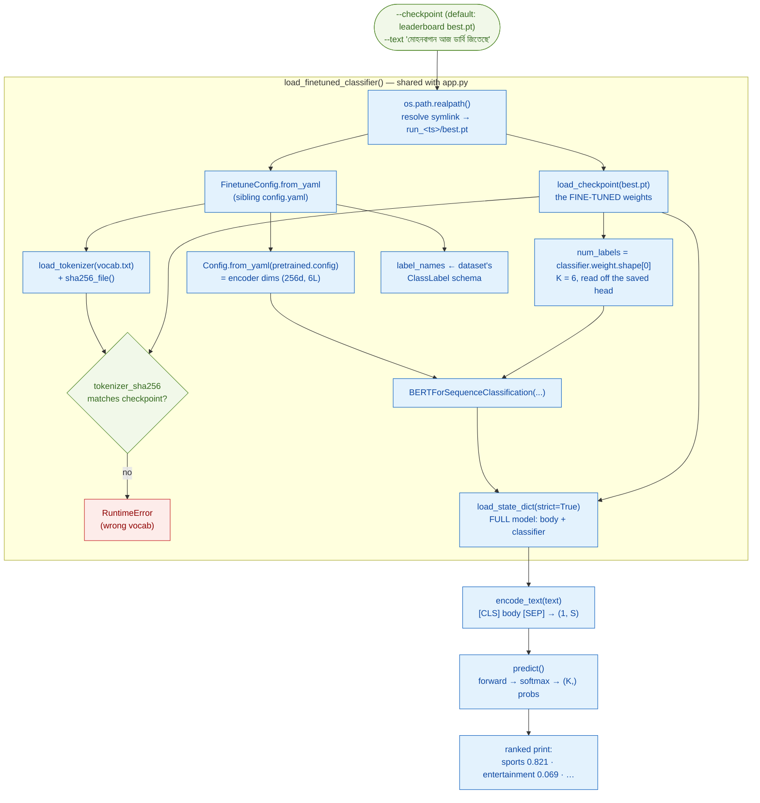
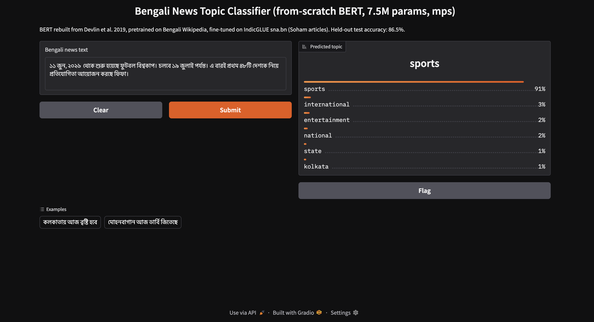
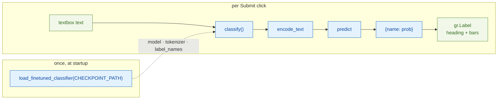

# BERT Inference Runbook (`inference.py` + `app.py`)

> Modules:
> [`BERT/scripts/inference.py`](../../scripts/inference.py) — the CLI entrypoint + the shared loader
> [`BERT/scripts/app.py`](../../scripts/app.py) — the Gradio web demo (imports everything from inference)
> [`BERT/scripts/_common.py`](../../scripts/_common.py) — `load_checkpoint` (shared with pretrain/finetune/evaluate)
> Paper: Devlin et al. 2019, [*BERT*](https://arxiv.org/abs/1810.04805), §4.1 (single-sentence classification)

This is the **prediction layer** — the first script in the chain that runs on text with **no label**.
Fine-tuning trained the classifier, evaluation scored it on the held-out test split (86.5%); inference
is what the model is *for*: hand it any Bengali sentence, get a topic back.

| script | input | output |
|---|---|---|
| [`finetune.py`](finetune.md) | train + val splits (**labelled**) | a trained `best.pt` |
| [`evaluate.py`](evaluate.md) | test split (**labelled, held out**) | accuracy, P/R/F1, confusion matrix |
| **`inference.py`** (this) | one sentence via `--text` (**no label**) | predicted topic + full softmax, printed |
| **`app.py`** (this) | sentences typed into a browser (**no label**) | predicted topic + confidence bars, live |

Both entrypoints are thin wrappers around the **same three functions** — `load_finetuned_classifier`,
`encode_text`, `predict` — all living in `inference.py`. The CLI pays the load cost per invocation;
the app pays it once and serves forever. Neither can drift from the other, because there is only one
implementation.

Throughout: **K** = `num_labels` (6 for `sna.bn`), **S** = the packed sentence length, **H** = `d_model` (256).

## Contents

- [The end-to-end flow](#the-end-to-end-flow)
- [`load_finetuned_classifier()` — one loader, two callers](#load_finetuned_classifier--one-loader-two-callers)
  - [Finding the config: the symlink → snapshot chain](#finding-the-config-the-symlink--snapshot-chain)
  - [Two configs from two different runs](#two-configs-from-two-different-runs)
  - [The tokenizer preflight (three-way check)](#the-tokenizer-preflight-three-way-check)
  - [Where `num_labels` and `label_names` come from](#where-num_labels-and-label_names-come-from)
- [`encode_text()` — packing one raw sentence](#encode_text--packing-one-raw-sentence)
- [`predict()` — forward → softmax](#predict--forward--softmax)
- [Reading the CLI output — the ranked list](#reading-the-cli-output--the-ranked-list)
- [`app.py` — the Gradio demo](#apppy--the-gradio-demo)
  - [Load once, serve forever](#load-once-serve-forever)
  - [`classify()` → the dict `gr.Label` draws](#classify--the-dict-grlabel-draws)
  - [Who picks the heading? (`gr.Label` internals)](#who-picks-the-heading-grlabel-internals)
- [Running it](#running-it)
- [References](#references)

---

## The end-to-end flow

One `python -m BERT.scripts.inference --text "..."` invocation runs this pipeline. The whole left
column is `load_finetuned_classifier()` — the exact setup `evaluate.py` does (config resolution,
tokenizer preflight, model rebuild), factored into a function so `app.py` can import it too. What
follows the loader is tiny: pack one sentence, one forward pass, print.



Note what is **absent** vs evaluate: no `create_test_dataloader`, no confusion matrix, no metrics —
there is no label to be right or wrong against. And vs finetune: no optimizer, no loss, gradients
globally off. Inference is the model's forward pass and nothing else.

---

## `load_finetuned_classifier()` — one loader, two callers

Everything needed to go from a `--checkpoint` path to a ready model, in one function:

```python
model, tokenizer, label_names, config, device = load_finetuned_classifier(checkpoint_arg)
```

| return | what it is | what the caller does with it |
|---|---|---|
| `model` | `BERTForSequenceClassification`, weights loaded, on `device` | `predict()` forwards through it |
| `tokenizer` | the WordPiece tokenizer the model was fine-tuned with | `encode_text()` tokenizes with it |
| `label_names` | `['kolkata', 'state', 'national', 'sports', 'entertainment', 'international']` | names the K outputs in print / UI |
| `config` | the run's `FinetuneConfig` snapshot | `config.training.max_seq_len` for truncation |
| `device` | resolved `torch.device` (mps here) | inputs are moved to it before the forward |

Its two callers:

- **`inference.py main()`** — calls it, classifies one `--text`, exits.
- **`app.py`** — calls it once at module level, then reuses the returns for every browser request.

This mirrors how `transformer/scripts/app.py` imports `translate` from its inference script: the
demo app owns **zero** model logic.

### Finding the config: the symlink → snapshot chain

The default checkpoint is built from the script's own location, so it works from any cwd:

```python
Path(__file__).parent.parent / "checkpoints" / "finetune" / "sna_bn" / "best.pt"
#    scripts/inference.py → scripts/ → BERT/ → BERT/checkpoints/finetune/sna_bn/best.pt
```

That `best.pt` is the **leaderboard symlink**, not a real file — two steps resolve it into the run
that owns the weights *and* the config that produced them:

```
sna_bn/
├── best.pt  ->  run_2026-07-11_23-46-39/best.pt     ① os.path.realpath() follows this
├── leaderboard.json
└── run_2026-07-11_23-46-39/
    ├── best.pt                                       ← the real weights
    ├── config.yaml                                   ② dirname(ckpt) + "config.yaml"
    └── last.pt
```

The order matters: `dirname` of the *symlink* would land in `sna_bn/`, where there is no
`config.yaml` — resolve first, then look beside. This is why neither inference nor evaluate takes a
`--config` flag: `--checkpoint` alone pins the dataset, tokenizer, and model dims via the **frozen
snapshot** saved at fine-tune time (editing the live `BERT/configs/finetune.yaml` later changes
nothing here).

### Two configs from two different runs

The finetune snapshot doesn't repeat the encoder architecture — it **points** at the pretrain run
that defined it:

```
sna_bn/run_2026-07-11_23-46-39/config.yaml          (finetune snapshot: dataset, max_seq_len, lr…)
        └── pretrained.config ─────►  base/run_2026-06-30_23-05-21/config.yaml
                                      (pretrain snapshot: d_model 256 · num_layers 6 · num_heads · d_ff…)
```

```python
config         = FinetuneConfig.from_yaml(config_path)        # snapshot ①
pretrained_cfg = Config.from_yaml(config.pretrained.config)   # snapshot ② — encoder dims
```

The model must be rebuilt with the *exact* skeleton the weights were trained in (a 256-dim, 6-layer
body); those dims live only in the pretrain config — single source of truth.

### The tokenizer preflight (three-way check)

Same gate as [`evaluate.py`](evaluate.md): token ids are row indices into the learned embedding
table, so the `vocab.txt` on disk must be **byte-identical** to the fine-tune-time one.

```python
if ckpt_tok_hash in (None, "unknown"):   # old checkpoint, no hash → warn, continue
elif ckpt_tok_hash != tokenizer_sha256:  # different vocab → RuntimeError, refuse to predict
                                         # match → silent fall-through (the happy path)
```

Pass = invisible, fail = loud. A wrong vocab wouldn't crash on its own — it would just map every
word to the wrong embedding row and predict garbage *confidently*, which is exactly why the check
exists.

### Where `num_labels` and `label_names` come from

Two different sources, deliberately:

- **`num_labels` — from the checkpoint itself.** §3.5: the classification head is
  W ∈ ℝ^(K×H), stored as `classifier.weight` with shape `(6, 256)`:

  ```python
  num_labels = checkpoint["model_state_dict"]["classifier.weight"].shape[0]   # → 6
  ```

  The checkpoint is the source of truth for the *math* — no dataset needed to size the head.

- **`label_names` — from the dataset's `ClassLabel` schema** (same lookup as
  `create_test_dataloader`), because the int→name table is the dataset's to define:

  ```python
  feat = dataset["train"].features[d.label_field]     # ClassLabel(names=['kolkata', …])
  label_names = feat.names if isinstance(feat, ClassLabel) else [str(i) for i in range(num_labels)]
  ```

  This is the only reason inference touches HuggingFace at all — purely to print `sports`
  instead of an anonymous `3`. (It reads the *schema*, not the data — no labels are used.)

---

## `encode_text()` — packing one raw sentence

The exact packing `ClassificationDataset` applies to every training example, applied to one string —
the model must see inference input in the same format it was fine-tuned on:

```python
ids = tokenizer.encode(text, add_special_tokens=False).ids   # suppress auto [CLS]/[SEP]
ids = ids[: max_seq_len - 2]                                 # truncate the BODY first
ids = [cls_id] + ids + [sep_id]                              # [CLS] body [SEP]
```

Worked example (`max_seq_len=6`, `[CLS]`→2, `[SEP]`→3, body "রাজনীতি"→`[41, 88]`):

| step | ids |
|---|---|
| tokenize, no specials | `[41, 88]` |
| truncate body to 6−2=4 | `[41, 88]` (already fits) |
| add specials by hand | `[2, 41, 88, 3]` |
| tensorize → `input_ids` | `[[2, 41, 88, 3]]` — shape **(1, S)**, a batch of one |
| `token_type_ids` | `[[0, 0, 0, 0]]` — single sentence → all segment A |

Two things training-time code needed that inference doesn't:

- **No padding.** `_collate` pads because a batch's sequences must align; a batch of one has
  nothing to align with.
- **No label.** That's the whole premise.

Truncating the body *before* adding specials means a long article can never chop off its own
trailing `[SEP]` — the two specials are always reserved.

---

## `predict()` — forward → softmax

```python
@torch.no_grad()
def predict(model, input_ids, token_type_ids, device):
    model.eval()                                                     # dropout OFF — deterministic
    logits = model(input_ids.to(device), token_type_ids.to(device))  # (1, K)
    return torch.softmax(logits, dim=-1)[0].cpu()                    # (K,)
```

- `@torch.no_grad()` + `model.eval()` — same pair as `evaluate()`: no gradient bookkeeping,
  dropout disabled, so the same sentence always gives the same answer.
- **Why softmax and not just argmax?** Argmax alone answers *"which class"*; softmax also answers
  *"how sure"*. The CLI's ranked list and the app's confidence bars both need the full
  distribution — argmax is then just "read the top of the sorted list".
- `[0]` unwraps the batch of one: `(1, K)` → `(K,)`. `.cpu()` brings the result back from mps so
  plain Python (`float()`, printing, JSON) can consume it.

---

## Reading the CLI output — the ranked list

`main()` prints the winner, then every class sorted by `probs.argsort(descending=True)`:

```
Predicted topic: sports  (p = 0.821)
  sports          0.821
  entertainment   0.069
  kolkata         0.043
  state           0.033
  international   0.023
  national        0.011
```

Two real runs, side by side:

| rank | "মোহনবাগান আজ ডার্বি জিতেছে" | "কলকাতায় আজ বৃষ্টি হবে" |
|---|---|---|
| 1 | **sports 0.821** | **kolkata 0.884** |
| 2 | entertainment 0.069 | state 0.078 |
| 3 | kolkata 0.043 | national 0.014 |

The ranking is worth printing because the top-1 label alone hides confidence. `sports` at
p = 0.94 and `sports` at p = 0.29 print identically without it. And the runner-ups are
informative: the rain-in-Kolkata sentence's second guess is `state` (its geographic neighbor
class), and an ambiguous world-news sentence will often show `national` and `international`
nearly tied — the same boundary the [confusion matrix](evaluate.md#reading-the-confusion-matrix--the-international-weakness)
already flagged as the model's weakest.

---

## `app.py` — the Gradio demo



*A 2026 World Cup snippet → `sports` 91%, runner-up `international` 3% — a sensible second guess
for a global-sport story.*

### Load once, serve forever

The CLI pays the full startup (checkpoint load, HF schema fetch, model rebuild — several seconds)
for **every sentence**. The app pays it once, at import time, then every Submit is just
tokenize + forward — milliseconds on mps:



The whole file is ~40 lines because the model logic is one import:

```python
from .inference import encode_text, load_finetuned_classifier, predict
```

Cosmetic notes: `lines=3` on the Textbox is display height only (paste a whole article — it
scrolls; the real limit is `encode_text`'s truncation to `max_seq_len` = 128 tokens), and
`examples=[...]` renders the two clickable sample sentences under the box.

### `classify()` → the dict `gr.Label` draws

```python
return {name: float(p) for name, p in zip(label_names, probs)}
# {'kolkata': 0.043, 'state': 0.033, 'national': 0.011,
#  'sports': 0.821, 'entertainment': 0.069, 'international': 0.023}
```

- `zip` pairs names with probabilities **by position** — position `i` of `label_names` names
  logit `i`, the same alignment the confusion matrix relies on.
- `float(p)` unwraps each 0-d tensor (`tensor(0.821)` → `0.821`) because Gradio serializes the
  return value to JSON for the browser, and JSON has no idea what a tensor is.
- The dict is in `label_names` order, **not** sorted — sorting is gr.Label's job (next section).

### Who picks the heading? (`gr.Label` internals)

The big `sports` title in the screenshot is *not* set by our code. `gr.Label.postprocess`
(gradio's own `components/label.py`) receives the dict and does the CLI's argsort for us:

```python
sorted_pred = sorted(value.items(), key=operator.itemgetter(1), reverse=True)  # by prob, high→low
return LabelData(
    label=sorted_pred[0][0],      # highest-prob NAME → the heading
    confidences=[...],            # the rest, already sorted → the bars
)
```

So the division of labor is: `predict()` supplies probabilities, `classify()` names them, and the
ranking/argmax that `inference.py` does by hand (`argmax`, `argsort`) is exactly what `gr.Label`
re-does internally for the UI. Same numbers either way — my smoke test through the app's API
returned `sports 0.821…` to the third decimal of the CLI run.

---

## Running it

From the **repo root** (so `from common.run_utils import …` resolves):

```bash
# CLI — one sentence, prints the ranked distribution
python -m BERT.scripts.inference --text "মোহনবাগান আজ ডার্বি জিতেছে"

# a specific run's checkpoint instead of the leaderboard winner
python -m BERT.scripts.inference --checkpoint BERT/checkpoints/finetune/sna_bn/run_2026-07-11_23-46-39/best.pt --text "..."

# Web demo — load once, then classify interactively
python -m BERT.scripts.app
# → open http://127.0.0.1:7860
```

---

## References

- Devlin et al. 2019, [*BERT: Pre-training of Deep Bidirectional Transformers for Language Understanding*](https://arxiv.org/abs/1810.04805) — §3.5 (the classification head W ∈ ℝ^(K×H) is the only new parameter), §4.1 (single-sentence input format).
- [Gradio `Interface`](https://www.gradio.app/docs/gradio/interface) and [`Label`](https://www.gradio.app/docs/gradio/label) docs — the `{name: confidence}` dict contract and the ranked-bar rendering.
- [`evaluate.md`](evaluate.md) — the scoring layer this model passed before being served (86.5% held-out test accuracy).
