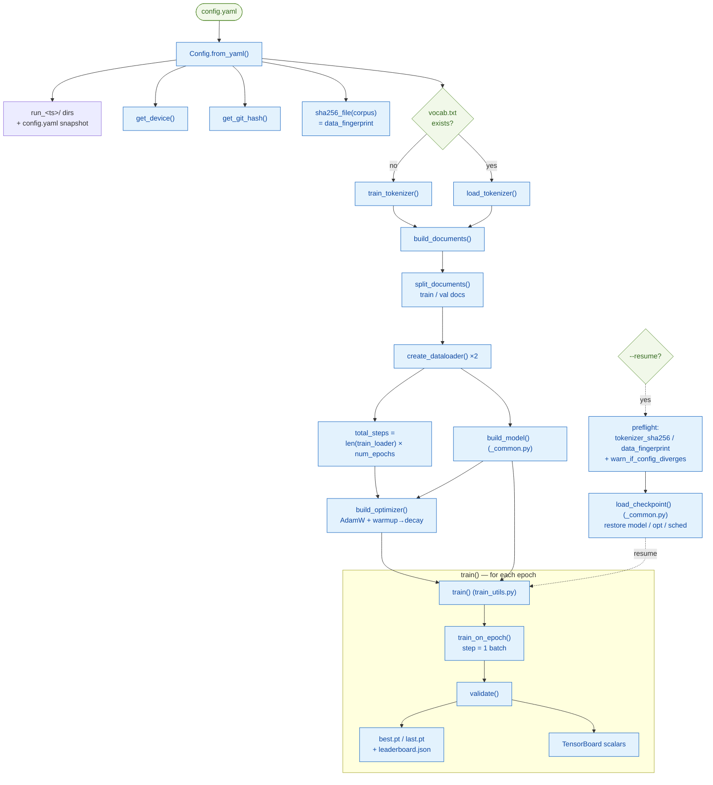
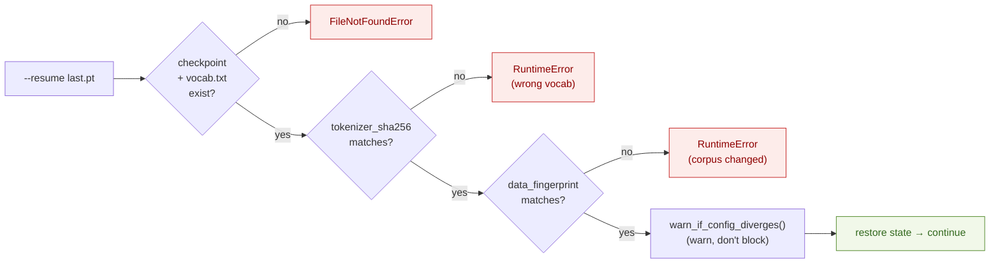
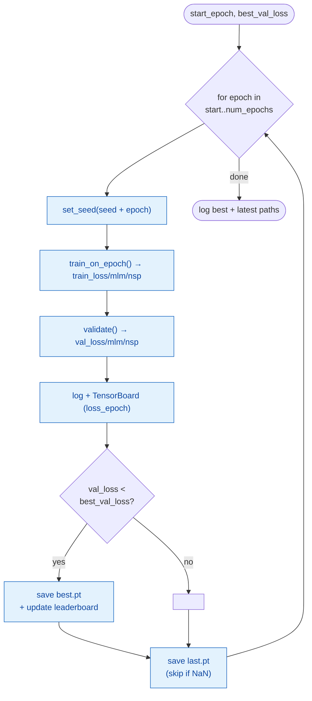
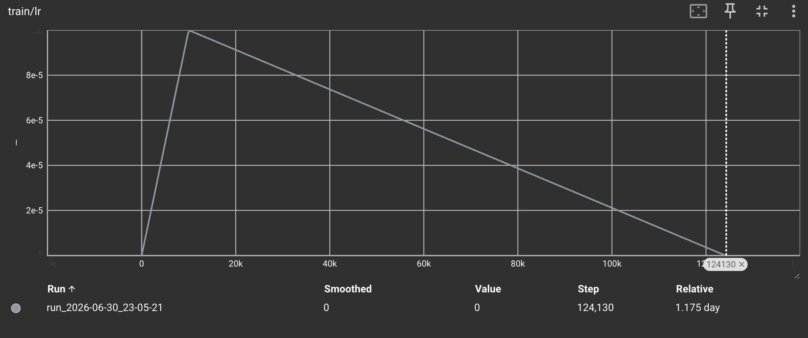
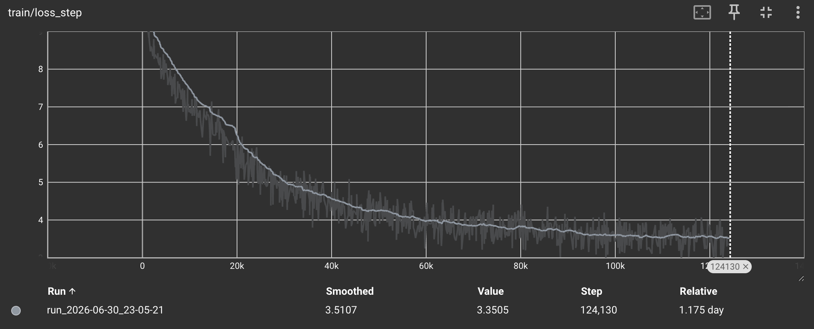
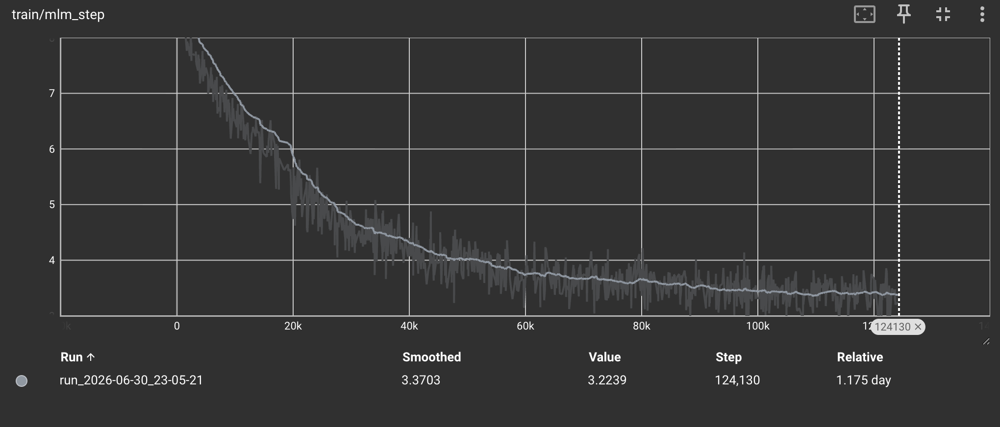
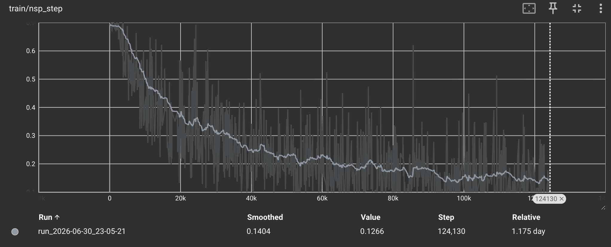
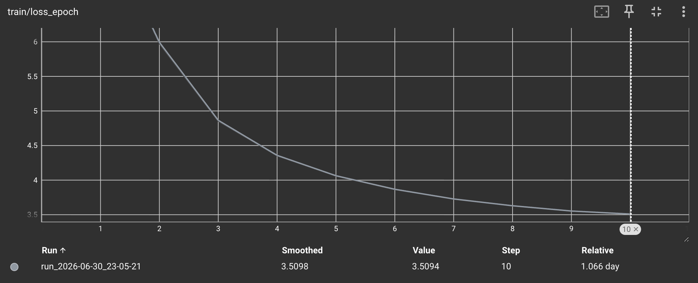
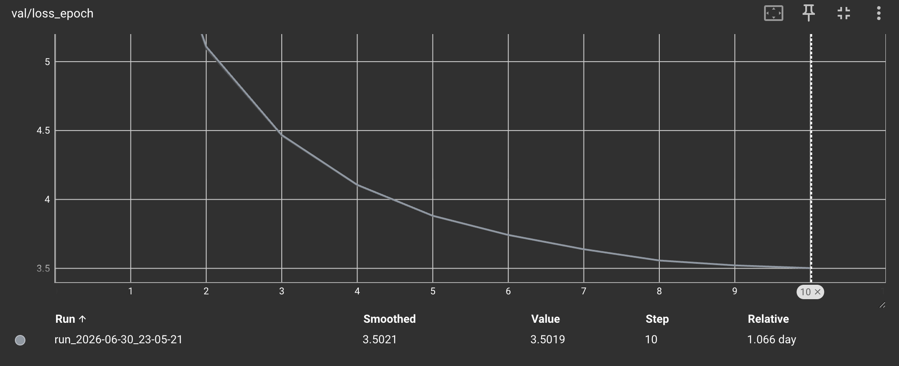

# BERT Pre-training Runbook (`pretrain.py`, `_common.py`, `train_utils.py`)

> Modules:
> [`BERT/scripts/pretrain.py`](../../scripts/pretrain.py) — the entrypoint
> [`BERT/scripts/_common.py`](../../scripts/_common.py) — shared builders (`build_model`, `load_checkpoint`)
> [`BERT/utils/train_utils.py`](../../utils/train_utils.py) — the train/validate loop + checkpointing
> Paper: Devlin et al. 2019, [*BERT*](https://arxiv.org/abs/1810.04805), §A.2 (Pre-training hyperparameters)

This is the **training layer** — everything that turns a corpus + a config into trained
weights. Three files, one story:

| file | role | you call it? |
|---|---|---|
| [`pretrain.py`](../../scripts/pretrain.py) | **entrypoint** — reads config, wires tokenizer → data → model → loss → optimizer, handles resume/provenance, then calls `train()` | **yes** — `python -m BERT.scripts.pretrain` |
| [`_common.py`](../../scripts/_common.py) | two tiny **builders** shared with finetune/evaluate/inference: `build_model`, `load_checkpoint` | no (imported) |
| [`train_utils.py`](../../utils/train_utils.py) | the **loop**: `train_on_epoch`, `validate`, `train`, `set_seed`, leaderboard | no (imported) |

Generic, paper-agnostic helpers (`get_device`, `get_git_hash`, `sha256_file`, `setup_logging`,
`warn_if_config_diverges`) live in [`common/run_utils.py`](../../../common/run_utils.py) so both
this replication and the [transformer](../../../transformer/scripts/train.py) could share them.

Throughout: **B** = batch size (32), **S** = sequence length, **step** = one batch.

## Contents

- [The end-to-end flow](#the-end-to-end-flow)
- [`pretrain.py` — the entrypoint](#pretrainpy--the-entrypoint)
  - [Per-run directories](#per-run-directories)
  - [Provenance & the resume preflight](#provenance--the-resume-preflight)
  - [Document-level train/val split](#document-level-trainval-split)
  - [`total_steps`](#total_steps)
- [`_common.py` — build_model & load_checkpoint](#_commonpy--build_model--load_checkpoint)
- [Model size — where 7,573,266 comes from](#model-size--where-7573266-comes-from)
  - [Position embeddings — 512 allocated, only 128 trained](#position-embeddings--512-allocated-only-128-trained)
- [`train_utils.py` — the loop](#train_utilspy--the-loop)
  - [`set_seed`](#set_seed)
  - [`train_on_epoch` — step = one batch](#train_on_epoch--step--one-batch)
  - [`validate`](#validate)
  - [`train` — the epoch loop & checkpoints](#train--the-epoch-loop--checkpoints)
  - [The leaderboard + `best.pt` symlink](#the-leaderboard--bestpt-symlink)
- [Example / batch / step / epoch — the hierarchy](#example--batch--step--epoch--the-hierarchy)
- [The running-average illusion](#the-running-average-illusion)
- [TensorBoard](#tensorboard)
- [Reading the curves — our 10-epoch base run](#reading-the-curves--our-10-epoch-base-run)
- [Resume — and the lr=0 trap](#resume--and-the-lr0-trap)
- [References](#references)

---

## The end-to-end flow

One `python -m BERT.scripts.pretrain --config ...` invocation runs this pipeline:



Prerequisite: the corpus must already exist at `config.data.corpus_path`
([`prepare_corpus.py`](prepare_corpus.md) writes it). `pretrain.py` errors fast with the
exact command if it's missing — building data is a **one-time** step; training runs **many** times.

---

## `pretrain.py` — the entrypoint

Its whole job is **wiring**: load config → build every piece in dependency order → call `train()`.
The body is wrapped in `try/except` so an unhandled crash lands in `train.log` with a full
traceback (not just stderr).

### Per-run directories

Every invocation gets its **own** timestamped subdir under both `checkpoint_dir` and `log_dir`,
so a new run (or a resume) never clobbers a previous run's weights, config, or log:

```python
timestamp = datetime.now().strftime("%Y-%m-%d_%H-%M-%S")
run_subdir = f"run_{timestamp}"
run_checkpoint_dir = os.path.join(config.paths.checkpoint_dir, run_subdir)
run_log_dir        = os.path.join(config.paths.log_dir, run_subdir)
shutil.copy(args.config, os.path.join(run_checkpoint_dir, "config.yaml"))   # snapshot
```

Resulting layout (the leaderboard + `best.pt` symlink sit **one level up**, ranking every run):

```
BERT/checkpoints/base/
├─ leaderboard.json                     ← {run_name: best_val_loss}, sorted
├─ best.pt → run_2026-06-30_23-05-21/best.pt   ← symlink to the global best
└─ run_2026-06-30_23-05-21/
   ├─ config.yaml    ← exact config this run used
   ├─ best.pt        ← best-val checkpoint for THIS run
   └─ last.pt        ← latest epoch (for --resume)
```

This is why `train()` needs a **per-run** `checkpoint_dir` — it derives the leaderboard's home
from `os.path.dirname(checkpoint_dir)`. Same scheme as
[`transformer/scripts/train.py`](../../../transformer/scripts/train.py).

### Provenance & the resume preflight

Three fingerprints are captured and **saved into every checkpoint**, so a year-old `best.pt` can
be traced back to *exactly* the code, tokenizer, and data that produced it:

| field | source | pins… |
|---|---|---|
| `git_hash` | `get_git_hash()` (+`-dirty` if uncommitted) | the **code** |
| `tokenizer_sha256` | `sha256_file(vocab.txt)` | the **vocab** (embedding rows) |
| `data_fingerprint` | `sha256_file(corpus_path)` | the **corpus** slice |

> **BERT adaptation:** the transformer fingerprints an HF *dataset slice* (`compute_data_fingerprint`);
> our corpus is a single `.txt`, so we just `sha256_file(corpus_path)` — same intent, right tool.

On `--resume`, the **preflight** runs *before* building anything expensive and aborts on a real
mismatch — so you fail in seconds, not an hour in:



`warn_if_config_diverges` is a **pure dict-diff** in
[`common/run_utils.py`](../../../common/run_utils.py): it compares the resumed run's config against
the snapshot next to the checkpoint and warns on any field that changed — **except** the keys in
`_RESUME_SAFE_KEYS` (`training.num_epochs`, `device`, `paths.log_dir`), which are *expected* to
differ on a resume. It warns, never blocks.

### Document-level train/val split

`create_dataloader` returns **one** loader, so `pretrain.py` splits the corpus itself — at the
**document** level, never mid-document:

```python
def split_documents(all_documents, val_split, seed):
    docs = list(all_documents)                  # shallow copy — don't shuffle the caller's list
    random.Random(seed).shuffle(docs)           # seeded LOCAL rng: reproducible, no global side effect
    val_count = int(len(docs) * val_split)
    return docs[val_count:], docs[:val_count]   # train, val
```

Why by document? **NSP integrity** — a document's sentences must never straddle the boundary, or
"the real next sentence" leaks val into train. A `random.Random(seed)` *local* generator keeps the
split reproducible without disturbing the global RNG that [`masking.py`](../utils/masking.md) /
[`nsp.py`](../objectives/nsp.md) draw from.

Our base run: `16213 docs → 14592 train / 1621 val` (val_split 0.1).

### `total_steps`

The lr schedule's linear decay needs to know the finish line, which isn't known until the loader
exists:

```python
total_steps = len(train_loader) * config.training.num_epochs   # 12413 × 10 = 124130
```

This flows into [`build_optimizer`](../utils/optimizer.md), whose schedule warms up for 10k steps
then decays linearly to **exactly 0** at step `total_steps`. (Remember this for [resume](#resume--and-the-lr0-trap).)

---

## `_common.py` — build_model & load_checkpoint

Deliberately tiny — only what's genuinely reused across `pretrain` / `finetune` / `evaluate` /
`inference`. Anything single-use stays inline in its caller.

**`build_model(config, vocab_size, device)`** — constructs
[`BERTForPreTraining`](../architecture/bert_for_pretraining.md) straight from the config and moves
it to the device. `vocab_size` comes from the *tokenizer* (`tokenizer.get_vocab_size()`), not the
config — the trained vocab is the source of truth:

```python
return BERTForPreTraining(
    vocab_size=vocab_size,
    d_model=config.model.d_model, num_heads=config.model.num_heads,
    d_ff=config.model.d_ff, num_layers=config.model.num_layers,
    max_position_embeddings=config.model.max_position_embeddings,
    num_segments=config.model.num_segments,
    pad_idx=config.tokens.pad_idx, dropout=config.model.dropout,
).to(device)
```

**`load_checkpoint(path, device)`** — one line, but two important flags:

```python
return torch.load(path, map_location=device, weights_only=True)
```

- `weights_only=True` — safe-load; blocks arbitrary pickle code execution.
- `map_location=device` — remaps tensors to *this* machine's device (mps/cuda/cpu) regardless of
  where the checkpoint was saved.

---

## Model size — where 7,573,266 comes from

Right after `build_model`, `pretrain.py` logs `Model parameters: 7,573,266 total, 7,573,266
trainable`. That number is fully accountable from the base config — **H**=256 (d_model), **V**=10,000
(vocab), **L**=6 layers, **F**=1024 (d_ff), **P**=512 (max positions), **Seg**=2:

**Embeddings — 2,692,096**

| piece | formula | params |
|---|---|---|
| token | V × H | 2,560,000 |
| position | P × H | 131,072 |
| segment | Seg × H | 512 |
| LayerNorm | 2 × H | 512 |

**One encoder layer — 789,760** (× 6 layers = **4,738,560**)

| piece | formula | params |
|---|---|---|
| Q, K, V projections | 3 × (H×H + H) | 197,376 |
| attn output proj | H×H + H | 65,792 |
| attn LayerNorm | 2 × H | 512 |
| FFN linear-1 | H×F + F | 263,168 |
| FFN linear-2 | F×H + H | 262,400 |
| FFN LayerNorm | 2 × H | 512 |

**Pooler** (`[CLS]` transform): `H×H + H` = **65,792**

**Pre-training heads — 76,818**

| piece | formula | params |
|---|---|---|
| MLM transform dense | H×H + H | 65,792 |
| MLM transform LayerNorm | 2 × H | 512 |
| MLM decoder **bias** | V | 10,000 |
| NSP classifier | H×2 + 2 | 514 |

Adding up:

```
   2,692,096   embeddings
 + 4,738,560   6 × encoder layer
 +    65,792   pooler
 ───────────  = 7,496,448   body (BERTModel)
 +    76,818   heads
 ───────────  = 7,573,266   ✓
```

> **Weight tying is why the heads are tiny.** The MLM decoder *weight* (`V×H` = 2,560,000) is the
> **same tensor** as the token embedding, so `model.parameters()` yields it **once** — only its
> separate **bias** (10,000) counts as new. Without tying, the heads would carry an extra 2.56M-row
> matrix. And since nothing is frozen (`requires_grad=True` everywhere), **total = trainable**.

### Position embeddings — 512 allocated, only 128 trained

The position table is `P × H = 512 × 256 = 131,072`, but the base config trains at `max_seq_len =
128`. Positions are indexed `0…S-1`, so with every sequence `≤ 128`, **rows 128–511 are never looked
up** → zero gradient → they stay frozen at their random init:

```
512 × 256 = 131,072   allocated
128 × 256 =  32,768   actually trained
──────────
           98,304   untrained "dead" rows   (~1.3% of the model)
```

Why 512 anyway? **Paper fidelity** — canonical BERT uses 512, and Devlin et al. train *staged*: ~90%
of steps at seq-len **128**, then ~10% at **512** to learn the long positions cheaply. **This
replication does 128 only**, so it inherits the 512-shaped table *without* the tail phase that fills
it — a deliberate-but-incomplete fidelity choice. It's harmless at 128 (those rows never participate
in the forward pass), but the tail rows aren't usable for `>128` sequences without further training.

**Choosing for your own run.** These weights are a starting point — pick the position-embedding setup
that fits how *you* intend to use them. Each option is a config change only (no model-code edits):

| if you… | change in your config | what you get |
|---|---|---|
| only ever feed **≤ 128 tokens** | `max_position_embeddings: 128` | sheds the 98,304 dead rows; the config now claims exactly what it trains |
| want a **512-capable** model | keep `512`, then run a closing **`max_seq_len: 512`** phase | actually trains rows 128–511 — the paper's staged recipe (needs longer packed examples + more compute) |
| **might** go long later, not now | leave `max_position_embeddings: 512` | the table is ready; rows 128–511 stay untrained until you run the phase above |

As shipped, this replication is the **last row** — 512-shaped for fidelity, 128-trained in practice.
Anyone building on it can move to either of the other rows by editing the config (and, for the middle
one, running the staged phase) — the model code doesn't change.

See [`bert.md`](../architecture/bert.md) for the embedding layer itself.

---

## `train_utils.py` — the loop

Four functions. `train()` is the conductor; it calls `train_on_epoch` + `validate` each epoch and
handles checkpointing.

### `set_seed`

```python
random.seed(seed)        # nsp.py: IsNext coin-flip + random next-sentence pick
np.random.seed(seed)     # nothing draws from it here — defensive carryover
torch.manual_seed(seed)  # masking.py randperm/rand/randint + dropout + DataLoader shuffle
```

Each line pins a *different* RNG. Note `np.random` is seeded but **nothing in this pipeline uses
it** — pure insurance. `train()` re-seeds as `set_seed(seed + epoch)` at each epoch boundary, so an
uninterrupted run and a resumed run are **bit-identical from any epoch boundary**.

### `train_on_epoch` — step = one batch

One `for batch in train_loader` iteration **is one step**: forward → loss → backward → clip →
`optimizer.step()` → `scheduler.step()`.

```python
for batch in pbar:                                    # 1 batch  = 1 step
    input_ids, token_type_ids = ...to(device)          # model builds its OWN pad mask — no attn_mask
    mlm_logits, nsp_logits = model(input_ids, token_type_ids)
    loss, mlm_loss, nsp_loss = criterion(mlm_logits, nsp_logits, mlm_labels, nsp_labels)
    optimizer.zero_grad(); loss.backward()
    nn.utils.clip_grad_norm_(model.parameters(), clip_grad_norm)
    optimizer.step(); scheduler.step()                 # lr moves EVERY step (warmup→decay)
    ...
    n = input_ids.size(0)                              # sequences in THIS batch (usually 32)
    total_loss += loss.item() * n; total_seqs += n     # weighted so a short last batch counts less
```

Two details worth pinning down:

- **The model takes only `input_ids` + `token_type_ids`.** It derives its pad mask internally from
  `input_ids`, so the batch's `attention_mask` isn't passed — the loop pulls only the four keys it
  needs (`input_ids`, `token_type_ids`, `mlm_labels`, `nsp_labels`).
- **Loss is weighted by `n = input_ids.size(0)`** (sequence count), not averaged naively — the last
  batch is usually short (our val: `43198 / 32` → 1349 full + 1 batch of 30), and it shouldn't count
  as a full batch. `return total_loss / total_seqs` is then a true epoch mean.

Returns `(avg_total, avg_mlm, avg_nsp)`.

### `validate`

Same forward as training, but `@torch.no_grad()` + `model.eval()` (dropout off), no backward, no
optimizer/scheduler step. Epoch-agnostic: run it on the same weights at epoch 1 or 50 and you get
the **identical** number — which is why it's `validate`, not `validate_on_epoch`. Returns
`(avg_total, avg_mlm, avg_nsp)`.

### `train` — the epoch loop & checkpoints



Every epoch writes a checkpoint dict with the full breakdown + provenance:

```python
{
  "epoch", "model_state_dict", "optimizer_state_dict", "scheduler_state_dict",
  "train_loss", "train_mlm", "train_nsp",
  "val_loss",   "val_mlm",   "val_nsp",
  "best_val_loss",
  "git_hash", "tokenizer_sha256", "data_fingerprint",   # provenance
}
```

- **`best.pt`** — written only when `val_loss` improves. Selection is on the **total** val loss
  (what the model actually minimizes); the mlm/nsp split is stored for *diagnostics*, not selection.
- **`last.pt`** — written every epoch for `--resume`, but **skipped on NaN** so a corrupted epoch
  can't poison auto-resume.

### The leaderboard + `best.pt` symlink

When `best.pt` improves, `_update_leaderboard(parent_dir, run_name, val_loss)` records this run's
best in `{parent_dir}/leaderboard.json` (sorted ascending, so it reads top-down as a ranking) and
repoints `{parent_dir}/best.pt` at the global best across **all** runs:

```
leaderboard.json
{
  "run_2026-06-30_23-05-21": 3.5019,   ← current best, best.pt → here
  "run_2026-06-25_10-11-02": 3.71,
  ...
}
```

So the global best is always one fixed path away: `BERT/checkpoints/base/best.pt`.

---

## Example / batch / step / epoch — the hierarchy

The four units, with our real base-run numbers:

```
example (1 row)   <   batch (32 rows = 1 STEP)   <   epoch (12,413 steps)   <   run (10 epochs)

397,197 train examples ÷ 32  =  12,413 batches  =  12,413 steps / epoch
12,413 steps × 10 epochs      =  124,130 total steps   ← lr decays to 0 exactly here
```

- **example** — one `[CLS] A [SEP] B [SEP]` row: `(token_ids, token_type_ids, nsp_label)`. (The 4th
  field, `mlm_labels`, is masked **fresh** in `__getitem__` each epoch — same row, new mask.)
- **batch** — 32 examples stacked into `(B, S)` by [`collate_fn`](../utils/data_utils.md). Count
  rounds **up** (`drop_last=False`), so the last batch is a short runt.
- **step** — one batch → one optimizer + scheduler update. The lr moves every step.
- **epoch** — one full pass over all batches. Validation + checkpoint happen **per epoch**.

---

## The running-average illusion

The loss on the tqdm bar is a **cumulative average that resets each epoch** — `total_loss /
total_seqs`. This creates a classic confusion: *within* an epoch the number looks frozen for
thousands of steps, then "jumps down" at the next epoch. The model isn't stalling — the **average**
is.

**Why it freezes late in an epoch.** By step 6,000 the shown value averages 6,000 batches. Adding
one *better* batch barely moves it:

```
new_avg = (6000 × 4.85 + 4.50) / 6001  ≈  4.8499     # moved by 0.0001
```

The average has 6,000 batches of "mass"; no single batch can budge it — even while the true
per-batch loss keeps sliding down.

**Why it drops at the epoch boundary.** Epoch N+1 resets the average to 0. At step 10 it averages
just 10 batches — of a model that already trained through all of epoch N — so it *immediately*
shows the true (lower) current loss.

> Cumulative-GPA analogy: after 6,000 courses at 4.85, acing course 6,001 barely moves your GPA.
> Start a fresh transcript (new epoch) and that same performance shows instantly.

**To see the *true* per-step curve**, look at TensorBoard's `train/loss_step` — it logs the raw
per-batch `loss.item()` (via `scheduler.last_epoch` as the global step), so it falls smoothly across
the whole run with no freeze.

---

## TensorBoard

`train_on_epoch` logs **per-step** scalars; `train` logs **per-epoch** ones. Launch:

```bash
uv run tensorboard --logdir BERT/logs/base
```

| tag | cadence | what it shows |
|---|---|---|
| `train/loss_step` | per step | raw total loss — the *real* curve (no averaging) |
| `train/mlm_step` | per step | raw MLM loss |
| `train/nsp_step` | per step | raw NSP loss |
| `train/lr` | per step | the warmup→decay triangle |
| `train/loss_epoch` | per epoch | epoch-mean train loss |
| `val/loss_epoch` | per epoch | epoch-mean val loss |

**`train/lr` — the warmup→decay triangle**



**`train/loss_step` & `train/mlm_step` — the smooth per-step descent**




**`train/nsp_step` — saturates early**



**`train/loss_epoch` & `val/loss_epoch` — convergence, no overfit**




---

## Reading the curves — our 10-epoch base run

7.57M params, mps, ~2h40m/epoch (~28h total). Val loss dropped every epoch:

| epoch | val total | val mlm | val nsp | Δ total |
|---|---|---|---|---|
| 1 | 6.693 | 6.263 | 0.430 | — |
| 5 | 3.880 | 3.646 | 0.234 | |
| 8 | 3.556 | 3.340 | 0.217 | −0.081 |
| 9 | 3.521 | 3.300 | 0.221 | −0.035 |
| 10 | 3.502 | 3.273 | 0.229 | −0.019 |

- **No overfitting** — val ≈ train throughout (E10: val 3.502 *below* train 3.509). Expected: train
  loss averages the whole epoch **with dropout on**; val is final weights **with dropout off**.
- **MLM carries it** — 6.26 → 3.27, i.e. perplexity ~525 → **~26** on a 10k vocab (random = 10000).
- **NSP saturates early** — ~0.22 by epoch 5, then flat (even ticks up). Classic: NSP is the easy
  objective; MLM does the real work. (The [RoBERTa](https://arxiv.org/abs/1907.11692) observation.)
- **Converged for this schedule** — Δval decelerated hard (0.081 → 0.035 → 0.019) and **lr hit 0.00**
  at epoch 10. This run is genuinely done.

---

## Resume — and the lr=0 trap

`base.yaml` plans "first run 10, then resume +20." **A naive `--resume` won't train**, and here's why:

The schedule decays linearly to **exactly 0** at `total_steps = 12413 × 10 = 124130`. On resume,
`pretrain.py` builds a fresh scheduler for the new epoch count — but then
`scheduler.load_state_dict(checkpoint)` **overwrites it**. `LinearWarmupScheduler` is a *callable
object*, so PyTorch's `LambdaLR` restores its saved `__dict__` (`total_steps=124130`) **and**
`last_epoch=124130`. Every step past 124130 then gives:

```
factor = max(0, (124130 - step) / (124130 - 10000))  =  0     # step > total_steps
```

→ **lr pinned at 0, model learns nothing.**

> This is a **BERT-specific** trap. The [transformer](../../../transformer/utils/optimizer.py)
> resumes fine because its **Noam** schedule decays as `step^-0.5` and never reaches 0. Our
> **linear-to-zero** schedule does.

**To actually continue training**, the added epochs need a **fresh warmup→decay** (a re-warm
"continued pretraining" phase), not a resumed scheduler with a bigger `num_epochs`. See
[`optimizer.md`](../utils/optimizer.md) for the schedule mechanics.

---

## References

- Devlin et al. 2019, [*BERT: Pre-training of Deep Bidirectional Transformers*](https://arxiv.org/abs/1810.04805) — §A.2 (hyperparameters)
- Liu et al. 2019, [*RoBERTa*](https://arxiv.org/abs/1907.11692) — the NSP-is-weak finding
- Sibling docs: [`optimizer.md`](../utils/optimizer.md) · [`loss.md`](../utils/loss.md) · [`data_utils.md`](../utils/data_utils.md) · [`prepare_corpus.md`](prepare_corpus.md)
- Source: [`pretrain.py`](../../scripts/pretrain.py) · [`_common.py`](../../scripts/_common.py) · [`train_utils.py`](../../utils/train_utils.py) · [`common/run_utils.py`](../../../common/run_utils.py)
- Mirror reference: [`transformer/scripts/train.py`](../../../transformer/scripts/train.py) · [`transformer/docs/scripts/train.md`](../../../transformer/docs/scripts/train.md)
