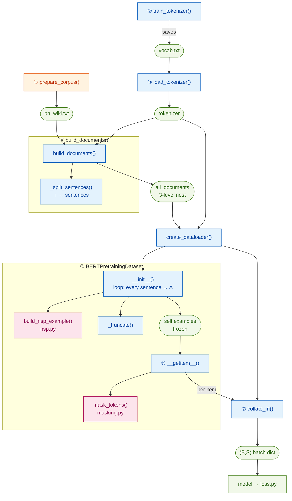

# The data pipeline — corpus → batches (`data_utils.py`)

> Module: [`BERT/utils/data_utils.py`](../../utils/data_utils.py)
> Paper: Devlin et al. 2019, [*BERT*](https://arxiv.org/abs/1810.04805), §3.1 (pre-training data) + §3 (WordPiece, 30k vocab)

This is the **glue** of pre-training. Every other data module does *one* small job;
`data_utils.py` wires them into a single path that turns a folder-of-text into the
`(B, S)` tensors the model eats:

```
raw Bengali text  ─►  WordPiece ids  ─►  [CLS] A [SEP] B [SEP]  ─►  masked + padded batch
                       (tokenizer)        (nsp.py)                  (this file)
```

It owns four things the other modules deliberately leave out:
1. **the tokenizer** (string ↔ id),
2. **turning the corpus into the 3-level `all_documents` nest** NSP needs,
3. **the caller loop + truncation** that [`nsp.py`](../objectives/nsp.md) left for "later",
4. **masking + padding + batching** — calling [`masking.py`](masking.md) and stacking everything into rectangles.

Throughout: **B** = batch size, **S** = sequence length (per batch, after padding),
**V** = vocab size.

## Contents

- [The functions at a glance (call graph)](#the-functions-at-a-glance-call-graph)
- [Where this sits in the pipeline](#where-this-sits-in-the-pipeline)
- [The 3-level nest everything revolves around](#the-3-level-nest-everything-revolves-around)
- [1. The WordPiece tokenizer](#1-the-wordpiece-tokenizer)
- [2. Corpus → `all_documents`](#2-corpus--all_documents)
- [3. Truncation — `_truncate`](#3-truncation--_truncate)
- [4. The Dataset — pairs once, masks fresh](#4-the-dataset--pairs-once-masks-fresh)
  - [The caller loop (`__init__`)](#the-caller-loop-__init__)
  - [Static NSP vs dynamic masking](#static-nsp-vs-dynamic-masking)
  - [`__getitem__` — list → tensor, mask a clone](#__getitem__--list--tensor-mask-a-clone)
- [5. `collate_fn` — ragged lists → `(B, S)` rectangles](#5-collate_fn--ragged-lists--b-s-rectangles)
- [6. `create_dataloader` — shuffle & workers](#6-create_dataloader--shuffle--workers)
- [A full worked example](#a-full-worked-example)
- [What changes across epochs (and what never does)](#what-changes-across-epochs-and-what-never-does)
- [Gotchas](#gotchas)
- [References](#references)

---

## The functions at a glance (call graph)

There are a lot of functions here. This is **who calls whom** — solid arrows are
calls, and each box is colour-grouped by the file it lives in. Read it top→bottom:
it's the same order you'd run things.

This is the **real call flow** — data flows along the arrows, and each helper sits
**inside the function that calls it** (`_split_sentences` inside ④, `build_nsp_example`
+ `_truncate` inside ⑤, `mask_tokens` inside ⑥). Rounded boxes are **data artifacts**
passed between steps. The numbers ①–⑦ match the worked trace below.



**The same ①–⑦, traced on one tiny 2-article corpus** (ids are illustrative):

```
① prepare_corpus()        writes bn_wiki.txt — one article per line:
                            মধুসূদন দত্ত একজন কবি। তিনি ১৮২৪ সালে জন্মান।
                            ⟨blank line⟩
                            কলকাতা একটি শহর। এটি বড়।

② train_tokenizer()       learns the WordPiece vocab → saves vocab.txt
③ load_tokenizer()        reloads vocab.txt → tokenizer object  ([CLS]=2, [SEP]=3, [MASK]=4)

④ build_documents(bn_wiki.txt, tokenizer)    splits on blank line (docs) + । (sentences), encodes:
                            all_documents = [ [[88,41,9],[5,33,90]],   # doc0: 2 sentences
                                              [[21,4],   [11,60]]   ]  # doc1: 2 sentences

   create_dataloader(all_documents, tokenizer)   builds the Dataset (runs ⑤) + a
                            DataLoader that drives ⑥ then ⑦ — it's the orchestrator, not a step

⑤ Dataset.__init__()      one example per sentence. For doc0, sentence0:
     ├ build_nsp_example → token_ids = [2, 88,41,9, 3, 5,33,90, 3]   ([CLS]A[SEP]B[SEP])
     │                     types     = [0,  0, 0,0, 0, 1, 1, 1, 1]   nsp_label = 0 (IsNext)
     └ _truncate          (already ≤ max_seq_len → unchanged)
   → self.examples = 4 frozen tuples (ids, types, nsp_label), one per sentence

⑥ __getitem__(0)          masks a CLONE (say position 2, id 41, is picked):
     └ mask_tokens →  input_ids  = [2, 88, 4, 9, 3, 5,33,90, 3]   (41 → [MASK]=4)
                      mlm_labels = [-100,-100, 41,-100,...,-100]  (orig id only at masked spot)
                      nsp_label  = 0

⑦ collate_fn([item0, item1])   pads both to S = max length in the batch → (B, S):
                      input_ids      (2, S)   pad → 0
                      token_type_ids (2, S)   pad → 0
                      attention_mask (2, S)   1 = real, 0 = pad
                      mlm_labels     (2, S)   pad → -100
                      nsp_labels     (2,)     [0, 1]
                      → straight into the model, then loss.py
```

Reading it as three phases:
- **① ④ once at setup** — after `Dataset.__init__` (⑤), `self.examples` is **frozen**.
- **⑥ every fetch** — `create_dataloader` drives `__getitem__`, which re-rolls a fresh mask each time.
- **⑦ every batch** — `collate_fn` pads a list of items into rectangles.

⑤ is the busy box — the only one that calls **both** `build_nsp_example` (nsp.py) and
`_truncate`. Everything after it is just "fetch one → mask → pad a stack."

## Where this sits in the pipeline

```
 prepare_corpus.py  (run once, separate script)
   download Bengali Wikipedia → filter → collapse each article to ONE line
   │   writes:  one article per line, blank line between articles
   ▼
 data/bn_wiki.txt
   │
   ▼
 ┌─────────────────────────  data_utils.py  ──────────────────────────┐
 │                                                                    │
 │  train_tokenizer / load_tokenizer   → WordPiece vocab (string↔id)  │
 │           │                                                        │
 │           ▼                                                        │
 │  build_documents(corpus, tokenizer) → all_documents  (3-level)     │
 │           │                                                        │
 │           ▼                                                        │
 │  BERTPretrainingDataset.__init__                                   │
 │     for every sentence A:  build_nsp_example(...)  ← nsp.py        │
 │                            _truncate(...)          ← this file     │
 │     → self.examples = [ (token_ids, token_type_ids, nsp_label) ]   │
 │           │                                                        │
 │           ▼                                                        │
 │  __getitem__(idx):  mask_tokens(...)  ← masking.py  (fresh mask)   │
 │           │                                                        │
 │           ▼                                                        │
 │  collate_fn:  pad ragged examples → (B, S) tensors + attn mask     │
 │                                                                    │
 └────────────────────────────────────────────────────────────────────┘
   │
   ▼
 model → loss.py   (mlm_labels, nsp_labels are the seams)
```

The two seams worth remembering:
- **`mlm_labels`** carries `-100` everywhere the loss must ignore (set by [`masking.py`](masking.md)); read by `F.cross_entropy(ignore_index=-100)` in [`loss.py`](loss.md).
- **`nsp_labels`** is `0 = IsNext / 1 = NotNext` (set by [`nsp.py`](../objectives/nsp.md)); a plain 2-class target.

---

## The 3-level nest everything revolves around

NSP needs to know **which sentences belong to the same document**, so the whole
pipeline speaks one shape — a list nested **three** deep:

```
all_documents : list[list[list[int]]]      the whole corpus
   └ document  : list[list[int]]           one article
        └ sentence : list[int]             WordPiece ids — NO [CLS]/[SEP] yet
             └ id : int                    one token
```

Peeling one bracket at a time:

| expression | is a | example |
|---|---|---|
| `all_documents`        | the corpus       | `[ doc0, doc1, ... ]` |
| `all_documents[0]`     | one **document** | `[ [88,41], [5,33,90] ]` |
| `all_documents[0][1]`  | one **sentence** | `[5, 33, 90]` |
| `all_documents[0][1][0]` | one **token id** | `5` |

Why no `[CLS]`/`[SEP]` in the sentences? Because `nsp.py` adds them when it packs
A and B — if the tokenizer added them per sentence you'd get a mess of doubled
specials. (That's the `add_special_tokens=False` in [step 2](#2-corpus--all_documents).)

---

## 1. The WordPiece tokenizer

> *"We use WordPiece embeddings (Wu et al., 2016) with a 30,000 token vocabulary."*
> — BERT §3

BERT uses **WordPiece** (not the transformer's SentencePiece BPE). Two helpers:

```python
train_tokenizer(corpus_files, vocab_size, save_dir)   # learn vocab → save vocab.txt
load_tokenizer(vocab_path)                            # reload it later
```

The single most important detail is the **special-token order**, because the order
*is* what fixes the ids:

```python
SPECIAL_TOKENS = ["[PAD]", "[UNK]", "[CLS]", "[SEP]", "[MASK]"]
#                    0        1        2        3        4
```

`nsp.py` and `masking.py` are *handed* `cls_id=2`, `sep_id=3`, `mask_id=4` — they
never hard-code them. Change the order here and everything downstream still works,
because the ids flow from this list.

Encoding a sentence asks for **bare content ids**:

```python
tokenizer.encode("মধুসূদন কবি", add_special_tokens=False).ids   # → [88, 41]
#                                ^^^^^^^^^^^^^^^^^^^^^^^^         ^^^ .ids = the integers
```

- `add_special_tokens=False` → no per-sentence `[CLS]`/`[SEP]` (nsp.py's job).
- `.ids` → the encoder returns an object; `.ids` is the integer list (`.tokens` would be the subword strings).

---

## 2. Corpus → `all_documents`

`build_documents` reads the `.txt` and produces the 3-level nest. Two separators do
two different jobs:

```
blank line  (\n\s*\n)   →  splits DOCUMENTS   (made by prepare_corpus)
। . ! ?                 →  splits SENTENCES   (natural punctuation)
```

```python
with open(corpus_path, encoding="utf-8") as f:   # utf-8 is mandatory for Bengali
    raw = f.read()

for block in re.split(r"\n\s*\n", raw.strip()):  # blank line = document boundary
    document = [
        tokenizer.encode(s, add_special_tokens=False).ids
        for s in _split_sentences(block)
    ]
    document = [ids for ids in document if ids]   # drop sentences that tokenized to nothing
    if document:
        all_documents.append(document)
```

**Example.** Corpus file (`\n` shown):

```
মধুসূদন দত্ত একজন কবি। তিনি ১৮২৪ সালে জন্মান।\n\nকলকাতা একটি শহর। এটি বড়।\n\n
```

splits on the blank lines into two blocks → each block split on `।` into sentences →
each sentence encoded → :

```python
all_documents = [
    [ [88,41,9], [5,33,90] ],     # doc 0  — মধুসূদন article (2 sentences)
    [ [21,4],    [11,60]   ],     # doc 1  — কলকাতা article  (2 sentences)
]
```

Two guards:
- `if ids` (per sentence) — a "sentence" that's only punctuation tokenizes to `[]`; dropped, so no zero-length sentence reaches NSP.
- `if document` (per block) — a block that emptied out entirely is dropped.

> **Why one article must be one line.** Real Wikipedia `text` has blank lines
> *between paragraphs*. If those survived, `build_documents` would split one article
> into many tiny "documents" — and NSP's "random sentence from a **different**
> document" could then grab the next paragraph of the *same* article (a false
> negative). `prepare_corpus.py` prevents this with `" ".join(text.split())`, which
> flattens every internal newline so the **only** blank lines left are the real
> article boundaries.

---

## 3. Truncation — `_truncate`

`nsp.py` assembles `[CLS] A [SEP] B [SEP]` but does **not** cap its length — that was
deferred here. `_truncate` trims an over-long sequence down to `max_seq_len` by
repeatedly deleting the **last content token of whichever segment is longer**, never
touching `[CLS]`/`[SEP]` (this is Google's `truncate_seq_pair`).

```python
while len(token_ids) > max_seq_len:
    seg_a_len = token_type_ids.count(0)     # [CLS] A [SEP]
    seg_b_len = token_type_ids.count(1)     # B [SEP]
    if seg_a_len >= seg_b_len:
        drop = seg_a_len - 2                # A's last content token (before A's [SEP])
    else:
        drop = len(token_ids) - 2           # B's last content token (before B's [SEP])
    del token_ids[drop]
    del token_type_ids[drop]
```

**Example** (`max_seq_len = 8`):

```
start (len 10):
token_ids      = [2, 10, 11, 12, 13, 3, 20, 21, 22, 3]   # [CLS] A(4) [SEP] B(3) [SEP]
token_type_ids = [0,  0,  0,  0,  0, 0,  1,  1,  1, 1]

iter 1: seg_a=6 ≥ seg_b=4  → drop idx 4 (=13, A's last word)
        [2, 10, 11, 12, 3, 20, 21, 22, 3]                # len 9
iter 2: seg_a=5 ≥ seg_b=4  → drop idx 3 (=12)
        [2, 10, 11, 3, 20, 21, 22, 3]                    # len 8  ✓ stop

result = [CLS] 10 11 [SEP] 20 21 22 [SEP]   — A trimmed, B intact, skeleton kept
```

On a tie (`>=`) it drops from **A** — matches Google. Note `seg_a_len` counts *two*
specials (`[CLS]`+`[SEP]`) and `seg_b_len` one (`[SEP]`), so it balances *segments*,
not raw content — a ≤1-token cosmetic difference, harmless.

---

## 4. The Dataset — pairs once, masks fresh

`BERTPretrainingDataset` is where the corpus becomes individual training examples.
The headline design: **NSP pairs are built once; MLM masks are rolled fresh on
every fetch.**

### The caller loop (`__init__`)

```python
self.examples = []
for document in all_documents:
    for a_index in range(len(document)):           # EVERY sentence becomes one "A"
        token_ids, token_type_ids, nsp_label = build_nsp_example(
            a_index, document, all_documents, self.cls_id, self.sep_id
        )
        token_ids, token_type_ids = _truncate(token_ids, token_type_ids, max_seq_len)
        self.examples.append((token_ids, token_type_ids, nsp_label))
```

This is the loop `nsp.py` was written *for*: it passes `a_index` straight in (a
position, a number) rather than searching for sentence A by value — so duplicate
sentences can't confuse it, and the true next sentence is unambiguously
`document[a_index + 1]`. (See [`nsp.md`](../objectives/nsp.md) for the `a_index`
vs `sentence_a` story.)

After `__init__`, `self.examples` is a flat, **frozen** list:

```python
self.examples = [
    ([2,88,41,3,5,33,90,3], [0,0,0,0,1,1,1,1], 0),   # doc0 s0  IsNext
    ([2,5,33,90,3, ...],    [...],             1),   # doc0 s1  (last → NotNext)
    ...                                              # one entry per sentence in the corpus
]
```

### Static NSP vs dynamic masking

| | when it's decided | changes per epoch? |
|---|---|---|
| **A–B pairing** (which B follows A) | once, in `__init__` | ❌ frozen |
| **NSP label** (IsNext/NotNext) | once, with the pair | ❌ frozen |
| **MLM mask** (which 15% hidden) | every `__getitem__` | ✅ fresh each fetch |

Why mask dynamically? Original BERT froze the mask in a **separate preprocessing
pass** (`create_masked_lm_predictions` in `create_pretraining_data.py`) that wrote
masked examples to disk, and `run_pretraining.py` just read them. To add variety it
duplicated the corpus **`dupe_factor=10×`** with different masks (the "10×" is the
code's default + RoBERTa §4.1 — *not* a number in the BERT paper). We skip all that:
re-masking in `__getitem__` gives unlimited mask variety for free, no stored copies.

```
same example, two epochs:
  epoch 1 fetch → mask_tokens() rolls a NEW mask → [2,88, 4,3,5,33,90,3]   (pos 2 hidden)
  epoch 2 fetch → rolls ANOTHER new mask         → [2,88,41,3, 4,33,90,3]   (pos 4 hidden)
  ↑ A and B are identical both times — only the mask moved
```

### `__getitem__` — list → tensor, mask a clone

```python
def __getitem__(self, idx):
    token_ids, token_type_ids, nsp_label = self.examples[idx]   # FROZEN lists + int

    masked_ids, mlm_labels = mask_tokens(
        torch.tensor(token_ids, dtype=torch.long),   # list → LongTensor (see below)
        vocab_size=self.vocab_size,
        mask_token_id=self.mask_id,
        special_token_ids=self.special_token_ids,
        mlm_probability=self.mlm_probability,
    )
    return {
        "input_ids":      masked_ids,                                       # (S,) corrupted
        "token_type_ids": torch.tensor(token_type_ids, dtype=torch.long),   # (S,) 0/1 segments
        "mlm_labels":     mlm_labels,                                       # (S,) orig id at masked, -100 else
        "nsp_label":      torch.tensor(nsp_label, dtype=torch.long),        # ()  0/1
    }
```

Two "why"s:

- **Why `torch.tensor(..., dtype=torch.long)`?** The stored example is a plain Python
  **list** (nsp.py and `_truncate` work on lists). `mask_tokens` runs tensor ops, so
  we convert. `long` because token ids are **integer indices** — `nn.Embedding` and
  `cross_entropy` require int64.
- **The example is never mutated.** Inside `mask_tokens`, `masked_ids = token_ids.clone()`
  — corruption happens on a **copy**. So `self.examples[idx]` stays byte-for-byte
  identical across epochs; only the returned `masked_ids` differs. *That* is what
  makes the mask "fresh" without ever changing the data.

---

## 5. `collate_fn` — ragged lists → `(B, S)` rectangles

`__getitem__` hands back examples of **different lengths**. `collate_fn` pads each
field to the batch's longest, producing rectangular tensors. Each field pads with a
**different value**:

```python
input_ids      = pad_sequence(..., batch_first=True, padding_value=pad_id)       # real-token slot, ignored
token_type_ids = pad_sequence(..., batch_first=True, padding_value=0)            # padding sits in segment 0
mlm_labels     = pad_sequence(..., batch_first=True, padding_value=ignore_index) # -100 → loss skips it
nsp_labels     = torch.stack([b["nsp_label"] for b in batch])                    # scalars → (B,)
attention_mask = (input_ids != pad_id).long()                                    # 1 = real, 0 = pad
```

**Example** — two examples, lengths 8 and 6, `pad_id=0`:

```
before padding:
  example A (len 8):  [2, 88, 4, 3, 5, 33, 90, 3]
  example B (len 6):  [2, 21, 4, 3, 8,  3]          ← shorter

pad every field to S = 8 (the longest in the batch):

  input_ids       A: [   2,    88,     4,    3,    5,   33,   90,    3]
                  B: [   2,    21,     4,    3,    8,    3,    0,    0]   ← pad_id = 0
                                                              └──┬───┘
                                                            padding

  token_type_ids  A: [   0,     0,     0,    0,    1,    1,    1,    1]
                  B: [   0,     0,     0,    0,    1,    1,    0,    0]   ← pad → segment 0

  mlm_labels      A: [-100, -100,    41, -100, -100, -100, -100, -100]
                  B: [-100, -100,    19, -100, -100, -100, -100, -100]   ← pad → -100

  attention_mask  A: [   1,     1,     1,    1,    1,    1,    1,    1]
                  B: [   1,     1,     1,    1,    1,    1,    0,    0]   ← 0 exactly at padding

  nsp_labels       : [   0,     1]                                       ← one scalar per example

shapes:  input_ids / token_type_ids / mlm_labels / attention_mask = (2, 8)
         nsp_labels = (2,)
```

Two details:

- **`batch_first=True`** → shape `(B, S)` = each **row** is one example. Every
  downstream piece assumes batch on axis 0 (loss.py reads `(B, S, V)`; the model takes
  `[CLS]` as `hidden[:, 0]`). `False` would give `(S, B)` and force transposes.
- **Why padding's segment id is harmless.** A pad slot gets `token_type_id = 0`
  (segment A's embedding), but its hidden state is never used: `attention_mask = 0`
  there (nobody attends to it), `mlm_labels = -100` there (loss ignores it), and NSP
  reads only `[CLS]`. The thing that actually neutralizes padding is the
  **`attention_mask`**, not the segment id.

---

## 6. `create_dataloader` — shuffle & workers

```python
DataLoader(
    dataset,
    batch_size=batch_size,
    shuffle=shuffle,                              # shuffles EXAMPLES each epoch (not A↔B pairing)
    num_workers=num_workers,
    collate_fn=partial(collate_fn, pad_id=pad_id),  # partial, NOT lambda — see Gotchas
)
```

`shuffle=True` makes PyTorch build a `RandomSampler` that runs `torch.randperm(len)`
at the **start of every epoch**, then feeds those indices to `__getitem__`:

```
epoch 1: perm [3,0,4,1,2] → batches (ex3,ex0) (ex4,ex1) (ex2)
epoch 2: perm [1,4,2,0,3] → batches (ex1,ex4) (ex2,ex0) (ex3)
```

It shuffles **which examples land together / in what order** — it does **not**
re-pair A with a new B (that's frozen) and does **not** touch the mask (re-rolled
regardless).

---

## A full worked example

Two short articles, end to end.

**Corpus file:**
```
মধুসূদন দত্ত একজন কবি। তিনি ১৮২৪ সালে জন্মান।\n\nকলকাতা একটি শহর। এটি বড়।\n\n
```

**① `build_documents`** → ids (`[CLS]=2 [SEP]=3`, others illustrative):
```python
all_documents = [
    [ [88,41,9], [5,33,90] ],     # doc 0
    [ [21,4],    [11,60]   ],     # doc 1
]
```

**② `__init__` caller loop** → 4 examples (one per sentence). For `doc0, a_index=0`
(coin → IsNext, B = next sentence):
```python
build_nsp_example(0, doc0, all_documents, 2, 3)
# token_ids      = [2, 88, 41, 9, 3, 5, 33, 90, 3]
# token_type_ids = [0,  0,  0, 0, 0, 1,  1,  1, 1]
# nsp_label      = 0
_truncate(...)   # ≤ max_seq_len → unchanged
self.examples.append((token_ids, token_type_ids, 0))
```

**③ `__getitem__(0)`** → mask a clone (say pos 2 picked):
```python
{
 "input_ids":      tensor([2, 88,  4, 9, 3, 5, 33, 90, 3]),   # 41 → [MASK]=4
 "token_type_ids": tensor([0,  0,  0, 0, 0, 1,  1,  1, 1]),
 "mlm_labels":     tensor([-100,-100,41,-100,-100,-100,-100,-100,-100]),
 "nsp_label":      tensor(0),
}
```

**④ `collate_fn`** over a batch of these → padded `(B, S)` dict with `input_ids`,
`token_type_ids`, `attention_mask`, `mlm_labels`, `nsp_labels` → straight into the
model, then [`loss.py`](loss.md).

---

## What changes across epochs (and what never does)

```
self.examples (A–B pairs, NSP labels) ──────────── frozen forever  (built in __init__)
returned masked_ids / mlm_labels ──────────────── new every fetch  (mask_tokens clones + corrupts)
batch composition / order ──────────────────────── new every epoch (shuffle=True → randperm)
```

The training variety comes **entirely from re-masking a clone** — never from
altering the stored examples.

---

## Gotchas

- **Needs ≥ 2 documents.** `nsp.py`'s `_random_sentence` raises `ValueError` if the
  corpus has fewer than 2 documents (a NotNext negative needs a *different* document).
  A toy corpus that yields 0–1 documents will crash inside `__init__`.
- **`partial`, not `lambda`, for `collate_fn`.** A `lambda` isn't picklable, so on
  macOS (spawn) `num_workers > 0` would crash. `functools.partial` is picklable and
  behaves identically at `num_workers = 0`. (The transformer sidestepped this by
  always running `num_workers = 0`.)
- **Key names are a seam.** `__getitem__` emits `"nsp_label"` (singular);
  `collate_fn` reads `b["nsp_label"]` and emits `"nsp_labels"` (plural) to match
  [`loss.py`](loss.md)'s `forward` argument. Mismatch → `KeyError`.
- **Eager build.** `__init__` materializes every example in RAM — fine for a capped
  corpus; for the full dump, switch to storing `(document, a_index)` and building the
  pair lazily in `__getitem__`.

---

## References

- Paper: Devlin et al. 2019, [*BERT*](https://arxiv.org/abs/1810.04805) — §3.1 (data); §3 (WordPiece, "30,000 token vocabulary").
- Static vs dynamic masking: Liu et al. 2019, [*RoBERTa*](https://arxiv.org/abs/1907.11692) — §4.1.
- Google reference: `create_pretraining_data.py` (`dupe_factor`, `truncate_seq_pair`).
- Sibling docs: [`masking.md`](masking.md), [`nsp.md`](../objectives/nsp.md), [`loss.md`](loss.md).
