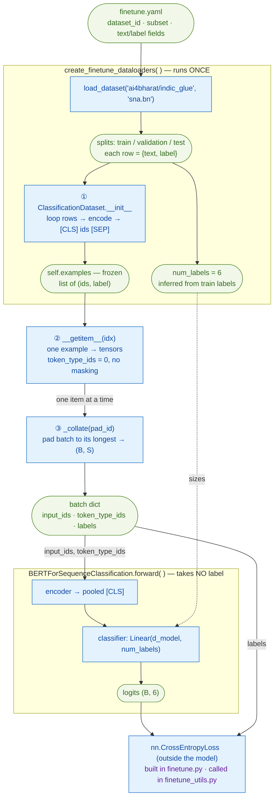

# The fine-tuning data pipeline — labeled text → batches (`finetune_data.py`)

> Module: [`BERT/utils/finetune_data.py`](../../utils/finetune_data.py)
> Paper: Devlin et al. 2019, [*BERT*](https://arxiv.org/abs/1810.04805), §4.1 (single-sentence classification — the SST-2 input format)
> Pretraining sibling: [`data_utils.py`](data_utils.md) (the *unlabeled* MLM+NSP pipeline)

This is the data glue for **fine-tuning**. Where [`data_utils.py`](data_utils.md) turns a
folder-of-text into masked MLM+NSP batches, this file turns a **labeled** HuggingFace
dataset into the `(B, S)` tensors + a class label the classifier eats:

```
labeled Bengali news  ─►  WordPiece ids  ─►  [CLS] tokens [SEP]  ─►  padded batch + label
  (ai4bharat/indic_glue    (tokenizer)        (this file)             (this file)
   sna.bn: text, label)
```

It is deliberately **much smaller** than the pretraining pipeline, because fine-tuning
throws away everything that made pretraining complex — no NSP pairing, no document
nest, no masking, no truncation-of-two-segments. One sentence in, one label out.

Throughout: **B** = batch size, **S** = sequence length (per batch, after padding).

## Contents

- [The two data paths are separate](#the-two-data-paths-are-separate)
- [What fine-tuning *drops* vs pretraining](#what-fine-tuning-drops-vs-pretraining)
- [The functions at a glance (call graph)](#the-functions-at-a-glance-call-graph)
- [The dataset: `ai4bharat/indic_glue` `sna.bn`](#the-dataset-ai4bharatindic_glue-snabn)
- [1. `ClassificationDataset` — tokenize once, tensorize on fetch](#1-classificationdataset--tokenize-once-tensorize-on-fetch)
- [2. `_collate` — dynamic per-batch padding](#2-_collate--dynamic-per-batch-padding)
- [3. `create_finetune_dataloaders` — the orchestrator](#3-create_finetune_dataloaders--the-orchestrator)
- [A full worked example](#a-full-worked-example)
- [Baseline to compare against](#baseline-to-compare-against)
- [Gotchas](#gotchas)
- [References](#references)

---

## The two data paths are separate

The single most important thing to hold in your head: **fine-tuning and pretraining
never share a loader, a file, or a dataset.**

| | pretraining ([`data_utils.py`](data_utils.md)) | fine-tuning (this file) |
|---|---|---|
| source | `wikimedia/wikipedia` `20231101.bn` | `ai4bharat/indic_glue` `sna.bn` |
| when loaded | **offline, once** (`prepare_corpus.py`) | **live, at train time** (`load_dataset`) |
| intermediate file | `data/bn_wiki.txt` | none |
| labels? | ❌ none (self-supervised) | ✅ 6 topic classes |
| why the difference | raw text needs filtering + document structure for NSP → cheaper to preprocess once | already-clean `(text, label)` pairs → nothing to preprocess, just read |

So the `for row in hf_split:` loop in this file is **fine-tune-only**. Pretraining's
equivalent is `build_documents()` reading lines from `bn_wiki.txt`.

---

## What fine-tuning *drops* vs pretraining

BERT §3.5: *"the only new parameters introduced during fine-tuning are classification
layer weights."* The data side mirrors that minimalism — three whole pretraining
mechanisms simply vanish:

```
pretraining example                          fine-tuning example
────────────────────                         ───────────────────
[CLS] A [SEP] B [SEP]   two segments   ─►     [CLS] tokens [SEP]     one segment
token_type_ids 0…0 1…1  (A vs B)       ─►     token_type_ids 0…0     (all segment 0)
15% tokens → [MASK]     (MLM)          ─►     no masking             (full clean text)
nsp_label 0/1           (IsNext?)      ─►     (gone)
mlm_labels -100/id                     ─►     (gone)
                                              label ∈ 0..5           (the ONLY supervision)
```

- **No MLM masking** — the model reads the *full clean sentence*; `mask_id` never appears.
- **No NSP label** — it's a single sentence, not a pair, so there's nothing to predict "next."
- **The only target is the topic class**, fed to `nn.CrossEntropyLoss`.

---

## The functions at a glance (call graph)

Read it **top → bottom** — that's the order things run. Rounded green boxes are **data**;
square blue boxes are **code steps**. The whole grey box is what
`create_finetune_dataloaders` does **once at setup**; below it is what happens **per
fetch / per batch**. The circled ①②③ are the same three steps traced in the
[worked example](#a-full-worked-example).



The two timescales the diagram separates:

- **Inside the grey box — runs once at setup.** `create_finetune_dataloaders` calls
  `load_dataset`, picks the splits, infers `num_labels`, and builds the datasets. After
  `__init__` (①), `self.examples` is **frozen**.
- **Below the grey box — runs every fetch / batch.** `__getitem__` (②) tensorizes one
  stored example; `_collate` (③) pads a list of them into `(B, S)` rectangles. Unlike
  pretraining, **nothing here is random** — no fresh mask, so the same `idx` always
  returns the same tensors.

Note how the batch splits at the model boundary:

- **`input_ids` + `token_type_ids`** are the **only** things that enter the model. Its
  `forward` produces `logits (B, 6)` and takes **no label** — the model is a pure
  predictor (see [`bert_for_classification.py`](../architecture/bert_for_classification.md)).
- **`labels`** bypass the model entirely and go **straight to `CrossEntropyLoss`**, where
  they're compared against the logits. The loss lives in the training loop
  ([`finetune_utils.py`](finetune_utils.md)), *outside* the model — `loss = criterion(logits, labels)`.
- The dotted **`num_labels → classifier`** arrow means `num_labels` only *sizes* the
  `Linear` output layer (6 neurons), handed over **once** at build time.
  `CrossEntropyLoss` never sees `num_labels` — it reads the class count off the logits'
  last dimension.

---

## The dataset: `ai4bharat/indic_glue` `sna.bn`

Verified from HuggingFace's dataset server:

```
features:  text  : string
           label : ClassLabel(6)  →  kolkata, state, national, sports, entertainment, international
splits:    train        11,284
           validation     1,411
           test           1,411
```

**Provenance (honest version).** `sna.bn` is IndicGLUE's Bengali *Article Genre
Classification* set, curated by AI4Bharat from the **Soham** Bengali news dataset
(Kaggle author `csoham`). The paper's own results table literally labels the Bengali
row `Soham Articles`. The acronym `sna` is **not** spelled out in the paper — reading
it as "Soham News Article" is a reasonable inference, not a cited fact.

---

## 1. `ClassificationDataset` — tokenize once, tensorize on fetch

`__init__` runs **once per split**; `__getitem__` runs **once per fetch**. So all the
work (tokenize + pack) happens up front in `__init__`, and `__getitem__` stays trivial.

```python
def __init__(self, hf_split, tokenizer, text_field, label_field, max_seq_len):
    cls_id = tokenizer.token_to_id("[CLS]")   # LOCAL — consumed entirely here,
    sep_id = tokenizer.token_to_id("[SEP]")   # __getitem__ never needs them

    self.examples = []
    for row in hf_split:
        ids = tokenizer.encode(row[text_field], add_special_tokens=False).ids
        ids = ids[: max_seq_len - 2]          # leave room for [CLS] and [SEP]
        ids = [cls_id] + ids + [sep_id]       # [CLS] tokens [SEP]
        self.examples.append((ids, int(row[label_field])))
```

Three details that came up:

- **`add_special_tokens=False`** — the tokenizer *would* auto-insert `[CLS]…[SEP]`. We
  switch that **off** so we can truncate the **body first**, *then* add the specials by
  hand. If we let it add them first, slicing `[:max_seq_len-2]` could chop off the
  trailing `[SEP]` and we'd double-add `[CLS]`. Doing it manually guarantees the `-2`
  leaves exactly enough room.
- **`cls_id` / `sep_id` are local, not `self.`** — the rule: use `self.` only if a
  *different method* needs the value later. These are consumed entirely inside the
  `__init__` loop, so they stay local. (Contrast pretraining's `self.mask_id`, which
  `__getitem__` genuinely needs on every fetch.)
- **Order of operations is `truncate → pack`**, not the reverse.

`__getitem__` then just tensorizes — and stamps `token_type_ids` all-zero, because a
single sentence is entirely segment A:

```python
def __getitem__(self, idx):
    ids, label = self.examples[idx]
    return {
        "input_ids":      torch.tensor(ids, dtype=torch.long),
        "token_type_ids": torch.zeros(len(ids), dtype=torch.long),  # single sentence → segment 0
        "label":          torch.tensor(label, dtype=torch.long),
    }
```

Unlike pretraining, **nothing here is random** — no `.clone()`, no fresh mask. The same
`idx` returns the identical tensors every epoch; variety comes only from `shuffle=True`
reordering examples.

---

## 2. `_collate` — dynamic per-batch padding

`__getitem__` hands back examples of **different lengths** (news articles vary). Within
one batch of 32, `pad_sequence` finds the **longest** sequence *in that batch* and pads
every shorter one up to it — producing a clean `(32, S)` rectangle.

```python
def _collate(batch, pad_id):
    input_ids      = pad_sequence([b["input_ids"] for b in batch],      batch_first=True, padding_value=pad_id)
    token_type_ids = pad_sequence([b["token_type_ids"] for b in batch], batch_first=True, padding_value=0)
    labels         = torch.stack([b["label"] for b in batch])
    return {"input_ids": input_ids, "token_type_ids": token_type_ids, "labels": labels}
```

- **`S` is per-batch, not global.** Batch A might be `(32, 90)`, batch B `(32, 47)` —
  padding only to each batch's own max. This is **dynamic padding**: cheaper than
  padding everything to `max_seq_len = 128`, and identical in result (pad positions are
  masked out by the model's attention mask either way).
- **How the max is found:** you don't compute it — `pad_sequence` internally takes
  `max(t.size(0) for t in tensors)`, allocates a `padding_value`-filled `(B, max)`
  tensor, and copies each row in.
- Each field pads with its **own** value: `input_ids` → `pad_id` (`[PAD]`),
  `token_type_ids` → `0` (padding is still segment 0), `labels` → nothing (one scalar
  per example, just `stack`ed).

> **Note — this differs from original BERT.** Google's `run_classifier.py` pads *every*
> example to a **fixed** `max_seq_length` (e.g. 128) up front. Per-batch dynamic padding
> is a later efficiency trick (HF's `DataCollatorWithPadding` does the same). Same
> result, less wasted compute.

---

## 3. `create_finetune_dataloaders` — the orchestrator

Downloads the dataset, wraps each split, and returns the two loaders + `num_labels` +
per-class train counts.

```python
d = config.data
dataset = load_dataset(d.dataset_id, d.subset) if d.subset else load_dataset(d.dataset_id)

train_split = dataset["train"]
val_key = "validation" if "validation" in dataset else "test"   # sna.bn → "validation"
val_split = dataset[val_key]

num_labels = d.num_labels or len(set(train_split[d.label_field]))   # null in yaml → infer → 6
label_counts = torch.bincount(torch.tensor(train_split[d.label_field]), minlength=num_labels)

collate = partial(_collate, pad_id=tokenizer.token_to_id("[PAD]"))   # freeze pad_id (see Gotchas)
train_ds = ClassificationDataset(train_split, tokenizer, d.text_field, d.label_field, max_seq_len)
val_ds   = ClassificationDataset(val_split,   tokenizer, d.text_field, d.label_field, max_seq_len)

train_loader = DataLoader(train_ds, batch_size=..., shuffle=True,  collate_fn=collate)
val_loader   = DataLoader(val_ds,   batch_size=..., shuffle=False, collate_fn=collate)
return train_loader, val_loader, num_labels, label_counts
```

> **`label_counts`** tallies the train labels — `bincount` walks the 11,284 ints and keeps
> `num_labels` running tallies, `label_counts[c]` = how many times label `c` appeared:
>
> ```python
> train_split["label"]   # [0, 3, 0, 5, 1, 0, 2, 0, ...]   ← 11,284 ints
> torch.bincount(...)    # tensor([4603, 2245, 1435, 1289, 1186, 526])
> #                        kolkata state  natl  sports  ent   intl
> ```
>
> Only `finetune.py` consumes it, and only when `training.class_weighting: true`
> (see [finetune.md](../scripts/finetune.md#the-loss--optional-class-weighting)); `minlength`
> keeps all `num_labels` slots even if a class is absent from train (bincount's output would
> otherwise stop at the highest label seen, misaligning the weight math).

Three config-driven decisions:

- **Val split resolution.** `sna.bn` ships **train + validation + test**, so `val_key`
  resolves to **`"validation"`** — and `test` is left **untouched** as a true held-out
  set for `evaluate.py` later. (The `else "test"` branch is a fallback for datasets that
  ship no validation split.)
- **`num_labels` — infer with an override.** `config.data.num_labels` is `null` in the
  yaml, which is falsy, so `or` runs the right side: `len(set(train labels))` → 6. If you
  ever need to force it (e.g. a class missing from train), set `num_labels: 6` in the
  yaml and the `or` uses your value instead. Nothing is hard-coded in the .py — it stays
  config-driven.
- **`partial(_collate, pad_id=…)`.** A DataLoader calls `collate_fn(batch)` with **one**
  argument, but `_collate` needs two. `partial` freezes `pad_id` (looked up **once**
  here) so `collate(batch) == _collate(batch, pad_id=…)`. `partial` over a `lambda`
  because it's picklable (matters if `num_workers > 0` on macOS spawn).

---

## A full worked example

`max_seq_len = 6`, `[CLS] = 2`, `[SEP] = 3`, body `"রাজনীতি"` → `[41, 88]`.

**① `ClassificationDataset.__init__`** over one row:

```python
row  = {"text": "রাজনীতি", "label": 0}
ids  = [41, 88]                    # add_special_tokens=False → no auto [CLS]/[SEP]
ids  = [41, 88][:4] = [41, 88]     # room left for the two we add
ids  = [2, 41, 88, 3]              # [CLS] body [SEP]
self.examples.append(([2, 41, 88, 3], 0))
```

**② `__getitem__(0)`** → tensorize (all-zero segments, no masking):

```python
{
 "input_ids":      tensor([2, 41, 88, 3]),
 "token_type_ids": tensor([0,  0,  0, 0]),   # single sentence → segment 0
 "label":          tensor(0),
}
```

**③ `_collate`** over a batch of two (lengths 4 and 3), `pad_id = 0`:

```
before:
  A (len 4): [2, 41, 88, 3]
  B (len 3): [2, 57,  3]          ← shorter

pad to S = 4 (batch max):
  input_ids       A: [2, 41, 88, 3]
                  B: [2, 57,  3, 0]   ← pad_id = 0
  token_type_ids  A: [0,  0,  0, 0]
                  B: [0,  0,  0, 0]   ← pad → segment 0
  labels           : [0, 4]           ← one class id per example

shapes:  input_ids / token_type_ids = (2, 4)
         labels = (2,)
```

→ straight into `BERTForSequenceClassification`: encoder → pooled `[CLS]` → dropout →
`Linear(d_model, num_labels)` → `CrossEntropyLoss(logits, labels)`.

---

## Baseline to compare against

`sna.bn` is from the **IndicNLPSuite / IndicGLUE** paper (Kakwani et al. 2020), which
reports Bengali Article-Genre accuracy for large multilingual models:

| model | params | `sna.bn` acc |
|---|---|---|
| XLM-R | ~270M | **98.29** |
| mBERT | ~110M | **97.71** |
| IndicBERT-base | ~18M | **97.14** |
| **ours** | **7.57M** | *(scratch, tiny wiki — expect well below)* |

Two honest caveats: (1) those scores are **near-ceiling** — this IndicGLUE split is
easy; (2) the paper reports **no pretraining loss** value, so our val-loss 3.50 has
nothing to compare against — only downstream accuracy is comparable. The point of the
baseline isn't to *beat* it, it's to make our number interpretable.

---

## Gotchas

- **Two data paths never mix.** This file is fine-tune-only (`load_dataset` live);
  pretraining reads `bn_wiki.txt`. Don't point one at the other.
- **`num_labels` counts *train* labels only.** Safe for `sna.bn` (all 6 classes appear
  in train and are contiguous `0..5`). If a rare class were absent from train you'd get
  a too-small head — that's what the `num_labels:` yaml override exists for.
- **`partial`, not `lambda`, for `collate_fn`.** A `lambda` isn't picklable → crashes
  with `num_workers > 0` on macOS spawn. Same reason as [`data_utils.py`](data_utils.md).
- **Tokenizer must match the pretrained encoder.** The vocab indexes the encoder's
  embedding rows; a different tokenizer silently misaligns every id. `finetune.py`
  preflights this by comparing `tokenizer_sha256` against the checkpoint's.
- **`max_seq_len ≤ pretrained max_position_embeddings`.** You can't feed positions the
  encoder never learned. `finetune.py` asserts this before building anything.

---

## References

- Paper: Devlin et al. 2019, [*BERT*](https://arxiv.org/abs/1810.04805) — §4.1 (single-sentence classification), §3.5 (only new params = classifier).
- Dataset: Kakwani et al. 2020, [*IndicNLPSuite*](https://aclanthology.org/2020.findings-emnlp.445/) (IndicGLUE, `sna.bn`).
- Google reference: `run_classifier.py` (fixed-length padding, `warmup_proportion=0.1`).
- Sibling docs: [`data_utils.md`](data_utils.md) (pretraining pipeline), [`optimizer.md`](optimizer.md), [`finetune.md`](../scripts/finetune.md).
