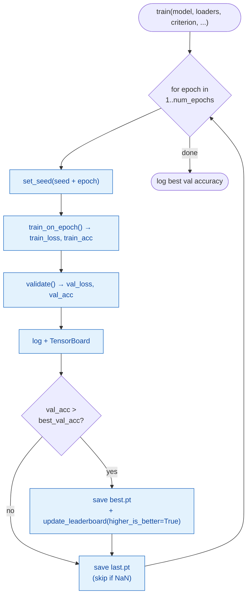

# Fine-tuning Loop (`finetune_utils.py`)

> Module: [`BERT/utils/finetune_utils.py`](../../utils/finetune_utils.py) — `train_on_epoch`, `validate`, `train`
> Paper: Devlin et al. 2019, [*BERT*](https://arxiv.org/abs/1810.04805), §A.3 (fine-tuning hyperparameters)

The **training loop for fine-tuning** — the classification mirror of pre-training's
[`train_utils.py`](../scripts/pretrain.md#train_utilspy--the-loop). Same three-function shape
(`train` conducts, calling `train_on_epoch` + `validate` each epoch), but the target metric flips
from **val loss** (minimize) to **val accuracy** (maximize), and the loss is a plain
`CrossEntropyLoss` instead of the combined MLM+NSP objective.

It reuses `set_seed` from [`train_utils.py`](../../utils/train_utils.py) and
`update_leaderboard` from [`common/run_utils.py`](../../../common/run_utils.py) — no need to
re-implement either.

Throughout: **B** = batch size (32), **S** = sequence length (varies per batch —
[dynamic padding](finetune_data.md#dynamic-per-batch-padding)), **step** = one batch.

## Contents

- [The three functions](#the-three-functions)
- [`train_on_epoch` — step = one batch](#train_on_epoch--step--one-batch)
  - [The weighted running mean](#the-weighted-running-mean)
  - [Accuracy in one line](#accuracy-in-one-line)
- [`validate`](#validate)
- [`train` — the epoch loop & checkpoints](#train--the-epoch-loop--checkpoints)
  - [Best-by-accuracy (not loss)](#best-by-accuracy-not-loss)
  - [The leaderboard + `best.pt` symlink](#the-leaderboard--bestpt-symlink)
  - [What's saved — and why resume isn't wired](#whats-saved--and-why-resume-isnt-wired)
- [Reading the curves — our winning 5e-5 run](#reading-the-curves--our-winning-5e-5-run)
- [References](#references)

---

## The three functions

| function | role | metric |
|---|---|---|
| `train_on_epoch` | one pass over train batches: forward → CE loss → backward → clip → step → sched step | running train loss + acc |
| `validate` | `@torch.no_grad` + `eval()` pass over val batches | val loss + acc |
| `train` | the conductor — loops epochs, checkpoints the best by **val accuracy** | — |



---

## `train_on_epoch` — step = one batch

One `for batch in loader` iteration **is one step**: forward → loss → backward → clip →
`optimizer.step()` → `scheduler.step()`. The lr moves every step (warmup→decay).

```python
for batch in pbar:                                   # 1 batch = 1 step
    input_ids      = batch["input_ids"].to(device)       # (B, S)
    token_type_ids = batch["token_type_ids"].to(device)  # (B, S) — all zeros
    labels         = batch["labels"].to(device)          # (B,)

    logits = model(input_ids, token_type_ids)            # (B, num_labels) — no label passed in
    loss   = criterion(logits, labels)                   # CrossEntropyLoss, mean over batch

    optimizer.zero_grad(); loss.backward()
    nn.utils.clip_grad_norm_(model.parameters(), clip_grad_norm)
    optimizer.step(); scheduler.step()
```

The model takes only `input_ids` + `token_type_ids` — it derives its pad mask internally from
`input_ids`, so no `attention_mask` is passed. The label never enters the model; it meets the
logits only at `criterion` (see [why loss lives outside the model](../architecture/bert_for_classification.md#why-the-loss-lives-elsewhere)).

### The weighted running mean

The per-epoch train stats are accumulated as **sums**, then divided at the end — never averaged
naively across batches:

```python
n = labels.size(0)                                     # examples in THIS batch
total_loss += loss.item() * n                          # un-average: recover the batch's summed loss
correct    += (logits.argmax(dim=-1) == labels).sum().item()
total      += n
```

`criterion` already **averaged** over the batch, so multiplying back by `n` recovers the summed
loss before accumulating. Why bother? The last batch is a runt: `11284 train / 32` → **352 full
batches + 1 batch of 20**. A naive `mean-of-means` would let those 20 examples count as much as a
full 32. Weighting by `n` makes `total_loss / total` a **true epoch mean**. (Same trick as
[pre-training](../scripts/pretrain.md#train_on_epoch--step--one-batch).)

### Accuracy in one line

```python
correct += (logits.argmax(dim=-1) == labels).sum().item()
```

Traced on a 4-example batch (`sna.bn`, 6 classes):

```python
logits.argmax(dim=-1)  → tensor([3, 4, 5, 1])   # predicted class = highest-scoring of the 6
labels                 → tensor([3, 1, 5, 1])
== labels              → tensor([True, False, True, True])   # example 2 wrong
.sum().item()          → 3                       # 3 correct this batch
```

Accumulate `correct` and `total` across batches → `correct / total` is the running accuracy shown
on the tqdm bar. This is the metric fine-tuning actually optimizes for (§A.3).

## `validate`

Same forward as training, but `@torch.no_grad()` + `model.eval()` (dropout off), no backward, no
optimizer/scheduler step. Same weighted-mean accumulation. Epoch-agnostic — run it on the same
weights at epoch 1 or 3 and you get the identical number, which is why it's `validate`, not
`validate_on_epoch`. Returns `(val_loss, val_acc)`.

## `train` — the epoch loop & checkpoints

Every epoch: reseed → train → validate → log → checkpoint. The checkpoint dict:

```python
{
  "epoch", "model_state_dict", "optimizer_state_dict", "scheduler_state_dict",
  "train_loss", "train_acc", "val_loss", "val_acc", "best_val_acc",
  "git_hash", "tokenizer_sha256", "pretrained_checkpoint",   # provenance
}
```

`pretrained_checkpoint` is the fine-tune-specific provenance field (which encoder these weights
descend from) — the counterpart of pre-training's `data_fingerprint`.

### Best-by-accuracy (not loss)

```python
best_val_acc = 0.0
...
improved = val_acc > best_val_acc     # HIGHER is better (loss uses <)
if improved:
    best_val_acc = val_acc
```

The one meaningful divergence from pre-training: `best.pt` is written when **val accuracy
improves** (starting from `0.0`), not when val loss drops. Accuracy is classification's reportable
target; the val loss is stored for diagnostics only. `last.pt` is written every epoch but
**skipped on NaN** so a corrupted epoch can't poison a checkpoint.

### The leaderboard + `best.pt` symlink

When `best.pt` improves, `train` calls the shared helper — the same one pre-training uses, just
with the sort direction flipped:

```python
update_leaderboard(parent_dir, run_name, val_acc, higher_is_better=True)
```

`higher_is_better=True` ranks `{parent_dir}/leaderboard.json` by val_acc **descending** (mirror of
pre-training's ascending val_loss) and repoints `{parent_dir}/best.pt` at the global-best run. After
our three-run lr sweep:

```
BERT/checkpoints/finetune/sna_bn/
├─ leaderboard.json          { run_23-46-39: 0.8533,  run_23-25-17: 0.8221,  run_21-42-45: 0.7952 }
├─ best.pt → run_2026-07-11_23-46-39/best.pt        ← the 5e-5 winner, one fixed path away
└─ run_2026-07-11_23-46-39/  (config.yaml, best.pt, last.pt)
```

This helper was **hoisted into [`common/run_utils.py`](../../../common/run_utils.py)** — it's
paper-agnostic plumbing (write a JSON ranking, repoint a symlink), shared with pre-training rather
than duplicated. See [`run_utils.md`](../../../common/docs/run_utils.md#update_leaderboard).

### What's saved — and why resume isn't wired

The checkpoint carries `optimizer_state_dict` + `scheduler_state_dict` + `epoch`, so a run is
**resume-*capable*** — but **no resume path is wired for fine-tuning**. There's no `--resume` flag
in [`finetune.py`](../scripts/finetune.md), and `train()` has no `start_epoch`/`best_val_acc`
params; it always starts fresh at epoch 1.

That's deliberate: a fine-tune run is **~9.5 minutes** (3 epochs, ~3 min each on mps). Resume earns
its complexity for a multi-hour *pre-training* run (where [`pretrain.py --resume`](../scripts/pretrain.md#resume--and-the-lr0-trap)
does full preflight); here it's cheaper to just re-run. Note also: those saved optimizer/scheduler
states are **never** reused to *start* a fine-tune — that path loads only `bert.*` weights and
starts the optimizer/scheduler clean ([why](../scripts/finetune.md#the-transplant)).

## Reading the curves — our winning 5e-5 run

7.5M params, mps, ~3 min/epoch. Best of the [lr sweep](../scripts/finetune.md#the-lr-sweep) at
`lr = 5e-5`:

| epoch | train loss | train acc | val loss | val acc |
|---|---|---|---|---|
| 1 | 1.0667 | 0.6146 | 0.6146 | 0.7987 |
| 2 | 0.5418 | 0.8234 | 0.4999 | 0.8377 |
| 3 | 0.4416 | 0.8609 | 0.4715 | **0.8533** |

- **No overfitting** — val loss falls every epoch (0.615 → 0.500 → 0.472) and val acc ≥ train-ish;
  the gap stays healthy. (Train acc averages the epoch *with dropout on*; val is final weights with
  dropout off, so val ≥ train early is normal.)
- **Fast convergence** — 3 epochs is enough (§A.3 says 2–4). The classifier learns quickly because
  the encoder is already pretrained.
- **Schedule spent** — by epoch 3 `lr` hit `0.00e+00` (warmup→linear-decay), so the run is done for
  this config; more epochs at the same schedule wouldn't help. See the
  [sweep](../scripts/finetune.md#the-lr-sweep) for why 5e-5 beat 3e-5 (0.8221) and 2e-5 (0.7952).

The **reportable** number is not this 0.8533 (that's val, used to *pick* the winner) — it's the
held-out **test** accuracy from `evaluate.py`.

## References

- Paper: Devlin et al. 2019, [*BERT*](https://arxiv.org/abs/1810.04805) — §A.3 (fine-tune 2–4 epochs, small lr)
- Sibling docs: [`finetune.md`](../scripts/finetune.md) (the runbook) · [`finetune_data.md`](finetune_data.md) (the data) · [`bert_for_classification.md`](../architecture/bert_for_classification.md) (the model) · [`run_utils.md`](../../../common/docs/run_utils.md) (`update_leaderboard`)
- Pre-training mirror: [`pretrain.md`](../scripts/pretrain.md#train_utilspy--the-loop) (`train_utils.py` — the loss-minimizing version)
- Source: [`finetune_utils.py`](../../utils/finetune_utils.py)
