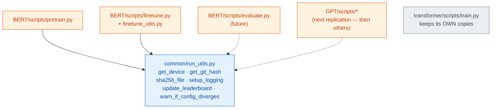

# Shared Run Utilities (`common/run_utils.py`)

> Module: [`common/run_utils.py`](../run_utils.py)
> Consumers: **any replication in this repo** — currently [`BERT/scripts/pretrain.py`](../../BERT/scripts/pretrain.py) (+ future finetune / evaluate / inference), and any architecture added later (GPT next, then others).

A tiny, **paper-agnostic** toolbox: device resolution, checkpoint provenance (git hash + file
hashing), logging setup, a leaderboard/`best.pt` ranking, and a config-divergence check. Nothing
here knows about BERT, transformers, attention, or losses — it's pure plumbing that *any* training
script needs, for *any* model. New replications import it instead of re-implementing it.

## Why a top-level `common/`?

`get_device`, `sha256_file`, etc. are generic — the [transformer replication](../../transformer/scripts/train.py)
has its own copies. Rather than have BERT `import` from the transformer (which would **couple two
unrelated papers** — rename `transformer/` and BERT breaks), the shared, generic helpers live once
in `common/`. BERT imports them; the transformer is **left untouched** (already shipped).



What stays **out** of `common/`: anything coupled to a specific replication — e.g. `build_model`
(needs the model class → [`BERT/scripts/_common.py`](../../BERT/scripts/_common.py)) or
`_RESUME_SAFE_KEYS` (BERT's config field names → `pretrain.py`).

> Import path note: run scripts as modules **from the repo root** (`python -m BERT.scripts.pretrain`)
> so `from common.run_utils import ...` resolves — `common/` sits next to `BERT/` and `transformer/`.

## Contents

- [`get_device`](#get_device)
- [`get_git_hash`](#get_git_hash)
- [`sha256_file`](#sha256_file)
- [`setup_logging`](#setup_logging)
- [`update_leaderboard`](#update_leaderboard)
- [`warn_if_config_diverges`](#warn_if_config_diverges)
- [References](#references)

---

## `get_device`

Turns the config's `device` string into a real `torch.device`, resolving `"auto"` to the best
available backend:

```python
def get_device(device_config: str) -> torch.device:
    if device_config == "auto":
        if torch.backends.mps.is_available():   return torch.device("mps")
        if torch.cuda.is_available():           return torch.device("cuda")
        return torch.device("cpu")
    return torch.device(device_config)          # explicit "cpu"/"cuda"/"mps" passes through
```

| `config.device` | mps avail? | cuda avail? | → resolves to |
|---|---|---|---|
| `"auto"` | ✅ | – | `mps` |
| `"auto"` | ❌ | ✅ | `cuda` |
| `"auto"` | ❌ | ❌ | `cpu` |
| `"cpu"` / `"cuda"` / `"mps"` | – | – | exactly that (no probing) |

Precedence is **mps → cuda → cpu** (this repo's primary machine is Apple Silicon). Any run using
`"auto"` on an M1 resolves to `mps` — e.g. BERT's base run logged `Using device: mps`.

---

## `get_git_hash`

Captures the exact commit that produced a run, for checkpoint provenance:

```python
commit = git rev-parse HEAD                    # the SHA
dirty  = git status --porcelain                # non-empty ⇒ uncommitted changes
return f"{commit}-dirty" if dirty else commit
```

Example output: `057728a0069a0eecdc19d7c46514a729e3418fdd-dirty`.

- **`-dirty` matters.** If the working tree has uncommitted edits, a bare hash would *lie* — it would
  point at code that isn't what actually ran. The suffix flags "the real code ≠ this commit."
- **Never crashes.** Not a git repo, or `git` not installed → returns `"unknown"` (catches
  `CalledProcessError` / `FileNotFoundError`). Provenance is best-effort, never fatal.

---

## `sha256_file`

A **streamed** SHA-256 of *any* file's bytes. Generic by design — a run hashes whatever it needs to
pin to a checkpoint (a tokenizer, a vocab, a data file); the **consumer** decides what:

```python
h = hashlib.sha256()
with open(path, "rb") as f:
    for chunk in iter(lambda: f.read(1 << 16), b""):   # 64 KB at a time, until EOF (b"")
        h.update(chunk)
return h.hexdigest()
```

Why chunked instead of `h.update(f.read())`? Reading a large file whole loads *all* of it into RAM —
a multi-hundred-MB corpus or dataset shard would spike memory. `iter(lambda: f.read(65536), b"")`
reads 64 KB at a time and stops at the sentinel `b""` (EOF), so memory stays flat regardless of file
size.

**Example — how BERT (the current consumer) uses it:** two calls, each pinning identity to a checkpoint.

| call | fingerprints | catches on resume |
|---|---|---|
| `sha256_file(vocab.txt)` | the tokenizer | a **retrained vocab** (embedding rows would mismatch) |
| `sha256_file(corpus_path)` | the corpus | a **changed corpus** (different data slice) |

→ `981e888d4972...` (tokenizer), `192ce17ed379...` (corpus) — both logged, truncated to 12 chars. A
different architecture might instead hash a merges file, a `.bin` shard, or a preprocessing script —
same function, different inputs.

---

## `setup_logging`

Sends every `logger.*` call to **both** the console and a per-run `train.log`:

```python
os.makedirs(log_dir, exist_ok=True)
logging.basicConfig(
    level=logging.INFO,
    format="%(asctime)s | %(levelname)s | %(message)s",
    handlers=[logging.FileHandler(f"{log_dir}/train.log"), logging.StreamHandler()],
)
```

It configures the **root** logger, so *every* module logger in a run (`logging.getLogger(__name__)`,
wherever it lives) propagates up and lands in the same file — no per-module wiring needed. Output:

```
2026-06-30 23:05:21,495 | INFO | Git commit: 057728a...-dirty
2026-06-30 23:05:21,540 | INFO | Using device: mps
```

Call it **first** in the entrypoint (right after the run dir is made) so nothing logs before the file
handler exists. `train.log` then lands in the same per-run dir as that run's checkpoints + tfevents —
one self-contained folder per run. (BERT does this at the top of `pretrain.py`.)

---

## `update_leaderboard`

Records a run's best score in `{parent_dir}/leaderboard.json` and repoints `{parent_dir}/best.pt`
at the global best across **all** runs — so the best checkpoint is always one fixed path away, no
matter how many runs pile up:

```python
def update_leaderboard(parent_dir, run_name, score, higher_is_better=False):
    board = json.load(open(leaderboard_path)) if exists else {}
    board[run_name] = score
    board = dict(sorted(board.items(), key=lambda kv: kv[1], reverse=higher_is_better))  # rank
    json.dump(board, ...)
    best_run = next(iter(board))                       # top of the ranking
    os.symlink(f"{best_run}/best.pt", f"{parent_dir}/best.pt")   # relative → portable
```

The **only** knob that differs between metrics is `higher_is_better` — the sort direction:

| caller | metric | `higher_is_better` | ranking |
|---|---|---|---|
| pre-training ([`train_utils.py`](../../BERT/utils/train_utils.py)) | `val_loss` | `False` (default) | ascending — lower wins |
| fine-tuning ([`finetune_utils.py`](../../BERT/utils/finetune_utils.py)) | `val_acc` | `True` | descending — higher wins |

**Worked example** — the fine-tune lr sweep, after three runs (`higher_is_better=True`):

```
leaderboard.json                                   best.pt symlink
{                                                  best.pt → run_2026-07-11_23-46-39/best.pt
  "run_2026-07-11_23-46-39": 0.8533,   ← 5e-5, top      (auto-repointed to the winner each time
  "run_2026-07-11_23-25-17": 0.8221,   ← 3e-5            a new run beats the current best)
  "run_2026-07-11_21-42-45": 0.7952    ← 2e-5
}
```

The **relative** symlink target (`run_X/best.pt`, not an absolute path) keeps the parent dir
portable — move or rename it and the link still resolves.

> **Why this is in `common/`.** Writing a JSON ranking and repointing a symlink is generic — it
> knows nothing about BERT, losses, or attention. Pre-training and fine-tuning both need it, so it
> lives here **once** with a `higher_is_better` flag rather than being copied per-metric. (One
> historical copy still lives inline in `train_utils.py` with a drift-note pointing here — kept to
> avoid churning already-shipped pre-training code; new callers use this one.)

---

## `warn_if_config_diverges`

On `--resume`, warns if the current config drifted from the one that produced the checkpoint. It's a
**pure recursive dict-diff** — Config-agnostic, so each replication supplies its own loaded dicts and
its own `safe_keys`:

```python
def warn_if_config_diverges(snapshot: dict, current: dict, safe_keys: set[str]) -> None:
    def walk(a, b, prefix=""):
        if isinstance(a, dict) and isinstance(b, dict):
            for k in sorted(set(a) | set(b)):                 # sorted → stable warning order
                walk(a.get(k), b.get(k), f"{prefix}.{k}" if prefix else k)
        elif a != b and prefix not in safe_keys:              # leaf changed & not whitelisted
            risky.append(f"  {prefix}: {a!r} -> {b!r}")
    ...
```

It recurses into nested dicts building a dotted `prefix` (`optimizer.lr`, `model.d_model`), and at
each **leaf** flags a change *unless* the key is in `safe_keys`.

**Worked example** (fields are illustrative — any nested config works) — resuming with `num_epochs`
bumped 10→30 and `d_model` accidentally changed, `safe_keys = {"training.num_epochs", "device", "paths.log_dir"}`:

```
key                    snapshot → current      verdict
──────────────────────────────────────────────────────
training.num_epochs    10  →  30               safe  → silent  ✅ (expected on resume)
device                 mps →  cpu              safe  → silent  ✅
model.d_model          256 →  512              RISKY → WARN     ⚠️
optimizer.lr           1e-4 → 3e-4             RISKY → WARN     ⚠️
```

Output:

```
resumed config differs from checkpoint snapshot:
  model.d_model: 256 -> 512
  optimizer.lr: 0.0001 -> 0.0003
  (continuing — trajectory may differ from the original run)
```

It **warns, never blocks** — you might legitimately tweak a field; the log just makes sure you did it
on purpose. The caller (`pretrain.py`) does the Config-specific part — load the snapshot, dump both
to dicts, pass its own `_RESUME_SAFE_KEYS`:

```python
snapshot = Config.from_yaml(snapshot_path).model_dump()
warn_if_config_diverges(snapshot, config.model_dump(), _RESUME_SAFE_KEYS)
```

That split — generic dict-diff here, `Config` loading + safe-keys in the caller — is exactly why this
function can live in `common/` while `_RESUME_SAFE_KEYS` can't.

---

## References

- Consumer docs: [`BERT/docs/scripts/pretrain.md`](../../BERT/docs/scripts/pretrain.md) (provenance & resume preflight) · [`BERT/docs/scripts/finetune.md`](../../BERT/docs/scripts/finetune.md) & [`finetune_utils.md`](../../BERT/docs/utils/finetune_utils.md) (`update_leaderboard`, `higher_is_better=True`)
- Source: [`common/run_utils.py`](../run_utils.py) · [`BERT/scripts/pretrain.py`](../../BERT/scripts/pretrain.py) · [`BERT/scripts/_common.py`](../../BERT/scripts/_common.py) · [`BERT/utils/finetune_utils.py`](../../BERT/utils/finetune_utils.py)
- Mirror reference (own copies): [`transformer/scripts/train.py`](../../transformer/scripts/train.py)
