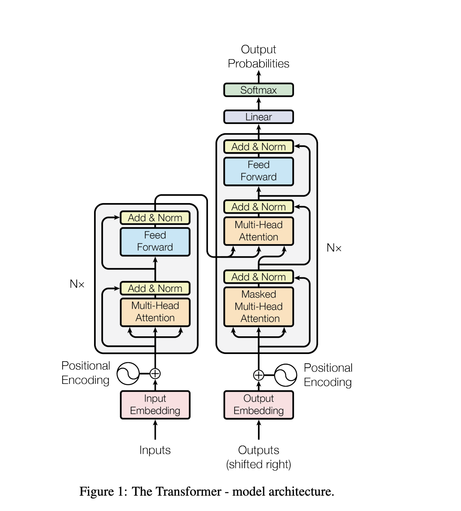
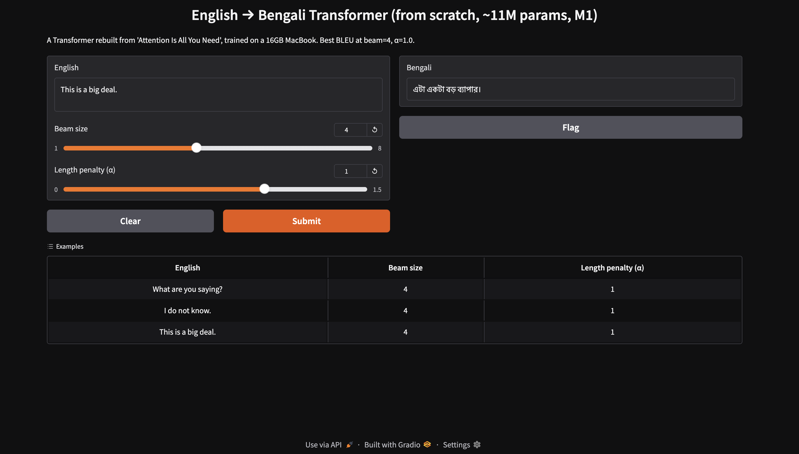
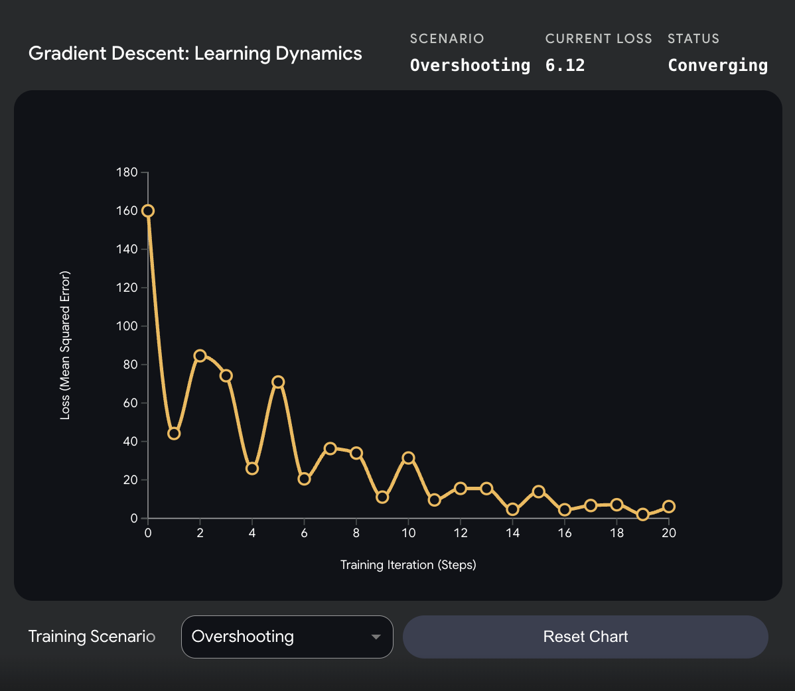
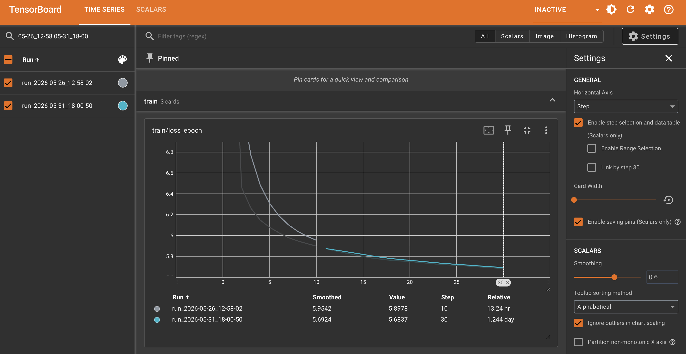
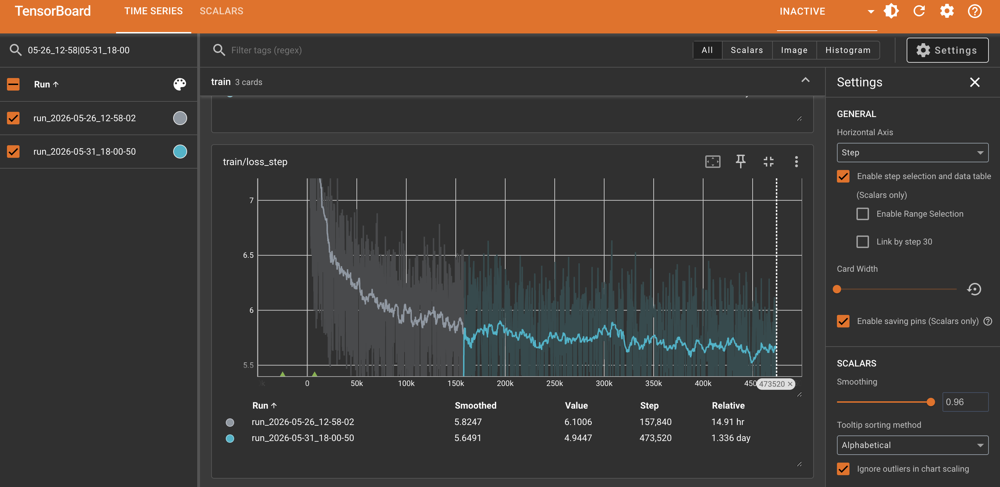
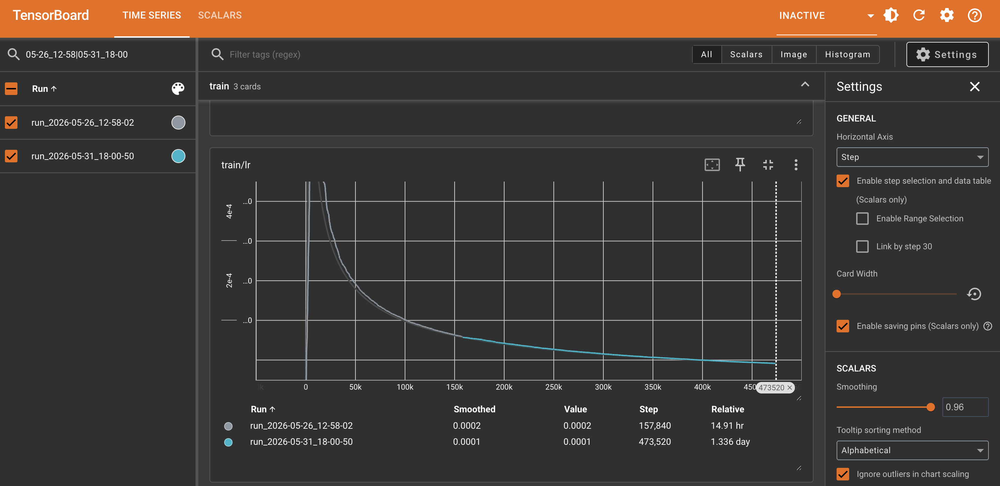
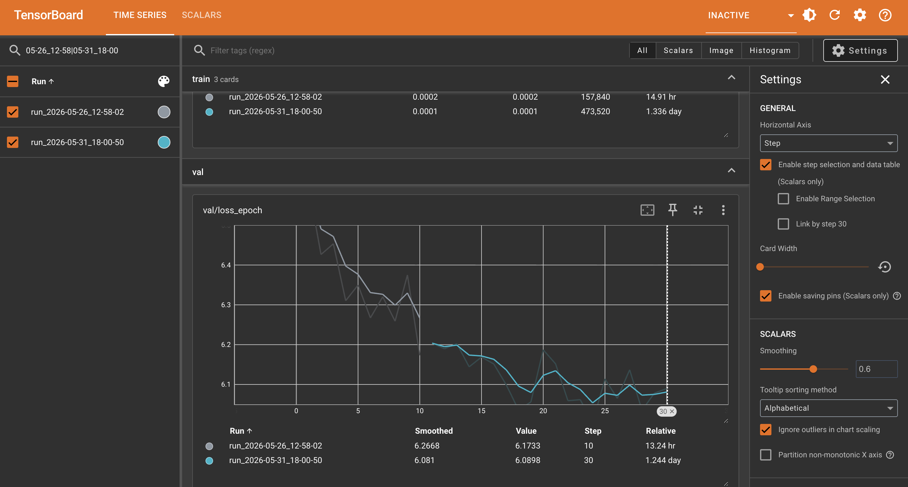

# Rebuilding "Attention Is All You Need" From Scratch on a Mac M1 with 16GB of RAM

### No CUDA, no 8× P100s, no shortcuts. An ~11M-parameter Transformer, built tensor by tensor, on a single MacBook — and understanding why each one is shaped the way it is.

---

## Contents

- **[Introduction](#introduction)**
- **[Why build it from scratch — and why on a 16GB Mac?](#why-build-it-from-scratch--and-why-on-a-16gb-mac)**
- **[The Transformer in one breath](#the-transformer-in-one-breath)**
- **[What changed (and what was refused to change)](#what-changed-and-what-was-refused-to-change)**
- **[Project structure — and the build order](#project-structure--and-the-build-order)**
- **[Setting up and running](#setting-up-and-running)**
- **[Part 1 — How the Transformer actually works](#part-1--how-the-transformer-actually-works)**
  - [1.1 Embeddings: the mysterious √d_model](#11-embeddings-the-mysterious-d_model)
  - [1.2 Positional encoding: telling the model *where* each word is](#12-positional-encoding-telling-the-model-where-each-word-is)
  - [1.3 Relative position: the property that makes sinusoids special](#13-relative-position-the-property-that-makes-sinusoids-special)
  - [1.4 Self-attention: the heart, with a worked example](#14-self-attention-the-heart-with-a-worked-example)
  - [1.5 Multi-head attention: the same idea, eight times in parallel](#15-multi-head-attention-the-same-idea-eight-times-in-parallel)
  - [1.6 Masking: padding masks, causal masks, and the NaN that lives in them](#16-masking-padding-masks-causal-masks-and-the-nan-that-lives-in-them)
  - [1.7 Layer normalization: stabilizing each token independently](#17-layer-normalization-stabilizing-each-token-independently)
  - [1.8 The position-wise feed-forward network](#18-the-position-wise-feed-forward-network)
  - [1.9 How the encoder works](#19-how-the-encoder-works)
  - [1.10 How the decoder works: masked self-attention + cross-attention](#110-how-the-decoder-works-masked-self-attention--cross-attention)
  - [1.11 Putting it together: the full model and weight tying](#111-putting-it-together-the-full-model-and-weight-tying)
- **[Part 2 — The training objective: label smoothing, KL divergence, and why it OOM'd](#part-2--the-training-objective-label-smoothing-kl-divergence-and-why-it-oomd)**
  - [2.1 Label smoothing — the idea](#21-label-smoothing--the-idea)
  - [2.2 Why KL divergence (and why it equals cross-entropy)](#22-why-kl-divergence-and-why-it-equals-cross-entropy)
  - [2.3 Why KL failed *here* — and why cross-entropy won](#23-why-kl-failed-here--and-why-cross-entropy-won)
  - [2.4 The learning-rate schedule nobody can skip](#24-the-learning-rate-schedule-nobody-can-skip)
- **[Part 3 — Data: teaching it Bengali](#part-3--data-teaching-it-bengali)**
- **[Part 4 — Training on 16GB: the war stories](#part-4--training-on-16gb-the-war-stories)**
  - [War story 1 — The memory ceiling](#war-story-1--the-memory-ceiling)
  - [War story 2 — The NaN at epoch 4](#war-story-2--the-nan-at-epoch-4)
  - [War story 3 — Surviving crashes](#war-story-3--surviving-crashes)
- **[Part 5 — Production-grade infrastructure on a laptop](#part-5--production-grade-infrastructure-on-a-laptop)**
- **[Part 6 — Inference: beam search, and the model that stops too soon](#part-6--inference-beam-search-and-the-model-that-stops-too-soon)**
- **[Part 7 — Evaluation: the numbers, told honestly](#part-7--evaluation-the-numbers-told-honestly)**
- **[Findings you won't find in a tutorial](#findings-you-wont-find-in-a-tutorial)**
- **[What to do differently](#what-to-do-differently)**
- **[Future scope](#future-scope)**
- **[Conclusion](#conclusion)**
- **[References](#references)**

---

## Introduction

Everyone uses Transformers. Building one from scratch is a different problem entirely.

It is easy to `import torch.nn.TransformerEncoderLayer` and move on. It is a very different thing to sit down with the 2017 paper and a blank `multi_head_attention.py` and reproduce the architecture that rewired all of modern AI from scratch — on a 16GB MacBook, with no GPU cluster.

That is what this article is about: the full Transformer from "Attention Is All You Need" rebuilt in plain PyTorch, trained to translate **English into Bengali**, and run end-to-end on a single Apple M1.

This is not a "here is the clean final code" tutorial. The clean code is the easy part. This article does three things at once:

1. **Explains how the Transformer actually works** — internally, with worked numerical examples for self-attention, multi-head attention, positional encoding, layer normalization, masking, cross-attention, label smoothing, and beam search. Not the API. The math, traced through real tensors, all in one place.
2. **Walks through the build process** — the bottom-up order, the memory ceiling and how it was found, and the failure modes that only appear once you actually train the model.
3. **Shares the findings that aren't in any tutorial** — things only the act of building on constrained hardware surfaces, collected and named in one place.

It is fully self-contained: everything you need to understand the model is here, and every claim points at the real source file in this repository so you can read the actual implementation, not a sanitized snippet.

---

## Why build it from scratch — and why on a 16GB Mac?

There are two honest answers.

The first is **understanding**. The Transformer is not really understood until `softmax(QKᵀ / √dₖ) V` has been written by hand, fed a mask, and watched produce `NaN` because an entire row was masked to `-inf`. The paper is around ten pages. Turning those ten pages into a model that actually trains forces a confrontation with every assumption the authors quietly made.

The second is **constraint**. The paper trained on 8× NVIDIA P100 GPUs — 128GB of combined VRAM — for 100,000 steps. This project had one Apple M1 with **16GB of unified memory** shared between the OS, the browser, and the model. That constraint was not a handicap. It was the best teacher available. Every architectural decision in the paper that "just works" on a cluster becomes a life-or-death memory negotiation on a laptop. You learn what each tensor *costs*.

So the real subject is two things at once: **how the Transformer actually works, and what survives when you force a cluster-scale paper through a 16GB hole.**

---

## The Transformer in one breath

The Transformer is a sequence-to-sequence model with two stacks:

- An **encoder** reads the source sentence (English) and turns it into a set of context-rich vectors called `memory`.
- A **decoder** generates the target sentence (Bengali) one token at a time, attending both to what it has produced so far *and* to the encoder's `memory`.

```
ENGLISH                                            BENGALI
"We are friends"                                   "আমরা বন্ধু"
      │                                                  ▲
      ▼                                                  │
┌──────────────┐                              ┌──────────────────┐
│   ENCODER    │                              │     DECODER      │
│  (N layers)  │── memory ───────────────────▶│   (N layers)     │
│ self-attn +  │   (batch, src_len, d_model)  │ masked self-attn │
│     FFN      │                              │ + cross-attn +   │
└──────────────┘                              │      FFN         │
                                              └──────────────────┘
```

The same picture, in full detail — the original figure from the paper:

> 
>
> *The encoder (left) and decoder (right) stacks, each repeated N×: embeddings + positional encoding at the bottom, the Add & Norm / attention / feed-forward sub-layers in the middle, and the linear + softmax output head on top. Every box in this figure is dissected in Part 1. Source: Vaswani et al. (2017), "Attention Is All You Need", Figure 1.*

There is no recurrence and no convolution. The only mechanism that moves information between positions is **attention** — every token looks at every other token and decides what to pull in. That single idea is the whole paper, and the title is not modest about it.

---

## What changed (and what was refused to change)

Replicating a paper on a laptop is an exercise in honest compromise. Here is exactly where this build deviated from "Attention Is All You Need" and where it held the line. Nearly every value below lives in [`configs/base.yaml`](configs/base.yaml), each with the reason attached as a comment.

| Knob | Paper (base) | This Build (M1 16GB) | Why |
|---|---|---|---|
| `d_model` | 512 | **256** | Halved — the single biggest memory lever. |
| `d_ff` | 2048 | **1024** | Scaled proportionally with `d_model`. |
| `num_layers` (N) | 6 | **4** | Fewer activations to hold in memory. |
| `num_heads` | 8 | **8** ✓ | Kept — `256/8 = 32` per head, still healthy. |
| Tokens/batch | ~25,000 | **800** | The most painful cut. More on this below. |
| `max_seq_len` | unspecified | **64** | Attention cost scales with `seq²`; a hard cap keeps it manageable. |
| Dataset | WMT'14 En-De (4.5M) | **AI4Bharat Samanantar En-Bn**, 500K subset of 8.5M | A custom, low-resource target language. |
| Vocab | ~37,000 BPE | **16,000 BPE** (SentencePiece) | Smaller vocab suits 500K pairs better. |
| Training length | 100K steps / ~12 h, 8× P100 | **30 epochs / ~47 h**, 1× M1 | Practicality (wall-clock is the only comparable axis — batch sizes differ ~31×). |
| Optimizer, β, ε, warmup | Adam, (0.9, 0.98), 1e-9, 4000 | **Identical** ✓ | No reason to touch what works. |
| Label smoothing | 0.1 | **0.1** ✓ | Identical. |
| Dropout | 0.1 | **0.1** ✓ | Identical. |
| **Total parameters** | ~65M | **~11M** | Weight tying + smaller dims. |

The "Training length" row deserves a closer look. Steps and epochs don't compare directly because the batch sizes differ ~31×. The only honest axis is **total tokens seen**:

| | Steps | Tokens/batch | Total tokens | Wall-clock |
|---|---|---|---|---|
| Paper (base) | 100K | ~25,000 | **~2.5B** | ~12 h, 8× P100 |
| Ours | ~474K | 800 | **~379M** | ~47 h, 1× M1 |

*Steps × tokens/batch gives total tokens: ours = ~474K × 800 ≈ 379M (the ~474K is 30 epochs × ~15,784 steps/epoch); paper = 100K × ~25,000 ≈ 2.5B.*

We trained on **~6.6× fewer tokens** in **~4× more wall-clock time**. That single fact explains most of the BLEU gap — the model never saw enough data to generalize, not just train.

The rule held throughout: **shrink the model, never the method.** Every hyperparameter that encodes a *finding* of the paper (the optimizer betas, the warmup, the label smoothing, the √d_model embedding scale) stayed exactly as published. Only the dimensions that encode *hardware* got cut.

---

## Project structure — and the build order

The build went strictly bottom-up: smallest module first, full model last. You cannot meaningfully test attention before embeddings exist, and you cannot debug a training loop before the forward pass is verified. The layout mirrors that order.

```
transformer/
├── models/
│   ├── modules/
│   │   ├── embeddings.py            # token embeddings × √d_model
│   │   ├── positional_encoding.py   # sinusoidal PE, registered buffer
│   │   ├── multi_head_attention.py  # scaled dot-product + MHA
│   │   ├── feed_forward.py          # position-wise FFN (ReLU)
│   │   └── layer_norm.py            # layer normalization
│   ├── encoder.py                   # EncoderLayer + Encoder stack
│   ├── decoder.py                   # DecoderLayer + Decoder stack
│   └── transformer.py               # full model + weight tying
├── utils/
│   ├── config.py                    # typed, validated YAML config (pydantic)
│   ├── mask_utils.py                # src / tgt / memory masks
│   ├── loss.py                      # label-smoothed cross-entropy
│   ├── optimizer.py                 # Adam + Noam LR schedule
│   ├── data_utils.py                # Samanantar + SentencePiece + token batching
│   ├── train_utils.py               # the training loop + checkpointing
│   └── logging_setup.py             # logging configuration
├── scripts/
│   ├── _common.py                   # shared model/checkpoint helpers
│   ├── train.py                     # training entrypoint + run provenance
│   ├── evaluate.py                  # BLEU + perplexity
│   ├── inference.py                 # beam-search translation
│   ├── app.py                       # local Gradio translation demo
│   └── auto_resume_train.sh         # crash-resilient training across OOM
├── configs/
│   ├── base.yaml                    # nearly every knob, documented with its reason
│   └── tiny.yaml                    # minimal config for quick smoke tests
├── tokenizer/base/                  # shipped: trained SentencePiece model (sp.model + sp.vocab)
├── checkpoints/base/                # shipped: the 2 runs + best.pt + leaderboard.json (weights via Git LFS)
└── logs/base/                       # shipped: TensorBoard event files for the 2 runs
```

The last three directories are the **shipped artifacts** — the repo carries the trained tokenizer and both checkpoints (weights tracked with Git LFS) so the model runs without retraining.

**The build phases, and what each one actually taught:**

1. **Modules.** Each block in its own file, each tested in isolation on a 3-token toy sentence. This is where the math gets internalized — and where the first non-obvious bugs hide (the `dim=-1` in softmax, the `view`/`transpose`/`contiguous` dance, registering PE as a buffer not a parameter).
2. **Encoder / decoder (assembly).** Stacking the blocks with residuals and the post-LayerNorm recipe. Cheap to get *almost* right and silently wrong — the decoder needs *three* sub-layers and *two different* masks.
3. **Full model + weight tying.** Wiring embeddings → PE → stacks → projection, and sharing one weight matrix across three places.
4. **Utils (the unglamorous half).** Masks, the label-smoothed loss, the Noam schedule, the SentencePiece pipeline, the token-based batch sampler. More wall-clock time than the model itself.
5. **Scripts + training.** Getting it to *train without crashing* on 16GB — the hardest part, and where most of this article's findings come from.

---

## Setting up and running

Everything below runs from the **repository root** (the folder *above* `transformer/`), because the scripts are invoked as modules — that is what makes the package imports resolve from any directory.

**Environment.** Python 3.12, managed with [`uv`](https://github.com/astral-sh/uv):

```bash
git clone https://github.com/samyamoyrakshit/papers-from-scratch.git
cd papers-from-scratch
uv sync                    # installs torch, sentencepiece, sacrebleu, gradio, … from pyproject.toml
```

Checkpoints, logs, and the trained tokenizer are not in this repo (kept gitignored to stay light — see [README](README.md)). The first training run trains and caches the SentencePiece tokenizer; every later run loads it and verifies its SHA-256 against the checkpoint.

**Train.** The plain entrypoint reads `configs/base.yaml` by default. On a 16GB Mac you want the wrapper instead — it re-launches training after every MPS OOM and resumes from the latest checkpoint, with `caffeinate` to stop the laptop sleeping mid-run:

```bash
# direct — fine for a quick run or a bigger machine
uv run python -m transformer.scripts.train --config transformer/configs/base.yaml

# crash-resilient — what was actually used (config, target_epoch)
bash transformer/scripts/auto_resume_train.sh transformer/configs/base.yaml 30
```

Checkpoints land in `transformer/checkpoints/base/run_<timestamp>/`, with `best.pt` (lowest val loss) and `last.pt` (latest step) in each run. To resume a specific run manually, pass `--resume <path>/last.pt`.

**Evaluate.** Corpus BLEU + perplexity on the validation split. `--max_samples` caps how many pairs get translated (full val is 50K and slow):

```bash
uv run python -m transformer.scripts.evaluate \
    --config transformer/configs/base.yaml \
    --checkpoint transformer/checkpoints/base/run_<timestamp>/best.pt \
    --max_samples 500
```

**Translate.** Beam-search inference on a single sentence. Omit `--text` to drop into a REPL — type an English sentence, get Bengali back:

```bash
uv run python -m transformer.scripts.inference \
    --config transformer/configs/base.yaml \
    --checkpoint transformer/checkpoints/base/run_<timestamp>/best.pt \
    --text "This is a big deal."
```

**TensorBoard.** Training logs to `transformer/logs/base/run_<timestamp>/` via `SummaryWriter`. To inspect loss curves and the Noam LR schedule live or after the run (the curves themselves are read in Part 7):

```bash
# full 30-epoch run (epochs 11–30, best val_loss 6.004 at epoch 24)
uv run tensorboard --logdir transformer/logs/base/run_2026-05-31_18-00-50/

# or load all runs together to compare
uv run tensorboard --logdir transformer/logs/base/
# open http://localhost:6006
```

**Demo.** A small [Gradio](https://www.gradio.app/) app wraps the same beam-search `translate()` in a browser UI — a textbox for the English input plus sliders for beam size and length penalty (α), so the decode-time knobs from Part 6 are tunable live. It loads the checkpoint once at startup and runs entirely locally:

```bash
uv run python -m transformer.scripts.app   # serves http://127.0.0.1:7860 (gradio is already a dependency)
```

The checkpoint path is set at the top of [`scripts/app.py`](scripts/app.py); the sliders default to `beam=4, α=1.0` (the best-BLEU setting from Part 6).

> 
>
> *Source: Image by Author.*

> **Note:** the first training run trains the SentencePiece tokenizer on the data slice and caches it; every later run loads it and verifies its SHA-256 against the checkpoint, so a silent vocab change can't corrupt a resume. More on that in Part 5.

---

# Part 1 — How the Transformer actually works

This is the deep dive: every building block, with worked examples on tiny tensors so the math is visible. A single toy sentence is reused so the numbers stay traceable.

## 1.1 Embeddings: the mysterious √d_model

A careful reader of the paper stops at Section 3.4:

> "In the embedding layers, we multiply those weights by √d_model."

Four characters of code, a genuinely deep reason. ([`models/modules/embeddings.py`](models/modules/embeddings.py))

```python
def forward(self, x):
    return self.embeddings(x) * math.sqrt(self.d_model)
```

`nn.Embedding` initializes weights from `N(0, 1)`, so each embedding vector has components around unit variance. The **positional encoding** added next has values bounded in `[-1, 1]`. Without scaling, the two signals are roughly the same magnitude — and positional information drowns out token identity. Multiplying the embedding by `√d_model` (= 16 for `d_model=256`) blows the token signal up so it dominates, and position becomes a gentle perturbation on top. It also keeps the variance entering the first attention layer sane.

> **The lesson:** the paper's throwaway lines are never throwaway. Every "we multiply by X" is load-bearing.

---

## 1.2 Positional encoding: telling the model *where* each word is

Attention is **permutation-invariant**. To the raw mechanism, "dog bites man" and "man bites dog" are identical bags of vectors. Positional encoding injects word *order*. The paper's formula:

$$PE(pos, 2i) = \sin\left(\frac{pos}{10000^{2i/d_{model}}}\right), \quad PE(pos, 2i+1) = \cos\left(\frac{pos}{10000^{2i/d_{model}}}\right)$$

Each position gets a vector where **even dimensions are sines and odd dimensions are cosines**, each at a different frequency. Low dimensions oscillate fast (fine local position); high dimensions oscillate slowly (coarse global position). It is, quite literally, **binary counting in continuous form** — the same idea as how the bits of a binary number flip at different rates:

```
decimal   binary       ← bit 0 flips every step (fast),
   0       0 0 0          bit 2 flips every 4 steps (slow)
   1       0 0 1
   2       0 1 0
   3       0 1 1
   4       1 0 0
```

Take `"I love AI"` with `d_model=4`. The division term works out to `[1.0, 0.01]`, and: ([`models/modules/positional_encoding.py`](models/modules/positional_encoding.py))

```
pe =
[ 0.0000,  1.0000, 0.0000, 1.0000 ],   # position 0  ("I")
[ 0.8415,  0.5403, 0.0100, 0.9999 ],   # position 1  ("love")
[ 0.9093, -0.4161, 0.0200, 0.9998 ]    # position 2  ("AI")
  └sin────┘└cos───┘ └sin──┘└cos───┘
```

These get **added** to the token embeddings — "what the word is" plus "where the word is."

**Two engineering details that matter more than they look:**

**1. Compute the frequencies in log space, never with `pow`.** The naive `10000^(2i/d_model)` overflows float32 for real `d_model`. Using the identity `aᵇ = e^(b·ln a)`:

```python
div_term = torch.exp(torch.arange(0, d_model, 2).float() * (-math.log(10000.0) / d_model))
```

keeps every intermediate number small and stable. Same math, safe on hardware.

**2. Register it as a buffer, not a parameter.** Positional encoding is *fixed* — never trained. But it must move to the GPU with the model and be saved in the checkpoint. `register_buffer('pe', pe)` is exactly the tool for "state that travels with the model but is not learned." Make it an `nn.Parameter` instead and it gets trained as a weight — a silent correctness bug, not a clean error.

---

## 1.3 Relative position: the property that makes sinusoids special

Here is the part most explanations skip, and the reason the paper chose sinusoids over learned position embeddings.

For any fixed offset `k`, **`PE(pos + k)` is a linear function of `PE(pos)`** — it can be obtained by multiplying `PE(pos)` by a rotation matrix that depends only on `k`, not on `pos`. In other words, "shift by 3 words" is the *same linear transformation* everywhere in the sentence.

Why this matters: the attention mechanism can learn to attend by **relative offset** ("the token three positions back") rather than absolute position, because the relationship between any two positions a fixed distance apart is consistent across the whole sequence. The sine/cosine pairing is what makes this work — each `(sin, cos)` pair at frequency `ωᵢ` behaves like a 2D point on a circle, and advancing the position rotates that point by a fixed angle:

```
[ sin(ω(pos+k)) ]   [ cos(ωk)   sin(ωk) ] [ sin(ω·pos) ]
[ cos(ω(pos+k)) ] = [ -sin(ωk)  cos(ωk) ] [ cos(ω·pos) ]
                     └──── depends only on k, not pos ────┘
```

This is also why fixed sinusoids can **extrapolate** to sequences longer than any seen in training — the property the paper cites for choosing them (Section 3.5) — the rotation rule keeps working past the training range. Learned positional embeddings cannot do this; they simply have no row for position 5001.

> **Sources for this property** (both excellent):
> - Amirhossein Kazemnejad, ["Transformer Architecture: The Positional Encoding"](https://kazemnejad.com/blog/transformer_architecture_positional_encoding/)
> - Timo Denk, ["Linear Relationships in the Transformer's Positional Encoding"](https://blog.timodenk.com/linear-relationships-in-the-transformers-positional-encoding/)

---

## 1.4 Self-attention: the heart, with a worked example

This is the module the whole paper is named after. Strip away the multi-head bookkeeping and it is three matrix multiplies and a softmax. ([`models/modules/multi_head_attention.py`](models/modules/multi_head_attention.py))

**Q, K, V — three roles for every token.** Each token's vector is projected by three different learned matrices into three roles:

| Symbol | Name | Intuition |
|--------|------|-----------|
| **Q** (Query) | "What am I looking for?" | like a search query |
| **K** (Key) | "What do I contain?" | like a search index/tag |
| **V** (Value) | "What do I actually offer?" | the real content |

In **self-attention, Q, K, V all start from the same input** — the learned weight matrices `W_q, W_k, W_v` make them different. (In cross-attention they come from different places; that's §1.10.)

**Worked example.** Sentence `"We are friends"`, one head, `d_k=2`. After projecting, suppose:

```
Q (3 words × 2 dims):       Kᵀ (2 dims × 3 words):
 q-we:  [1, 2]               [1, 3, 5]
 q-are: [3, 4]      @        [2, 4, 6]
 q-fri: [5, 6]
```

**Step 1 — scores = QKᵀ.** Every query dotted with every key → a word-to-word score grid:

```
              k-we  k-are  k-fri
q-we    [  5     11     17 ]
q-are   [ 11     25     39 ]
q-fri   [ 17     39     61 ]
```

Each number is "how much does this word attend to that word?"

**Step 2 — scale by √dₖ.** Divide by `√2 ≈ 1.414`:

```
[ 3.54   7.78  12.02 ]
[ 7.78  17.68  27.58 ]
[12.02  27.58  43.13 ]
```

Why scale? As `d_k` grows, the dot product is a sum of `d_k` products, so its variance grows with `d_k`. Large scores push softmax into a saturated regime where one entry is ~1 and the rest ~0 — gradients vanish. Dividing by `√d_k` rescales variance back to ~1 and keeps softmax in its learnable range. Remove it and training stalls.

**Step 3 — softmax per row** (each query's weights sum to 1):

```
q-we:  [0.00, 0.01, 0.99]   ← "we" attends almost entirely to "friends"
q-are: [0.00, 0.00, 1.00]
q-fri: [0.00, 0.00, 1.00]
```

`dim=-1` is critical here — softmax runs across **keys** so each *row* (query) becomes a probability distribution. Run it across the wrong dimension and you get silently-wrong attention with no error.

**Step 4 — weighted sum of values.** Each output is a blend of value vectors weighted by attention:

```
output-we = 0.00·v-we + 0.01·v-are + 0.99·v-friends
```

Every token's output is a context-aware mixture of all the other tokens. That is the whole mechanism.

> *For the best intuitive Q/K/V visuals, Jay Alammar's ["The Illustrated Transformer"](https://jalammar.github.io/illustrated-transformer/) is unbeaten.*

---

## 1.5 Multi-head attention: the same idea, eight times in parallel

A single attention computation can only express one notion of "relevance." **Multi-head** runs several in parallel, each in its own learned subspace, so different heads can specialize — one tracks syntactic agreement, another tracks which adjective modifies which noun, another tracks position.

Mechanically, multi-head is just **reshaping**:

```
1. Project Q, K, V to d_model                      (batch, seq, 256)
2. Split into heads: view + transpose              (batch, 8, seq, 32)   ← 256 = 8 × 32
3. Run scaled dot-product attention per head       (batch, 8, seq, 32)
4. Concatenate heads back together                 (batch, seq, 256)
5. One final linear projection W_o                 (batch, seq, 256)
```

Each head gets a 32-dim slice (`d_k = d_model / num_heads = 256/8 = 32`) and runs the exact §1.4 computation independently and in parallel.

**The `view`/`transpose`/`contiguous` gotcha** — the bug that ate an afternoon. To split heads, you `view` `(batch, seq, 256)` into `(batch, seq, 8, 32)`, then `transpose(1, 2)` to `(batch, 8, seq, 32)`. But `transpose` only swaps **strides** — it does not move data in memory. The tensor is now *non-contiguous*: its logical shape and its physical layout disagree. Call `.view()` on it and PyTorch raises `view size is not compatible with input tensor's size and stride`. The fix is `.contiguous()` (physically reorder the bytes) *before* `.view()` — which is exactly why `combine_heads` does `x.transpose(1, 2).contiguous().view(...)` and `split_heads` does not (it ends on a `transpose`, fine, because the *next* op is a matmul, not a view).

```python
def combine_heads(self, x):                 # (batch, heads, seq, d_k)
    batch, heads, seq, d_k = x.shape
    x = x.transpose(1, 2)                    # (batch, seq, heads, d_k) — non-contiguous
    return x.contiguous().view(batch, seq, self.d_model)   # must reorder before view
```

The projections use **Xavier-uniform** init (matching PyTorch's own `nn.MultiheadAttention`) rather than the default Kaiming, because these layers aren't followed by a ReLU — Xavier's symmetric-activation variance assumption is the one that actually holds here.

---

## 1.6 Masking: padding masks, causal masks, and the NaN that lives in them

Two different masks, two different jobs. Both work by setting forbidden scores to `-inf` *before* softmax, so `e^(-inf) = 0` gives those positions zero weight. ([`utils/mask_utils.py`](utils/mask_utils.py))

**Padding mask** — batches mix sentences of different lengths, so short ones are padded with `<pad>`. The padding mask blocks every query from attending to `<pad>` *keys* (columns):

```
Batch: ["I love AI",  "Hi <pad> <pad>"]
mask:  [1, 1, 1]      [1, 0, 0]   ← block the two pad columns
```

**Causal mask** — the decoder generates left-to-right, so position `i` must not peek at future tokens. A lower-triangular mask enforces it:

```
         I   love  AI
I      [ 1    0    0 ]   ← "I" sees only itself
love   [ 1    1    0 ]   ← "love" sees "I" + itself
AI     [ 1    1    1 ]   ← "AI" sees everything before it
```

**Why the mask shapes differ.** The padding mask is `(batch, 1, 1, seq)` — one row, broadcast across every query and every head. The causal mask is `(1, 1, seq, seq)` — a full grid, broadcast across batch and heads. The decoder's `tgt_mask` is the **bitwise AND** of the two: a position must be both a real token *and* not in the future. (They must be `torch.bool` for `&` to work — a float mask raises `Unsupported type Float`.)

**The fully-masked-row NaN — a bug that exists in code but not on paper.** If a query row is *entirely* `-inf` (e.g. a pad token that can see nothing valid), `softmax([-inf, -inf, ...]) = 0/0 = NaN`, and that `NaN` propagates through the whole network and poisons every gradient. The guard is one line:

```python
attention_weights = F.softmax(scores, dim=-1)
attention_weights = attention_weights.nan_to_num(0.0)   # a row that sees nothing → zero vector
```

In normal training with clean data this never triggers (every real sentence has a non-pad token). But it is cheap insurance against a degenerate batch silently destroying a run — and foreshadowing: this was *not* the only `NaN` this project would meet (§4).

---

## 1.7 Layer normalization: stabilizing each token independently

After each sub-layer, the Transformer normalizes. But **not** like a CNN. BatchNorm normalizes across the batch dimension — fine for fixed-size images, a disaster for variable-length sequences where batch statistics shift wildly with padding and sentence length. **LayerNorm normalizes across the feature dimension, per token, independently of every other token and the batch size.** ([`models/modules/layer_norm.py`](models/modules/layer_norm.py))

```python
mean = x.mean(dim=-1, keepdim=True)                 # one mean per token
var  = x.var(dim=-1, keepdim=True, unbiased=False)  # one variance per token
x_hat = (x - mean) / torch.sqrt(var + self.eps)
return self.gamma * x_hat + self.beta               # learned scale + shift
```

**Worked example** — sentence `"my name is khan"`, embedding dim 3:

```
"my"   [1, 2, 3]   → mean=2,  var=2/3,  std≈0.816  → [-1.225, 0.000, 1.225]
"name" [4, 5, 6]   → mean=5,  var=2/3              → [-1.225, 0.000, 1.225]
"is"   [7, 8, 9]   → mean=8                          → [-1.225, 0.000, 1.225]
"khan" [10,11,12]  → mean=11                         → [-1.225, 0.000, 1.225]
```

Each token is independently rescaled to zero mean, unit variance — then a learned `gamma` (scale) and `beta` (shift) let the model undo or reshape that normalization if it helps. The `keepdim=True` is what lets the per-token scalar statistics **broadcast** back across all `d_model` features. Population variance (`unbiased=False`) matches the original Layer Normalization paper (Ba et al., 2016) — PyTorch's `Tensor.var` defaults to the *unbiased* (Bessel-corrected) estimator, so this flag is a deliberate, easy-to-miss correction.

---

## 1.8 The position-wise feed-forward network

Between attention sub-layers sits a small MLP applied to **each position independently and identically**: ([`models/modules/feed_forward.py`](models/modules/feed_forward.py))

```
FFN(x) = max(0, x·W₁ + b₁)·W₂ + b₂
         expand 256 → 1024, ReLU, compress 1024 → 256
```

"Position-wise" means every token goes through the *same* `W₁, W₂` separately — no information moves between positions here (that already happened in attention). It is, surprisingly, the **single most expensive part of the model** by FLOP count, because it applies a big dense matrix (`256 × 1024` then `1024 × 256`) to every one of the thousands of tokens in a batch. Attention gets the paper's name; the FFN quietly eats the compute.

---

## 1.9 How the encoder works

One **EncoderLayer** is two sub-layers, each wrapped in the **post-LayerNorm residual** recipe `LayerNorm(x + Dropout(sublayer(x)))`: ([`models/encoder.py`](models/encoder.py))

```
 src
  │
  ├──────────────────────┐
  ▼                      │  residual
 self-attention          │  (skips the
 (src, src, src)         │   sub-layer)
  │                      │
  ▼                      │
 Dropout                 │
  │                      │
  ▼                      │
 (+) ◀───────────────────┘
  │
  ▼
 LayerNorm
  │
  ├──────────────────────┐
  ▼                      │  residual
 FeedForward             │
  │                      │
  ▼                      │
 Dropout                 │
  │                      │
  ▼                      │
 (+) ◀───────────────────┘
  │
  ▼
 LayerNorm ──▶ src'
```

The residual connections (`+ src`) are what let gradients flow cleanly through a deep stack — without them, a 4- or 6-layer model barely trains. Dropout is applied to the **sub-layer's output before** the residual add (Section 5.4), never after LayerNorm (that would destroy the normalization just computed).

Then this layer is stacked **N times**, each with its own independent weights (via `nn.ModuleList`, *not* `nn.Sequential` — the layers take a mask argument, so the forward pass is a manual loop), output of one feeding the next:

```
src₀ ─▶ Layer0 ─▶ src₁ ─▶ Layer1 ─▶ src₂ ─▶ Layer2 ─▶ src₃ ─▶ Layer3 ─▶ memory
```

Early layers capture local patterns; later layers capture long-range dependencies. The final layer's output is `memory` — the source representation handed to the decoder. (No final LayerNorm: the original paper is post-norm, so the last layer's `norm2` already normalizes the output.)

---

## 1.10 How the decoder works: masked self-attention + cross-attention

The **DecoderLayer** has *three* sub-layers (the encoder had two): ([`models/decoder.py`](models/decoder.py))

```
 tgt
  │
  ├──────────────────────┐
  ▼                      │  residual
 [1] MASKED              │  (skips the
     self-attention      │   sub-layer)
 (tgt, tgt, tgt)         │
  │                      │
  ▼                      │
 Dropout                 │
  │                      │
  ▼                      │
 (+) ◀───────────────────┘
  │
  ▼
 LayerNorm
  │
  ├──────────────────────┐
  ▼                      │  residual
 [2] CROSS-attention ◀───── memory (from encoder)
 (Q=tgt, K=V=memory)     │
  │                      │
  ▼                      │
 Dropout                 │
  │                      │
  ▼                      │
 (+) ◀───────────────────┘
  │
  ▼
 LayerNorm
  │
  ├──────────────────────┐
  ▼                      │  residual
 [3] FeedForward         │
  │                      │
  ▼                      │
 Dropout                 │
  │                      │
  ▼                      │
 (+) ◀───────────────────┘
  │
  ▼
 LayerNorm ──▶ tgt'
```

**Sub-layer 1 — masked self-attention.** The target attends to itself, but with a **causal mask** (§1.6) so position `i` can't see future tokens. This is what makes generation autoregressive: when predicting word 3, the model is only allowed to use words 1–2.

**Sub-layer 2 — cross-attention.** This is where translation actually happens. The **query comes from the decoder**, but the **key and value come from the encoder's `memory`**:

```python
cross_attn(tgt, memory, memory, memory_mask)
#          Q     K       V
```

Because Q (3 target positions) and K/V (4 source positions) have **different lengths**, the score matrix is **rectangular** `(tgt_len × src_len)`, not square:

```
              "We"  "are"  "friends"  "<eos>"
<sos>      [ 0.15  0.25   0.45       0.15 ]   ← each target position
আমরা        [ 0.40  0.15   0.25       0.20 ]     attends over ALL source
বন্ধু          [ 0.10  0.45   0.30       0.15 ]     positions
```

Multiplying by V collapses the `src_len` dimension away, so the output length always follows the **query** (target): `(batch, tgt_len, d_model)`. No matter how long the source is, the output matches the target length.

**Why no causal mask in cross-attention?** Because the source sentence is *already complete* — it was fully encoded before decoding began. There is no future to hide. The only thing to mask is source padding (`memory_mask`).

**A subtle point worth getting right:** even after the encoder's `src_mask`, the encoder output still contains **non-zero "artifact" vectors at pad positions** — pad positions still pass through FFN + LayerNorm, both of which produce non-zero output regardless of input. That's why the decoder needs a *separate* `memory_mask`: masks block pads as *keys* (columns), not as *queries* (rows), so the artifacts must be re-blocked when the decoder attends to `memory`. Forget this and the decoder quietly attends to garbage at every pad position.

---

## 1.11 Putting it together: the full model and weight tying

`Transformer.forward` reads almost like the paper's figure: ([`models/transformer.py`](models/transformer.py))

```python
src_embedded = self.positional_encoding(self.src_embedding(src))
memory       = self.encoder(src_embedded, src_mask)            # encode once

tgt_embedded = self.positional_encoding(self.tgt_embedding(tgt))
decoder_out  = self.decoder(tgt_embedded, memory, tgt_mask, memory_mask)

logits = self.output_projection(decoder_out)                  # → vocab
```

The same five lines as a picture — every module from §1.1–§1.10 in its place, and the single path a sentence travels from English tokens to a next-token distribution over Bengali:

```
     SOURCE (English)                        TARGET (Bengali, shifted right)
     "We are friends"                        "<sos> আমরা বন্ধু"
            │                                          │
            ▼                                          ▼
   ┌──────────────────┐                      ┌──────────────────┐
   │  src embedding   │                      │  tgt embedding   │   ◀── tied weights
   │    × √d_model    │                      │    × √d_model    │       (§1.11)
   └────────┬─────────┘                      └────────┬─────────┘
            │  + positional encoding                  │  + positional encoding
            ▼                                         ▼
   ┌──────────────────┐                      ┌──────────────────┐
   │   ENCODER × N    │                      │   DECODER × N    │
   │  self-attention  │ ───── memory ──────▶ │  masked self-attn│
   │       FFN        │   (K,V for cross)    │  cross-attn      │
   │                  │                      │       FFN        │
   └──────────────────┘                      └────────┬─────────┘
                                                      │
                                                      ▼
                                             ┌──────────────────┐
                                             │ output projection│  ◀── tied weights
                                             │  (→ 16000 vocab) │
                                             └────────┬─────────┘
                                                      │
                                                      ▼
                                          logits ─▶ softmax ─▶ next token
```

The dashed arrows mark the three places one weight matrix is shared (weight tying, below); the `memory` arrow is the encoder output, computed once and reused for every decoder step.

Two design points:

**`memory` is computed once.** It is constant for the whole target sentence — the single most important inference-time optimization (§5): encode once, then loop the decoder reusing the same `memory`. The model exposes `run_encoder_stack` and `run_decoder_stack` precisely so inference can split the two.

**Weight tying (Section 3.4).** One weight matrix is shared between the source embedding, target embedding, and final pre-softmax projection:

```python
self.output_projection.weight = self.tgt_embedding.embeddings.weight
```

Because a single shared SentencePiece vocabulary covers both English and Bengali, all three tie. This is what brings the total to **~11M parameters** — without tying, the output projection (`vocab_size × d_model = 16000 × 256`) would add another 4M on top. Beyond saving parameters, tying means "the vector that represents token *t* on the way in is the same vector scored against on the way out" — an elegant constraint that measurably helps small models.

---

# Part 2 — The training objective: label smoothing, KL divergence, and why it OOM'd

The loss function is where two of this project's most instructive lessons live. ([`utils/loss.py`](utils/loss.py))

## 2.1 Label smoothing — the idea

Standard cross-entropy uses a **one-hot** target: all probability on the correct token. The model is pushed to output `0.99+` for the right token — and becomes **pathologically overconfident**, which hurts generalization. Label smoothing (Section 5.4, ε = 0.1) softens the target:

```
Without smoothing:  [0,  0,  0,  1.0,  0,  0, ...]
With smoothing:     [0,  ε/N, ε/N, 0.9, ε/N, ε/N, ...]
                                    └correct token = 1 − ε = 0.9
```

Instead of "be 100% sure," the target says "be ~90% sure, and spread 10% across the rest." The paper is explicit that this **hurts perplexity but improves BLEU** — the model trades calibration for better generalization.

## 2.2 Why KL divergence (and why it equals cross-entropy)

A *soft* target distribution can't be fed to the classic integer-target cross-entropy. The textbook replication route uses **KL divergence**, which compares two full distributions:

```
KL(p || q) = Σ p · (log p − log q)
           = Σ p·log p   −   Σ p·log q
             └─ −H(p) ─┘     └─ CE(p,q) ─┘
              constant!       what matters
```

Since the smoothed target `p` is fixed, `H(p)` is constant — its gradient is zero. So **`∂KL/∂θ = ∂CE/∂θ`**: training with KL against a smoothed target is *identical* to training with smoothed cross-entropy. (This is exactly why Harvard's Annotated Transformer, fairseq, and tensor2tensor all used the `KLDivLoss` workaround for years — PyTorch couldn't do soft-target cross-entropy until 1.10.)

## 2.3 Why KL failed *here* — and why cross-entropy won

The textbook KL implementation builds the smoothed target **explicitly**:

```python
# ORIGINAL — materializes a (batch*seq, vocab) fp32 tensor. OOMs on M1.
smoothed = torch.full_like(log_probs, smooth_value)   # shape (batch*seq, 16000)!
smoothed.scatter_(1, target.unsqueeze(1), confidence)
loss = self.criterion(log_probs, smoothed)            # nn.KLDivLoss
```

That `torch.full_like(...)` allocates a dense `(batch×seq, 16000)` fp32 tensor — **materialized fresh on every single step**. For even a modest batch that is hundreds of megabytes, on a machine where megabytes are precious. It **OOM'd**.

The fix: `F.cross_entropy` has had a **fused** `label_smoothing` argument since PyTorch 1.10 that computes the *identical* math without ever materializing the target tensor:

```python
return F.cross_entropy(
    logits, target,
    label_smoothing=self.smoothing,
    ignore_index=self.pad_idx,   # excludes pad from loss AND from the mean
    reduction="mean",
)
```

Same loss, a fraction of the memory. The repo keeps the original KL version commented out right above the fused call — because the explicit version is the better *teacher*, even though the fused version is the better *code*.

> **Lesson:** on constrained hardware, "mathematically correct" and "deployable" are two different bars. The gap between them is where framework knowledge is built.

## 2.4 The learning-rate schedule nobody can skip

The Transformer does not use a constant learning rate. It uses the **Noam schedule** (Section 5.3): warm up linearly for 4000 steps, then decay as `step^(-0.5)`. ([`utils/optimizer.py`](utils/optimizer.py))

```python
lr = d_model**(-0.5) * min(step**(-0.5), step * warmup_steps**(-1.5))
```

`warmup_steps = 4000` stayed exactly as published. The warmup is what lets Adam build stable second-moment estimates before the learning rate peaks — skip it and the early steps blow up. This was tested. They blow up:

> *An illustration of the two regimes the warmup guards against — a too-aggressive learning rate sending the loss oscillating and diverging, versus a warmed-up schedule converging smoothly:*
>
> 
> 
>
> *Source: Image by Author. Created using Gemini.*

---

# Part 3 — Data: teaching it Bengali

The paper translates English to German on WMT'14. This project chose something harder and more personal: **English → Bengali**, using the **AI4Bharat Samanantar** corpus — the largest publicly available parallel corpus for Indian languages (8.5M English-Bengali pairs). ([`utils/data_utils.py`](utils/data_utils.py))

A single **SentencePiece** model (`vocab_size = 16000`) was trained over the combined English+Bengali text, giving one shared subword vocabulary across both languages. Subword tokenization matters enormously for Bengali — a morphologically rich script where word-level vocabularies explode. Four special tokens anchor the scheme: `<pad>=0`, `<sos>=1`, `<eos>=2`, `<unk>=3`.

**A custom-data finding the paper never has to mention — shuffle *before* you slice.** A 500K-pair subset of 8.5M was used for practical iteration speed. The naive way to take a subset is `dataset.select(range(500000))`. That is a trap: Samanantar *concatenates* its per-source corpora (PMIndia, Wikipedia, news, …), so the first 500K rows are essentially **one domain**. The model would learn government-press Bengali and nothing else. The fix is a seeded shuffle *before* the slice — representative *and* reproducible (same seed → same 500K rows). This kind of thing only shows up when you work with a real, messy, concatenated corpus instead of a pre-cleaned benchmark.

**Two more data details that aren't in any "build a transformer" tutorial:**

- **A language-aware sanity filter.** `is_valid_pair` drops empty pairs, pairs whose target contains *no* Bengali characters (a real Unicode-range check, `ঀ`–`৿`), and pairs with an extreme length ratio (a 6-word English sentence "translating" to a 1-word Bengali line is almost always misaligned data). Garbage pairs teach garbage.
- **Token-based batching, done exactly.** The paper batches by *token count* (~25,000), not sentence count, so every batch does roughly equal work. That idea was kept but the budget slashed to **800 tokens**. The sampler sorts by length (so a batch's sentences are similar lengths → less padding waste), then packs greedily using the *exact post-padding tensor size* — `(num_sentences + 1) × longest_in_batch` — not a naive sum of lengths. Getting that arithmetic right is the difference between "800 tokens" meaning what you think and the batch silently ballooning.

---

# Part 4 — Training on 16GB: the war stories

This is the part no clean tutorial tells you. Building the model is the quick part; getting it to *train* without crashing on 16GB is where the real work is. ([`utils/train_utils.py`](utils/train_utils.py), [`scripts/train.py`](scripts/train.py))

## War story 1 — The memory ceiling

On the M1, the GPU (MPS backend) shares the same 16GB as everything else. There is no separate VRAM. When it runs out, there is no clean error — the system swaps to disk and a step that should take 0.4s takes 40.

The ceiling was found empirically, by hitting it repeatedly:

- `max_tokens_per_batch: 8000` → OOM almost immediately.
- `1500` → OOM at step ~1689 (deep into the first epoch, once MPS cache pressure accumulated).
- `1000` → survived an epoch but crept up dangerously over 13K steps.
- **`800`** → stable across all 30 epochs.

`max_seq_len` was also dropped from 80 to **64**. Attention cost scales with `seq²` per head: `80² = 6400` vs `64² = 4096` — a 36% cut on the worst-case attention matrix, for almost no data loss since most pairs are under 64 tokens.

> **The non-obvious enemy: cache fragmentation.** The OOM was not always at step 1 — it often appeared *thousands* of steps in, because MPS does not aggressively free its allocator cache. The model that fit at step 1 no longer fit at step 1689. The fix: a periodic `torch.mps.empty_cache()` every step plus a conservative token budget. It costs ~5% speed and prevents the slow-motion OOM entirely. On a cluster you never think about this. On a laptop it is the whole game.

## War story 2 — The NaN at epoch 4

This is the most instructive bug in the project.

Training proceeds normally — loss falling, three healthy epochs. Then at **epoch 4** the loss becomes `NaN`. Not gradually — instantly. One step it is 4-point-something, the next `nan`, and every step after `nan` forever.

The fully-masked-row NaN inside attention (§1.6) is already guarded. This is a different one. The trail:

1. **First hypothesis: the loss.** Mixed precision (fp16) via `GradScaler` was in use, and `F.cross_entropy` was inside the `autocast` region. fp16 has a tiny dynamic range; a large logit overflows to `inf`, and `inf` in cross-entropy gives `nan`. Pulling the loss out of autocast and casting logits to fp32 first **helped — but did not fix it.**

2. **Second hypothesis: the attention softmax itself.** Even with the loss in fp32, the *forward pass* was still fp16. As training progresses, attention weights grow; `QKᵀ` in fp16 can overflow to `inf` *before* the softmax, and `softmax(inf) = nan`. The `NaN` was being born deep inside the network, three layers before the loss ever saw it. No amount of fp32-casting the loss could undo damage done that early. **This is the finding that isn't written down anywhere** — most fp16-NaN advice points at the loss, because on NVIDIA hardware that's usually where it bites. On MPS it was born in attention.

3. **The fix: stop fighting fp16. Drop it.** Setting `scaler = None` and training in **full fp32** solved it. On an M1, fp16 buys far less than on a tensor-core NVIDIA GPU anyway — the speedup was marginal, the stability cost catastrophic. With fp32, the overflow simply does not happen. The `NaN` never came back.

```python
scaler = None  # fp32 — MPS fp16 attention overflow is not worth the marginal speedup
...
loss = criterion(logits.float(), tgt_output)   # loss always in fp32
```

The autocast/`GradScaler` path is still in the code, fully wired (including the subtle bit where, if the scaler skips an optimizer step on inf/NaN gradients, the LR scheduler must skip too — otherwise the schedule advances on a step that never updated weights). It is left in as a documented dead end: best practice *on the hardware it was designed for*, a trap on MPS.

> **The lesson that cost a week:** mixed precision is a hardware-specific optimization, not a free lunch. Cargo-culting NVIDIA advice onto Apple Silicon is how you lose a week to a `NaN`.

## War story 3 — Surviving crashes

Thirty epochs at 15,784 steps each means the process can be interrupted — by an OOM, a sleep, or a closed lid. `scripts/auto_resume_train.sh` wraps training in a loop: run → crash → grab the latest checkpoint *from this session only* → resume → repeat, up to 20 attempts. Two non-obvious details made it actually work:

- **`caffeinate -s`** keeps macOS awake for the whole run (while on AC power — `-s` only holds when charging) — a closed lid or a sleep timer is its own kind of crash.
- **A per-session marker file.** The first version used `ls -t` to find the latest `last.pt` and kept resuming from an *unrelated older run* (different `max_rows`/`num_epochs`), then exiting immediately because that run had already passed the target epoch. The fix: `touch` a marker at startup and only consider checkpoints `-newer` than it.

> **Healthy training looks alarming if you don't know what to expect.** Epoch 1's *training* loss being higher than its *validation* loss is normal — dropout is on during training, off during validation. By epoch 3, training dropping *below* validation is also normal — the model is starting to fit. Knowing the shape of a healthy curve is half of not panicking.

---

# Part 5 — Production-grade infrastructure on a laptop

This is the section that separates "I ran a notebook once" from "I can reproduce this run a year from now." None of it is in the paper, and almost none of it is in any from-scratch tutorial — but it is exactly the engineering that makes a replication *trustworthy*. It all lives in [`scripts/train.py`](scripts/train.py) and [`utils/train_utils.py`](utils/train_utils.py).

**Every checkpoint knows exactly which code, tokenizer, and data produced it.** Each saved checkpoint carries three fingerprints:

- **`git_hash`** — the commit that produced the weights, with a `-dirty` suffix appended if the working tree had uncommitted changes (a clean-looking hash that secretly lies about the code is worse than no hash).
- **`tokenizer_sha256`** — a hash of the tokenizer file. Embeddings are meaningless against a *different* vocab; resuming with a retrained tokenizer would silently load weights against the wrong token IDs. The resume path **refuses to continue** on a mismatch.
- **`data_fingerprint`** — a hash of `(dataset name, length, and the content of the first/middle/last rows)`. Change the shuffle, the `max_rows`, the seed, or the upstream dataset version, and at least one of those flips — so a stale resume against a re-sliced dataset *fails fast* instead of quietly fine-tuning on a different distribution.

**Resumes are bit-identical at epoch boundaries — without pickling RNG state.** Saving the full numpy/torch RNG state requires loading checkpoints with `weights_only=False`, which permits arbitrary pickle code execution. To avoid that risk, RNG state is *not* saved; instead the loop re-seeds with `set_seed(seed + epoch)` at the start of every epoch. An uninterrupted run and a resumed run both hit the same seed at the same epoch, so dropout masks and shuffle order match from that point on — reproducibility *and* a safe `weights_only=True` load.

**A self-maintaining leaderboard.** Every run records its best validation loss in `leaderboard.json`, sorted ascending, and repoints a `best.pt` symlink at the global best across *all* runs — using a relative link so the directory stays portable if moved:

```json
{
  "run_2026-05-25_22-17-28": 5.7197,   ← global best across all local runs
  "run_2026-05-31_18-00-50": 6.0037,   ← the 30-epoch run (the shipped demo model)
  "run_2026-05-26_12-58-02": 6.1733,   ← the first 10-epoch run
  "run_2026-05-25_16-36-57": 6.3166
}
```

The public repo ships only the two runs this article analyzes — the 10- and 30-epoch base runs — so its `best.pt` symlink points to the 30-epoch model (`run_2026-05-31_18-00-50`), the same checkpoint the demo and the evaluation numbers use. The lower-loss `run_2026-05-25_22-17-28` was an earlier exploratory run and isn't part of the submission.

**The NaN-save guard** — the simple guard that should have existed *before* the epoch-4 disaster, so a poisoned checkpoint can never overwrite the last good one:

```python
if math.isfinite(train_loss) and math.isfinite(val_loss):
    torch.save(checkpoint, latest_path)
else:
    logger.warning(f"Skipping last.pt save — NaN loss (train={train_loss}, val={val_loss})")
```

**Plus the quiet safety net:** every run writes to its own `run_<timestamp>/` directory (prior runs are never overwritten), snapshots its exact config there (reproducible even if the YAML later changes), warns on resume if the config diverges from that snapshot, and the config itself is a typed, validated pydantic model so a typo like `d_modle: 256` raises at load time instead of training a broken model for an hour.

---

# Part 6 — Inference: beam search, and the model that stops too soon

A trained model gives a probability distribution over the next token. Turning that into a sentence is its own problem. ([`scripts/inference.py`](scripts/inference.py))

**Encode once, decode in a loop.** `memory` depends only on the source, so the encoder runs **once**; the decoder loops, reusing `memory` every step. Re-encoding inside the loop would re-compute the same thing dozens of times — pure waste.

**Greedy is short-sighted.** Always taking the argmax means one early mistake cascades. **Beam search** keeps the `k` best partial sentences alive so a strong continuation can rescue a mediocre prefix.

```
<sos>
 ├─(-0.36)─▶ train ─┬─(-0.22)─▶ engine ─┬─▶ "is"  (cum -1.09) ✓
 │                  └─(-1.61)─▶ track   └─▶ "oil" (cum -1.27) ✓
 └─(-0.69)─▶ steam ──(-0.36)─▶ engine ────▶ "stops" (cum -1.97) ✗ pruned

 edge labels = per-token log-prob   node cum = running sum
```

Three details the textbook glosses over, all of which this implementation gets right:

**1. Log-probabilities, summed.** Multiplying 30 probabilities (each < 1) underflows toward zero fast (`0.3³⁰ ≈ 2e-16`). Logs turn the product into a sum of negatives — no underflow — and `log` is monotonic so ranking is preserved.

**2. Pooled top-k, not one-per-parent.** A common bug keeps the single best child of each beam. The correct version pools *all* `k×k` candidates and keeps the global best `k` — so a dominant prefix can win **multiple** slots and evict a weaker prefix entirely. In the tree above, both survivors at step 3 are children of `train engine`; `steam engine` is evicted. One-child-per-parent could not do that.

**3. Length penalty, applied only at completion.** Every step adds a negative log-prob, so raw scores systematically favor **short** sequences. The fix (Wu et al., 2016) divides the final score by `length^α`, applied *only* when a beam finishes — the one moment sequences of different lengths are compared:

```python
length = len(tokens) - 1                 # exclude <sos>
completed.append((score / (length ** alpha), tokens))
```

**The premature-`<eos>` problem — a real finding.** This project's under-trained model learns the `<eos>` token's *frequency* before it learns *when* to use it, so it stops far too early. With the paper's `α = 0.6`, that bias dominated and outputs came out badly truncated. Raising **`α` to 1.0** and **beam size from 2 to 4** rewarded longer hypotheses enough to undo the bias:

| Setting | BLEU | Length ratio (hyp/ref) |
|---|---|---|
| `beam=2, α=0.6` (paper defaults) | 0.06 | 0.344 (severe under-generation) |
| `beam=4, α=1.0` | **0.12** | **0.690** |

> **The honest caveat:** `α = 1.0` is not the "right" value — it is a *crutch* compensating at decode time for a model that is under-trained on `<eos>`. A fully-trained model would prefer the paper's `α = 0.6`. Tuning inference to paper over a training shortfall is legitimate — but only if you *know* that's what you're doing.

**Real outputs** from the 500K/10-epoch checkpoint (beam 2, α 0.6):

| English input | Bengali output | Note |
|---|---|---|
| `do you know` | আপনি কি জানেন? | **correct** ✓ |
| `Do you know?` | কেন? ("Why?") | capital `D` + `?` are different tokens → garbage |
| `Hi` | *(empty)* | emitted `<eos>` immediately |

The model learned *real* mappings but is brittle to surface variation — a capacity/training symptom, not a decode bug.

---

# Part 7 — Evaluation: the numbers, told honestly

([`scripts/evaluate.py`](scripts/evaluate.py))

Training ran for **30 epochs total** (~47 hours wall-clock on M1: ~15h for the first 10, ~32h for the remaining 20), at ~2.0–3.4 it/s. Per-epoch val loss across the full run:

| Epoch | Train loss | Val loss | Best? |
|---|---|---|---|
| 1 | 8.686 | 6.597 | ✓ |
| 2 | 6.461 | 6.426 | ✓ |
| 3 | 6.261 | 6.453 | — |
| 4 | 6.147 | 6.310 | ✓ |
| 5 | 6.079 | 6.350 | — |
| 6 | 6.026 | 6.267 | ✓ |
| 7 | 5.980 | 6.320 | — |
| 8 | 5.948 | 6.259 | ✓ |
| 9 | 5.922 | 6.375 | — |
| 10 | 5.898 | 6.173 | ✓ |
| 11 | 5.875 | 6.204 | — |
| 12 | 5.853 | 6.190 | — |
| 13 | 5.834 | 6.203 | — |
| 14 | 5.816 | 6.144 | ✓ |
| 15 | 5.799 | 6.169 | — |
| 16 | 5.782 | 6.151 | — |
| 17 | 5.772 | 6.099 | ✓ |
| 18 | 5.762 | 6.036 | ✓ |
| 19 | 5.756 | 6.056 | — |
| 20 | 5.750 | 6.187 | — |
| 21 | 5.742 | 6.152 | — |
| 22 | 5.733 | 6.059 | — |
| 23 | 5.725 | 6.062 | — |
| 24 | 5.719 | **6.004** | ✓ (final best) |
| 25 | 5.714 | 6.114 | — |
| 26 | 5.709 | 6.065 | — |
| 27 | 5.700 | 6.137 | — |
| 28 | 5.696 | 6.035 | — |
| 29 | 5.689 | 6.078 | — |
| 30 | 5.684 | 6.090 | — |

Training loss fell monotonically across all 30 epochs. Val loss kept improving through epoch 24, then plateaued — the model has saturated at this scale (4 layers, d_model=256, 500K pairs). Epochs 25–30 show oscillation without progress, the classic sign that more epochs won't help without a larger model or more data.

The split into two runs wasn't a crash: the first run (`run_2026-05-26_12-58-02`) was a planned 10 epochs, and with val loss still falling at epoch 10, it was extended to 30 by *resuming* into a second run (`run_2026-05-31_18-00-50`) rather than restarting from scratch.

The same story, straight from TensorBoard — **gray is the first run (epochs 1–10), cyan is the resume (epochs 11–30)**:

> 
>
> *`train/loss_epoch` — gray falls 6.8 → 5.90 over the first 10 epochs, cyan continues 5.87 → 5.68 to epoch 30. The two segments join with no discontinuity: the resume restored weights, optimizer, and LR state cleanly. Training loss never stops falling. Source: Image by Author, TensorBoard.*
>
> 
>
> *`train/loss_step` — the same loss per batch (not per epoch), hence the noise. Smoothed (0.96), the steep warmup-era drop gives way to a long flat grind around 5.6–5.7 in the cyan region — the diminishing returns of the extra 20 epochs, made visible. Source: Image by Author, TensorBoard.*
>
> 
>
> *`train/lr` — the Noam schedule: linear warmup to the peak at step 4000, then `step^-0.5` decay. The resume did **not** restart the warmup — cyan continues the decay from step 157,840, because the LR is a function of the global step. A broken resume would show a second spike here. Source: Image by Author, TensorBoard.*
>
> 
>
> *`val/loss_epoch` — the one that matters. Gray drops to 6.1733 (epoch 10); cyan reaches the global best **6.004 at epoch 24**, then oscillates 6.03–6.14 with no further gain. Train loss is still falling while this has flattened — the widening gap is the mild overfitting / capacity saturation at this scale. Source: Image by Author, TensorBoard.*

**Perplexity** = `exp(validation_loss)` — how "surprised" the model is by the true next token. Best checkpoint val loss **6.004** → perplexity ≈ **405**. A strong full-scale model is in the low tens. Nowhere near — and expected for a 4-layer, 256-dim model trained on a laptop. (Note: label smoothing inflates this on purpose — the paper accepts "hurts perplexity, improves BLEU.")

**BLEU** — via `sacrebleu` with the **`intl` tokenizer** (not the default `13a`, which is built for European whitespace languages and badly under-segments Bengali). That one tokenizer choice meaningfully changes the score.

| Setting | Epochs | BLEU | Length ratio |
|---|---|---|---|
| `beam=2, α=0.6` (paper defaults) | 10 | 0.06 | 0.344 |
| `beam=2, α=0.6` (paper defaults) | 30 | 0.07 | 0.349 |
| `beam=4, α=1.0` | 10 | 0.12 | 0.690 |
| `beam=4, α=1.0` | **30** | **0.17** | **0.565** |

Two axes move the score. **More training** helps a little: the extra 20 epochs lift BLEU 0.06 → 0.07 at the paper's decode settings, and 0.12 → 0.17 at the tuned ones. But the bigger lever is the **length penalty α**: at the same 30-epoch checkpoint, going from `α=0.6` to `α=1.0` (with beam 2→4) jumps BLEU 0.07 → 0.17 and the length ratio 0.349 → 0.565. The under-trained model emits `<eos>` too early, so the brevity penalty crushes its short outputs; α=1.0 rewards longer hypotheses and rescues the score (§6). Beam width 2→4 helps at the margin, but α does the real work.

**Sample translations** from the 30-epoch checkpoint (epoch 24 best, val loss 6.004):

| English input | Model output | Note |
|---|---|---|
| `What are you saying?` | তুমি কি বলছ? | **correct** ✓ |
| `This is a big deal.` | এটা একটা বড় ব্যাপার। | **correct** ✓ |
| `Air-gap.` | এ বারও। | Named-entity / technical term: fails ✗ |

The pattern is consistent: the model learned Bengali grammar and common phrases, not meaning alignment. Short conversational sentences do better than named-entity-heavy or technical ones — a direct consequence of training on a general-domain corpus at limited scale. In the extreme, it mode-collapses: different inputs produce the same few fluent sentences, and it will even swap meanings — translating "He died later" as "later he was admitted to hospital" and vice versa.

Is BLEU 0.17 good? **No** — production En-Bn systems score in the 20s–30s. But that was never the goal. The goal was a *correct, from-scratch, end-to-end* Transformer that demonstrably learns to translate on a 16GB laptop — and it does. The BLEU number is just the receipt.

> **Why report it anyway:** an article that hides its weak numbers is worthless. The interesting result is not "BLEU X" — it is "here is exactly which knobs move BLEU, by how much, and why, and here is the honest gap between a laptop replication and a cluster-scale system."

---

# Findings you won't find in a tutorial

The whole point of building from scratch on hostile hardware is that you surface things the polished guides never mention. Collected in one place, the genuinely hard-won ones:

1. **The MPS fp16 NaN is born in attention, not the loss.** Every standard fix targets the loss; on Apple Silicon, `QKᵀ` overflows to `inf` *before* softmax, three layers upstream. Full fp32 is the real fix on M1 — mixed precision is an NVIDIA optimization, not a universal one. (§4)
2. **MPS OOM is a slow-motion event.** Cache fragmentation means the batch that fit at step 1 OOMs at step 1689. Per-step `empty_cache()` + a conservative token budget, not a one-time size check, is what fixes it. (§4)
3. **`α = 1.0` as a deliberate crutch.** When a model under-learns *when* to emit `<eos>`, the length penalty can compensate at decode time — measurable in the BLEU/length-ratio table. Knowing it's a crutch (not the right value) is the finding. (§6)
4. **`memory_mask` is not redundant with `src_mask`.** Pad positions emit non-zero artifacts through FFN+LayerNorm, and masks block *keys*, not *queries* — so cross-attention must re-block source padding even after the encoder already masked it. (§1.10)
5. **Shuffle before slicing a concatenated corpus.** Samanantar's first 500K rows are one domain; a seeded shuffle is the difference between learning Bengali and learning press-release Bengali. (§3)
6. **Provenance turns a run into a result.** Git-dirty hashing, tokenizer/data fingerprints, and bit-identical reseed-resume (without unsafe pickle) make a laptop run as traceable as a cluster run. (§5)

---

## What to do differently

The lessons, distilled:

1. **Write the `isfinite` guard on day one.** It is five lines. It was written *after* a NaN overwrote a good checkpoint.
2. **Profile memory before choosing batch size, not after the third OOM.** `800` was found by crashing repeatedly; a ten-minute profile would have found it in one.
3. **Question hardware-specific "best practices."** Mixed precision is gospel on NVIDIA and a trap on MPS. The fp16 NaN came from trusting advice written for someone else's hardware.
4. **Train longer before tuning inference.** Half the BLEU pain was a decode-time band-aid for an under-trained model. More epochs would have fixed the premature-`<eos>` problem at the source.
5. **Keep the "wrong" code as a comment.** `loss.py` still contains the memory-hungry KL version. It is the better teacher even though it is the worse code, and the diff between the two *is* the lesson about constrained hardware.

---

## Future scope

The honest gaps in this build double as the roadmap. Each item targets a shortfall named earlier in the article:

1. **Gradient accumulation to close the batch-size gap.** The biggest single cause of the BLEU gap is the ~31× smaller batch (800 vs ~25,000 tokens) forced by the 16GB ceiling (§7). Accumulating gradients over ~30 micro-batches before each optimizer step simulates the paper's effective batch *without* raising peak memory — the most direct lever left untried.
2. **bf16 instead of fp16.** The epoch-4 NaN came from fp16's narrow dynamic range overflowing inside attention (§4). bf16 has fp32's range (just less precision), so it sidesteps the overflow while recovering most of the speed fp32 gives up — the obvious MPS retry.
3. **Pre-norm instead of post-norm.** The build follows the paper's post-norm recipe, which leans on the warmup for stability. Pre-norm (Xiong et al., 2020 — already cited) trains more robustly and would likely have softened the NaN battles at the source.
4. **More data before more epochs.** Val loss plateaued at epoch 24 (§7) — the model saturated at 4 layers / 500K pairs. Scaling toward the full 8.5M Samanantar corpus attacks the generalization gap where extra epochs no longer help.
5. **Train long enough to retire the α=1.0 crutch.** The length penalty was inflated to mask a model that under-learned *when* to emit `<eos>` (§6). A properly trained model would prefer the paper's α=0.6 — fixing the cause, not the symptom.

---

## Conclusion

The goal was to rebuild "Attention Is All You Need" from an empty directory, on a single Apple M1 with 16GB of RAM, and translate English into Bengali. It worked. Every line — the √d_model scaling, the log-space sinusoids and their relative-position property, the scaled dot-product attention with its NaN guard, the multi-head reshaping and its `contiguous` trap, the per-token LayerNorm, the rectangular cross-attention, the weight-tied projections, the label-smoothed loss that had to be re-derived to fit in memory, the Noam schedule, the pooled-top-k beam search, and the provenance system that makes every run reproducible — was written and understood, not an API called.

The model is small and its BLEU is humble. The *understanding* is not. Every line of the paper now has a reason; every tensor has a cost; and the ten clean pages quietly assuming a GPU cluster are visible for what they are. That knowledge does not come from `import torch.nn.Transformer`. It comes from the NaN at epoch 4, the OOM at step 1689, and the slow satisfaction of watching a curve finally go down and *stay* down.

The codebase is deliberately readable: every module in its own file, every paper section cited in the docstrings, every deviation documented in `base.yaml` with the reason attached. To understand the Transformer by building it — especially on hardware that fights you — clone it and start at `models/modules/embeddings.py`. The constraints are the curriculum.

---

## References

**Papers**
1. Vaswani, A., et al. (2017). **Attention Is All You Need.** *NeurIPS.* [arXiv:1706.03762](https://arxiv.org/abs/1706.03762)
2. Ba, J., Kiros, J., Hinton, G. (2016). **Layer Normalization.** [arXiv:1607.06450](https://arxiv.org/abs/1607.06450)
3. Szegedy, C., et al. (2016). **Rethinking the Inception Architecture** (label smoothing). [arXiv:1512.00567](https://arxiv.org/abs/1512.00567)
4. Wu, Y., et al. (2016). **Google's Neural Machine Translation System** (length-penalty α). [arXiv:1609.08144](https://arxiv.org/abs/1609.08144)
5. Xiong, R., et al. (2020). **On Layer Normalization in the Transformer Architecture** (pre-norm). [arXiv:2002.04745](https://arxiv.org/abs/2002.04745)
6. Ramesh, G., et al. (2022). **Samanantar: The Largest Publicly Available Parallel Corpora for 11 Indic Languages.** *TACL.* [ai4bharat/samanantar](https://huggingface.co/datasets/ai4bharat/samanantar)
7. Kudo, T., & Richardson, J. (2018). **SentencePiece.** [arXiv:1808.06226](https://arxiv.org/abs/1808.06226)
8. Post, M. (2018). **A Call for Clarity in Reporting BLEU Scores** (sacreBLEU). [arXiv:1804.08771](https://arxiv.org/abs/1804.08771)

**Explainers (the genuinely best on each topic)**

9. Alammar, J. **The Illustrated Transformer.** [jalammar.github.io/illustrated-transformer](https://jalammar.github.io/illustrated-transformer/) — best intuition for Q/K/V and multi-head.
10. Alammar, J. **Visualizing A Neural Machine Translation Model.** [jalammar.github.io](https://jalammar.github.io/visualizing-neural-machine-translation-mechanics-of-seq2seq-models-with-attention/)
11. Kazemnejad, A. **Transformer Architecture: The Positional Encoding.** [kazemnejad.com](https://kazemnejad.com/blog/transformer_architecture_positional_encoding/) — the relative-position property.
12. Denk, T. **Linear Relationships in the Transformer's Positional Encoding.** [blog.timodenk.com](https://blog.timodenk.com/linear-relationships-in-the-transformers-positional-encoding/)
13. Phillips, H. **Positional Encoding.** [Medium](https://medium.com/@hunter-j-phillips/positional-encoding-7a93db4109e6) — the log-space derivation.
14. Rush, A. (2018). **The Annotated Transformer.** Harvard NLP. [nlp.seas.harvard.edu/annotated-transformer](http://nlp.seas.harvard.edu/annotated-transformer/)
15. PyTorch. **`nn.MultiheadAttention` source** (the Xavier-init convention). [github.com/pytorch/pytorch](https://github.com/pytorch/pytorch/blob/main/torch/nn/modules/activation.py)

---

*Built from scratch by Samyamoy Rakshit.*
