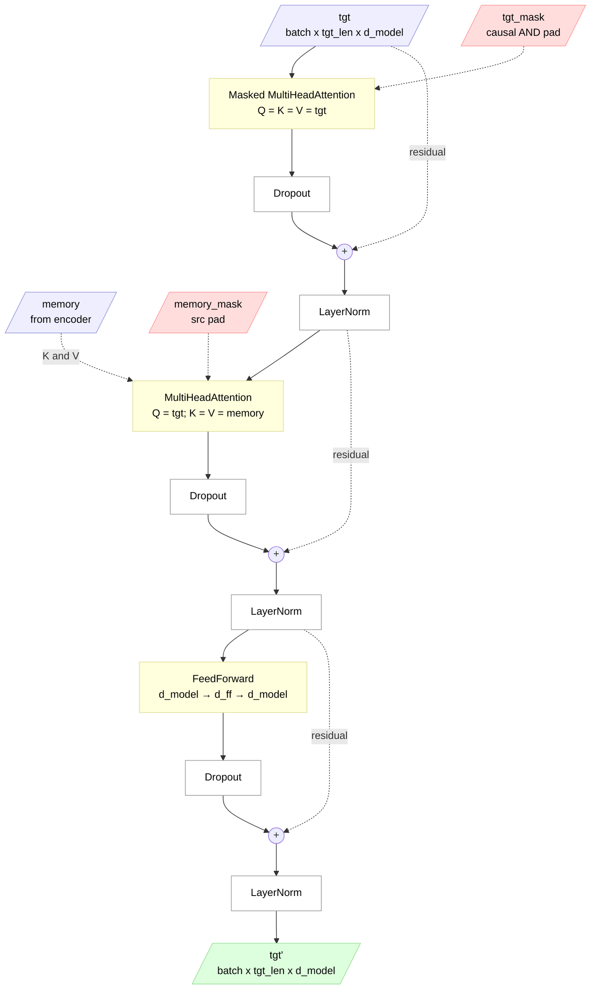

## Table of Contents

1. [Architecture at a Glance](#architecture-at-a-glance)
2. [Why Cross-Attention Only Needs Padding Mask](#why-cross-attention-only-needs-padding-mask)
3. [Why Output Shape Follows Query, Not Key/Value](#why-output-shape-follows-query-not-keyvalue)
4. [End-to-End Mathematical Trace — One DecoderLayer](#end-to-end-mathematical-trace--one-decoderlayer)
5. [Padding vs Masking — Why Encoder Output Has Pad Artifacts](#padding-vs-masking--why-encoder-output-has-pad-artifacts)
   - [What `src_mask` Actually Does — Rows vs Columns](#what-src_mask-actually-does--rows-vs-columns)
   - [What Happens After Attention — FFN + LayerNorm on Pad Positions](#what-happens-after-attention--ffn--layernorm-on-pad-positions)
   - [Why `memory_mask` Exists — Decoder Runs Its Own Attention](#why-memory_mask-exists--decoder-runs-its-own-attention)
   - [Summary — Who Blocks What](#summary--who-blocks-what)

---

# Architecture at a Glance

One **DecoderLayer** — applied identically N times to form the full decoder. Three sub-layers: masked self-attention (on the target), cross-attention (target queries against the encoder's `memory`), and a position-wise FFN. Each follows post-LN: `LayerNorm(x + Dropout(sublayer(x)))`.

Blue = inputs (target tokens + encoder memory), green = output, pink = masks (dashed = control-only), yellow = computation.



The two masks do different jobs:
- **`tgt_mask`** combines causal (no peeking at future tokens) + padding (ignore `<pad>` tokens) for self-attention — see [Why Cross-Attention Only Needs Padding Mask](#why-cross-attention-only-needs-padding-mask).
- **`memory_mask`** is pure src-padding for cross-attention — the decoder can attend to any source position, just not the padded ones.

`memory` is computed once by the encoder and reused across **every** decoder layer, **every** decode step at inference time — that's why `inference.py` calls `run_encoder_stack` once and loops only the decoder.

---

# Why Cross-Attention Only Needs Padding Mask

## The Decoder's Two Attention Masks

The decoder has two attention sub-layers, each with a different mask:

- **`tgt_mask`** — for self-attention (sub-layer 1)
- **`memory_mask`** — for cross-attention (sub-layer 2)

## Concrete Example

Translating English → Bengali:

```
Source (English):  ["We", "are", "friends", "<pad>", "<pad>"]   # src_seq_len = 5
Target (Bengali):  ["আমরা", "বন্ধু", "হই"]                       # tgt_seq_len = 3
```

## Sub-layer 1: Masked Self-Attention (`tgt_mask`)

The decoder attends to **itself** — target looks at target.

```
            Keys (target)
            আমরা  বন্ধু  হই
Queries     ┌─────────────────┐
আমরা        │ ✅    ✗    ✗    │  ← can only see itself
বন্ধু          │ ✅    ✅   ✗    │  ← can see আমরা + itself
হই          │ ✅    ✅   ✅    │   ← can see all previous
            └─────────────────┘
```

This is the **causal mask** — lower triangular. Position `i` can only attend to positions `≤ i`. If target had padding, `tgt_mask` would combine causal + padding.

**No source padding involved** — target is only looking at itself.

## Sub-layer 2: Cross-Attention (`memory_mask`)

The decoder attends to the **encoder output** — target looks at source.

```
         Keys (source/encoder output)
         "We"  "are"  "friends"  <pad>  <pad>
Queries  ┌────────────────────────────────────┐
আমরা     │  ✅    ✅     ✅       ✗      ✗     │
বন্ধু       │  ✅    ✅     ✅       ✗      ✗     │
হই       │  ✅    ✅     ✅       ✗      ✗     │
         └────────────────────────────────────┘
```

Every decoder position can attend to **all real source tokens** — no causal restriction. But `<pad>` positions must be masked out. That's `memory_mask`.

## Why No Causal Mask in Cross-Attention?

- **Self-attention** needs causal because the decoder generates left-to-right — position `i` can't peek at future token `i+1`
- **Cross-attention** doesn't need causal because the source sentence is **already complete** — it was fully encoded before decoding started. There's nothing to "hide". The only thing to mask is padding.

---

# Why Output Shape Follows Query, Not Key/Value

## The Question

`DecoderLayer.forward()` takes two different sequence lengths:

```python
tgt:             (batch_size, tgt_seq_len, d_model)   # e.g., 2 tokens
encoder_output:  (batch_size, src_seq_len, d_model)   # e.g., 3 tokens
```

Yet the output is `(batch_size, tgt_seq_len, d_model)`. How does `src_seq_len` disappear?

## Trace Through Cross-Attention Math

```
Q from tgt:              (batch, tgt_seq_len, d_model)
K from encoder_output:   (batch, src_seq_len, d_model)
V from encoder_output:   (batch, src_seq_len, d_model)

# After split_heads:
Q: (batch, heads, tgt_seq_len, d_k)
K: (batch, heads, src_seq_len, d_k)
V: (batch, heads, src_seq_len, d_k)

# Attention scores: Q @ K^T
(batch, heads, tgt_seq_len, d_k) @ (batch, heads, d_k, src_seq_len)
= (batch, heads, tgt_seq_len, src_seq_len)    ← the rectangular grid

# Multiply by V: scores @ V
(batch, heads, tgt_seq_len, src_seq_len) @ (batch, heads, src_seq_len, d_k)
= (batch, heads, tgt_seq_len, d_k)            ← src_seq_len cancels out!

# After combine_heads + W_o:
= (batch, tgt_seq_len, d_model)
```

## Why `src_seq_len` Disappears

The `src_seq_len` dimension gets **summed away** during `scores @ V`. Each query position produces a weighted sum over all source values — that weighted sum collapses `src_seq_len` into a single `d_k` vector per query position.

No matter how long the source is (3 tokens, 100 tokens, 1000 tokens), the output always matches the **query's** length: `(batch, tgt_seq_len, d_model)`.

This is exactly why `MultiHeadAttention.forward()` takes separate `query`, `key`, `value` arguments with independent `seq_len_q` and `seq_len_k` — the attention score matrix is `(seq_len_q x seq_len_k)`, which doesn't have to be square.

---

# End-to-End Mathematical Trace — One DecoderLayer

Trace a single input through one `DecoderLayer`, showing every operation and shape change. Uses our config: `d_model=256`, `num_heads=8`, `d_k=32`, `d_ff=1024`.

The decoder has **3 sub-layers** (vs encoder's 2): masked self-attention, cross-attention, and FFN.

## Input

```
tgt: (batch=1, tgt_seq_len=3, d_model=256)
     ["<sos>", "আমরা", "বন্ধু"] — decoder input (teacher forcing, shifted right)

encoder_output: (1, src_seq_len=4, 256)
     ["We", "are", "friends", "<eos>"] — encoder's final output

tgt_mask: (1, 1, 3, 3)     ← causal + padding mask (lower triangular)
memory_mask: (1, 1, 1, 4)  ← source padding mask (all 1s here, no pads)
```

## Sub-layer 1: Masked Self-Attention (tgt attends to tgt)

### Step 1 — Linear projections

```python
Q = self.W_q(tgt)     # tgt @ W_q^T + b_q
K = self.W_k(tgt)     # tgt @ W_k^T + b_k
V = self.W_v(tgt)     # tgt @ W_v^T + b_v
```

```
tgt: (1, 3, 256)
Q = K = V source: all from tgt (self-attention: Q=K=V=tgt)

Q, K, V: (1, 3, 256) each
```

### Step 2 — Split into 8 heads

```
Q: (1, 3, 256) → (1, 8, 3, 32)
K: (1, 3, 256) → (1, 8, 3, 32)
V: (1, 3, 256) → (1, 8, 3, 32)
```

### Step 3 — Scaled dot-product + causal mask

```
scores = Q @ K^T / sqrt(32)
         (1, 8, 3, 32) @ (1, 8, 32, 3) = (1, 8, 3, 3)
```

Before masking (one head):

```
               key: <sos>  আমরা   বন্ধু
query <sos>:     [ 1.2    0.8    0.5 ]
query আমরা:      [ 0.6    1.4    0.9 ]
query বন্ধু:        [ 0.3    0.7    1.6 ]
```

After tgt_mask (causal — can't see future):

```
               key: <sos>  আমরা   বন্ধু
query <sos>:     [ 1.2    -inf   -inf ]   ← sees only itself
query আমরা:      [ 0.6    1.4    -inf ]   ← sees <sos> + itself
query বন্ধু:        [ 0.3    0.7    1.6  ]   ← sees all previous + itself
```

After softmax:

```
query <sos>:     [ 1.00   0.00   0.00 ]
query আমরা:      [ 0.31   0.69   0.00 ]
query বন্ধু:        [ 0.12   0.18   0.70 ]
```

### Step 4 — Weighted sum + combine + residual + LayerNorm

```
attn_output = weights @ V                              → (1, 8, 3, 32)
attn_output = combine_heads(attn_output)               → (1, 3, 256)
attn_output = W_o(attn_output)                         → (1, 3, 256)
tgt = self.norm1(tgt + self.dropout1(attn_output))     → (1, 3, 256)
```

**After sub-layer 1**: each target position knows about previous target positions only.

## Sub-layer 2: Cross-Attention (tgt attends to encoder_output)

This is where the decoder "reads" the source sentence.

### Step 5 — Linear projections (Q from decoder, K/V from encoder)

```python
Q = self.W_q(tgt)                # Q from DECODER — (1, 3, 256)
K = self.W_k(encoder_output)     # K from ENCODER — (1, 4, 256)
V = self.W_v(encoder_output)     # V from ENCODER — (1, 4, 256)
```

Note: Q has 3 positions (target), K/V have 4 positions (source). Different sequence lengths!

### Step 6 — Split heads

```
Q: (1, 3, 256) → (1, 8, 3, 32)     ← 3 queries (target positions)
K: (1, 4, 256) → (1, 8, 4, 32)     ← 4 keys (source positions)
V: (1, 4, 256) → (1, 8, 4, 32)     ← 4 values (source positions)
```

### Step 7 — Rectangular attention scores

```
scores = Q @ K^T / sqrt(32)
         (1, 8, 3, 32) @ (1, 8, 32, 4) = (1, 8, 3, 4)
                                                  ↑  ↑
                                           3 queries × 4 keys = NOT square!
```

One head's score matrix:

```
               key: "We"  "are"  "friends"  "<eos>"
query <sos>:     [ 0.3    0.5    0.8        0.1   ]
query আমরা:      [ 0.7    0.2    0.4        0.3   ]
query বন্ধু:        [ 0.2    0.9    0.6        0.1   ]
```

After memory_mask + softmax (no pads here, so no change):

```
query <sos>:     [ 0.15   0.25   0.45       0.15  ]    ← attends most to "friends"
query আমরা:      [ 0.40   0.15   0.25       0.20  ]    ← attends most to "We"
query বন্ধু:        [ 0.10   0.45   0.30       0.15  ]    ← attends most to "are"
```

No causal mask — every decoder position can see ALL encoder positions. The source sentence is already complete.

### Step 8 — Weighted sum collapses src_seq_len

```
cross_output = weights @ V
               (1, 8, 3, 4) @ (1, 8, 4, 32) = (1, 8, 3, 32)
                       ↑  ↑          ↑  ↑             ↑
                  3 queries          4 values      src_seq_len gone!

For query আমরা:
output_আমরা = 0.40 × V("We") + 0.15 × V("are") + 0.25 × V("friends") + 0.20 × V("<eos>")
            = 32-dim vector per head
```

The `src_seq_len=4` dimension gets **summed away** — each query produces one weighted sum.

### Step 9 — Combine + residual + LayerNorm

```
cross_output = combine_heads(cross_output)                     → (1, 3, 256)
cross_output = W_o(cross_output)                               → (1, 3, 256)
tgt = self.norm2(tgt + self.dropout2(cross_output))            → (1, 3, 256)
```

**After sub-layer 2**: each target position now carries information from both previous target tokens AND the full source sentence.

## Sub-layer 3: Feed-Forward Network

### Step 10 — Expand, ReLU, compress (same as encoder)

```python
ff_output = self.feed_forward(tgt)
```

```
tgt:               (1, 3, 256)
linear1:           (1, 3, 256) @ (256, 1024) = (1, 3, 1024)    ← expand
relu:              (1, 3, 1024)                                  ← zero negatives
dropout:           (1, 3, 1024)
linear2:           (1, 3, 1024) @ (1024, 256) = (1, 3, 256)    ← compress
```

For each position independently:

```
FFN(tgt₁) = max(0, tgt₁ W₁ + b₁) W₂ + b₂

tgt₁ ("আমরা"):   (256,)
× W₁ + b₁:       (1024,)    ← expand
ReLU:             (1024,)    ← zero negatives
× W₂ + b₂:       (256,)     ← compress back
```

### Step 11 — Residual + LayerNorm

```
tgt = self.norm3(tgt + self.dropout3(ff_output))    → (1, 3, 256)
```

## Output — One DecoderLayer Done

```
Input:   tgt (1, 3, 256)         + encoder_output (1, 4, 256)
Output:  tgt (1, 3, 256)         ← enriched with source + target context

Each position now knows:
- Previous target tokens (sub-layer 1: masked self-attention)
- Full source sentence (sub-layer 2: cross-attention)
- Non-linear transformation (sub-layer 3: FFN)
```

## Full Decoder Stack — 4 Layers

```python
# Decoder.forward()
for layer in self.layers:       # 4 layers
    tgt = layer(tgt, encoder_output, tgt_mask, memory_mask)
```

```
tgt₀: (1, 3, 256)  ← input (target embedding + PE)
        ↓ DecoderLayer 0 (self_attn₀, cross_attn₀, FFN₀, norm₀₁₂₃)
tgt₁: (1, 3, 256)
        ↓ DecoderLayer 1 (self_attn₁, cross_attn₁, FFN₁, norm₁₁₂₃)
tgt₂: (1, 3, 256)
        ↓ DecoderLayer 2 (self_attn₂, cross_attn₂, FFN₂, norm₂₁₂₃)
tgt₃: (1, 3, 256)
        ↓ DecoderLayer 3 (self_attn₃, cross_attn₃, FFN₃, norm₃₁₂₃)
decoder_output: (1, 3, 256)  ← goes to output_projection

Note: encoder_output (1, 4, 256) is the SAME for all 4 layers.
      It was computed once and reused. Only tgt changes layer to layer.
```

## Encoder vs Decoder — Side by Side

| | EncoderLayer (2 sub-layers) | DecoderLayer (3 sub-layers) |
|---|---|---|
| Sub-layer 1 | Self-attention: `self_attn(src, src, src, src_mask)` | **Masked** self-attention: `self_attn(tgt, tgt, tgt, tgt_mask)` |
| Sub-layer 2 | FFN: `feed_forward(src)` | **Cross-attention**: `cross_attn(tgt, enc_out, enc_out, memory_mask)` |
| Sub-layer 3 | — | FFN: `feed_forward(tgt)` |
| Mask type | Padding only | Causal + padding (sub-layer 1), padding only (sub-layer 2) |
| Input | `src` only | `tgt` + `encoder_output` |

---

# Padding vs Masking — Why Encoder Output Has Pad Artifacts

A common question: "We already use `src_mask` in the encoder to block pad positions — so why does the decoder need `memory_mask` to block them again?"

The answer: `src_mask` only blocks pads as **keys** (columns), not as **queries** (rows). Pad positions still compute attention output, then go through FFN and LayerNorm, producing non-zero artifact vectors. The decoder's cross-attention needs `memory_mask` to ignore them.

## What `src_mask` Actually Does — Rows vs Columns

In the attention score matrix, **rows = queries** and **columns = keys**:

```
src_mask shape: (batch, 1, 1, src_len)     ← masks KEY dimension only
scores shape:   (batch, heads, seq_len, seq_len)
                                 ↑ query    ↑ key

Broadcasting: src_mask adds -inf to pad COLUMNS (keys)
              pad ROWS (queries) are untouched
```

Concrete example — input: `["I", "love", "AI", <pad>, <pad>]`:

```
scores = Q @ K^T / sqrt(d_k)

              KEY
              "I"   "love"  "AI"  <pad>  <pad>
Q  "I"      [ 0.3    0.5    0.2   -inf   -inf ]   ← row 0 (query "I")
U  "love"   [ 0.1    0.4    0.3   -inf   -inf ]   ← row 1 (query "love")
E  "AI"     [ 0.2    0.2    0.6   -inf   -inf ]   ← row 2 (query "AI")
R  <pad>    [ 0.2    0.3    0.5   -inf   -inf ]   ← row 3 (pad query)
Y  <pad>    [ 0.1    0.4    0.5   -inf   -inf ]   ← row 4 (pad query)
               ↑                    ↑
          normal scores        masked by src_mask
```

**For real token as query** (row 0 = "I") — works perfectly:

```
[0.3, 0.5, 0.2, -inf, -inf] → softmax → [0.28, 0.40, 0.32, 0, 0]
                                                                ↑  ↑
                                                          pad keys = 0 weight ✓
```

**For pad token as query** (row 3 = `<pad>`) — still computes:

```
[0.2, 0.3, 0.5, -inf, -inf] → softmax → [0.20, 0.30, 0.50, 0, 0]
                                           ↑     ↑     ↑
                                      attends to real keys!
```

The pad **query** still attends to real keys "I", "love", "AI". It gets a weighted sum of their value vectors:

```
output₃ = 0.20 × V("I") + 0.30 × V("love") + 0.50 × V("AI")
         = some 256-dim vector   ← meaningful math, meaningless semantically
```

## What Happens After Attention — FFN + LayerNorm on Pad Positions

After self-attention, the encoder layer continues **position-wise** on ALL positions — including pad positions. From `encoder.py`:

```python
# EncoderLayer.forward() — runs on EVERY position, including pads
attn_output = self.self_attn(src, src, src, src_mask)     # pad position gets attention output
src = self.norm1(src + self.dropout1(attn_output))        # residual + LayerNorm → non-zero
ff_output = self.feed_forward(src)                         # FFN: ReLU(x₃W₁+b₁)W₂+b₂
src = self.norm2(src + self.dropout2(ff_output))           # residual + LayerNorm → non-zero again
```

Step by step for pad position 3:

```
x₃ = embedding of <pad>                          ← some vector (embedding for token ID 0)
x₃ = x₃ + attention_output₃                      ← residual connection adds attention output
x₃ = LayerNorm(x₃)                               ← normalizes to zero-mean, unit-variance
                                                     → guaranteed non-zero (gamma * x̂ + beta)
x₃ = x₃ + FFN(x₃)                                ← FFN: two linear layers + ReLU
                                                     ReLU(x₃W₁ + b₁)W₂ + b₂
x₃ = LayerNorm(x₃)                               ← normalizes again → definitely non-zero
```

This repeats for all 4 encoder layers. After the final layer:

```
encoder_output: [vec₁,  vec₂,   vec₃,  vec₄,      vec₅     ]
                 "I"    "love"  "AI"   artifact   artifact
                 real    real   real    ← non-zero but meaningless
```

FFN doesn't know or care that position 3 is a pad. LayerNorm guarantees non-zero output. These artifact vectors look "real" (non-zero, normalized) but carry no useful semantic information.

## Why `memory_mask` Exists — Decoder Runs Its Own Attention

The encoder is finished. Its `src_mask` lived and died inside the encoder's self-attention layers. Now the **decoder** runs its own **cross-attention** — a completely new `Q @ K^T` computation:

```python
# DecoderLayer.forward() — sub-layer 2: cross-attention
# Q comes from DECODER, K and V come from ENCODER OUTPUT
cross_attn_output = self.cross_attn(tgt, encoder_output, encoder_output, memory_mask)
```

Inside this cross-attention:

```python
Q = W_q(tgt)              # Q from DECODER hidden state (e.g. "আমি")
K = W_k(encoder_output)   # K from ENCODER output (all 5 positions, including artifacts)
V = W_v(encoder_output)   # V from ENCODER output (all 5 positions, including artifacts)

scores = Q @ K^T / sqrt(d_k)    ← brand new scores, nothing to do with encoder's internal scores
```

**Without memory_mask** — artifacts leak into decoder:

```
Decoder query "আমি" × Encoder keys:

     K₁("I")  K₂("love")  K₃("AI")  K₄(artifact)  K₅(artifact)
      0.35      0.40        0.15       0.05           0.05

softmax → [0.30, 0.35, 0.20, 0.08, 0.07]
                                 ↑           ↑
                           15% garbage leaking into decoder output!
```

K₄ and K₅ are projections of artifact vectors. They're non-zero, so `Q @ K^T` gives non-zero scores. Softmax assigns them non-zero weight.

**With memory_mask** — clean output:

```
scores + memory_mask:

     K₁("I")  K₂("love")  K₃("AI")  K₄(artifact)  K₅(artifact)
      0.35      0.40        0.15       -inf           -inf

softmax → [0.38, 0.43, 0.19, 0.0, 0.0]    ← clean! only real tokens
```

## Summary — Who Blocks What

```
ENCODER                              DECODER
┌──────────────────────┐            ┌──────────────────────────┐
│                      │            │                          │
│  self-attention      │            │  self-attention          │
│  + src_mask ✓        │            │  + tgt_mask              │
│       ↓              │            │       ↓                  │
│  FFN + LayerNorm     │            │  cross-attention         │
│       ↓              │            │  Q = decoder hidden      │
│  encoder_output ─────────────────→│  K,V = encoder_output    │
│  (has pad artifacts) │            │  + memory_mask ✓  ← HERE │
│                      │            │       ↓                  │
└──────────────────────┘            │  FFN + LayerNorm         │
                                    └──────────────────────────┘
```

| What | Who blocks it | How |
|---|---|---|
| Real token attending to pad **key** (in encoder) | `src_mask` | -inf on pad columns → softmax → 0 weight |
| Pad **query** attending to real keys (in encoder) | **Nobody** | Pad row computes normally → artifact vector |
| FFN/LayerNorm on pad positions (in encoder) | **Nobody** | Runs on all positions → non-zero output |
| Decoder attending to pad encoder positions | `memory_mask` | -inf on pad columns → softmax → 0 weight |

**Key insight**: masks block pads as **keys** (columns), not as **queries** (rows). Encoder pad positions produce artifact vectors. `memory_mask` ensures the decoder never attends to them.
