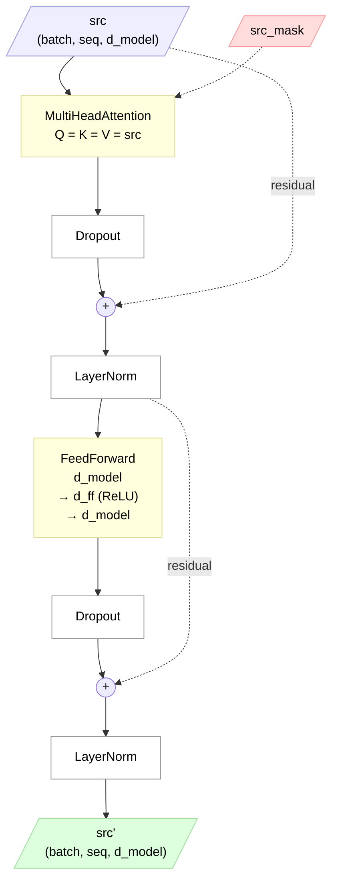
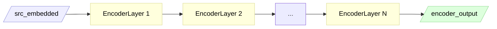

## Table of Contents

1. [Architecture at a Glance](#architecture-at-a-glance)
2. [Relative Imports and `__init__.py`](#relative-imports-and-__init__py)
   - [The Three Import Styles](#the-three-import-styles)
   - [How `.` Works in Relative Imports](#how--works-in-relative-imports)
   - [Why `__init__.py` is Required](#why-__init__py-is-required)
   - [The Caveat: Can't Run Files Directly](#the-caveat-cant-run-files-directly)
   - [Will This Break Existing Code?](#will-this-break-existing-code)
3. [Why `self.self_attn(src, src, src)` — Self-Attention Explained](#why-selfself_attnsrc-src-src--self-attention-explained)
   - [The Confusing Line](#the-confusing-line)
   - [`__init__` and `forward` Are Different Calls](#__init__-and-forward-are-different-calls)
   - [Why Q = K = V = `src`?](#why-q--k--v--src)
   - [Self-Attention vs Cross-Attention](#self-attention-vs-cross-attention)
   - [Who Says Q, K, V Dimensions Must Match?](#who-says-q-k-v-dimensions-must-match)
4. [`__init__` vs `forward` — Building the Machine vs Running It](#__init__-vs-forward--building-the-machine-vs-running-it)
   - [The Core Idea](#the-core-idea)
   - [Why Can't We Pass Data in `__init__`?](#why-cant-we-pass-data-in-__init__)
   - [Data Arrives in `forward`](#data-arrives-in-forward)
   - [The Factory Analogy](#the-factory-analogy)
   - [The Full Lifecycle](#the-full-lifecycle)
5. [End-to-End Mathematical Trace — One EncoderLayer](#end-to-end-mathematical-trace--one-encoderlayer)
   - [Sub-layer 1: Multi-Head Self-Attention](#sub-layer-1-multi-head-self-attention)
   - [Sub-layer 2: Feed-Forward Network](#sub-layer-2-feed-forward-network)
   - [Output — One EncoderLayer Done](#output--one-encoderlayer-done)
   - [Full Encoder Stack — 4 Layers](#full-encoder-stack--4-layers)
6. [What Is Dropout? — Regularization by Random Zeroing](#what-is-dropout--regularization-by-random-zeroing)
   - [The Problem — Overfitting](#the-problem--overfitting)
   - [How Dropout Works](#how-dropout-works)
   - [`model.train()` vs `model.eval()` — The Mode Switch](#modeltrain-vs-modeleval--the-mode-switch)
   - [Where Dropout Is Used in Our Code](#where-dropout-is-used-in-our-code)
   - [Why 0.1 and Not Higher?](#why-01-and-not-higher)
7. [Where Does Dropout Go? — Sub-layer Output, Not LayerNorm Output](#where-does-dropout-go--sub-layer-output-not-layernorm-output)
   - [The Paper's Formula (Section 5.4)](#the-papers-formula-section-54)
   - [All Three Dropout Locations in the Paper (Section 5.4)](#all-three-dropout-locations-in-the-paper-section-54)
   - [Why Not After LayerNorm?](#why-not-after-layernorm)
8. [`nn.ModuleList` — N Layers, Each With Own Weights](#nnmodulelist--n-layers-each-with-own-weights)
   - [What This Code Does](#what-this-code-does)
   - [What Happens Inside Each `EncoderLayer(...)` Call](#what-happens-inside-each-encoderlayer-call)
   - [Data Flows Through Layers Sequentially](#data-flows-through-layers-sequentially)
9. [`nn.ModuleList` vs `nn.Sequential` — Stacking Layers](#nnmodulelist-vs-nnsequential--stacking-layers)
   - [`nn.Sequential` — stack + return (from `ViT/ViT.ipynb`)](#nnsequential--stack--return-from-vitvitipynb)
   - [`nn.ModuleList` — stack only (from `transformer/models/encoder.py`)](#nnmodulelist--stack-only-from-transformermodelsencoderpy)
   - [Why the Difference?](#why-the-difference)
10. [Why No Final LayerNorm? — Staying Faithful to the Paper](#why-no-final-layernorm--staying-faithful-to-the-paper)
    - [What PyTorch Does](#what-pytorch-does)
    - [Why PyTorch Has It](#why-pytorch-has-it)
    - [Why We Don't Use It](#why-we-dont-use-it)

---

# Architecture at a Glance

One **EncoderLayer** — applied identically N times (default 4) to form the full encoder. Blue = input, green = output, pink = mask (dashed = control-only), yellow = computation, `(+)` = residual sum. The two sub-layers (self-attention, then position-wise FFN) each follow the post-LN recipe: `LayerNorm(x + Dropout(sublayer(x)))`.



Stacked N times to form the full Encoder — the output of one layer is the input of the next:



Every layer has its own weights (see [nn.ModuleList](#nnmodulelist--n-layers-each-with-own-weights)). The mask is the same `src_mask` reused across all layers — it depends only on the padding pattern, which doesn't change.

---

# Relative Imports and `__init__.py`

## The Three Import Styles

From `models/encoder.py`, there are three ways to import `MultiHeadAttention`:

### Option 1: Relative import (standard)
```python
from .modules.multi_head_attention import MultiHeadAttention
```
The `.` means "start from **my** package (`models/`)". So `.modules` = `models/modules/`.

### Option 2: Absolute from project root
```python
from models.modules.multi_head_attention import MultiHeadAttention
```
Works when running from `transformer/` directory. Depends on working directory.

### Option 3: Direct module import (fragile)
```python
from modules.multi_head_attention import MultiHeadAttention
```
Only works if `modules/` happens to be on `sys.path`. Fragile and incorrect.

**We use Option 1** — it's the standard in open-source Python packages (PyTorch, HuggingFace Transformers, fairseq, etc.).

## How `.` Works in Relative Imports

The `.` refers to the **package level**, not the filesystem directory. Each `.` goes **up** one package level:

```
From models/encoder.py:

.                = models/              (my package)
.modules         = models/modules/     (sub-package of my package)
..               = transformer/        (parent package — one level UP)
...              = parent of transformer/
```

So `from .modules.multi_head_attention import ...` means: "from my package (`models/`), go into `modules/`, find `multi_head_attention`."

**Without the `.`**, Python looks for a **top-level** package called `modules` on `sys.path` — it doesn't know you mean "the `modules` folder next to me."

## Why `__init__.py` is Required

For relative imports to work, both `models/` and `models/modules/` must have `__init__.py` files. This tells Python they are **packages**, not just directories with Python files.

```
models/
├── __init__.py          ← makes models/ a package
├── encoder.py
├── decoder.py
└── modules/
    ├── __init__.py      ← makes modules/ a sub-package
    ├── multi_head_attention.py
    ├── feed_forward.py
    ├── layer_norm.py
    ├── embeddings.py
    └── positional_encoding.py
```

The `__init__.py` files can be empty — their presence alone is what matters.

## The Caveat: Can't Run Files Directly

With relative imports, you **cannot** run a module file directly:

```bash
python models/encoder.py    # ❌ ImportError: attempted relative import with no known parent package
```

This is a Python limitation, not a bug. Relative imports require the file to be imported **as part of a package**.

**This is not a problem** because module files like `encoder.py`, `multi_head_attention.py`, etc. are never meant to be run as scripts. They define classes that are imported by:

```python
# In Transformer.ipynb or scripts/train.py
from models.encoder import Encoder    # ✅ Works perfectly
```

## Will This Break Existing Code?

No. Relative imports only affect **how Python finds the module** — the imported class is identical regardless of import style. No existing code is affected.

---

# Why `self.self_attn(src, src, src)` — Self-Attention Explained

## The Confusing Line

In `EncoderLayer.forward()`, we write:

```python
attn_output = self.self_attn(src, src, src, src_mask)
```

This looks strange — why pass `src` three times? And `MultiHeadAttention.__init__` takes `d_model, num_heads, dropout` — so how does it suddenly accept `src, src, src, src_mask`?

## `__init__` and `forward` Are Different Calls

When we write `self.self_attn(src, src, src, src_mask)`, we're **not** calling `__init__`. We're calling `forward`.

```python
# This happens ONCE — creates the layer with its architecture config
self.self_attn = MultiHeadAttention(d_model=512, num_heads=8, dropout=0.1)
#                                   ↑ __init__ args — configure the weights

# This happens EVERY TIME data flows through — processes actual data
attn_output = self.self_attn(src, src, src, src_mask)
#                            ↑ forward args — query, key, value, mask
```

In PyTorch, calling a module like a function (`self.self_attn(...)`) triggers its `forward()` method. So this line actually calls:

```python
MultiHeadAttention.forward(self, query=src, key=src, value=src, mask=src_mask)
```

## Why Q = K = V = `src`?

This is what makes it **self**-attention. The encoder looks at **its own sequence** to find relationships between tokens.

In `MultiHeadAttention.forward()`:

```python
def forward(self, query, key, value, mask=None):
    Q = self.W_q(query)   # query=src → projects src with W_q weights
    K = self.W_k(key)     # key=src   → projects src with W_k weights
    V = self.W_v(value)   # value=src → projects src with W_v weights
```

Even though Q, K, V all start as the **same** tensor (`src`), the linear projections `W_q`, `W_k`, `W_v` have **different learned weights**. So after projection, they become **three different tensors**.

**Analogy:** Imagine you have a photo (src). You apply three different Instagram filters (W_q, W_k, W_v) to the same photo. You get three different-looking images — even though the original was the same.

## Self-Attention vs Cross-Attention

This is also why `forward` takes **separate** `query`, `key`, `value` arguments instead of just one input. In the **decoder**, cross-attention uses **different** sources:

```python
# Self-attention (encoder): Q, K, V all come from the same place
attn_output = self.self_attn(src, src, src, src_mask)
#                            Q    K    V    — all src

# Cross-attention (decoder): Q from decoder, K and V from encoder output
attn_output = self.cross_attn(decoder_out, encoder_out, encoder_out, mask)
#                              Q            K             V
#                              ↑ decoder    ↑ encoder     ↑ encoder
```

Self-attention is just the **special case** where query, key, and value are all the same tensor.

## Who Says Q, K, V Dimensions Must Match?

The paper does (Section 3.2.2). In self-attention, all three come from the previous layer's output, so they all have the same shape: `(batch_size, seq_len, d_model)`. The linear projections then transform them into the same dimension space (`d_model → d_model`), so dimensions always align for the matrix multiplication inside scaled dot-product attention.

---

# `__init__` vs `forward` — Building the Machine vs Running It

## The Core Idea

In PyTorch, every `nn.Module` has two phases:

1. **`__init__`** — Build the machine (define layers, set up weights). Runs **once**.
2. **`forward`** — Feed data through the machine. Runs **thousands of times** during training.

## Why Can't We Pass Data in `__init__`?

When `__init__` runs, **no data exists yet**. We're just defining the architecture:

```python
class EncoderLayer(nn.Module):
    def __init__(self, d_model, num_heads, d_ff, dropout=0.1):
        super().__init__()
        # Building the machine — no src tensor exists yet!
        self.self_attn = MultiHeadAttention(d_model, num_heads, dropout)
        self.feed_forward = FeedForward(d_model, d_ff, dropout)
        self.norm1 = LayerNorm(d_model)
        self.norm2 = LayerNorm(d_model)
        # We only know the SHAPE of future data (d_model=512),
        # not the actual data itself.
```

## Data Arrives in `forward`

Every time a batch comes in during training, `forward` is called with the actual data:

```python
    def forward(self, src, src_mask=None):
        # NOW we have real data!
        # src shape: (batch_size, seq_len, d_model) — e.g., (32, 100, 512)
        attn_output = self.self_attn(src, src, src, src_mask)
        src = self.norm1(src + self.dropout1(attn_output))
        ff_output = self.feed_forward(src)
        src = self.norm2(src + self.dropout2(ff_output))
        return src
```

## The Factory Analogy

Think of it like building a **factory**:

| Phase | Factory | PyTorch |
|---|---|---|
| `__init__` | Install machines, conveyor belts, set factory size | Create layers, set dimensions, initialize weights |
| `forward` | Raw materials arrive → feed through machines → product comes out | Input tensor arrives → pass through layers → output tensor comes out |

You build the factory **once**. Then every day, different raw materials arrive and get processed. You can't install machines based on tomorrow's raw materials — you don't know what they'll be yet.

## The Full Lifecycle

```python
# Step 1: Build (once)
encoder_layer = EncoderLayer(d_model=512, num_heads=8, d_ff=2048)
# __init__ runs → weights created, layers ready

# Step 2: Run (thousands of times during training)
for batch in dataloader:
    src = batch["input"]              # actual data arrives
    output = encoder_layer(src, mask) # forward() runs → data processed
    # Next batch: different src, same weights (until optimizer updates them)
```

Every call to `encoder_layer(src, mask)` gets **different** `src` (different batches, different training steps), but uses the **same** weights — which the optimizer gradually improves.

---

# End-to-End Mathematical Trace — One EncoderLayer

Trace a single input through one `EncoderLayer`, showing every operation and shape change. Uses our config values: `d_model=256`, `num_heads=8`, `d_k=32`, `d_ff=1024`.

## Input

```
src: (batch=1, seq_len=3, d_model=256)    ← 3 tokens after embedding + PE
     ["I", "love", "AI"] — each is a 256-dim vector

src_mask: (1, 1, 1, 3) = [1, 1, 1]       ← no padding in this example
```

## Sub-layer 1: Multi-Head Self-Attention

### Step 1 — Linear projections (Q, K, V)

```python
Q = self.W_q(src)     # src @ W_q^T + b_q
K = self.W_k(src)     # src @ W_k^T + b_k
V = self.W_v(src)     # src @ W_v^T + b_v
```

```
src:  (1, 3, 256)
W_q:  (256, 256)     ← nn.Linear weight matrix

Q = src @ W_q^T + b_q
    (1, 3, 256) @ (256, 256) = (1, 3, 256)

Same for K and V → all three are (1, 3, 256)
```

### Step 2 — Split into 8 heads

```python
Q = self.split_heads(Q)    # view + transpose
```

```
Q: (1, 3, 256) → view → (1, 3, 8, 32) → transpose(1,2) → (1, 8, 3, 32)
                          ↑ seq  heads d_k                   ↑ heads seq d_k

Same for K, V → all three are (1, 8, 3, 32)
```

Each head gets its own 32-dim slice. Head 0 sees Q[:, 0, :, :] = (1, 3, 32).

### Step 3 — Scaled dot-product attention (per head)

```python
scores = Q @ K^T / sqrt(d_k)
```

```
Q @ K^T:
(1, 8, 3, 32) @ (1, 8, 32, 3) = (1, 8, 3, 3)
                                        ↑ query × key

/ sqrt(32) = / 5.66

scores: (1, 8, 3, 3)    ← 8 heads, each with a 3×3 attention grid
```

One head's 3×3 score matrix (before softmax):

```
            key: "I"   "love"  "AI"
query "I":     [ 1.2    0.8    0.3 ]
query "love":  [ 0.5    1.5    0.9 ]
query "AI":    [ 0.2    0.7    1.8 ]
```

### Step 4 — Mask + Softmax

```python
scores = scores.masked_fill(mask == 0, float('-inf'))    # no pads → no change
attention_weights = softmax(scores, dim=-1)               # each ROW sums to 1
```

```
            key: "I"   "love"  "AI"
query "I":     [ 0.50   0.33   0.17 ]    ← "I" attends mostly to itself
query "love":  [ 0.18   0.50   0.32 ]    ← "love" attends mostly to itself
query "AI":    [ 0.08   0.27   0.65 ]    ← "AI" attends mostly to itself

attention_weights: (1, 8, 3, 3)    ← each row sums to 1.0
```

### Step 5 — Weighted sum of values

```python
attn_output = attention_weights @ V
```

```
(1, 8, 3, 3) @ (1, 8, 3, 32) = (1, 8, 3, 32)
        ↑ weights    ↑ values         ↑ weighted sum per query

For query "I":
output_I = 0.50 × V("I") + 0.33 × V("love") + 0.17 × V("AI")
         = 32-dim vector    ← context-aware representation of "I"
```

### Step 6 — Combine heads + output projection

```python
attn_output = self.combine_heads(attn_output)    # transpose + view
output = self.W_o(attn_output)                    # final linear
```

```
attn_output: (1, 8, 3, 32) → transpose(1,2) → (1, 3, 8, 32) → view → (1, 3, 256)
                                                                         ↑ 8 × 32 = 256

output = attn_output @ W_o^T + b_o
         (1, 3, 256) @ (256, 256) = (1, 3, 256)
```

### Step 7 — Residual + LayerNorm

```python
src = self.norm1(src + self.dropout1(attn_output))
```

```
dropout1(attn_output):    (1, 3, 256)    ← randomly zero ~10% of values
src + dropout1(...):      (1, 3, 256)    ← residual: add original input back
norm1(...):               (1, 3, 256)    ← per-position: x̂ = (x - μ) / √(σ² + ε)
                                            then γ * x̂ + β (learned scale + shift)
```

**After sub-layer 1**: `src` is (1, 3, 256) — same shape, but each token now carries context from all other tokens.

## Sub-layer 2: Feed-Forward Network

### Step 8 — Expand to d_ff, ReLU, project back

```python
ff_output = self.feed_forward(src)
```

```python
# Inside FeedForward.forward():
x = self.linear1(src)      # (1, 3, 256) @ (256, 1024) = (1, 3, 1024)   ← expand
x = self.relu(x)           # (1, 3, 1024)                                ← zero out negatives
x = self.dropout(x)        # (1, 3, 1024)                                ← randomly zero ~10%
x = self.linear2(x)        # (1, 3, 1024) @ (1024, 256) = (1, 3, 256)   ← compress back
```

Mathematically for each position independently:

```
FFN(x₀) = max(0, x₀ W₁ + b₁) W₂ + b₂

x₀:           (256,)     ← one position's vector
x₀ W₁ + b₁:  (1024,)    ← expand to 1024 dims
ReLU:         (1024,)    ← zero out negative values
× W₂ + b₂:   (256,)     ← compress back to 256 dims
```

"Position-wise" means: position 0 ("I"), position 1 ("love"), position 2 ("AI") each go through the **same** W₁, W₂ weights **independently**. No interaction between positions here — that already happened in self-attention.

### Step 9 — Residual + LayerNorm (again)

```python
src = self.norm2(src + self.dropout2(ff_output))
```

```
dropout2(ff_output):    (1, 3, 256)
src + dropout2(...):    (1, 3, 256)    ← residual
norm2(...):             (1, 3, 256)    ← LayerNorm
```

## Output — One EncoderLayer Done

```
Input:  src (1, 3, 256)    ← embeddings of ["I", "love", "AI"]
Output: src (1, 3, 256)    ← context-aware representations

Same shape in, same shape out. But the vectors are now enriched:
- "I" knows about "love" and "AI" (via self-attention)
- Each vector was non-linearly transformed (via FFN)
- Both additions were normalized (via LayerNorm)
```

## Full Encoder Stack — 4 Layers

```python
# Encoder.forward()
for layer in self.layers:       # 4 layers
    src = layer(src, src_mask)
```

```
src₀: (1, 3, 256)  ← input (embedding + PE)
        ↓ EncoderLayer 0 (W_q₀, W_k₀, W_v₀, W_o₀, FFN₀, norm₀)
src₁: (1, 3, 256)  ← layer 0 output → layer 1 input
        ↓ EncoderLayer 1 (W_q₁, W_k₁, W_v₁, W_o₁, FFN₁, norm₁)
src₂: (1, 3, 256)  ← layer 1 output → layer 2 input
        ↓ EncoderLayer 2 (W_q₂, W_k₂, W_v₂, W_o₂, FFN₂, norm₂)
src₃: (1, 3, 256)  ← layer 2 output → layer 3 input
        ↓ EncoderLayer 3 (W_q₃, W_k₃, W_v₃, W_o₃, FFN₃, norm₃)
encoder_output: (1, 3, 256)  ← final output → goes to decoder as K, V
```

Each layer has **its own weights** (subscript ₀, ₁, ₂, ₃). Same architecture, different learned parameters. The representation gets progressively more refined — early layers capture local patterns, later layers capture long-range dependencies.

---

# What Is Dropout? — Regularization by Random Zeroing

## The Problem — Overfitting

A model that memorizes the training data instead of learning general patterns. It performs great on training data, terrible on new data:

```
Training loss:    0.1  ← "I memorized everything!"
Validation loss:  3.5  ← "I can't generalize to new sentences"
```

This happens when the model relies too heavily on a few specific neurons — they memorize patterns instead of learning useful features.

## How Dropout Works

During **training**, dropout randomly zeros ~10% of values (our config: `dropout=0.1`) at each step:

```
Input:  [0.5, 0.8, 0.3, 0.7, 0.2, 0.9, 0.4, 0.6, 0.1, 0.8]

Step 1: [0.5, 0.0, 0.3, 0.7, 0.2, 0.9, 0.0, 0.6, 0.1, 0.8]
              ↑                          ↑
          killed                     killed

Step 2: [0.5, 0.8, 0.0, 0.7, 0.2, 0.0, 0.4, 0.6, 0.1, 0.8]
                    ↑              ↑
                killed         killed
```

Different neurons are killed each step — randomly chosen. This forces the model to spread knowledge across many neurons. No single neuron can be relied on, because it might be zeroed next step.

During **eval** (validation / inference), dropout is **OFF** — everything passes through unchanged:

```
Input:  [0.5, 0.8, 0.3, 0.7, 0.2, 0.9, 0.4, 0.6, 0.1, 0.8]
Output: [0.5, 0.8, 0.3, 0.7, 0.2, 0.9, 0.4, 0.6, 0.1, 0.8]    ← no zeroing
```

Why? During eval you want the model's **full power** — consistent, deterministic predictions. If dropout stayed on, the same input could give different outputs each time.

## `model.train()` vs `model.eval()` — The Mode Switch

```python
model.train()    # dropout ON  → for training (randomness helps generalization)
model.eval()     # dropout OFF → for validation/inference (need consistent output)
```

These don't train or evaluate anything — they just flip a boolean flag (`model.training = True/False`). Dropout checks this flag internally:

```python
# Inside nn.Dropout.forward() (simplified):
def forward(self, x):
    if self.training:          # ← checks model.training flag
        mask = random_mask()   # randomly zero ~10%
        return x * mask
    else:
        return x               # pass through unchanged
```

## Where Dropout Is Used in Our Code

```
MultiHeadAttention  → self.dropout         (after softmax on attention weights)
FeedForward         → self.dropout         (after ReLU)
EncoderLayer        → self.dropout1        (after self-attention output)
                    → self.dropout2        (after FFN output)
DecoderLayer        → self.dropout1        (after masked self-attention output)
                    → self.dropout2        (after cross-attention output)
                    → self.dropout3        (after FFN output)
PositionalEncoding  → self.dropout         (after embedding + PE sum)
```

All of these are `nn.Dropout(0.1)` — same dropout rate, matching Section 5.4.

## Why 0.1 and Not Higher?

The paper uses `dropout = 0.1` (Section 5.4). Common values:

```
0.0  = no dropout (no regularization)
0.1  = mild dropout (paper's choice — model is large enough to need some)
0.3  = moderate (used in smaller models that overfit more easily)
0.5  = aggressive (50% of neurons killed — used in very old networks like AlexNet)
```

0.1 is mild because the Transformer is already well-regularized by other techniques (label smoothing, weight sharing, the architecture itself). Too much dropout would slow down learning.

---

# Where Does Dropout Go? — Sub-layer Output, Not LayerNorm Output

## The Paper's Formula (Section 5.4)

```
output = LayerNorm(x + Dropout(Sublayer(x)))
```

Dropout is applied to the **sub-layer's output** (attention or FFN), **before** the residual addition. LayerNorm comes **last**.

Data flow for each sub-layer:

```
src
 ↓
Self-Attention(src, src, src)    ← sub-layer produces attn_output
 ↓
Dropout(attn_output)             ← dropout applied HERE, on sub-layer output
 ↓
src + Dropout(attn_output)       ← residual connection (add original input back)
 ↓
LayerNorm(...)                   ← normalize the combined result
 ↓
output                           ← clean, normalized — NO dropout after this
```

In code:

```python
attn_output = self.self_attn(src, src, src, src_mask)
src = self.norm1(src + self.dropout1(attn_output))
```

## All Three Dropout Locations in the Paper (Section 5.4)

The paper only applies dropout in three places — nowhere else:

1. **Sub-layer outputs** — after attention and after FFN, before residual add (inside each `EncoderLayer`)
2. **Embedding + positional encoding sum** — applied at the `Transformer` level, before feeding into the encoder
3. **Attention weights** — inside `MultiHeadAttention`, after softmax

No dropout after the full encoder stack. The encoder's output goes directly to the decoder's cross-attention as K and V.

## Why Not After LayerNorm?

LayerNorm normalizes to zero mean and unit variance, then applies learned gamma/beta. Dropout after that would randomly zero out values — **destroying** the normalization LayerNorm just computed.

```python
# ❌ WRONG — corrupts normalized output
src = self.dropout(self.norm1(src + attn_output))

# ✅ CORRECT — dropout on sub-layer output, LayerNorm last
src = self.norm1(src + self.dropout1(attn_output))
```

---

# `nn.ModuleList` — N Layers, Each With Own Weights

## What This Code Does

```python
self.layers = nn.ModuleList([
    EncoderLayer(d_model, num_heads, d_ff, dropout)
    for _ in range(num_layers)
])
```

Each `EncoderLayer(...)` call triggers `__init__`, which creates **new, randomly initialized** weight matrices. With `num_layers=6`:

```python
self.layers = nn.ModuleList([
    EncoderLayer(512, 8, 2048, 0.1),   # Layer 0 — own W_q₀, W_k₀, W_v₀, W_o₀, FFN₀
    EncoderLayer(512, 8, 2048, 0.1),   # Layer 1 — own W_q₁, W_k₁, W_v₁, W_o₁, FFN₁
    EncoderLayer(512, 8, 2048, 0.1),   # Layer 2 — own W_q₂, W_k₂, W_v₂, W_o₂, FFN₂
    EncoderLayer(512, 8, 2048, 0.1),   # Layer 3 — own W_q₃, W_k₃, W_v₃, W_o₃, FFN₃
    EncoderLayer(512, 8, 2048, 0.1),   # Layer 4 — own W_q₄, W_k₄, W_v₄, W_o₄, FFN₄
    EncoderLayer(512, 8, 2048, 0.1),   # Layer 5 — own W_q₅, W_k₅, W_v₅, W_o₅, FFN₅
])
```

Same **architecture** (same d_model, num_heads, etc.), but each layer has **its own randomly initialized weights** that learn independently during training.

## What Happens Inside Each `EncoderLayer(...)` Call

```python
# Layer 0's __init__ runs:
self.self_attn = MultiHeadAttention(512, 8, 0.1)  # creates W_q₀, W_k₀, W_v₀, W_o₀
self.feed_forward = FeedForward(512, 2048, 0.1)    # creates W₁₀, W₂₀
self.norm1 = LayerNorm(512)                         # creates gamma₀, beta₀
self.norm2 = LayerNorm(512)                         # creates gamma₀, beta₀

# Layer 1's __init__ runs SEPARATELY:
self.self_attn = MultiHeadAttention(512, 8, 0.1)  # creates W_q₁, W_k₁, W_v₁, W_o₁ (DIFFERENT from Layer 0)
self.feed_forward = FeedForward(512, 2048, 0.1)    # creates W₁₁, W₂₁ (DIFFERENT)
self.norm1 = LayerNorm(512)                         # creates gamma₁, beta₁ (DIFFERENT)
self.norm2 = LayerNorm(512)                         # creates gamma₁, beta₁ (DIFFERENT)

# ... same for Layer 2, 3, 4, 5 — each gets FRESH random weights
```

## Data Flows Through Layers Sequentially

```python
for layer in self.layers:
    src = layer(src, src_mask)
# Layer 0 output → becomes Layer 1 input → becomes Layer 2 input → ...
```

Each layer refines the representation further. Same structure, different learned behaviors — that's the whole point of stacking layers.

---

# `nn.ModuleList` vs `nn.Sequential` — Stacking Layers

Both create N layers with their own weights. The difference is how the forward pass works.

## `nn.Sequential` — stack + return (from `ViT/ViT.ipynb`)

```python
# Stack + return: creates layers AND handles forward automatically
self.transformer_encoder = nn.Sequential(*[
    TransformerEncoderBlock(embedding_dim, num_heads, mlp_size, attn_dropout, mlp_dropout)
    for _ in range(num_transformer_layers)
])

# Forward: automatic — just pass input
# Just call it — Sequential runs all layers and returns output
output = self.transformer_encoder(x)
# internally: layer5(layer4(layer3(layer2(layer1(layer0(x))))))
```

`*` unpacks the list into separate args because `Sequential` expects `Sequential(layer0, layer1, ...)` not `Sequential([layer0, layer1, ...])`.

## `nn.ModuleList` — stack only (from `transformer/models/encoder.py`)

```python
# Stack only: creates layers, does NOT handle forward
self.layers = nn.ModuleList([
    EncoderLayer(d_model, num_heads, d_ff, dropout)
    for _ in range(num_layers)
])

# Forward: manual loop — you pass multiple args
# You must write the loop yourself to return output
for layer in self.layers:
    src = layer(src, src_mask)
```

`ModuleList` takes a list directly — no `*` needed.

## Why the Difference?

| | `nn.Sequential` | `nn.ModuleList` |
|---|---|---|
| Forward | Automatic | Manual loop |
| Args per layer | Single tensor only | Multiple args (e.g., `src, src_mask`) |
| Input format | `nn.Sequential(*[...])` | `nn.ModuleList([...])` |
| **Use when** | ViT (only passes `x`) | Transformer (passes `src` + `src_mask`) |

---

# Why No Final LayerNorm? — Staying Faithful to the Paper

## What PyTorch Does

PyTorch's `nn.TransformerEncoder` has an optional `norm` parameter that applies a final LayerNorm after all N layers:

```python
# PyTorch source (torch/nn/modules/transformer.py)
class TransformerEncoder(Module):
    def __init__(self, encoder_layer, num_layers, norm=None):
        ...
        self.norm = norm    # norm=None by default

    def forward(self, src, ...):
        output = src
        for mod in self.layers:
            output = mod(output, ...)
        if self.norm is not None:       # ← optional final LayerNorm
            output = self.norm(output)
        return output
```

By default `norm=None` — no final LayerNorm. You must explicitly opt in:

```python
# Without (default) — no final LayerNorm
encoder = nn.TransformerEncoder(encoder_layer, num_layers=6)

# With — you pass it yourself
encoder = nn.TransformerEncoder(encoder_layer, num_layers=6, norm=nn.LayerNorm(512))
```

## Why PyTorch Has It

This optional `norm` exists to support **Pre-Norm** architectures (from later papers like GPT-2, "On Layer Normalization in the Transformer Architecture", 2020). In Pre-Norm, LayerNorm is applied **before** each sub-layer instead of after:

```python
# Post-Norm (original paper) — LayerNorm AFTER residual
src = LayerNorm(src + Sublayer(src))

# Pre-Norm (later papers) — LayerNorm BEFORE sub-layer
src = src + Sublayer(LayerNorm(src))
```

In Pre-Norm, the last layer's output is **not** normalized (since LayerNorm happens before, not after). So a final LayerNorm is needed to stabilize the output. That's what PyTorch's `norm` parameter is for.

## Why We Don't Use It

We are replicating "Attention Is All You Need" (Vaswani et al., 2017), which uses **Post-Norm**. Each `EncoderLayer` already ends with LayerNorm (after FFN). The last layer's `norm2` normalizes the final output — no extra LayerNorm needed.

```python
# Our encoder (models/encoder.py) — matches the paper exactly
for layer in self.layers:
    src = layer(src, src_mask)
return src    # ← already normalized by last layer's norm2
```