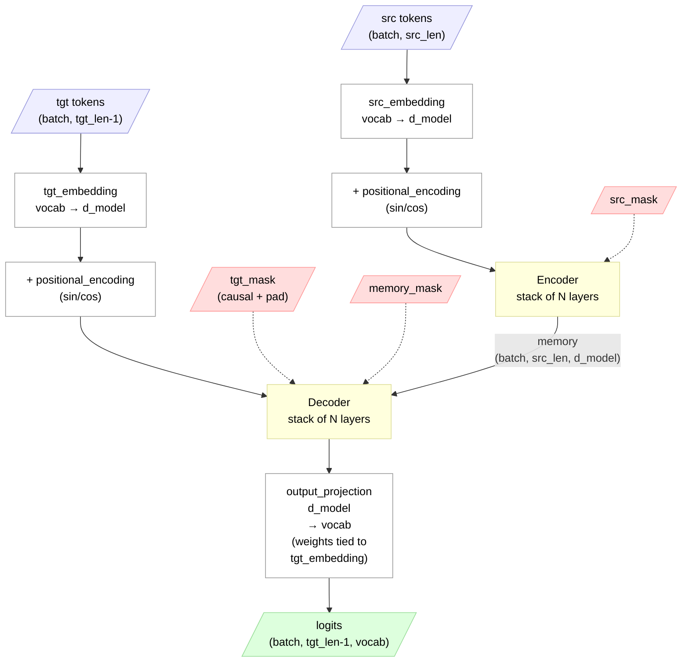

## Table of Contents

1. [Architecture at a Glance](#architecture-at-a-glance)
2. [What is Output Projection?](#what-is-output-projection)
3. [Weight Sharing — One Matrix, Two Jobs (Section 3.4)](#weight-sharing--one-matrix-two-jobs-section-34)
   - [What the Paper Says](#what-the-paper-says)
   - [How It Works in Code](#how-it-works-in-code)
   - [The Two Jobs of One Matrix](#the-two-jobs-of-one-matrix)
   - [Why Share?](#why-share)
   - [Why `src_vocab_size` and `tgt_vocab_size` Are Both 16000](#why-src_vocab_size-and-tgt_vocab_size-are-both-16000)
   - [But "I" ≠ "আমি" — How Can They Share W?](#but-i--আমি--how-can-they-share-w)
   - [What Actually Benefits From Sharing — Three Things](#what-actually-benefits-from-sharing--three-things)
   - [How Training Still Works With Shared Weights](#how-training-still-works-with-shared-weights)
   - [Full Example — With Sharing vs Without Sharing](#full-example--with-sharing-vs-without-sharing)
   - [Full Data Flow Summary](#full-data-flow-summary)
4. [What if `src_vocab_size != tgt_vocab_size`?](#what-if-src_vocab_size--tgt_vocab_size)
6. [Why Shared PositionalEncoding Works](#why-shared-positionalencoding-works)
7. [Why Return Logits, Not Softmax](#why-return-logits-not-softmax)
8. [Inference Helpers — `run_encoder_stack` / `run_decoder_stack`](#inference-helpers--run_encoder_stack--run_decoder_stack)
9. [End-to-End Mathematical Trace — Full Transformer Forward Pass](#end-to-end-mathematical-trace--full-transformer-forward-pass)

---

# Architecture at a Glance

End-to-end data flow through the full Transformer. Blue = inputs, green = outputs, pink = masks (dashed arrows, control-only — they shape attention, they aren't a value path), yellow = computation blocks.



The shape to notice: encoder runs **once** per batch (constant `memory`), decoder consumes it via cross-attention. The output projection's weights are **tied** to `tgt_embedding` (paper Section 3.4) — covered in the [Weight Sharing](#weight-sharing--one-matrix-two-jobs-section-34) section.

---

# What is Output Projection?

## The Problem

The decoder outputs a vector of shape `(d_model,)` for each position — a rich, context-aware representation. But we need **a word**, not a vector. Specifically, we need a probability distribution over the entire vocabulary: "how likely is each word to be the next token?"

## The Solution

`output_projection` is a linear layer that converts each decoder output vector into vocabulary-sized logits:

```python
self.output_projection = nn.Linear(d_model, tgt_vocab_size, bias=False)
```

For one decoder position:

```
decoder_output:     (1, 512)          one vector from decoder
W^T:                (512, 37000)      transposed weight matrix

logits = decoder_output @ W^T
         (1, 512) @ (512, 37000) = (1, 37000)    one score per vocab token
```

Each of the 37,000 scores is a **dot product** — measuring how similar the decoder's output vector is to each vocabulary token's embedding. The highest score is the predicted token.

For a full sequence:

```
decoder_output:     (tgt_seq_len, 512)
W^T:                (512, 37000)

logits = (tgt_seq_len, 512) @ (512, 37000) = (tgt_seq_len, 37000)
```

Each position independently predicts the next token.

## Why `bias=False`?

This is not from the paper — it's an implementation detail of weight sharing. `nn.Embedding` has no bias (it's a pure row lookup). Since we tie the Linear's weight to the Embedding's weight, we set `bias=False` so both operations are symmetric:

- **Embedding:** `W[token_id]` — pure row lookup, no bias
- **Projection:** `x @ W^T` — pure matrix multiply, no bias

If we had bias, the projection would compute `x @ W^T + b` — an extra term that the embedding side doesn't have, breaking the symmetry of "same matrix, opposite directions."

---

# Weight Sharing — One Matrix, Two Jobs (Section 3.4)

## What the Paper Says

From Section 3.4:

> "We share the same weight matrix between the two embedding layers and the pre-softmax linear transformation."

This means three components share **one** weight matrix `W` of shape `(vocab_size, d_model)`:

1. **Source embedding** (`src_embedding`)
2. **Target embedding** (`tgt_embedding`)
3. **Output projection** (`output_projection`)

## How It Works in Code

```python
# Weight sharing (Section 3.4)
self.output_projection.weight = self.tgt_embedding.embeddings.weight

if src_vocab_size == tgt_vocab_size:
    self.src_embedding.embeddings.weight = self.tgt_embedding.embeddings.weight
```

This is **not** copying values — it's making them point to the **same tensor in memory**. When the optimizer updates the weights during training, all three see the update.

## The Two Jobs of One Matrix

**Job 1 — Embedding (row lookup):**

Given a token ID, look up its row in `W` to get a vector representation.

```
Token ID 42 → W[42] = [0.5, 0.6, 0.7, ...]    shape: (d_model,)
```

**Job 2 — Output Projection (dot product similarity):**

Given a decoder output vector, compute dot product with **every** row in `W` to find which token it's most similar to.

```
decoder_output @ W^T = [score_0, score_1, ..., score_vocab]    shape: (vocab_size,)
```

Same matrix, opposite directions. If token "আমরা" maps **to** `[0.5, 0.6, 0.7, 0.8]` during embedding, then a decoder output **near** `[0.5, 0.6, 0.7, 0.8]` should map **back** to "আমরা" during projection. Sharing forces this consistency.

## Why Share?

1. **Consistency** — embedding and projection agree on what each token "looks like" in vector space
2. **Fewer parameters** — the embedding matrix is one of the largest components (`vocab_size x d_model` can be 37000 x 512 = ~19M parameters). Sharing cuts this by up to 2/3
3. **Better generalization** — fewer parameters means less overfitting

## Why `src_vocab_size` and `tgt_vocab_size` Are Both 16000

Our config has one `vocab_size: 16000`. This is a **shared vocabulary** — SentencePiece was trained on combined English + Bengali text and allocated 16000 slots based on frequency:

```
One shared vocab (16000 rows):

Row 0:     <pad>         ← special token
Row 1:     <sos>         ← special token
Row 2:     <eos>         ← special token
Row 3:     <unk>         ← special token
Row 4:     ▁the          ← English subword
Row 5:     ▁আম           ← Bengali subword
Row 6:     ▁of           ← English subword
Row 7:     রা             ← Bengali subword
Row 8:     ▁AI           ← both languages
Row 9:     .             ← both languages
...
Row 15999: (rare subword)
```

There's no separate "English vocab" and "Bengali vocab." Both languages live in one table. That's why `src_vocab_size == tgt_vocab_size == 16000` in our code.

The `Transformer` class takes them as separate parameters for flexibility — if someone uses separate tokenizers (e.g. 10K for English, 8K for Bengali), the sizes would differ and only `tgt_embedding ↔ output_projection` would share:

```python
# Always share tgt_embedding ↔ output_projection
self.output_projection.weight = self.tgt_embedding.embeddings.weight

# Only share src_embedding if same vocab size (True for us)
if src_vocab_size == tgt_vocab_size:
    self.src_embedding.embeddings.weight = self.tgt_embedding.embeddings.weight
```

## But "I" ≠ "আমি" — How Can They Share W?

They don't share the same **row**. They share the same **table**. Every token has its own row:

```
W table (16000 rows, 256 cols):

Row 0:   <pad>     = [0.01, 0.02, ...]
Row 1:   <sos>     = [0.10, 0.20, ...]
Row 2:   <eos>     = [0.15, 0.25, ...]
Row 14:  "I"       = [0.50, 0.60, 0.70, ...]    ← English only
Row 42:  "আমি"     = [0.30, 0.80, 0.10, ...]    ← Bengali only
Row 67:  "ভালোবাসি" = [0.90, 0.40, 0.20, ...]    ← Bengali only
Row 87:  "love"    = [0.20, 0.90, 0.40, ...]    ← English only
Row 95:  "AI"      = [0.60, 0.70, 0.50, ...]    ← BOTH languages
...16000 rows total
```

Encoder looks up "I" → reads `W[14]`. Decoder looks up "আমি" → reads `W[42]`. Different rows, different vectors, no interference. The encoder-decoder **layers** (attention + FFN) learn the mapping between "I" and "আমি" — that's their job, not W's job.

## What Actually Benefits From Sharing — Three Things

### Benefit 1: Shared tokens get the same vector

```
Encoder: "AI" → W[95] = [0.60, 0.70, 0.50, ...]
Decoder: "AI" → W[95] = [0.60, 0.70, 0.50, ...]    ← exact same vector

Same for: punctuation (. , ! ?), numbers (1, 2, 3), shared subwords (▁the, ▁a)
```

Without sharing, encoder's "AI" and decoder's "AI" would be different vectors. The model would have to learn they mean the same thing. Sharing gives this for free.

### Benefit 2: Fewer parameters

```
Without sharing: 3 separate matrices × (16000 × 256) = ~12M parameters
With sharing:    1 shared matrix    × (16000 × 256) = ~4M parameters
```

### Benefit 3: Projection agrees with embedding (the biggest reason)

This benefits ALL tokens — English, Bengali, shared:

```
Embedding sends    W[42] ("আমি") = [0.30, 0.80, 0.10, ...] into the model
    ↓ encoder/decoder layers transform it
Decoder produces   [0.31, 0.78, 0.12, ...]    ← close to W[42] if model learned well
Projection scores  against W[42] → dot product = 0.31×0.30 + 0.78×0.80 + 0.12×0.10 + ...
                                                = HIGH score → predicts "আমি" ✓
```

Without sharing, the projection would have a separate `W₃[42]` that might look nothing like `W₂[42]`. The model would need to learn two separate definitions of "what আমি looks like" — wasteful and harder.

## How Training Still Works With Shared Weights

A common question: "If all three share the same W, what's left to train?"

Answer: W still gets trained — by **two** gradient signals simultaneously.

```
Forward pass (W used twice):
    Job 1: W[42] → embedding → encoder/decoder layers → decoder_output
    Job 2: decoder_output @ W^T → scores → loss

Backward pass (gradients flow back through BOTH paths):
    ∂Loss/∂W from projection:  "adjust W[42] to match decoder_output better"
    ∂Loss/∂W from embedding:   "adjust W[42] so the model gets a better starting vector"

Total gradient:
    W[42] += lr × (gradient_from_embedding + gradient_from_projection)
```

One matrix, two gradient signals, both pushing W to be better. PyTorch accumulates them automatically. The model still trains — it just trains one matrix with **more** information instead of three matrices with less.

## Full Example — With Sharing vs Without Sharing

Translating: **"I love AI"** → **"আমি AI ভালোবাসি"**

### The Shared W Table (16000 rows, 256 cols)

```
Row 0:   <pad>     = [0.01, 0.02, ...]
Row 1:   <sos>     = [0.10, 0.20, ...]
Row 2:   <eos>     = [0.15, 0.25, ...]
Row 14:  "I"       = [0.50, 0.60, 0.70, ...]    ← English only
Row 42:  "আমি"     = [0.30, 0.80, 0.10, ...]    ← Bengali only
Row 67:  "ভালোবাসি" = [0.90, 0.40, 0.20, ...]    ← Bengali only
Row 87:  "love"    = [0.20, 0.90, 0.40, ...]    ← English only
Row 95:  "AI"      = [0.60, 0.70, 0.50, ...]    ← BOTH languages
...
(16000 rows total)
```

### WITH Sharing — One W for All Three

**Step 1 — Encoder Embedding** (Job 1 of W):

```
"I"   → W[14] = [0.50, 0.60, 0.70, ...]
"love"→ W[87] = [0.20, 0.90, 0.40, ...]
"AI"  → W[95] = [0.60, 0.70, 0.50, ...]
```

**Step 2 — Encoder layers** (4 layers of self-attention + FFN):

```
W[14], W[87], W[95] → encoder → encoder_output (1, 5, 256)
```

**Step 3 — Decoder Embedding** (Job 1 of SAME W):

```
"আমি"    → W[42] = [0.30, 0.80, 0.10, ...]    ← different row from "I" (row 14)
"AI"     → W[95] = [0.60, 0.70, 0.50, ...]    ← SAME as encoder's "AI" ✓
"ভালোবাসি" → W[67] = [0.90, 0.40, 0.20, ...]
```

**Step 4 — Decoder layers** → decoder_output:

```
position 0 (<sos> → should predict "আমি"):
    decoder_output₀ = [0.31, 0.78, 0.12, ...]    ← close to W[42]
```

**Step 5 — Output Projection** (Job 2 of SAME W):

```
decoder_output₀ = [0.31, 0.78, 0.12, ...]

dot with W[42] ("আমি"):   0.31×0.30 + 0.78×0.80 + 0.12×0.10 = 0.73  ← HIGH ✓
dot with W[14] ("I"):     0.31×0.50 + 0.78×0.60 + 0.12×0.70 = 0.71  ← lower
dot with W[87] ("love"):  0.31×0.20 + 0.78×0.90 + 0.12×0.40 = 0.81  ← close but wrong

Winner: W[42] ("আমি") after softmax over all 16000 rows ✓
```

The key: decoder learned to produce output close to `W[42]` — and since projection uses the **same** W, the dot product with `W[42]` is naturally high.

### WITHOUT Sharing — Three Separate Matrices

```
W₁ (src_embedding):     (16000, 256) ← random init A
W₂ (tgt_embedding):     (16000, 256) ← random init B
W₃ (output_projection): (16000, 256) ← random init C
```

**Step 1 — Encoder Embedding** (W₁):

```
"I"   → W₁[14] = [0.50, 0.60, 0.70, ...]
"AI"  → W₁[95] = [0.60, 0.70, 0.50, ...]    ← W₁'s version of "AI"
```

**Step 3 — Decoder Embedding** (W₂ — DIFFERENT matrix):

```
"আমি" → W₂[42] = [0.30, 0.80, 0.10, ...]
"AI"  → W₂[95] = [0.15, 0.33, 0.92, ...]    ← DIFFERENT from W₁[95]!
```

Problem 1: "AI" has different vectors in encoder vs decoder. Model must waste capacity learning they mean the same thing.

**Step 4 — Decoder layers** → decoder_output:

```
position 0 (<sos> → should predict "আমি"):
    decoder_output₀ = [0.31, 0.78, 0.12, ...]    ← close to W₂[42]
```

**Step 5 — Output Projection** (W₃ — ANOTHER different matrix):

```
W₂[42] ("আমি") = [0.30, 0.80, 0.10, ...]    ← what embedding thinks "আমি" looks like
W₃[42] ("আমি") = [0.72, 0.15, 0.88, ...]    ← what projection thinks "আমি" looks like
                   ↑ COMPLETELY DIFFERENT!

decoder_output₀ = [0.31, 0.78, 0.12, ...]    ← close to W₂[42], NOT close to W₃[42]

dot with W₃[42] ("আমি"):  0.31×0.72 + 0.78×0.15 + 0.12×0.88 = 0.45  ← LOW! ✗
dot with W₃[87] ("love"):  0.31×0.55 + 0.78×0.81 + 0.12×0.33 = 0.84  ← HIGHER! wrong token!
```

Problem 2: decoder output is close to `W₂[42]`, but projection uses `W₃[42]` which looks completely different. **Model predicts "love" instead of "আমি".**

The model **can** eventually learn to align W₂ and W₃ with more training — but it takes longer, uses 12M parameters instead of 4M, and might never align perfectly.

### Side-by-Side Summary

```
WITH SHARING (our code):
    Embedding:  W[42] = [0.30, 0.80, 0.10, ...]    ← one definition
    Decoder produces:   [0.31, 0.78, 0.12, ...]    ← close to W[42]
    Projection: W[42] = [0.30, 0.80, 0.10, ...]    ← SAME → high dot product ✓

WITHOUT SHARING:
    Embedding:  W₂[42] = [0.30, 0.80, 0.10, ...]   ← definition A
    Decoder produces:    [0.31, 0.78, 0.12, ...]    ← close to W₂[42]
    Projection: W₃[42] = [0.72, 0.15, 0.88, ...]   ← definition B → low dot product ✗
```

## Full Data Flow Summary

```
src token IDs                        tgt token IDs (shifted right)
     |                                       |
     v                                       v
[src_embedding] ← W (Job 1)        [tgt_embedding] ← W (Job 1)
     |                                       |
     v                                       v
[positional_encoding]               [positional_encoding]
     |                                       |
     v                                       v
  Encoder                              Decoder ←── encoder_output
     |                                       |
     |                                       v
     |                              [output_projection] ← W^T (Job 2)
     |                                       |
     |                                       v
     └──────────────────────────────     logits (vocab_size scores per position)
```

---

# What if `src_vocab_size != tgt_vocab_size`?

## Different Vocab Sizes = Separate Source Embedding

When languages have **separate vocabularies** (no shared tokenizer), `src_vocab_size` and `tgt_vocab_size` differ. Then the source embedding matrix has a different number of rows than the target — sharing is impossible.

```python
# Always shared: tgt_embedding <-> output_projection
self.output_projection.weight = self.tgt_embedding.embeddings.weight

# Only shared if vocab sizes match:
if src_vocab_size == tgt_vocab_size:
    self.src_embedding.embeddings.weight = self.tgt_embedding.embeddings.weight
```

With different sizes:

```
src_embedding:      (src_vocab_size, d_model) = (10000, 512)    own matrix
tgt_embedding:      (tgt_vocab_size, d_model) = (8000, 512)     shared with
output_projection:  (8000, d_model) = (8000, 512)               ← this
```

Target embedding and output projection **always** share — they operate on the same vocabulary.

## When Vocab Sizes Are Equal

This typically means both languages use a **shared tokenizer** (like BPE trained on combined data). The vocabulary contains tokens from both languages:

```
Shared BPE Vocabulary (single tokenizer):
Row 0:     <pad>
Row 1:     <sos>
Row 2:     <eos>
Row 3:     "the"
Row 4:     "আম"          Bengali subword
Row 5:     "রা"           Bengali subword
Row 6:     "we"
Row 7:     "friend"
Row 8:     "##s"          subword suffix
...
Row 4999:  "বন্ধু"
```

Both languages' tokens are in **one big vocabulary**. English tokens and Bengali tokens each occupy their own rows — they don't overlap (except shared symbols like punctuation, numbers, special tokens).

Even though "we" (row 6) and "আমরা" (composed of rows 4+5) are in the same matrix, each row learns an **independent** 512-dimensional vector. The model learns to place semantically similar words **near each other** in this vector space — that's actually a **benefit** of sharing. It forces the model to learn a shared multilingual representation.

---

# Why Shared PositionalEncoding Works

## One Instance, Two Users

```python
# One PositionalEncoding instance
self.positional_encoding = PositionalEncoding(d_model, dropout, max_len)

# Used by both encoder and decoder
src_embedded = self.positional_encoding(self.src_embedding(src))
tgt_embedded = self.positional_encoding(self.tgt_embedding(tgt))
```

This works because `PositionalEncoding` is **stateless** — it has no learned parameters that depend on which sequence (source or target) is being processed.

## What PositionalEncoding Does

```python
def forward(self, x):
    x = x + self.pe[:, :x.size(1)]    # add pre-computed sin/cos values
    return self.dropout(x)             # apply dropout
```

Two operations, neither depends on "who" calls it:

1. **Add positional signals** — `self.pe` is a fixed buffer of sin/cos values, pre-computed for all positions up to `max_len`. It just slices to match the input's sequence length.
2. **Apply dropout** — random zeroing, independent each call.

Position 0 gets the same sin/cos values whether it's the first English token or the first Bengali token. That's exactly what we want — position encoding captures **where** a token is, not **what** it is.

---

# Why Return Logits, Not Softmax

## What the Model Returns

```python
def forward(self, src, tgt, src_mask=None, tgt_mask=None, memory_mask=None):
    ...
    logits = self.output_projection(decoder_output)
    return logits    # raw scores, NOT probabilities
```

## Why Not Apply Softmax?

`nn.CrossEntropyLoss` — the standard loss function for classification tasks — expects **raw logits** and applies softmax internally:

```python
# CrossEntropyLoss = LogSoftmax + NLLLoss (combined for numerical stability)
loss_fn = nn.CrossEntropyLoss()
loss = loss_fn(logits, targets)    # softmax happens INSIDE here
```

If we applied softmax in the model **and** CrossEntropyLoss applied it again, we'd get `softmax(softmax(logits))` — mathematically wrong.

## Numerical Stability

PyTorch's `CrossEntropyLoss` uses the [log-sum-exp trick](https://en.wikipedia.org/wiki/LogSumExp) internally, which avoids overflow/underflow that can happen when computing `exp(logits)` for large values. Applying softmax manually first would lose this benefit.

## During Inference

When generating translations (not training), you **do** apply softmax yourself:

```python
# Training: let CrossEntropyLoss handle it
loss = loss_fn(model(src, tgt), targets)

# Inference: apply softmax to get probabilities
logits = model(src, tgt)
probs = torch.softmax(logits[:, -1, :], dim=-1)    # last position
next_token = probs.argmax(dim=-1)                    # greedy decoding
```

---

# Inference Helpers — `run_encoder_stack` / `run_decoder_stack`

Translation is autoregressive: tokens are generated one at a time. The source, however, is fixed for the whole decode — the encoder output (`memory`) never changes. Calling `forward()` inside the decode loop would re-run the encoder on every step for no reason.

The model exposes two helpers that split the same pipeline as `forward()`:

```python
# Called ONCE before the decode loop
memory = model.run_encoder_stack(src, src_mask)        # (batch, src_len, d_model)

# Called per generated token
logits = model.run_decoder_stack(tgt, memory, tgt_mask, memory_mask)
                                                       # (batch, tgt_len, tgt_vocab_size)
```

Same embed → PE → encoder / decoder → projection math as `forward()` — just split so the encoder cost is paid once instead of `O(T)` times.

```
forward()  (training):              run_encoder_stack + run_decoder_stack (inference):
    src ─► embed+PE ─► encoder ─┐       src ─► embed+PE ─► encoder ─► memory   (once)
                                │                                       │
    tgt ─► embed+PE ─► decoder ─┴─► proj ─► logits                      │
                                                                        ▼
                                        tgt ─► embed+PE ─► decoder ─► proj ─► logits  (per step)
```

Names avoid collisions with `self.encoder` / `self.decoder` (the submodules) and `data_utils.encode` / `decode` (the tokenizer functions).

---

# End-to-End Mathematical Trace — Full Transformer Forward Pass

Trace a complete forward pass from raw token IDs to logits, showing every operation and shape change across **all** components. Uses our config: `d_model=256`, `num_heads=8`, `d_k=32`, `d_ff=1024`, `num_layers=4`, `vocab_size=16000`.

## Input (from train_utils)

```python
# Teacher forcing split (in train_one_epoch)
src = src_batch                  # (batch, src_len) e.g. (1, 5)
tgt_input = tgt[:, :-1]         # (batch, tgt_len) e.g. (1, 4) — remove last token
tgt_output = tgt[:, 1:]         # (batch, tgt_len) e.g. (1, 4) — remove <sos>
```

Example sentences:

```
src:        [1, 14, 87, 3, 2]          ← [<sos>, "I", "love", "AI", <eos>]
tgt_input:  [1, 42, 95, 67]           ← [<sos>, "আমি", "AI", "ভালোবাসি"]
tgt_output: [42, 95, 67, 2]           ← ["আমি", "AI", "ভালোবাসি", <eos>]
```

## Phase 1: Masks (from mask_utils)

```python
src_mask = create_src_mask(src, pad_idx)            # (1, 1, 1, 5)
tgt_mask = create_tgt_mask(tgt_input, pad_idx)      # (1, 1, 4, 4)
memory_mask = create_memory_mask(src, pad_idx)       # (1, 1, 1, 5)
```

```
src_mask:     [1, 1, 1, 1, 1]     ← no pads → all visible

tgt_mask:     ← causal (lower triangular) combined with padding
              [1, 0, 0, 0]        ← <sos> sees only itself
              [1, 1, 0, 0]        ← আমি sees <sos> + itself
              [1, 1, 1, 0]        ← AI sees all previous
              [1, 1, 1, 1]        ← ভালোবাসি sees everything

memory_mask:  [1, 1, 1, 1, 1]    ← same as src_mask (which encoder positions decoder can see)
```

## Phase 2: Source Embedding + PE

```python
# transformer.py line 95
src_embedded = self.positional_encoding(self.src_embedding(src))
```

### Step 1 — Embedding lookup

```
src: (1, 5)    ← 5 token IDs

self.src_embedding(src):
    token 1 (<sos>)  → W[1]  = 256-dim vector       ← row lookup from (16000, 256) table
    token 14 ("I")   → W[14] = 256-dim vector
    token 87 ("love")→ W[87] = 256-dim vector
    token 3 ("AI")   → W[3]  = 256-dim vector
    token 2 (<eos>)  → W[2]  = 256-dim vector

    × sqrt(256) = × 16    ← scale embeddings (Section 3.4)

    result: (1, 5, 256)
```

### Step 2 — Add positional encoding

```
self.positional_encoding(src_embedded):
    PE table: (5000, 256)    ← pre-computed sin/cos, registered as buffer (no gradients)

    src_embedded = src_embedded + PE[:, :5]    ← slice first 5 rows
                   (1, 5, 256) + (1, 5, 256) = (1, 5, 256)

    src_embedded = dropout(src_embedded)       ← randomly zero ~10% of values

    result: (1, 5, 256)
```

## Phase 3: Encoder Stack (4 layers)

```python
# transformer.py line 96
encoder_output = self.encoder(src_embedded, src_mask)
```

```
src_embedded: (1, 5, 256)
                ↓
    ┌─── EncoderLayer 0 ───────────────────────────────────────────┐
    │ attn₀ = self_attn₀(src, src, src, src_mask)                  │
    │       Q₀ = src @ W_q₀  →  split_heads → (1, 8, 5, 32)        │
    │       K₀ = src @ W_k₀  →  split_heads → (1, 8, 5, 32)        │
    │       V₀ = src @ W_v₀  →  split_heads → (1, 8, 5, 32)        │
    │       scores₀ = Q₀ @ K₀^T / √32  →  (1, 8, 5, 5)             │
    │       scores₀ = scores₀ + src_mask  →  -inf on pad columns   │
    │       weights₀ = softmax(scores₀)  →  (1, 8, 5, 5)           │
    │       attn₀ = weights₀ @ V₀  →  (1, 8, 5, 32)                │
    │       attn₀ = combine_heads → W_o₀  →  (1, 5, 256)           │
    │                                                              │
    │ src = norm1₀(src + dropout(attn₀))           → (1, 5, 256)   │
    │                                                              │
    │ ff₀ = linear2₀(relu(linear1₀(src)))                          │
    │      (1,5,256)→(1,5,1024)→relu→(1,5,1024)→(1,5,256)          │
    │                                                              │
    │ src = norm2₀(src + dropout(ff₀))             → (1, 5, 256)   │
    └──────────────────────────────────────────────────────────────┘
                ↓
    ┌─── EncoderLayer 1 (same structure, different weights W_q₁, W_k₁...) ──┐
    │ ...same operations...                        → (1, 5, 256)            │
    └───────────────────────────────────────────────────────────────────────┘
                ↓
    ┌─── EncoderLayer 2 ──┐
    │ ...                 │  → (1, 5, 256)
    └─────────────────────┘
                ↓
    ┌─── EncoderLayer 3 ──┐
    │ ...                 │  → (1, 5, 256)
    └─────────────────────┘
                ↓
encoder_output: (1, 5, 256)    ← 5 context-aware vectors, one per source token
```

## Phase 4: Target Embedding + PE

```python
# transformer.py line 99
tgt_embedded = self.positional_encoding(self.tgt_embedding(tgt))
```

```
tgt_input: (1, 4)    ← [<sos>, আমি, AI, ভালোবাসি]

self.tgt_embedding(tgt_input):
    token 1 (<sos>)      → W[1]  = 256-dim vector    ← SAME W matrix (weight sharing)
    token 42 ("আমি")     → W[42] = 256-dim vector
    token 95 ("AI")      → W[95] = 256-dim vector
    token 67 ("ভালোবাসি") → W[67] = 256-dim vector

    × sqrt(256) = × 16

    + PE[:, :4]    ← first 4 rows of PE table (same PE instance as encoder)
    + dropout

    result: (1, 4, 256)
```

## Phase 5: Decoder Stack (4 layers)

```python
# transformer.py line 100
decoder_output = self.decoder(tgt_embedded, encoder_output, tgt_mask, memory_mask)
```

```
tgt_embedded: (1, 4, 256)
encoder_output: (1, 5, 256)    ← computed once, reused in ALL 4 decoder layers
                ↓
    ┌─── DecoderLayer 0 ───────────────────────────────────────────────────┐
    │                                                                      │
    │ SUB-LAYER 1: Masked Self-Attention (tgt attends to tgt)              │
    │   Q₀ = tgt @ W_q₀  →  (1, 8, 4, 32)                                  │
    │   K₀ = tgt @ W_k₀  →  (1, 8, 4, 32)                                  │
    │   V₀ = tgt @ W_v₀  →  (1, 8, 4, 32)                                  │
    │   scores₀ = Q₀ @ K₀^T / √32  →  (1, 8, 4, 4)  ← square               │
    │   scores₀ + tgt_mask  →  -inf above diagonal (causal)                │
    │   weights₀ = softmax  →  (1, 8, 4, 4)                                │
    │   attn₀ = weights₀ @ V₀  →  (1, 8, 4, 32) → combine → (1, 4, 256)    │
    │   tgt = norm1₀(tgt + dropout(attn₀))                  → (1, 4, 256)  │
    │                                                                      │
    │ SUB-LAYER 2: Cross-Attention (tgt attends to encoder_output)         │
    │   Q₀ = tgt @ W_q₀'          →  (1, 8, 4, 32)   ← from decoder        │
    │   K₀ = enc_out @ W_k₀'      →  (1, 8, 5, 32)   ← from encoder        │
    │   V₀ = enc_out @ W_v₀'      →  (1, 8, 5, 32)   ← from encoder        │
    │   scores₀ = Q₀ @ K₀^T / √32 → (1, 8, 4, 5)    ← NOT square!          │
    │                                    4 queries × 5 keys                │
    │   scores₀ + memory_mask  →  -inf on pad columns                      │
    │   weights₀ = softmax     →  (1, 8, 4, 5)                             │
    │   cross₀ = weights₀ @ V₀ → (1, 8, 4, 32)  ← src_len=5 summed away    │
    │   cross₀ = combine → W_o  → (1, 4, 256)                              │
    │   tgt = norm2₀(tgt + dropout(cross₀))              → (1, 4, 256)     │
    │                                                                      │
    │ SUB-LAYER 3: Feed-Forward                                            │
    │   ff₀ = linear2(relu(linear1(tgt)))                                  │
    │        (1,4,256)→(1,4,1024)→relu→(1,4,1024)→(1,4,256)                │
    │   tgt = norm3₀(tgt + dropout(ff₀))                → (1, 4, 256)      │
    │                                                                      │
    └──────────────────────────────────────────────────────────────────────┘
                ↓
    ┌─── DecoderLayer 1 (same structure, different weights) ──┐
    │ ...3 sub-layers...                     → (1, 4, 256)    │
    └─────────────────────────────────────────────────────────┘
                ↓
    ┌─── DecoderLayer 2 ──┐  → (1, 4, 256)
    └─────────────────────┘
                ↓
    ┌─── DecoderLayer 3 ──┐  → (1, 4, 256)
    └─────────────────────┘
                ↓
decoder_output: (1, 4, 256)    ← 4 context-aware vectors, one per target position
```

## Phase 6: Output Projection

```python
# transformer.py line 103
logits = self.output_projection(decoder_output)
```

```
decoder_output: (1, 4, 256)
W (shared):     (16000, 256)    ← same matrix as embedding table!

logits = decoder_output @ W^T
         (1, 4, 256) @ (256, 16000) = (1, 4, 16000)
                                            ↑
                                    16000 scores per position
```

For each position, the dot product measures similarity to every vocab entry:

```
Position 0 (<sos> → should predict "আমি"):
    dot with W[42] ("আমি"):      high score   ← correct!
    dot with W[100] ("বাংলা"):   low score
    dot with W[0] (<pad>):       low score
    ...16000 scores total

Position 1 (আমি → should predict "AI"):
    dot with W[95] ("AI"):       high score   ← correct!
    ...

Position 2 (AI → should predict "ভালোবাসি"):
    dot with W[67] ("ভালোবাসি"):  high score   ← correct!
    ...

Position 3 (ভালোবাসি → should predict <eos>):
    dot with W[2] (<eos>):       high score   ← correct!
    ...
```

## Phase 7: Loss Computation (in train_utils)

```python
# Flatten for loss
logits = logits.reshape(-1, vocab_size)       # (1, 4, 16000) → (4, 16000)
tgt_output = tgt_output.reshape(-1)            # (1, 4) → (4,)

loss = criterion(logits, tgt_output)           # LabelSmoothedLoss
```

```
logits:     (4, 16000)    ← 4 positions × 16000 vocab scores
tgt_output: (4,) = [42, 95, 67, 2]    ← ["আমি", "AI", "ভালোবাসি", <eos>]

Loss = KLDivLoss(log_softmax(logits), smoothed_targets)
       where smoothed_targets puts 0.9 on correct token, 0.1/(16000-2) on others
```

## Complete Shape Journey — Summary

```
src token IDs:          (1, 5)                  ← 5 integers
    ↓ embedding         (1, 5, 256)             ← lookup + × √256
    ↓ + PE              (1, 5, 256)             ← add sin/cos
    ↓ encoder ×4        (1, 5, 256)             ← self-attn + FFN per layer
    = encoder_output    (1, 5, 256)             ← frozen, reused by decoder

tgt token IDs:          (1, 4)                  ← 4 integers
    ↓ embedding         (1, 4, 256)             ← lookup + × √256
    ↓ + PE              (1, 4, 256)             ← add sin/cos
    ↓ decoder ×4        (1, 4, 256)             ← self-attn + cross-attn + FFN
    = decoder_output    (1, 4, 256)

    ↓ output_proj       (1, 4, 16000)           ← @ W^T (shared embedding matrix)
    = logits            (1, 4, 16000)           ← one score per vocab token

    ↓ reshape           (4, 16000)              ← flatten for loss
    ↓ loss              scalar                  ← single number → backprop
```
