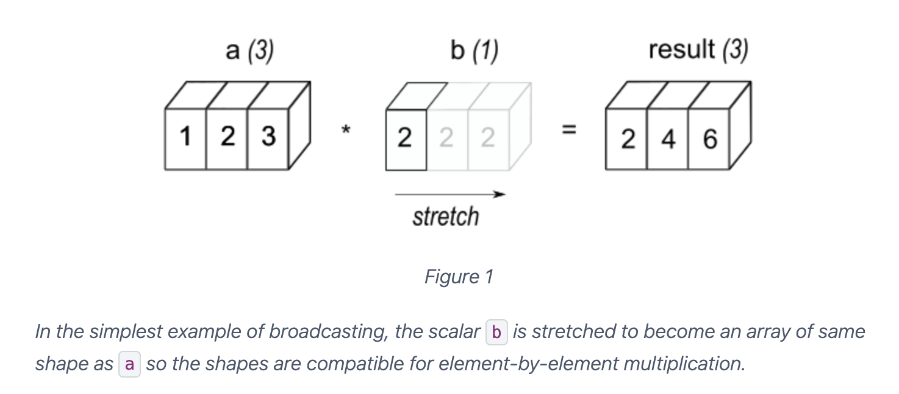
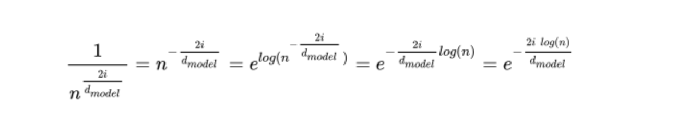

## 📋 Table of Contents

1. [References](#references)
2. [Code Explanation with Example](#code-explanation-with-example)
   - [Step 0: Input embeddings](#-step-0-input-embeddings)
   - [Now go inside `__init__`](#-now-go-inside-__init__)
   - [Now forward()](#-now-forward)
   - [Summary of Dimension Changes](#-summary-of-dimension-changes)
   - [Final Big Picture](#-final-big-picture)
3. [Example](#example)
4. [The `log` Intuition (numerical stability)](#the-log-intuition-numerical-stability)
   - [Why we use `log` here](#why-we-use-log-here)
   - [Example of how `log` works](#example-of-how-log-works)
5. [Where `self.pe` came from?](#where-selfpe-line-no-70-came-from)
6. [We Don't Train Positional Encoding in the Original Transformer](#we-dont-train-positional-encoding-in-the-original-transformer)
7. [Does the Paper Mention Dropout for (Embedding + PE)?](#does-the-paper-mention-dropout-for-embedding--pe)
8. [Just to learn for better code understanding](#just-to-learn-for-better-code-understanding)

---

# References:
1. [Positional Encoding with PyTorch Intuition](https://medium.com/@hunter-j-phillips/positional-encoding-7a93db4109e6)

2. [Transformer Architecture: The Positional Encoding - Let's use sinusoidal functions to inject the order of words in our model](https://kazemnejad.com/blog/transformer_architecture_positional_encoding/)

3. [Linear Relationships in the Transformer’s Positional Encoding - Timo Denk's Blog](https://blog.timodenk.com/linear-relationships-in-the-transformers-positional-encoding/) 

4. [Info got from claude](https://claude.ai/share/18405f10-5310-43b4-b385-51f61a93b547)

5. [Broadcasting](https://numpy.org/doc/stable/user/basics.broadcasting.html)


# Code Explanation with Example:

let’s go **very carefully, line by line**, and track:

* Shape
* Why dimension increases/decreases
* What each line mathematically does

We’ll use one sentence:

> **"I love AI"**

Assume:

```
batch_size = 1
seq_len = 3
d_model = 4   (must be even)
max_len = 5   (small just for demonstration)
```

---

## 🔹 Step 0: Input embeddings

From `nn.Embedding`, suppose we get:

```
x.shape = (1, 3, 4)
```

Meaning:

```
(batch_size, seq_len, d_model)
```

Example:

```
x =
[
  [
    [0.1, 0.2, 0.3, 0.4],   # I
    [0.5, 0.6, 0.7, 0.8],   # love
    [0.9, 1.0, 1.1, 1.2]    # AI
  ]
]
```

---

## 🔹 Now go inside `__init__`

---

### 1️⃣

```python
super().__init__()
```

Initializes `nn.Module`.

No shape change.

---

### 2️⃣

```python
assert d_model % 2 == 0
```

Why?

Because:

```
even indices → sin
odd indices  → cos
```

We need pairs like:

```
(dim0 sin, dim1 cos)
(dim2 sin, dim3 cos)
```

---

### 3️⃣

```python
self.dropout = nn.Dropout(p=dropout)
```

No shape change.
Just stores dropout layer.

---

### 4️⃣

```python
pe = torch.zeros(max_len, d_model)
```

Shape:

```
(5, 4)
```

Why 2D?

Because we want:

```
(position, embedding_dimension)
```

So:

```
row → position
column → embedding dimension
```

Currently:

```
pe =
[
 [0,0,0,0],   # position 0
 [0,0,0,0],   # position 1
 [0,0,0,0],   # position 2
 [0,0,0,0],   # position 3
 [0,0,0,0],   # position 4
]
```

---

### 5️⃣

```python
position = torch.arange(0, max_len).unsqueeze(1)
```

Before unsqueeze:

```
[0,1,2,3,4]
shape = (5,)
```

After:

```
[[0],
 [1],
 [2],
 [3],
 [4]]

shape = (5,1)
```

#### ❓ Why `unsqueeze(1)`?

We add one dimension so that broadcasting works with `div_term`.

We want:

```
position.shape = (5,1)
div_term.shape = (2,)
```

So multiplication becomes:

```
(5,1) * (2,) → (5,2)
```

Without unsqueeze → broadcasting would fail.

---

### 6️⃣

```python
div_term = torch.exp(
    torch.arange(0, d_model, 2).float()
    * (-math.log(10000.0) / d_model)
)
```

Step-by-step:

```
torch.arange(0, 4, 2)
→ [0, 2]
```

Shape:

```
(2,)
```

Why step 2?

Because:

```
we fill even indices only (0,2)
```

Now compute:

For d_model=4:

```
div_term = [1.0, 0.01]
```

Shape:

```
(2,)
```

---

### 7️⃣

```python
pe[:, 0::2] = torch.sin(position * div_term)
```

Break it:

#### `position * div_term`

```
position.shape = (5,1)
div_term.shape = (2,)
```

Broadcast result:

```
(5,2)
```

Example first 3 rows:

```
[
 [0*1,   0*0.01],
 [1*1,   1*0.01],
 [2*1,   2*0.01],
]
```

Apply sin → still shape `(5,2)`

Now:

```
pe[:, 0::2]
```

What is `0::2`?

Take columns:

```
0, 2
```

So shape:

```
(5,2)
```

Perfect match.

---

### 8️⃣

```python
pe[:, 1::2] = torch.cos(position * div_term)
```

`1::2` means:

```
columns 1 and 3
```

Shape:

```
(5,2)
```

Cos output shape:

```
(5,2)
```

Still consistent.

Now pe becomes:

```
[
 [0.00, 1.00, 0.00, 1.00],
 [0.84, 0.54, 0.01, 0.99],
 [0.91,-0.41, 0.02, 0.99],
 ...
]
```

Shape:

```
(5,4)
```

---

### 9️⃣

```python
pe = pe.unsqueeze(0)
```

Before:

```
(5,4)
```

After:

```
(1,5,4)
```

#### ❓ Why add dimension?

Because input `x` is:

```
(batch_size, seq_len, d_model)
```

So we want positional encoding to also have batch dimension:

```
(1, max_len, d_model)
```

Then broadcasting works when adding to:

```
(1, 3, 4)
```

---

### 🔟

```python
self.register_buffer("pe", pe)
```

Why buffer?

Because:

* Not trainable
* Saved in `state_dict`
* Moves to GPU automatically

No shape change.

---

## 🔹 Now forward()

---

### 1️⃣

```python
x = x + self.pe[:, :x.size(1)]
```

Recall:

```
x.shape = (1,3,4)
self.pe.shape = (1,5,4)
```

We slice:

```
self.pe[:, :3]
```

New shape:

```
(1,3,4)
```

Now shapes match:

```
(1,3,4) + (1,3,4)
```

Elementwise addition.

No dimension change.

---

### 2️⃣

```python
return self.dropout(x)
```

Dropout:

* Keeps same shape
* Randomly zeros elements (training only)

Output shape:

```
(1,3,4)
```

---

## 🔥 Summary of Dimension Changes

| Line         | Shape   | Why changed?                  |
| ------------ | ------- | ----------------------------- |
| zeros        | (5,4)   | create (position, dim)        |
| arange       | (5,)    | 1D vector                     |
| unsqueeze    | (5,1)   | needed for broadcasting       |
| div_term     | (2,)    | half dims (even indices only) |
| sin result   | (5,2)   | broadcast multiply            |
| unsqueeze(0) | (1,5,4) | add batch dimension           |
| slice        | (1,3,4) | match input seq_len           |

---

## 🧠 Final Big Picture

Embedding gives:

```
"What word is this?"
```

Positional Encoding gives:

```
"Where is this word?"
```

Added together:

```
Word meaning + position meaning
```


# Example
Below is **one concrete sentence** and a **full line-by-line walkthrough** of what your `PositionalEncoding` does, with **real shapes and numbers** (small `d_model` so it’s easy to see).

---

## Example setup

**Sentence:**

> `"I love AI"`

**Tokenized (example):**

```text
["I", "love", "AI"]
```

So:

* `seq_len = 3`
* Assume `batch_size = 1`
* Choose `d_model = 4` (small & even)

---

## Step 1: Input embeddings (from `nn.Embedding`)

Assume your embedding layer outputs this tensor:

```python
x.shape = (1, 3, 4)  # (batch_size, seq_len, d_model)
```

Example values (just illustrative):

```text
x =
[
  [  # batch 0
    [0.10, 0.20, 0.30, 0.40],   # "I"
    [0.50, 0.60, 0.70, 0.80],   # "love"
    [0.90, 1.00, 1.10, 1.20]    # "AI"
  ]
]
```

---

## Step 2: Inside `__init__` – create positional encodings

### Line

```python
pe = torch.zeros(max_len, d_model)
```

Creates:

```text
pe.shape = (5000, 4)
```

---

### Line

```python
position = torch.arange(0, max_len).unsqueeze(1)
```

For first few positions:

```text
position =
[
 [0],
 [1],
 [2],
 ...
]
```

Shape:

```text
(5000, 1)
```

---

### Line

```python
div_term = exp(arange(0, d_model, 2) * (-log(10000) / d_model))
```

For `d_model = 4`:

```python
arange(0, 4, 2) = [0, 2]
```

So:

```text
div_term =
[
  10000^(-0/4) = 1.0,
  10000^(-2/4) = 10000^(-0.5) ≈ 0.01
]
```

---

### Line

```python
pe[:, 0::2] = sin(position * div_term)
```

Even indices → **sine**

For first 3 positions:

| position | sin(pos * 1.0) | sin(pos * 0.01) |
| -------- | -------------- | --------------- |
| 0        | 0.0000         | 0.0000          |
| 1        | 0.8415         | 0.0100          |
| 2        | 0.9093         | 0.0200          |

---

### Line

```python
pe[:, 1::2] = cos(position * div_term)
```

Odd indices → **cosine**

| position | cos(pos * 1.0) | cos(pos * 0.01) |
| -------- | -------------- | --------------- |
| 0        | 1.0000         | 1.0000          |
| 1        | 0.5403         | 0.9999          |
| 2        | -0.4161        | 0.9998          |

---

### Final positional encodings (first 3 positions)

```text
pe =
[
 [ 0.0000,  1.0000, 0.0000, 1.0000 ],  # position 0
 [ 0.8415,  0.5403, 0.0100, 0.9999 ],  # position 1
 [ 0.9093, -0.4161, 0.0200, 0.9998 ]   # position 2
]
```

---

### Line

```python
pe = pe.unsqueeze(0)
```

Adds batch dimension:

```text
pe.shape = (1, 5000, 4)
```

---

### Line

```python
self.register_buffer("pe", pe)
```

✔ Stored with model
✔ Not trainable
✔ Moves with `.to(device)`

---

## Step 3: `forward()` – add positional info

### Line

```python
x = x + self.pe[:, :x.size(1)]
```

Slice positional encodings:

```text
self.pe[:, :3] → shape (1, 3, 4)
```

Add **element-wise**:

### Token 1: `"I"` (position 0)

```text
[0.10, 0.20, 0.30, 0.40]
+
[0.00, 1.00, 0.00, 1.00]
=
[0.10, 1.20, 0.30, 1.40]
```

### Token 2: `"love"` (position 1)

```text
[0.50, 0.60, 0.70, 0.80]
+
[0.84, 0.54, 0.01, 1.00]
=
[1.34, 1.14, 0.71, 1.80]
```

### Token 3: `"AI"` (position 2)

```text
[0.90, 1.00, 1.10, 1.20]
+
[0.91, -0.42, 0.02, 1.00]
=
[1.81, 0.58, 1.12, 2.20]
```

---

### Line

```python
return self.dropout(x)
```

Randomly zeros some values **during training only**.

---

## Final intuition (one line)

> **Word embeddings tell *what* the word is, positional encoding tells *where* the word is in the sentence — and the Transformer needs both.**

---


# The `log` intuition (numerical stability):

before going into there let's check some `log` of `math` library of `python`:

```python
import math
# The natural logarithm of 'e' is 1
ln_e = math.log(math.e)
print(f"The natural logarithm of e is: {ln_e}\n")

# Calculate the natural logarithm (ln) of a number
x = 10
e_ln_x = math.e**(math.log(x))
print(f"The natural logarithm of e to the power ln({x}) is: {e_ln_x}")
```

**output:**
```txt
The natural logarithm of e is: 1.0

The natural logarithm of e to the power ln(10) is: 10.000000000000002
```

> so `math` library uses **$\log_e $** or **$\ln $**; not **$\log_{10} $**

---

## Why we use `log` here?:

### Short answer (direct)

**`log` is not used to change the result.**
It’s used because **computers can’t safely compute powers like `10000**x` at scale**.

---

### Why `log` is needed even though math is the same

#### 1️⃣ Numerical stability (main reason)

Computers use **finite-precision floats**.

If you do:

```python
10000 ** (2i / d_model)
```

* for larger `i`, intermediate values become **very large**
* GPU float32 can overflow → `inf`
* small values can underflow → `0`

Using:

```python
exp(-log(10000) * x)
```

keeps numbers in a **safe range** throughout computation.

---

#### 2️⃣ Gradual scaling (no sudden jumps)

Exponential with log:

```text
log → multiply → exp
```

gives **smooth, monotonic scaling** of frequencies across dimensions.

Direct power ops often introduce **precision loss** for fractional exponents.

---

#### 3️⃣ Industry standard for exponentials

Every deep-learning library internally prefers:

$$
a^b = e^{b \ln a}
$$

We use same logic here:
<div align="center">



*Source: [Medium Blog](https://medium.com/@hunter-j-phillips/positional-encoding-7a93db4109e6)*

</div>

**here, `log` means `ln`.*

because:

* more stable on GPUs
* consistent across hardware
* better behaved for gradients (even though PE has no gradients)

---

### Is it faster?

🔸 **Speed is not the main reason**
🔸 Stability and correctness are

In practice:

* `exp + mul` is often **as fast or faster** than `pow`
* especially on GPUs

---

### Final one-liner (take this with you)

> `log` is used not to change the math, but to compute the **same value safely and reliably** on real hardware.

## Example of how `log` works:

### Goal

Compute:

$$
\frac{1}{10000^{0.75}}
$$

---

### ❌ Direct power (unstable in practice)

```python
10000 ** 0.75
```

Math value:

$$
10000^{0.75} = (10^4)^{0.75} = 10^3 = 1000
$$

Looks fine **for this case**, but for larger `d_model`, you’ll get exponents like `0.99`, `1.5`, etc.
On GPU / float32, repeated power ops → **overflow / precision loss**.

---

### ✅ Log–exp version (stable)

Use identity:
$$
a^b = e^{b \log a}
$$

So:
$$
\frac{1}{10000^{0.75}}
= e^{-0.75 \log(10000)}
$$

Code:

```python
import math
math.exp(-0.75 * math.log(10000))
```

Intermediate values:

```
log(10000) = 9.21
-0.75 * 9.21 = -6.91
exp(-6.91) ≈ 0.001
```

Stable numbers throughout. No large powers.

---

### Direct equivalence (this is the key)

$$
10000^{-0.75}
= \frac{1}{10000^{0.75}}
= \frac{1}{1000}
= 0.001
$$

And by definition:

$$
10000^{-0.75} = e^{-0.75 \ln(10000)}
$$

---

### Why this matters (one sentence)

> **`log` keeps numbers small during computation, preventing overflow while producing the same mathematical result.**

---

# Where `self.pe` (line no. 70) came from?:

`self.pe` comes from **`register_buffer`**. Let explain how it works:

## What `register_buffer` Does

```python
self.register_buffer('pe', pe)
```

This line **creates an attribute** called `self.pe` and assigns the tensor `pe` to it.

**It's equivalent to:**
```python
self.pe = pe  # But with special properties!
```

---

## How It Works Step-by-Step

```python
def __init__(self, d_model: int, dropout: float = 0.1, max_len: int = 5000):
    super().__init__()
    
    # Step 1: Create a local variable 'pe'
    pe = torch.zeros(max_len, d_model)
    
    # ... compute positional encodings ...
    
    pe = pe.unsqueeze(0)  # Shape: (1, max_len, d_model)
    
    # Step 2: Register it as a buffer named 'pe'
    #         This creates self.pe and assigns the tensor to it
    self.register_buffer('pe', pe)
    #                     ↑     ↑
    #                  name   tensor
    
    # Now self.pe exists and holds the tensor!
```

---

## Why Use `register_buffer` Instead of `self.pe = pe`?

| Method | Trainable? | Saved in state_dict? | Moves with .to(device)? |
|--------|------------|---------------------|------------------------|
| `self.pe = pe` | ❌ No | ❌ No | ❌ No |
| `nn.Parameter(pe)` | ✅ Yes | ✅ Yes | ✅ Yes |
| `register_buffer('pe', pe)` | ❌ No | ✅ Yes | ✅ Yes |

**Use `register_buffer` when you want:**
- Tensor to be **part of the model** (saved/loaded)
- Tensor to **move to GPU/CPU** with the model
- But **NOT be trainable** (no gradients)

---

## Example Usage

```python
# Create model
model = PositionalEncoding(d_model=512)

# Access self.pe
print(model.pe.shape)  # torch.Size([1, 5000, 512])

# Move model to GPU
model = model.to('cuda')

# self.pe automatically moves to GPU!
print(model.pe.device)  # cuda:0
```

---

## Visual Flow

```
__init__:
  ┌─────────────────────────────────────┐
  │ Local variable:                     │
  │ pe = torch.zeros(5000, 512)         │
  │                                     │
  │ register_buffer('pe', pe)           │
  │         ↓                           │
  │ Creates: self.pe = pe               │
  └─────────────────────────────────────┘

forward:
  ┌─────────────────────────────────────┐
  │ Can now access:                     │
  │ x = x + self.pe[:, :x.size(1)]      │
  │              ↑                      │
  │         Attribute created by        │
  │         register_buffer             │
  └─────────────────────────────────────┘
```

---

## Key Takeaway

**`register_buffer('pe', pe)` creates `self.pe`** — it's just a special way to register a tensor as a non-trainable part of the model!


# We Don't Train `Positional Encoding` in the Original Transformer

From the paper (Section 3.5):

> "We chose the sinusoidal version because it may allow the model to extrapolate to sequence lengths longer than the ones encountered during training."

---

## Two Approaches to Positional Encoding

### 1. **Fixed Sinusoidal** (What the Paper Uses) ❄️

```python
# Not trainable - computed once, fixed forever
self.register_buffer('pe', pe)
```

**Advantages:**
- ✅ Works for **any sequence length** (extrapolation)
- ✅ No extra parameters to learn
- ✅ Mathematically elegant (relative positions have patterns)
- ✅ No risk of overfitting to training sequence lengths

**How it works:**
The sine/cosine functions have inherent properties that encode relative positions, so the model can learn to use them without training.

---

### 2. **Learnable Positional Embeddings** (Alternative) 🔥

```python
# Trainable version (like BERT uses)
self.pos_embedding = nn.Parameter(torch.randn(1, max_len, d_model))
```

**Advantages:**
- ✅ Can learn task-specific position patterns
- ✅ Sometimes performs slightly better on fixed-length tasks

**Disadvantages:**
- ❌ Can't handle sequences longer than `max_len` seen in training
- ❌ Adds parameters (e.g., 5000 × 512 = 2.56M extra parameters)

---

## Why Fixed Works

The key insight: **The model learns to use the positional information, not the positional encoding itself.**

Think of it like:
- The positional encoding provides a **"coordinate system"**
- The attention layers **learn to read those coordinates**

Just like you don't need to train the x-axis on a graph — you train the model to interpret it!

---

## Real-World Usage

| Model | Positional Encoding Type |
|-------|-------------------------|
| **Transformer (original)** | Fixed sinusoidal |
| **BERT** | Learnable |
| **GPT-2/GPT-3** | Learnable |
| **T5** | Relative learned |
| **RoFormer** | Rotary (fixed) |

Both approaches work! The original paper chose fixed sinusoidal for its mathematical elegance and extrapolation properties.

---

## Key Takeaway

**Fixed sinusoidal encoding works because:**
1. It provides unique, consistent position information
2. The rest of the model (attention, FFN) **learns to use** that information
3. No training needed — the sine/cosine patterns are already meaningful

It's like giving the model a ruler — you don't need to train the ruler, just train the model to read it! 📏

---

# Does the Paper Mention Dropout for `(Embedding + PE)`?

**Yes!** From Section 5.4 (Regularization):

> "We apply dropout to the output of each sub-layer, before it is added to the sub-layer input and normalized. **In addition, we apply dropout to the sums of the embeddings and the positional encodings** in both the encoder and decoder stacks. For the base model, we use a rate of **$P_{drop} = 0.1$**"

So `dropout` **is explicitly mentioned** for positional encodings! And its value is `0.1` for the `base model` of the `transformer`.

---

# Just to learn for better `code understanding`:

## 1️⃣
```python
a = [1,2,3,4,5,6,7,8]
print(a[0::2])
print(a[1::2])
print(a[::-1])
```
**output:**
```txt
[1, 3, 5, 7]
[2, 4, 6, 8]
[8, 7, 6, 5, 4, 3, 2, 1]
```

## 2️⃣ 
```python
import torch
d_model = 4
n = 100
i_2 = torch.arange(0, d_model, 2)
div_term = torch.exp(i_2 * -(math.log(n) / d_model))
print(i_2)
print(f"{i_2} * {-math.log(n)} / {d_model} = {i_2 * -(math.log(n) / d_model)}")
print(div_term)
print(div_term.shape)
```
**output:**
```txt
tensor([0, 2])
tensor([0, 2]) * -4.605170185988092 / 4 = tensor([-0.0000, -2.3026])
tensor([1.0000, 0.1000])
torch.Size([2])
```

## 3️⃣
```python
a = torch.tensor([1,2,3,4])
b = torch.tensor([2,2,2])
print(f"shape of a: {a.shape}\n")
print(f"shape of b: {b.shape}\n")
try:
    print(a*b)
except Exception as e:
    # Catches any other potential exceptions
    print(f"An unexpected error occurred: {e}\n")

a_1 = torch.unsqueeze(a, dim=1)
print(a_1)
print(f"shape of a: {a_1.shape}\n")
print(a_1*b)
print(f"shape of a*b: {(a_1*b).shape}")

a_0 = torch.unsqueeze(a, dim=0)
print(a_0)
print(f"shape of a: {a_0.shape}\n")
try:
    print(a_0*b)
    print(f"shape of a*b: {(a_0*b).shape}")
except Exception as e:
    # Catches any other potential exceptions
    print(f"An unexpected error occurred: {e}\n")
```

**output:**
```txt
shape of a: torch.Size([4])

shape of b: torch.Size([3])

An unexpected error occurred: The size of tensor a (4) must match the size of tensor b (3) at non-singleton dimension 0

tensor([[1],
        [2],
        [3],
        [4]])
shape of a: torch.Size([4, 1])

tensor([[2, 2, 2],
        [4, 4, 4],
        [6, 6, 6],
        [8, 8, 8]])
shape of a*b: torch.Size([4, 3])
tensor([[1, 2, 3, 4]])
shape of a: torch.Size([1, 4])

An unexpected error occurred: The size of tensor a (4) must match the size of tensor b (3) at non-singleton dimension 1
```
