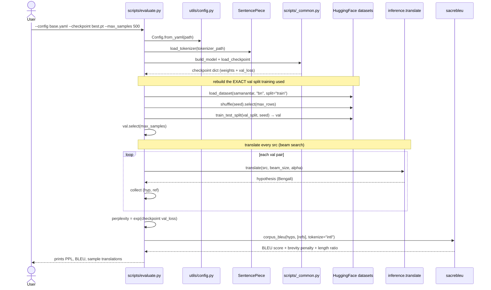

## Table of Contents

1. [Overview — What `evaluate.py` Owns](#overview--what-evaluatepy-owns)
2. [Flow Diagram — Translate the Val Set, Then Score It](#flow-diagram--translate-the-val-set-then-score-it)
3. [Two Metrics, Two Questions](#two-metrics-two-questions)
4. [BLEU — The Concept](#bleu--the-concept)
   - [Why "Understudy"](#why-understudy)
   - [Clipped Precision](#clipped-precision)
   - [n-gram Precision (1-gram → 4-gram)](#n-gram-precision-1-gram--4-gram)
   - [Geometric Mean of the Precisions](#geometric-mean-of-the-precisions)
   - [Brevity Penalty](#brevity-penalty)
   - [Putting It Together](#putting-it-together)
   - [BLEU Is Corpus-Level, Not Sentence-Level](#bleu-is-corpus-level-not-sentence-level)
5. [BLEU in the Code — sacreBLEU and the `intl` Tokenizer](#bleu-in-the-code--sacrebleu-and-the-intl-tokenizer)
6. [Perplexity — The Concept and the Code](#perplexity--the-concept-and-the-code)
7. [Mirroring `train.py`'s Val Split Exactly](#mirroring-trainpys-val-split-exactly)
8. [Why `--max_samples`](#why---max_samples)
9. [Results From This Project](#results-from-this-project)
10. [Strengths and Weaknesses of BLEU](#strengths-and-weaknesses-of-bleu)
11. [CLI — Commands](#cli--commands)
12. [References](#references)

---

# Overview — What `evaluate.py` Owns

Training tells you the **loss**; it does not tell you whether the translations are any *good*. [`scripts/evaluate.py`](../../scripts/evaluate.py) owns the answer: it turns a trained checkpoint into two numbers — **BLEU** (are the translations correct?) and **perplexity** (how surprised is the model by the truth?).

It is deliberately thin — it reuses the exact same `translate()` from [`inference.py`](inference.md), just in bulk:

```
evaluate.py                          ← scoring orchestration (this doc)
  │
  ├── Config.from_yaml(...)          ← typed config (utils/config.py)
  ├── load_tokenizer(...)            ← SentencePiece processor (utils/data_utils.py)
  ├── build_model / load_checkpoint  ← model + weights (scripts/_common.py)
  ├── load_dataset(...)              ← same val split as training (HuggingFace)
  │
  ├── translate(...)                 ← beam search, looped over every val pair (inference.py)
  ├── exp(val_loss)                  ← perplexity (intrinsic)
  └── sacrebleu.corpus_bleu(...)     ← BLEU (extrinsic)
```

The one rule it must get right: **evaluate on the same data the model was *validated* on, never the data it trained on.** Scoring on training pairs would measure memorization, not translation. The val-split mirroring (below) is what guarantees this.

---

# Flow Diagram — Translate the Val Set, Then Score It

One `python -m transformer.scripts.evaluate` invocation:



The shape to notice: **perplexity is free** (it's just `exp` of a number already in the checkpoint), while **BLEU is expensive** — it runs full beam search on every val pair. That asymmetry is why `--max_samples` exists.

> *If your VS Code preview shows raw mermaid source, native rendering ships in VS Code 1.121+ — just reload the window.*

---

# Two Metrics, Two Questions

| Metric | Type | Question it answers | Higher is… | Computed from |
|---|---|---|---|---|
| **Perplexity** | *Intrinsic* | "How surprised is the model by the true next token?" | worse | the model's own probabilities (`exp(val_loss)`) |
| **BLEU** | *Extrinsic* | "Do the generated translations match human references?" | better | the model's *outputs* vs reference text |

They can disagree, and the paper *expects* them to: label smoothing **hurts perplexity but improves BLEU** (Section 5.4). A model can be "confidently wrong" (low perplexity, bad BLEU) or "uncertain but right" — so reporting both is the honest choice.

---

# BLEU — The Concept

**BLEU = Bilingual Evaluation Understudy.** It scores a machine translation by measuring how much its n-grams overlap with one or more human reference translations.

## Why "Understudy"

The name borrows a theatre term. An **understudy** is an actor who learns another performer's role and can step in at a moment's notice. BLEU is an *understudy for a human judge*: a cheap, automatic stand-in for the expensive, slow process of having bilingual humans rate every translation. It is not as good as the real thing — but it is always available and instant.

## Clipped Precision

Plain precision (fraction of predicted words that appear in the reference) is trivially gamed by repetition. BLEU fixes this with **clipped precision**: each predicted word can only be counted *as many times as it appears in the reference*.

Worked example:

```
Reference 1:  He eats a sweet apple
Reference 2:  He is eating a tasty apple
Predicted:    He He He eats tasty fruit
```

- The model predicts `He` three times. But `He` appears **once** in the reference, so it counts **once**, not three times → the rest are *clipped*.
- Matching words: `He` (1, clipped), `eats` (1), `tasty` (1) = **3** correct.
- Total predicted words = **6**.

```
Clipped Precision = clipped correct predictions / total predictions = 3 / 6
```

Without clipping, the three `He`s would inflate the score — exactly the gaming BLEU is built to stop.

## n-gram Precision (1-gram → 4-gram)

BLEU doesn't just count single words; it counts n-grams up to length 4, so word *order* matters somewhat. Example:

```
Reference:  The guard arrived late because it was raining
Predicted:  The guard arrived late because of the rain
```

Computing clipped precision at each n-gram length:

| n | Matching n-grams | Precision `pₙ` |
|---|---|---|
| 1-gram | `The`, `guard`, `arrived`, `late`, `because` | **5 / 8** |
| 2-gram | `The guard`, `guard arrived`, `arrived late`, `late because` | **4 / 7** |
| 3-gram | `The guard arrived`, `guard arrived late`, `arrived late because` | **3 / 6** |
| 4-gram | `The guard arrived late`, `guard arrived late because` | **2 / 5** |

Higher-order n-grams (3, 4) reward getting whole phrases right, which is why a fluent translation scores far above a bag-of-correct-words one.

## Geometric Mean of the Precisions

The four precisions are combined with a **weighted geometric mean** (not an arithmetic one — the geometric mean punishes any single `pₙ` being near zero, so you can't ace unigrams and ignore phrase structure). With `N = 4` and uniform weights `wₙ = 1/4`:

```
geometric_mean = exp( Σₙ wₙ · log(pₙ) )       for n = 1..N
```

That `exp(Σ w·log p)` form *is* the geometric mean — here's why, step by step:

```
Step 1 — log-power rule:   wₙ·log(pₙ) = log(pₙ^wₙ)
Step 2 — sum of logs:      Σ log(pₙ^wₙ) = log( Π pₙ^wₙ )
Step 3 — exp cancels log:  exp( log( Π pₙ^wₙ ) ) = Π pₙ^wₙ

⇒  exp( Σ wₙ·log pₙ )  =  Π pₙ^wₙ        (the weighted geometric product)
```

The code never writes this out — sacreBLEU does it internally — but it's why a single zero n-gram precision drags the whole score to ~0 (a real failure mode for short or very wrong outputs).

## Brevity Penalty

Precision alone rewards being *short*: output just `"The"` and 1-gram precision is `1/1 = 1`. To stop that, BLEU multiplies by a **Brevity Penalty (BP)**:

```
BP = 1                     if  c > r
BP = exp(1 − r/c)          if  c ≤ r
```

where `c` = total length of the predicted (candidate) corpus and `r` = total reference length. The ratio reported by sacreBLEU is **c/r**; the penalty depends on its inverse **r/c**.

- If the output is **longer** than the reference, `BP = 1` (no reward for padding — the n-gram precision already drops).
- If the output is **shorter**, `BP < 1` shrinks the score, hard. This is the term our under-trained model gets punished by: it stops too early (premature `<eos>`), so `c ≪ r`, so BP crushes the BLEU. (See [`inference.md` → Tuning α](inference.md#tuning--a-real-finding-from-this-project).)

**BP is a multiplier, so it's easy to read as a percentage.** Final BLEU = `BP × (n-gram precision part)`. So a `BP` of `0.155` means you *keep* 15.5% of the score and **lose `(1 − 0.155) = ~85%`** of it. The rule of thumb: **score knocked off = `(1 − BP) × 100%`**.

### Worked En→Bn example

```
English:    "He was later admitted to the hospital."
Reference:  পরে তাঁকে হাসপাতালে ভর্তি করা হয়।        → r = 7 tokens
```

**Hypothesis A — model stops too early (premature `<eos>`):**
```
পরে তাঁকে।                                            → c = 3 tokens
BP = exp(1 − 7/3) = exp(−1.33) = 0.264               → ~74% knocked off
```
Even if all three words are **correct** (perfect precision), the final BLEU is multiplied by `0.264` — the brevity penalty alone cuts ~74% of the score, purely for being short.

**Hypothesis B — full-length output (higher α lets it run longer):**
```
পরে তাঁকে হাসপাতালে ভর্তি করা হয়।                    → c = 7 tokens
BP = exp(1 − 7/7) = exp(0) = 1.0                      → no penalty
```

Same model, same vocabulary — the only difference is length, and BP alone swings the score ~4×.

**Short outputs get punished twice.** A 3-token hypothesis has **no 4-grams at all**, so `p₄ = 0`, which collapses the geometric mean toward zero *before* BP even applies. Premature-`<eos>` outputs lose on both the precision side (missing high-order n-grams) and the BP side (length) — which is why they score near zero.

## Putting It Together

```
BLEU = BP · exp( Σₙ wₙ · log pₙ )
```

BLEU-N refers to the highest n-gram used: BLEU-1 is unigram precision only; BLEU-4 (the standard, and what sacreBLEU reports by default) is the geometric mean of 1- through 4-gram precision, times the brevity penalty.

## BLEU Is Corpus-Level, Not Sentence-Level

A critical, often-missed point: **BLEU is computed over the whole corpus at once**, not per sentence and then averaged. The n-gram match counts and the lengths `c` and `r` are summed across *all* sentences before the formula is applied. You cannot score each sentence separately and average — that gives a different (and wrong) number. This is exactly why the code calls `corpus_bleu(...)` over the full list of hypotheses, not `sentence_bleu` in a loop.

---

# BLEU in the Code — sacreBLEU and the `intl` Tokenizer

The whole concept above collapses to two lines, because [`sacrebleu`](https://github.com/mjpost/sacrebleu) implements it:

```python
# evaluate.py:115
bleu = sacrebleu.corpus_bleu(hypotheses, [references], tokenize="intl")
```

Three details that matter:

**1. Why sacreBLEU and not a hand-rolled BLEU.** Raw BLEU is *not* reproducible across papers — the score depends on hidden preprocessing (tokenization, lowercasing, normalization). Two groups reporting "BLEU 30" can be using different tokenizers and not be comparable at all. sacreBLEU (Post, 2018) fixes a **standard tokenization** so scores are comparable across papers; it's the field default for exactly this reason.

**2. Why `tokenize="intl"` and not the default `13a`.** The default `13a` tokenizer is built for European, whitespace-delimited languages. **Bengali** is a Brahmic script with its own punctuation (the danda `।`) and no Latin word boundaries — `13a` under-segments it, inflating or distorting the score. The `intl` (International) tokenizer applies Unicode-aware segmentation that handles non-Latin scripts properly. For an English→Bengali system this single flag meaningfully changes the number — picking it is a correctness decision, not a cosmetic one.

**3. It's BLEU-4 — the N=4 default, not something we hard-coded.** `corpus_bleu(...)` takes no `max_ngram_order` argument, so it falls back to sacreBLEU's default of **4** — the geometric mean of 1- through 4-gram precision (which is exactly why the [n-gram precision](#n-gram-precision-1-gram--4-gram) and [geometric mean](#geometric-mean-of-the-precisions) sections above stop at 4). This isn't arbitrary: "BLEU" with no number *means* BLEU-4 by convention (Papineni et al., 2002), so reporting it keeps our score comparable to every other paper. You *can* go higher —

```python
from sacrebleu import BLEU
bleu = BLEU(max_ngram_order=6, tokenize="intl")   # BLEU-6
```

— but you generally shouldn't: 5- and 6-gram *exact* matches are so rare that `p₅`/`p₆` are usually 0, which collapses the geometric mean to ~0 for almost any system, *and* it breaks comparability since nobody else reports BLEU-6. N=4 is the sweet spot — high enough to reward phrase-level word order, low enough that the n-grams still match often enough to be informative.

The references are wrapped in a one-element outer list — `[references]` — because sacreBLEU supports *multiple* reference translations per hypothesis (`[[ref1_a, ref2_a, ...], [ref1_b, ...]]`). We have exactly one reference per source, so it's a single inner list.

The printed `bleu.bp`, `bleu.sys_len`, and `bleu.ref_len` ([evaluate.py:118-119](../../scripts/evaluate.py#L118-L119)) expose the brevity penalty and the `c / r` length ratio directly — so a low BLEU caused by *short output* (BP) is visibly distinguishable from one caused by *wrong words* (low precision).

---

# Perplexity — The Concept and the Code

**Perplexity (PPL) is the exponential of the cross-entropy loss.** Intuitively, it's the model's average "branching factor" — *how many equally-likely options the model thinks it's choosing between at each token*. PPL = 10 means the model is, on average, as confused as if it were picking uniformly among 10 tokens. Lower is better; a perfect model has PPL = 1.

```
PPL = exp(cross_entropy_per_token)
```

In the code, it's one line — and it's read from the checkpoint, not recomputed:

```python
# evaluate.py:107
ppl = float(torch.exp(torch.tensor(ckpt["val_loss"])))
```

Three things to understand here:

1. **Why `exp(val_loss)` works directly.** The training loss *is* mean per-token cross-entropy (in nats), so exponentiating it gives perplexity by definition. No separate forward pass needed.
2. **Why it's more stable than the BLEU here.** `val_loss` was computed over the **full** validation set during training, while BLEU only covers `--max_samples` pairs (beam search is too slow for all 50K). So the PPL is the more statistically stable of the two numbers.
3. **Label smoothing inflates it on purpose.** With label smoothing (ε = 0.1), the model is trained to *never* put full probability on the correct token — so its cross-entropy (and thus PPL) is structurally higher than an unsmoothed model's, even when it translates better. This is the paper's explicit tradeoff: *"hurts perplexity, improves BLEU."* A PPL of ~400 here looks alarming but is partly this smoothing, partly genuine under-training — see the code comment at [evaluate.py:102-106](../../scripts/evaluate.py#L102-L106).

---

# Mirroring `train.py`'s Val Split Exactly

The single most important correctness property of this script: it must score the **same validation pairs** the model never trained on. It guarantees this by reproducing `train.py`'s data pipeline *deterministically*:

```python
# evaluate.py:64-74
raw_dataset = load_dataset(path=config.data.dataset, name=config.data.tgt_lang, split="train")
if config.data.max_rows is not None:
    raw_dataset = raw_dataset.shuffle(seed=config.seed).select(
        range(min(config.data.max_rows, len(raw_dataset)))
    )
split = raw_dataset.train_test_split(test_size=config.training.val_split, seed=config.seed)
val_raw = split["test"]
```

The chain of guarantees:

- **Same `seed`** → `shuffle(seed=...)` picks the *same* `max_rows` subset out of the 8.5M-pair corpus.
- **Same `max_rows`** → the same slice is taken before splitting.
- **Same `val_split` + same `seed`** → `train_test_split` carves off the *identical* 10% as validation.

Change any one of those config values and you'd be evaluating on different pairs (possibly pairs the model trained on). This is the data-side mirror of the `data_fingerprint` provenance check described in [`train.md`](train.md) — same idea, enforced by shared config rather than a hash.

---

# Why `--max_samples`

```python
# evaluate.py:77-78
n = min(args.max_samples, len(val_raw))
val_subset = val_raw.select(range(n))
```

BLEU needs an actual translation for every pair, and translation here means **beam search** — the expensive, autoregressive, one-token-at-a-time loop from `inference.py`. The full validation set (~50K pairs) would take *hours*. 500–1000 pairs give a stable enough BLEU estimate for tracking progress, at a fraction of the wall-clock cost.

Note the asymmetry this creates: **perplexity** reflects the full val set (it's from `val_loss`), while **BLEU** reflects only the sampled subset. That's a deliberate, documented tradeoff — the cheap metric is exact, the expensive metric is sampled.

---

# Results From This Project

Measured directly via this script. The decode knobs (`beam_size`, `length_penalty`) are read from the config and change the BLEU substantially — the brevity penalty makes the under-trained model's early-stopping visible:

| Setting | Epochs | BLEU | Length ratio (c/r) | r/c | BP = exp(1 − r/c) | Score knocked off |
|---|---|---|---|---|---|---|
| `beam=2, α=0.6` (paper defaults) | 30 | 0.07 | 0.349 | 2.865 | **≈ 0.155** | ~85% |
| `beam=4, α=1.0` (tuned) | 30 | **0.17** | 0.565 | 1.770 | **≈ 0.463** | ~54% |

Perplexity (from the 30-epoch checkpoint's best `val_loss` ≈ 6.004): **≈ 405**.

The brevity penalty does most of the work here. Going from `α=0.6` to `α=1.0` lengthens the outputs (c/r `0.349 → 0.565`), which raises BP from `0.155` to `0.463` — **roughly a 3× multiplier on the score by itself**, which is most of the BLEU jump from `0.07 → 0.17`. The model isn't translating *better*; it's translating *longer*, so BLEU stops crushing it for brevity. (The rest of the gain is a few more correct n-grams that the longer outputs happen to contain.) This is precisely why α=1.0 is called a *crutch*, not a real improvement.

These are humble numbers — production English↔Bengali systems score BLEU in the 20s–30s. The point was never the score; it was a *correct, from-scratch* pipeline on a 16 GB laptop, with the metrics reported honestly. The α=0.6 → 1.0 jump (BLEU 0.07 → 0.17) is the brevity penalty being beaten by longer outputs — a decode-time crutch for a model that stops too early, explained in full in [`inference.md`](inference.md#tuning--a-real-finding-from-this-project).

---

# Strengths and Weaknesses of BLEU

BLEU is the field standard despite real, well-known flaws. Reporting it honestly means knowing both sides.

**Strengths**

- **Fast and cheap** to compute — no human in the loop.
- **Correlates** reasonably with human judgment at the corpus level.
- **Language-independent** — the same algorithm works for any language pair (with the right tokenizer).
- **Multi-reference** capable — handles several valid translations per source.
- **Ubiquitous** — so your number is comparable to other published work (especially via sacreBLEU).

**Weaknesses**

- **Ignores meaning.** A human accepts `watchman` for `guard`; BLEU counts it wrong (no synonym credit).
- **Exact matches only.** `rain` vs `raining` is a miss, even though it's the same word.
- **No word-importance weighting.** Getting `the` wrong is penalized as heavily as getting the main verb wrong.
- **Weak on word order.** Unigram BLEU scores `"The guard arrived late because of the rain"` and `"The rain arrived late because of the guard"` identically — the higher n-grams help here, but only partially.

These weaknesses are exactly why this project reports BLEU **alongside** perplexity and sample translations, rather than leaning on a single number.

---

# CLI — Commands

All from the repo root inside the `uv` venv.

### Standard evaluation (500 pairs)

```bash
uv run python -m transformer.scripts.evaluate \
    --config transformer/configs/base.yaml \
    --checkpoint transformer/checkpoints/base/run_2026-05-31_18-00-50/best.pt \
    --max_samples 500
```

### Faster smoke check (50 pairs, fewer samples printed)

```bash
uv run python -m transformer.scripts.evaluate \
    --config transformer/configs/base.yaml \
    --checkpoint transformer/checkpoints/base/run_2026-05-31_18-00-50/best.pt \
    --max_samples 50 --show_samples 10
```

Tune `beam_size` / `length_penalty` in [`base.yaml`](../../configs/base.yaml) and re-run — these affect decoding only, so you can sweep them against a fixed checkpoint.

Example output:

```
=== Perplexity (val): 405.00 ===
  (from checkpoint val_loss=6.0037, full val set)

=== BLEU: 0.17 ===
  (0.565 brevity penalty, ratio 3470/6139 = 0.565)
```

---

# References

1. [Papineni et al. 2002, "BLEU: a Method for Automatic Evaluation of Machine Translation"](https://aclanthology.org/P02-1040/) — the original BLEU paper (clipped precision, n-gram geometric mean, brevity penalty).
2. [Post, 2018, "A Call for Clarity in Reporting BLEU Scores" (sacreBLEU)](https://arxiv.org/abs/1804.08771) — why a standardized tokenizer is required for comparable scores.
3. [Ketan Doshi, "Foundations of NLP Explained — BLEU Score and WER Metrics"](https://towardsdatascience.com/foundations-of-nlp-explained-bleu-score-and-wer-metrics-1a5ba06d812b/) — the worked-example walkthrough this doc's BLEU section follows.
4. [Vaswani et al. 2017, "Attention Is All You Need"](https://arxiv.org/abs/1706.03762) — Section 5.4 (label smoothing "hurts perplexity, improves BLEU"), Section 6.1 (beam_size=4, α=0.6).
5. [Jurafsky & Martin, *Speech and Language Processing* (3rd ed.), Ch. 3](https://web.stanford.edu/~jurafsky/slp3/3.pdf) — perplexity as exponentiated cross-entropy / branching factor.
6. [`inference.md`](inference.md) — the `translate()` beam search this script loops over; the α-tuning finding behind the BLEU table.
7. [`train.md`](train.md) — where `val_loss` (and thus perplexity) comes from, and the matching data-provenance design.
