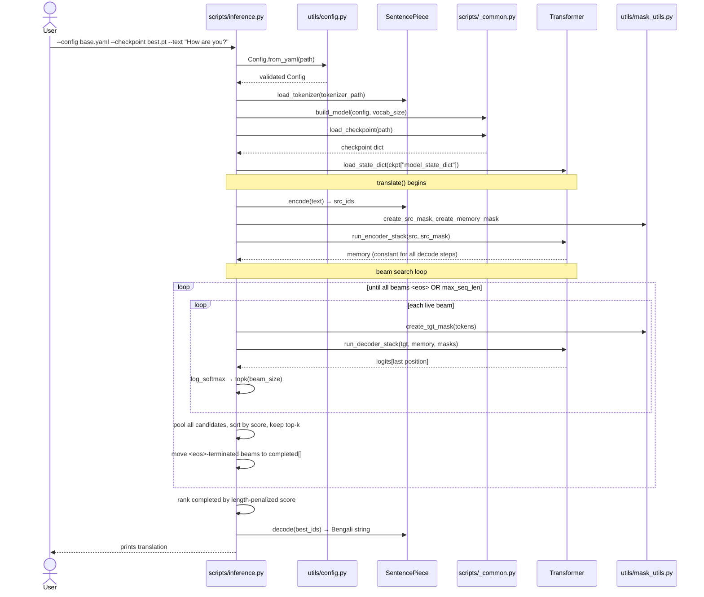
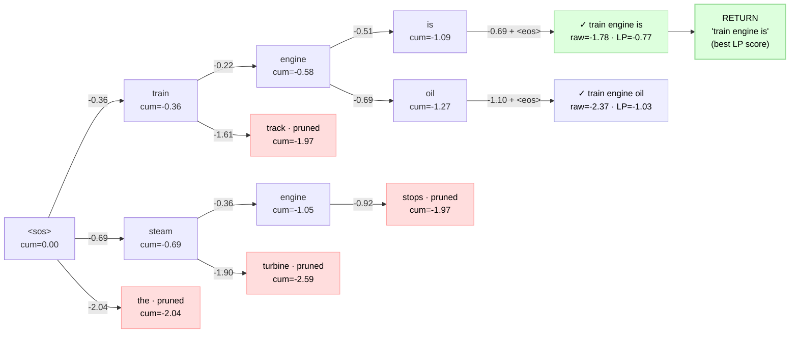

## Table of Contents

1. [Overview — What `inference.py` Owns](#overview--what-inferencepy-owns)
2. [Flow Diagram — Encode Once, Decode in a Loop](#flow-diagram--encode-once-decode-in-a-loop)
3. [Why Encode the Source Only Once](#why-encode-the-source-only-once)
4. [Beam Search — The Algorithm](#beam-search--the-algorithm)
   - [The Diagram](#the-diagram)
   - [Step-by-Step Walkthrough](#step-by-step-walkthrough)
   - [Why Log-Probabilities (Not Raw Probabilities)](#why-log-probabilities-not-raw-probabilities)
   - [Pooled Top-k vs One-Per-Parent](#pooled-top-k-vs-one-per-parent)
   - [Completed vs Live Beams](#completed-vs-live-beams)
   - [The Fallback — When No Beam Emits `<eos>`](#the-fallback--when-no-beam-emits-eos)
5. [Length Penalty — Why Short Sequences Cheat](#length-penalty--why-short-sequences-cheat)
   - [The Math](#the-math)
   - [Tuning α — A Real Finding From This Project](#tuning--a-real-finding-from-this-project)
6. [The Config Knobs — `beam_size` and `length_penalty`](#the-config-knobs--beam_size-and-length_penalty)
7. [Greedy Decoding Is Just `beam_size=1`](#greedy-decoding-is-just-beam_size1)
8. [`main()` — CLI and REPL](#main--cli-and-repl)
9. [Real Outputs From This Session](#real-outputs-from-this-session)
10. [Connection to `evaluate.py` (BLEU)](#connection-to-evaluatepy-bleu)
11. [CLI — Commands Used in This Session](#cli--commands-used-in-this-session)
12. [References](#references)

---

# Overview — What `inference.py` Owns

Training produces weights; **inference turns weights into text**. [`scripts/inference.py`](../../scripts/inference.py) owns exactly one job: given a trained checkpoint and an English string, produce a Bengali string via **beam-search decoding**.

It is deliberately thin. All the heavy machinery already exists elsewhere:

```
inference.py                         ← decoding orchestration (this doc)
  │
  ├── Config.from_yaml(...)          ← typed config (utils/config.py)
  ├── load_tokenizer(...)            ← SentencePiece processor (utils/data_utils.py)
  ├── build_model / load_checkpoint  ← model + weights (scripts/_common.py)
  ├── create_*_mask(...)             ← attention masks (utils/mask_utils.py)
  │
  └── translate(...)                 ← beam search (this file)
        ├── model.run_encoder_stack(...)   ← encode source once
        └── model.run_decoder_stack(...)   ← one decode step per beam, per token
```

The contrast with training: `train_utils.py` runs the model **forward + backward** under teacher forcing (the whole target is known, fed in parallel). Inference has **no target** — it must generate the target one token at a time, feeding each prediction back in. That autoregressive loop is the entire complexity of this file.

---

# Flow Diagram — Encode Once, Decode in a Loop

One `python -m transformer.scripts.inference --text "..."` invocation:



The shape to notice: **the encoder runs once** (single arrow), the **decoder runs many times** (inside two nested loops — once per beam, per token). That asymmetry is the next section.

> *If your VS Code preview shows raw mermaid source, install the **"Markdown Preview Mermaid Support"** extension (publisher: bierner) and reopen the preview.*

---

# Why Encode the Source Only Once

The encoder output — called `memory` — is a function of the **source sentence alone**. It does not depend on what the decoder has generated so far. So it is computed once, before the loop, and reused for every beam at every step:

```python
# inference.py:88-92
src_ids = tokenize(sp, text, max_seq_len)
src = torch.tensor([src_ids], dtype=torch.long, device=device)
src_mask = create_src_mask(src, pad_idx).to(device)
memory_mask = create_memory_mask(src, pad_idx).to(device)
memory = model.run_encoder_stack(src, src_mask)
```

If the encoder were re-run inside the loop, decoding a 30-token output with beam size 2 would re-encode the source ~60 times — pure waste, since the answer is identical every time. The encoder/decoder split in the architecture is precisely what makes this caching legal: cross-attention reads `memory` as a fixed key/value bank.

This is the inference-time payoff of the encoder-decoder design. (A decoder-only model would have no such constant to cache — it re-attends over the growing sequence every step.)

---

# Beam Search — The Algorithm

Greedy decoding takes the single highest-probability token at each step and never reconsiders. That is locally optimal but globally short-sighted: the best first token can lead to a dead end, while a slightly-worse first token opens a much better continuation. **Beam search keeps the `k` best partial sequences alive** so a strong continuation can rescue a mediocre prefix.

## The Diagram

A worked `beam_size=2` example, drawn to match **exactly what `translate()` does** — not
the textbook idealization. Concretely:

- **Edge labels** = the per-token **log-probability** from `log_softmax(...)` (always ≤ 0).
- **Node `cum`** = the running **sum** of log-probs along the path (`score + log_prob` in
  the code) — higher (closer to 0) is better.
- **Pruned (red)** = didn't make the global top-2 *after pooling all candidates* (the code
  sorts `all_candidates` together, not per-parent).
- **`✓` completed** = hit `<eos>`; scored with the **length penalty** `cum / length^α`
  (`α=0.6`, `length` excludes `<sos>`).
- **RETURN** = `completed[0]` after the final sort — **one** sentence, not two.



Reading it against the code:

1. **Step 1** — `<sos>` expands; `the` (cum −2.04) loses the top-2 cut → pruned.
2. **Step 2** — both live beams expand into 4 candidates; the code pools all 4 and keeps
   the best 2 by `cum`: `train engine` (−0.58) and `steam engine` (−1.05).
3. **Step 3 — the pooling payoff.** The 4 new candidates are `train engine is` (−1.09),
   `train engine oil` (−1.27), `steam engine stops` (−1.97), … The top-2 are **both
   children of `train engine`** — so `steam engine` is evicted entirely. This is the
   `# strong parent wins multiple slots` comment in [inference.py:115-118](../../scripts/inference.py#L115-L118)
   made concrete; a one-child-per-parent rule could **not** do this.
4. **Step 4** — both survivors emit `<eos>` → moved to `completed[]` with the length
   penalty applied. `train engine is`: `raw=-1.78`, `LP = -1.78 / 4^0.6 = -0.77`.
   `train engine oil`: `raw=-2.37`, `LP = -2.37 / 4^0.6 = -1.03`.
5. **Return** — `completed[]` is sorted by LP; `completed[0]` (`-0.77`) wins. The function
   returns the **single** string `"train engine is"`. The runner-up (blue) is computed and
   compared, but **never returned** — answering "why don't we get 2 sentences with `k=2`?"

> Note on length penalty: it's applied **only at completion**, the one moment beams of
> different lengths are compared. While beams grow in lockstep, raw `cum` is a fair
> comparison; `cum / length^α` only matters when ranking finished sequences. Without it,
> the shorter sequence almost always wins (every step adds a negative number).

## Step-by-Step Walkthrough

The loop in [`inference.py:100-134`](../../scripts/inference.py#L100-L134), with `beam_size = k`:

```python
beams = [(0.0, [sos_idx])]      # one live beam: score 0.0 (= log 1.0), just <sos>
completed = []

for _ in range(max_seq_len):
    all_candidates = []
    for score, tokens in beams:                 # expand EVERY live beam
        tgt = torch.tensor([tokens], ...)
        tgt_mask = create_tgt_mask(tgt, pad_idx)
        logits = model.run_decoder_stack(tgt, memory, tgt_mask, memory_mask)
        log_probs = torch.log_softmax(logits[0, -1], dim=-1)   # next-token dist
        topk_log_probs, topk_ids = log_probs.topk(beam_size)
        for log_prob, next_id in zip(topk_log_probs.tolist(), topk_ids.tolist()):
            all_candidates.append((score + log_prob, tokens + [next_id]))

    all_candidates.sort(key=lambda x: x[0], reverse=True)       # best first

    beams = []
    for score, tokens in all_candidates:
        if tokens[-1] == eos_idx:
            length = len(tokens) - 1                            # exclude <sos>
            completed.append((score / (length ** alpha), tokens))
        else:
            beams.append((score, tokens))
        if len(beams) == beam_size:                             # k live beams kept
            break

    if not beams:           # every survivor ended in <eos> — nothing left to extend
        break
```

The cycle each step:

1. **Expand** — every live beam proposes its top-`k` next tokens via `log_softmax(...).topk(k)`. With `k` beams each proposing `k` children, the candidate pool is `k × k`.
2. **Score** — each child's cumulative score is `parent_score + log_prob` (a sum, because log).
3. **Prune** — sort the whole pool, keep the best `k` that are *still live* (haven't hit `<eos>`).
4. **Harvest** — any candidate ending in `<eos>` is moved to `completed[]` with a length-penalized score.

## Why Log-Probabilities (Not Raw Probabilities)

The score sums `log_prob` across steps instead of multiplying raw probabilities:

```python
# inference.py:110-113
log_probs = torch.log_softmax(logits[0, -1], dim=-1)
...
all_candidates.append((score + log_prob, tokens + [next_id]))
```

Two reasons:

- **Numerical stability.** A 30-token sentence multiplies 30 probabilities, each `< 1`. Their product underflows toward zero fast (`0.3^30 ≈ 2e-16`). In log space, multiplication becomes addition of negative numbers — no underflow.
- **`argmax` is preserved.** `log` is monotonic, so the highest-probability sequence is still the highest-log-prob sequence. Ranking is unaffected; only the arithmetic is safer.

Picking the **last position** (`logits[0, -1]`) is the key autoregressive detail: the decoder outputs a distribution at *every* position, but only the final one is the genuine "next token" prediction — the earlier positions just re-predict tokens we already committed to.

## Pooled Top-k vs One-Per-Parent

The prune step sorts **all** `k × k` candidates together and keeps the global top-`k` — it does **not** keep one child per parent:

```python
# inference.py:115-118
# Pick the top-k from ALL candidates pooled together, not one per parent.
# This lets a strong parent win multiple slots — e.g. if "tumi kemon" and
# "tumi bhalo" both score better than anything from "tomar", both can survive.
all_candidates.sort(key=lambda x: x[0], reverse=True)
```

This matters: if one prefix is dominant, **both** of its top continuations can occupy the beam, evicting a weaker prefix entirely. Forcing one-child-per-parent would waste a slot on a doomed branch. Pooled selection is standard beam search.

## Completed vs Live Beams

A beam that emits `<eos>` is *finished* — it can't be extended, so it's moved out of the live set into `completed[]`:

```python
# inference.py:120-130
if tokens[-1] == eos_idx:
    length = len(tokens) - 1                 # -1 excludes the leading <sos>
    completed.append((score / (length ** alpha), tokens))
else:
    beams.append((score, tokens))
```

Crucially, the **length penalty is applied only at completion** — that's the only moment where we compare sequences of *different* lengths against each other. While beams are still growing in lockstep, raw cumulative score is a fair comparison; at the finish line, lengths diverge, so normalization kicks in (next section).

The loop ends when either:
- **All beams finished** (`if not beams: break`, [line 133](../../scripts/inference.py#L133)), or
- **`max_seq_len` reached** — the hard cap matching training-time truncation, so generated length never exceeds what the model saw in training.

## The Fallback — When No Beam Emits `<eos>`

If decoding hits `max_seq_len` with no beam ever emitting `<eos>`, `completed[]` is empty. Returning nothing would be a bug, so the best live beam is force-scored and used:

```python
# inference.py:138-140
if not completed:
    score, tokens = beams[0]
    completed.append((score / ((len(tokens) - 1) ** alpha), tokens))
```

Then the winner is the highest length-penalized score, with `<sos>`/`<eos>` stripped before detokenizing:

```python
# inference.py:142-146
completed.sort(key=lambda x: x[0], reverse=True)
out_ids = completed[0][1][1:]                  # drop leading <sos>
if out_ids and out_ids[-1] == eos_idx:
    out_ids = out_ids[:-1]                     # drop trailing <eos>
return detokenize(sp, out_ids)
```

---

# Length Penalty — Why Short Sequences Cheat

## The Math

Every decode step adds a **negative** number (`log_prob < 0`) to the cumulative score. So a longer sequence *always* has a lower (worse) raw score than a shorter one, purely because it has more terms — regardless of quality. Without a correction, beam search systematically prefers **short** outputs and bails early.

The fix (Wu et al. 2016) divides by length raised to a tunable exponent α:

```
final_score = sum(log_probs) / length^α
```

```python
# inference.py:125-126
length = len(tokens) - 1
completed.append((score / (length ** alpha), tokens))
```

- **α = 0** → no penalty → pure sum → strong short-sequence bias.
- **α = 1** → full division by length → essentially average log-prob per token → favors longer outputs.
- **α = 0.6** (paper default, Section 6.1) → a tuned middle ground.

## Tuning α — A Real Finding From This Project

The paper uses α = 0.6 *and* gets full-length outputs, because a well-trained model naturally stops at the right place. Our under-trained M1 model has a strong **premature-`<eos>` bias** — it wants to stop early. With α = 0.6, that bias dominated and outputs came out far too short.

Measured directly via `evaluate.py` on the 500K-row, 10-epoch checkpoint:

| Setting | BLEU | Brevity penalty | Length ratio (hyp/ref) |
|---|---|---|---|
| `beam_size=2, α=0.6` | 0.06 | 0.149 | 2112 / 6139 = **0.344** |
| `beam_size=4, α=1.0` | **0.12** | 0.638 | 4235 / 6139 = **0.690** |

Raising α from 0.6 → 1.0 nearly **doubled** the output length ratio (0.344 → 0.690) and **doubled BLEU** (0.06 → 0.12). The higher α penalizes short sequences less harshly at the comparison step, so beam search keeps the longer candidates that the model would otherwise abandon.

**The lesson:** α = 1.0 here is a *crutch* compensating for a model defect (early stopping), not a healthy tuning. Once the model is trained enough to stop on its own, α should drift back toward the paper's 0.6 — and seeing it prefer 0.6 again would itself be evidence the model improved. (BLEU 0.12 is still near-zero; length tuning recovers what's there, but the model's vocabulary mapping is the real ceiling.)

---

# The Config Knobs — `beam_size` and `length_penalty`

Both live under `inference:` in the YAML and are read in `main()` → passed to `translate()`:

```yaml
# base.yaml:65-67
inference:
  beam_size: 2          # Paper: 4, Section 6.1. Reduced to 2 for cheaper decode on small model.
  length_penalty: 0.6   # Paper: 0.6, Section 6.1 (Wu et al. 2016, WMT-tuned)
```

```python
# inference.py:184-185
beam_size=config.inference.beam_size,
alpha=config.inference.length_penalty
```

| Knob | Effect | Cost |
|---|---|---|
| `beam_size` ↑ | Wider search → better sequences found | Linear: `k` decoder calls per step |
| `length_penalty` (α) ↑ | Favors longer outputs (fights early `<eos>`) | None — just changes ranking |

These affect **decoding only** — they never touch training, so you can tune them against a fixed checkpoint and re-run `evaluate.py` freely.

---

# Greedy Decoding Is Just `beam_size=1`

There's no separate greedy code path. With `beam_size = 1`:

- The single beam proposes its top-1 token each step.
- The candidate pool has exactly one entry → no pruning competition.
- It reduces to "take the argmax every step" — i.e. greedy decoding.

So `beam_size` is a single dial from greedy (`1`) to wider, more expensive search (`4`, the paper's value). The same loop covers both.

---

# `main()` — CLI and REPL

```python
# inference.py:150-157
parser.add_argument("--config",     type=str, required=True)
parser.add_argument("--checkpoint", type=str, required=True)
parser.add_argument("--text",       type=str, default=None)   # omit → REPL
```

Setup mirrors `evaluate.py`: load config → device → tokenizer → build model → restore weights, printing provenance from the checkpoint dict:

```python
# inference.py:168-172
print(
    f"Loaded {args.checkpoint} (epoch {ckpt['epoch']}, "
    f"val_loss {ckpt['val_loss']:.4f}, "
    f"git_hash {ckpt.get('git_hash', 'unknown')[:7]})"
)
```

Two modes:

- **One-shot** — `--text "..."` translates once and exits ([line 190-192](../../scripts/inference.py#L190-L192)).
- **REPL** — omit `--text`, type sentences interactively, Ctrl-C/EOF to quit ([line 194-203](../../scripts/inference.py#L194-L203)). Handy for poking at a model's behavior without re-loading weights each time.

---

# Real Outputs From This Session

The 500K-row, 10-epoch checkpoint produced these (beam 2, α 0.6):

| English input | Bengali output | Literal meaning |
|---|---|---|
| `How are you?` | তুমি কি বলছ? | "What are you saying?" |
| `do you know` | আপনি কি জানেন? | **"Do you know?"** ✓ correct |
| `Do you know?` | কেন? | "Why?" |
| `What did you say?` | কেন? | "Why?" |
| `Hi` | *(empty)* | emitted `<eos>` immediately |

Two behaviors worth recording:

- **The model learned real mappings but is brittle.** `"do you know"` → `"আপনি কি জানেন?"` is a *correct* translation. But adding `?` or capitalizing `Do` flips it to garbage — because `Do`/`do`/`?` are distinct SentencePiece tokens and the under-trained model treats them as unrelated inputs. Robustness to such surface variation needs far more training.
- **Premature `<eos>`** is the systemic failure (`"Hi"` → empty). This is the same bias the length penalty fights — see [Tuning α](#tuning--a-real-finding-from-this-project).

These are compute/capacity symptoms, not bugs in `translate()`. The decode logic is correct; the weights are weak.

---

# Connection to `evaluate.py` (BLEU)

`evaluate.py` *is* `inference.py` run in bulk: it imports `translate` directly and calls it on every validation pair, then scores the collected hypotheses against references with sacreBLEU.

```python
# evaluate.py — same translate(), looped over the val set
from .inference import translate
...
hyp_text = translate(model=model, sp=sp, text=src_text, ...,
                     beam_size=config.inference.beam_size,
                     alpha=config.inference.length_penalty)
```

So every decoding knob documented here (`beam_size`, `length_penalty`, the `max_seq_len` cap, the `<eos>` handling) directly shapes the BLEU number. The brevity-penalty table above is exactly this coupling made visible.

---

# CLI — Commands Used in This Session

All from the repo root inside the `uv` venv.

### One-shot translation

```bash
uv run python -m transformer.scripts.inference \
    --config transformer/configs/base.yaml \
    --checkpoint transformer/checkpoints/base/run_2026-05-26_12-58-02/best.pt \
    --text "How are you?"
```

### Interactive REPL

```bash
uv run python -m transformer.scripts.inference \
    --config transformer/configs/base.yaml \
    --checkpoint transformer/checkpoints/base/run_2026-05-26_12-58-02/best.pt
# en> how are you
#   en: how are you
#   bn: তুমি কি বলছ?
# en> ^C
```

### Normalizing input to match training distribution

The model is case/punctuation-sensitive. Lowercasing and stripping `?` nudges input toward forms it handled correctly:

```bash
uv run python -m transformer.scripts.inference \
    --config transformer/configs/base.yaml \
    --checkpoint transformer/checkpoints/base/run_2026-05-26_12-58-02/best.pt \
    --text "$(echo 'Do you know?' | tr '[:upper:]' '[:lower:]' | tr -d '?')"
```

---

# References

1. [Vaswani et al. 2017, "Attention Is All You Need"](https://arxiv.org/abs/1706.03762) — Section 6.1 specifies beam_size=4, α=0.6 for the WMT results.
2. [Wu et al. 2016, "Google's Neural Machine Translation System"](https://arxiv.org/abs/1609.08144) — origin of the `length^α` penalty, α tuned on WMT En→Fr/De.
3. [`train.md`](train.md) — the training-side counterpart (teacher forcing, checkpointing, provenance).
4. [PyTorch `torch.log_softmax`](https://pytorch.org/docs/stable/generated/torch.nn.functional.log_softmax.html) — why log-space for sequence scoring.
