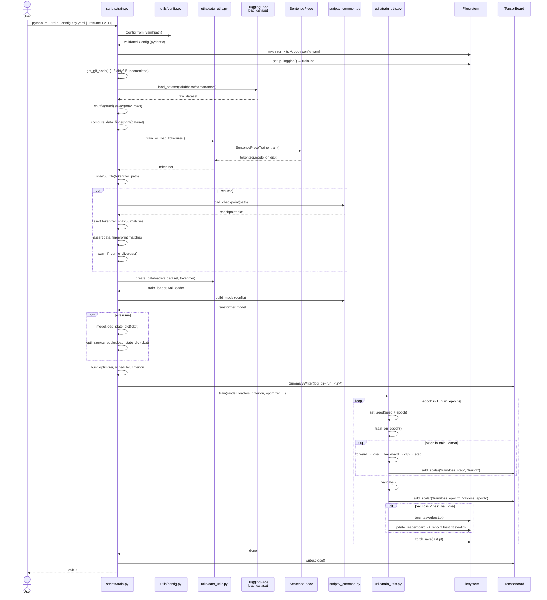
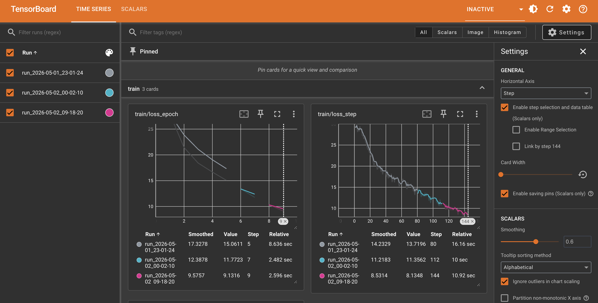
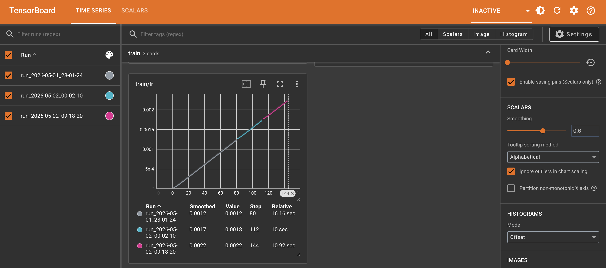
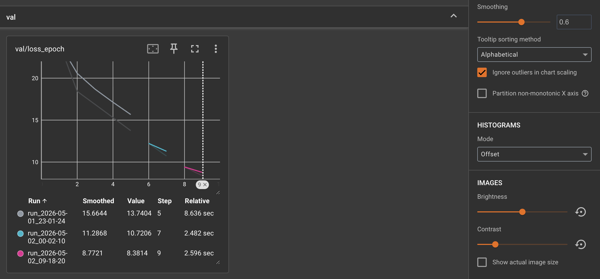

## Table of Contents

1. [Overview — What `train.py` Owns](#overview--what-trainpy-owns)
2. [Flow Diagram — What Calls What, When](#flow-diagram--what-calls-what-when)
3. [On-Disk Layout — Per-Run Timestamped Subdirs](#on-disk-layout--per-run-timestamped-subdirs)
4. [Typed Config — `Config.from_yaml`](#typed-config--configfrom_yaml)
   - [Why pydantic Instead of a Dict](#why-pydantic-instead-of-a-dict)
   - [`extra="forbid"` and `strict=True` — Two Classes of Mistakes](#extraforbid-and-stricttrue--two-classes-of-mistakes)
   - [`@model_validator` — Cross-Field Invariants](#model_validator--cross-field-invariants)
   - [Resolving Relative Paths](#resolving-relative-paths)
5. [The Run Subdir — `run_<timestamp>/`](#the-run-subdir--run_timestamp)
   - [Why a Fresh Subdir Per Invocation](#why-a-fresh-subdir-per-invocation)
   - [`config.yaml` Snapshot — Reproducibility](#configyaml-snapshot--reproducibility)
6. [Git Hash Provenance](#git-hash-provenance)
   - [The `-dirty` suffix](#the--dirty-suffix)
7. [Resume — `--resume` Flow](#resume----resume-flow)
   - [The Resume Preflight — One Place, Three Pins](#the-resume-preflight--one-place-three-pins)
   - [Three Pinning Mechanisms](#three-pinning-mechanisms)
   - [What Gets Restored, What Doesn't](#what-gets-restored-what-doesnt)
   - [`warn_if_config_diverges` — Detecting Silent Drift](#warn_if_config_diverges--detecting-silent-drift)
   - [`load_checkpoint` — Why `weights_only=True`](#load_checkpoint--why-weights_onlytrue)
   - [Tokenizer Sanity Check on Resume](#tokenizer-sanity-check-on-resume)
8. [Data Fingerprint — Pinning Weights to a Data Slice](#data-fingerprint--pinning-weights-to-a-data-slice)
9. [Leaderboard + Symlink — Finding the Best Run](#leaderboard--symlink--finding-the-best-run)
10. [Logging Setup — Why the Whole Body Is Wrapped in `try/except`](#logging-setup--why-the-whole-body-is-wrapped-in-tryexcept)
11. [TensorBoard — Reading the Event Files](#tensorboard--reading-the-event-files)
    - [Launching the UI](#launching-the-ui)
    - [Reading the Charts — Real Example](#reading-the-charts--real-example)
    - [Programmatic Access — `EventAccumulator`](#programmatic-access--eventaccumulator)
12. [End-to-End — One Full Run, Disk to Charts](#end-to-end--one-full-run-disk-to-charts)
13. [CLI — Commands Used in This Session](#cli--commands-used-in-this-session)
14. [References](#references)

---

# Overview — What `train.py` Owns

The training **logic** (forward, backward, validate, checkpoint) lives in [`utils/train_utils.py`](../utils/train_utils.md). [`scripts/train.py`](../../scripts/train.py) is the **orchestrator** — it decides:

- Where on disk this run writes (per-run timestamped subdir)
- Which config produced these weights (snapshotted YAML + git hash)
- Whether this is a fresh run or a resume (and warns if the resumed config drifted)
- Where TensorBoard events go (same per-run subdir as `train.log`)
- How unhandled exceptions land in `train.log` instead of vanishing on stderr

Everything that touches the filesystem outside `model.state_dict()` lives here, so `train_utils.py` stays pure: feed it tensors, get back losses.

```
train.py                          ← orchestration (this doc)
  │
  ├── Config.from_yaml(...)       ← typed config (utils/config.py)
  ├── build_model(...)            ← model constructor (scripts/_common.py)
  ├── load_checkpoint(...)        ← checkpoint loader (scripts/_common.py)
  │
  └── train(...)                  ← training loop (utils/train_utils.py)
        ├── train_on_epoch()
        ├── validate()
        └── _update_leaderboard()
```

---

# Flow Diagram — What Calls What, When

End-to-end sequence of one `python -m transformer.scripts.train` invocation. The diagram makes the cross-file call structure explicit — every arrow is a real function call you can grep for. The `opt --resume` blocks fire only when `--resume PATH` is passed.



How to read it:

- **Solid arrows (`->>`)** = synchronous call. **Dashed (`-->>`)** = return.
- **`opt`** blocks = optional path (only on resume).
- **`loop`** blocks = repeated execution (per-epoch, per-batch).
- **`alt`** blocks = conditional branch (best-vs-not-best save).
- Self-arrows (`train->>train`) = work done inside the same file (e.g., `get_git_hash()` is defined in `train.py`).

> *\* If your VS Code preview shows the raw mermaid source, install the **"Markdown Preview Mermaid Support"** extension (publisher: bierner) and reopen the preview.*

---

# On-Disk Layout — Per-Run Timestamped Subdirs

Every invocation of `train.py` writes to its **own** subdir under `checkpoint_dir/` and `log_dir/`. The subdir name is the wallclock timestamp at startup:

```python
# train.py:112-116
timestamp = datetime.now().strftime("%Y-%m-%d_%H-%M-%S")
run_subdir = f"run_{timestamp}"
run_checkpoint_dir = os.path.join(config.paths.checkpoint_dir, run_subdir)
run_log_dir       = os.path.join(config.paths.log_dir,        run_subdir)
```

After three invocations of `python -m transformer.scripts.train --config configs/tiny.yaml`, the disk looks like:

```
transformer/checkpoints/tiny/
├── best.pt                                   ← symlink → run with lowest val_loss
├── leaderboard.json                          ← all runs, sorted ascending by val_loss
├── run_2026-05-01_23-01-24/
│   ├── config.yaml                           ← snapshot of the YAML used
│   ├── best.pt                               ← this run's best weights
│   └── last.pt                               ← this run's most recent weights
├── run_2026-05-02_00-02-10/
│   ├── config.yaml
│   ├── best.pt
│   └── last.pt
└── run_2026-05-02_09-18-20/
    ├── config.yaml
    ├── best.pt
    └── last.pt

transformer/logs/tiny/
├── run_2026-05-01_23-01-24/
│   ├── train.log                             ← human-readable log
│   └── events.out.tfevents.<...>             ← TensorBoard binary events
├── run_2026-05-02_00-02-10/
│   ├── train.log
│   └── events.out.tfevents.<...>
└── run_2026-05-02_09-18-20/
    ├── train.log
    └── events.out.tfevents.<...>
```

The `checkpoints/` and `logs/` parents are gitignored ([`.gitignore`](../../../.gitignore) lines 55-56) — these are **runtime outputs**, not source.

---

# Typed Config — `Config.from_yaml`

[`utils/config.py`](../../utils/config.py) defines a pydantic model that mirrors the YAML structure exactly. Loading is one line:

```python
config = Config.from_yaml(args.config)
```

## Why pydantic Instead of a Dict

A plain `yaml.safe_load(f)` returns `dict[str, Any]`. Three problems:

```
1. Typo silently ignored:
     config["traning"]["num_epochs"]      → KeyError at the worst possible time
     config["model"]["d_modle"]           → silently 0 / None / default

2. Type confusion:
     d_model: "256"  (string in YAML)    → arithmetic later: TypeError mid-epoch
     num_heads: 8.0  (float instead int) → indexing later: TypeError deep inside MHA

3. Cross-field bugs not caught at load:
     d_model: 100, num_heads: 8          → 100 / 8 = 12.5 → cryptic shape error in attention
```

Pydantic catches all three at the moment of `Config.from_yaml(...)` — before training starts, before the GPU warms up, before you've waited 5 minutes only to crash on a typo.

## `extra="forbid"` and `strict=True` — Two Classes of Mistakes

```python
# config.py:18-22
class _Strict(BaseModel):
    model_config = ConfigDict(extra="forbid", strict=True)
```

| Setting | Catches |
|---|---|
| `extra="forbid"` | Unknown/typo keys: `d_modle: 256` raises `ValidationError` instead of being silently dropped |
| `strict=True` | Wrong types: `d_model: "256"` (string) raises instead of being coerced to `256` |

Every nested config (`ModelConfig`, `TrainingConfig`, ...) inherits from `_Strict` so the strictness is uniform — DRY.

## `@model_validator` — Cross-Field Invariants

Some checks need *multiple* fields. Pydantic field validators only see one field at a time. `@model_validator(mode="after")` runs once **all** fields are set and type-checked:

```python
# config.py:35-41
@model_validator(mode="after")
def _check(self):
    assert self.d_model % self.num_heads == 0, \
        f"d_model ({self.d_model}) must be divisible by num_heads ({self.num_heads})"
    assert 0.0 <= self.dropout < 1.0, f"dropout must be in [0, 1), got {self.dropout}"
    return self
```

Without this, `d_model: 100, num_heads: 8` parses cleanly and crashes inside `MultiHeadAttention.split_heads()` with `RuntimeError: shape '[..., 8, 12]' is invalid for input of size ...` — error message gives you no hint that the **config** is the problem.

## Resolving Relative Paths

YAML stores paths relative to the repo:

```yaml
# tiny.yaml:65-68
paths:
  checkpoint_dir: "transformer/checkpoints/tiny/"
  log_dir: "transformer/logs/tiny/"
  tokenizer_path: "transformer/tokenizer/tiny/sp.model"
```

But `python -m transformer.scripts.train` could be invoked from anywhere. `Config.from_yaml` resolves these against the **repo root** so CWD doesn't matter:

```python
# config.py:99-106
repo_root = Path(__file__).resolve().parents[2]    # utils/ → transformer/ → repo root
for field in ("checkpoint_dir", "log_dir", "tokenizer_path"):
    val = getattr(config.paths, field)
    if not os.path.isabs(val):
        setattr(config.paths, field, str(repo_root / val))
```

`parents[2]` works because `config.py` lives at `<repo>/transformer/utils/config.py` — three parents up from the file is the repo root.

---

# The Run Subdir — `run_<timestamp>/`

## Why a Fresh Subdir Per Invocation

Three invocations on the same day:

```
09:00  python -m transformer.scripts.train --config configs/base.yaml   # crashes at epoch 12
14:00  python -m transformer.scripts.train --config configs/base.yaml   # different lr, completes
20:00  python -m transformer.scripts.train --config configs/tiny.yaml   # debug run
```

Without per-run dirs, all three would **overwrite each other's `best.pt`, `train.log`, and tfevents file**. With per-run dirs, all three coexist and you can compare them side-by-side in TensorBoard.

## `config.yaml` Snapshot — Reproducibility

`train.py` copies the YAML *into* the run dir at startup:

```python
# train.py:120
shutil.copy(args.config, os.path.join(run_checkpoint_dir, "config.yaml"))
```

A year from now, when you load `run_2026-05-02_09-18-20/best.pt` and want to know what config produced it, the answer is one path away — even if `configs/tiny.yaml` has been edited or deleted in the meantime.

This snapshot is also what `--resume` uses to detect config drift (see below).

---

# Git Hash Provenance

Every checkpoint records the commit that produced it, with a `-dirty` suffix if the working tree had uncommitted changes:

```python
# train.py:39-57
def get_git_hash() -> str:
    """
    Return current git commit hash for run provenance, or 'unknown' if not in a repo.
    Appends '-dirty' if the working tree has uncommitted changes — otherwise
    a clean-looking hash would lie about which code actually produced the run.
    """
    try:
        commit = subprocess.check_output(
            ["git", "rev-parse", "HEAD"], stderr=subprocess.DEVNULL
        ).decode().strip()
        # `git status --porcelain` prints one line per modified/untracked file;
        # empty output ⇒ clean working tree.
        dirty = subprocess.check_output(
            ["git", "status", "--porcelain"], stderr=subprocess.DEVNULL
        ).decode().strip()
        return f"{commit}-dirty" if dirty else commit
    except (subprocess.CalledProcessError, FileNotFoundError):
        return "unknown"
```

Saved into the checkpoint dict by `train()`:

```python
# train_utils.py
checkpoint = {
    'epoch': epoch,
    'model_state_dict': model.state_dict(),
    ...
    'git_hash': git_hash,    # commit that produced these weights
}
```

To trace any saved checkpoint back to source:

```python
ckpt = torch.load("transformer/checkpoints/tiny/best.pt", weights_only=True)
print(ckpt["git_hash"])    # → "bc6aeec1f3a9..."  or  "bc6aeec1f3a9-dirty"
# Then: git checkout bc6aeec  →  exact code that produced these weights (if clean)
```

## The `-dirty` suffix

Why we check `git status --porcelain` and append `-dirty`: a commit hash without that suffix is **a lie when you have uncommitted changes**.

Scenario:
```
$ git rev-parse HEAD
bc6aeec1f3a9...               ← last commit

$ git status --porcelain
 M transformer/models/transformer.py    ← modified, not committed
 M transformer/utils/optimizer.py
```

Train now → checkpoint stores `git_hash = "bc6aeec1f3a9..."`. A year later you `git checkout bc6aeec` and try to reproduce: the repo is exactly the committed code, but **none of those uncommitted edits exist**. Different model, different loss curve. The hash silently lied because the code state at training time doesn't exist anywhere — not in any commit, not in any branch.

With `-dirty`:
```
ckpt["git_hash"] → "bc6aeec1f3a9-dirty"
```

You see this and immediately know: "this run can't be exactly reproduced." Standard practice in ML reproducibility tooling (W&B, MLflow, DVC) all log dirty state for the same reason. **Commit before kicking off real training runs** — otherwise the provenance string is a yellow flag that the run is unreproducible.

`git status --porcelain` is the machine-readable form of `git status`:
```
 M file_a.py        ← modified, not staged → dirty
M  file_a.py        ← modified and staged → dirty
?? new_file.py      ← untracked → dirty
                    ← empty output → clean
```

## Why This Matters

Weights alone are useless without the code that defined them. `state_dict` is just a flat `{param_name: tensor}` map — `nn.Module.load_state_dict` matches names and shapes against whatever class you call it on. If the class definition has drifted, the load fails (or worse, silently loads partial weights).

**Concrete failure it prevents.** Say you refactor `MultiHeadAttention` later to fuse Q/K/V into one matrix:

```python
# Before (saved into the checkpoint as 3 separate keys):
self.W_q = nn.Linear(d_model, d_model)
self.W_k = nn.Linear(d_model, d_model)
self.W_v = nn.Linear(d_model, d_model)

# After (now expects one fused key):
self.W_qkv = nn.Linear(d_model, 3 * d_model)
```

Loading the old `best.pt` against the new class:

```
RuntimeError: Error(s) in loading state_dict for Transformer:
    Missing key(s) in state_dict: "...W_qkv.weight", "...W_qkv.bias"
    Unexpected key(s) in state_dict: "...W_q.weight", "...W_k.weight", "...W_v.weight"
```

Without `git_hash`, the checkpoint is bricked — you'd have to guess which commit produced it, eyeballing `git log` and the date in the filename. With it:

```bash
git stash                                              # park current work
git checkout $(python -c "import torch; print(torch.load('best.pt', weights_only=True)['git_hash'])")
# repo is now exactly as it was at training time — old W_q/W_k/W_v class definition is back
python -c "..."                                        # load_state_dict succeeds
# (optionally re-save in the new fused format, then `git checkout -` and `git stash pop`)
```

Same pattern applies to any non-trivial change: renaming a module, adding/removing a sublayer, switching layer norm position (pre-LN vs post-LN), changing default `bias=True/False` on a `Linear`. All of these change `state_dict` keys or shapes.

**Other things the hash unlocks:**

- **Reproducing a result.** A run scored `val_loss=8.38` six months ago. You want to know which config + which code produced it. The hash + the snapshot `config.yaml` in the run dir together pin both.
- **Diffing two runs.** Run A and run B disagree by 2.0 loss. `git diff <hash_A> <hash_B>` shows exactly what changed in the code between them — separates "config drift" from "code drift."
- **Bisecting regressions.** If checkpoints from last week trained better than this week's, the hashes give you the commit range to `git bisect` through.

It's a 20-byte string that turns a "mystery file" into a reproducible artifact.

The `try/except` falls back to `"unknown"` so the script doesn't crash when run outside a git repo (e.g. a fresh clone of the data with no `.git`, or a Docker context without `git` installed).

---

# Resume — `--resume` Flow

```bash
python -m transformer.scripts.train --resume transformer/checkpoints/tiny/run_2026-05-02_09-18-20/last.pt
```

Resuming starts a **new** run subdir (with a fresh timestamp) but threads the prior state into the training loop. Before any of that, a single **preflight block** validates the resume is safe.

## The Resume Preflight — One Place, Three Pins

Resume validation is consolidated in [`train.py`](../../scripts/train.py) right after dataset load. It checks **all three pinning mechanisms** in one block:

```python
if args.resume:
    if not os.path.exists(args.resume):
        raise FileNotFoundError(...)
    if not os.path.exists(tokenizer_path):
        raise FileNotFoundError(f"Resume requires existing tokenizer at {tokenizer_path}")

    tokenizer_sha256 = sha256_file(tokenizer_path)
    checkpoint = load_checkpoint(args.resume, device)

    # 1. Tokenizer hash check  (pins embeddings ↔ tokenizer)
    ckpt_tok_hash = checkpoint.get("tokenizer_sha256")
    if ckpt_tok_hash is None:
        logger.warning("pre-hash run, cannot verify ...")
    elif ckpt_tok_hash != tokenizer_sha256:
        raise RuntimeError("Tokenizer mismatch on resume: ...")

    # 2. Data fingerprint check  (pins weights ↔ data slice)
    ckpt_data_fp = checkpoint.get("data_fingerprint")
    if ckpt_data_fp is None:
        logger.warning("pre-fingerprint run, cannot verify ...")
    elif ckpt_data_fp != data_fingerprint:
        raise RuntimeError("Data slice mismatch on resume: ...")

    # 3. Config drift warning  (warning only, not blocking)
    snapshot_path = os.path.join(os.path.dirname(args.resume), "config.yaml")
    warn_if_config_diverges(snapshot_path, config)
```

**Why one block, not scattered:** earlier iterations had tokenizer validation and data validation in different places. Splitting them led to duplicate `if args.resume:` branches and subtle ordering bugs (e.g. building the model with the wrong vocab_size before discovering the mismatch). The current shape — load dataset → fingerprint it → run preflight → continue with tokenizer/dataloaders/model — fails fast and reads top-to-bottom.

**The `checkpoint` variable is reused.** After preflight loads it for validation, the same dict gets used in the state-restoration block below — no second `load_checkpoint` call.

## Three Pinning Mechanisms

A complete provenance chain ties weights to the inputs that produced them:

| Pin | Mechanism | What it catches |
|---|---|---|
| **Code** | `git_hash` (with `-dirty` suffix) | Same checkpoint, different code → can't reproduce |
| **Tokenizer** | `tokenizer_sha256` of the `.model` file | Same path, retrained tokenizer → vocab IDs silently shifted |
| **Data** | `data_fingerprint` of the resolved slice | Same tokenizer, different rows → fine-tune on different distribution |

Each is its own section below. The preflight checks all three before allowing resume.

## What Gets Restored, What Doesn't

```python
# train.py:241-255
model.load_state_dict(checkpoint["model_state_dict"])
optimizer.load_state_dict(checkpoint["optimizer_state_dict"])
scheduler.load_state_dict(checkpoint["scheduler_state_dict"])

start_epoch   = checkpoint["epoch"] + 1
best_val_loss = checkpoint["best_val_loss"]
```

| Restored | Why |
|---|---|
| `model_state_dict` | Obviously — these are the trained weights |
| `optimizer_state_dict` | Adam's running mean/variance per parameter — momentum |
| `scheduler_state_dict` | LambdaLR's `last_epoch` step counter — keeps the warmup→decay curve continuous |
| `start_epoch` | So we don't redo finished epochs |
| `best_val_loss` | So the first resumed epoch doesn't trivially "beat" `inf` and overwrite `best.pt` |

| **Not** restored | Why |
|---|---|
| RNG state (torch/numpy/random) | Saving it would force `weights_only=False` on load → arbitrary pickle execution. Instead, `train()` re-seeds with `(seed + epoch)` at every epoch start, so resumed runs are bit-identical at epoch boundaries (mid-epoch crashes still diverge until the next epoch). |
| `train_loss` / `val_loss` | Recomputed each epoch — only printed on resume for context. |

## `warn_if_config_diverges` — Detecting Silent Drift

The snapshot in the resumed run dir is compared against the *current* config:

```python
# train.py:236-237
snapshot_path = os.path.join(os.path.dirname(args.resume), "config.yaml")
warn_if_config_diverges(snapshot_path, config)
```

A whitelist of "safe" keys is allowed to differ:

```python
# train.py:64
_RESUME_SAFE_KEYS = {"training.num_epochs", "device", "paths.log_dir"}
```

- `training.num_epochs` — you usually resume to *extend* training (e.g. 30 → 50 epochs)
- `device` — laptop crashed on MPS, resume on a CUDA box
- `paths.log_dir` — log dir is per-run anyway

Anything else triggers a warning:

```
WARNING resumed config differs from checkpoint snapshot:
  model.dropout: 0.1 -> 0.3
  training.label_smoothing: 0.1 -> 0.0
  (continuing — trajectory may differ from the original run)
```

It **warns** rather than blocks — sometimes you genuinely want to change `dropout` mid-training. The point is to surface it loudly so it isn't silent.

## `load_checkpoint` — Why `weights_only=True`

```python
# scripts/_common.py:28-37
def load_checkpoint(path: str, device: torch.device) -> dict:
    return torch.load(path, map_location=device, weights_only=True)
```

| Flag | Effect |
|---|---|
| `weights_only=True` | Refuses to unpickle arbitrary Python objects. A malicious checkpoint can't execute code on load. |
| `map_location=device` | Tensors saved on CUDA load fine on MPS/CPU and vice-versa. Without it, a checkpoint trained on a different machine would crash. |

This is also why we **don't** save RNG state — `torch.Generator` isn't on `weights_only=True`'s allowlist, so saving it would force `weights_only=False`, which we refuse for security reasons.

## Tokenizer Sanity Check on Resume

Two layers of defense — file must exist, AND file must be the *same* file.

### Layer 1 — file must exist

```python
# train.py:165-170
elif args.resume:
    raise FileNotFoundError(
        f"Resume requires existing tokenizer at {tokenizer_path}"
    )
```

If you `--resume` but the tokenizer file is missing, the script **refuses** to train a fresh tokenizer. A new tokenizer would have different vocab IDs — same word "love" → ID 87 in the old tokenizer, ID 142 in the new one. The saved embeddings would map IDs to vectors trained for the old IDs, silently producing garbage.

### Layer 2 — file must be the same file (hash check)

The check above only verifies "*a* tokenizer exists at this path." It doesn't verify "*the* tokenizer that produced these embeddings exists at this path." If you retrained the tokenizer in place (same path, different content), the file exists, the file has the same `vocab_size`, but every word now maps to a different ID. Old layer would let this through; the model would train on nonsense for hours.

To catch this, every checkpoint stores a SHA-256 hash of the tokenizer file:

```python
# train.py:50-56
def sha256_file(path: str) -> str:
    """SHA-256 of a file's bytes — used to pin the tokenizer to a checkpoint."""
    h = hashlib.sha256()
    with open(path, "rb") as f:
        for chunk in iter(lambda: f.read(1 << 16), b""):
            h.update(chunk)
    return h.hexdigest()
```

Saved into the checkpoint dict alongside `git_hash` ([`train_utils.py:294`](../../utils/train_utils.py#L294)):

```python
checkpoint = {
    ...
    'git_hash':         git_hash,
    'tokenizer_sha256': tokenizer_sha256,    # pins these embeddings to a specific tokenizer
}
```

On resume, [train.py:259-275](../../scripts/train.py#L259-L275) recomputes the current file's hash and compares:

```python
ckpt_tok_hash = checkpoint.get("tokenizer_sha256")
if ckpt_tok_hash is None:
    logger.warning("Checkpoint has no tokenizer_sha256 (pre-hash run) — cannot verify.")
elif ckpt_tok_hash != tokenizer_sha256:
    raise RuntimeError(
        f"Tokenizer mismatch on resume:\n"
        f"  checkpoint expects sha256={ckpt_tok_hash}\n"
        f"  current   tokenizer  sha256={tokenizer_sha256}\n"
        ...
    )
```

`None` (pre-hash checkpoints) → warn + continue. Mismatch → crash hard.

### What `hashlib`, `sha256`, etc. actually mean

Skip if you're already familiar. Here's the vocabulary in plain terms.

#### `hashlib`

Python's standard-library module for cryptographic hash functions. **Why you'd reach for it:** you have arbitrary input (a file, a string, a config), and you want a fixed-size **fingerprint** of it. Two desirable properties:

1. **Deterministic** — same input always gives the same fingerprint.
2. **Collision-resistant** — it's astronomically unlikely two different inputs produce the same fingerprint.

That makes it perfect for "is this byte-for-byte the same file as before?" — exactly the question we ask on resume.

#### `sha256`

One specific hash algorithm. The "256" = output is **256 bits** long, regardless of input size.

```
input:  b"hello"           (5 bytes)
sha256: 256 bits of output (32 bytes)

input:  a 10 GB file       (10,000,000,000 bytes)
sha256: 256 bits of output (32 bytes)   ← same length
```

#### Where the 64 hex chars come from

The 256 bits get returned as a **hex string** when you call `.hexdigest()`. Math:

```
256 bits = 32 bytes              (8 bits per byte → 256 / 8 = 32)
1 byte   = 2 hex chars           (4 bits per hex char → 8 / 4 = 2)
32 bytes × 2 hex chars = 64 hex chars
```

Visually:
```
byte:    0x2c   0xf2   0x4d   0xba   ...   (32 of these)
hex:     "2c"   "f2"   "4d"   "ba"   ...   (64 chars total)
```

That's why the log line shows:

```python
# train.py:202
logger.info(f"Tokenizer sha256: {tokenizer_sha256[:12]}...")
```

```
INFO  Tokenizer sha256: a3f2b8c41d9e...
```

`[:12]` because the full 64 chars is unreadable wallpaper in a log. 12 chars is enough to eyeball-compare two runs without looking the same by accident.

#### `update(chunk)`

Feeds bytes into the running hash. The key property: **calling `update()` N times in a row produces the same final hash as calling it once with all the bytes concatenated**.

```python
# All at once:
h1 = hashlib.sha256()
h1.update(b"hello world")
h1.hexdigest()                # → "b94d27b9934d3e08..."

# Chunked:
h2 = hashlib.sha256()
h2.update(b"hello ")
h2.update(b"world")
h2.hexdigest()                # → "b94d27b9934d3e08..."   (identical)
```

That's why we can hash a multi-GB file with only 64KB of RAM — read 64KB, `update`, discard, repeat. Nothing is "saved" by chunking; the full file is still read end-to-end. Chunking is just the **delivery mechanism**, not a sampling strategy.

#### `hexdigest()` vs `digest()`

```python
h = hashlib.sha256(b"hello")
h.digest()       # → b'\x2c\xf2\x4d\xba\x5f\xb0\xa3\x0e...'   (32 raw bytes)
h.hexdigest()    # → "2cf24dba5fb0a30e..."                    (64 hex chars)
```

Same data, two encodings. We use `hexdigest()` because hex strings are JSON-serializable, log-friendly, and copy-pastable. Raw bytes would break `torch.save` if it expected JSON-able metadata.

#### `b""`

Empty **bytes** literal (not a string).

```python
""     # empty STRING (text — Unicode codepoints)
b""    # empty BYTES  (raw bytes)
```

`f.read(64KB)` on a binary file returns **bytes**, not str. At end-of-file, it returns `b""`. That's the sentinel value `iter()` watches for to know it's done:

```python
for chunk in iter(lambda: f.read(1 << 16), b""):
    h.update(chunk)
```

`iter(callable, sentinel)` keeps calling `callable()` and yielding results until one equals `sentinel`. So the loop unrolls to:

```python
chunk = f.read(64KB)    # b"\x00\x01..."  (full chunk)
h.update(chunk)
chunk = f.read(64KB)    # b"\x00..."      (partial last chunk)
h.update(chunk)
chunk = f.read(64KB)    # b""             (EOF — stop)
```

#### `1 << 16` — bitwise left shift

`1 << N` means: take `1`, shift its binary representation **left by N positions**, filling with zeros. Equivalent to `2 ** N`.

Binary view:

```
1       =  00000001               (= 2^0  = 1)
1 << 1  =  00000010               (= 2^1  = 2)
1 << 2  =  00000100               (= 2^2  = 4)
1 << 3  =  00001000               (= 2^3  = 8)
1 << 4  =  00010000               (= 2^4  = 16)
...
1 << 13 =  10000000000000         (= 2^13 = 8192)
1 << 16 =  10000000000000000      (= 2^16 = 65536)   ← the buffer size
1 << 20 =  100000000000000000000  (= 2^20 = 1048576) (1 MB)
```

Why `2^N` in binary is just `1` followed by N zeros:

```
1                = 2^0 = 1
10               = 2^1 = 2
100              = 2^2 = 4
1000             = 2^3 = 8
10000            = 2^4 = 16
...
10000000000000   = 2^13 = 8192
```

Each leftward shift = one more zero appended = one more doubling.

Could just write `65536` or `64 * 1024`. `1 << 16` is a C-ism — visually screams "this is a power of 2, probably a buffer size." Common in low-level Python where buffer sizes get tuned.

### End-to-end scenario

The whole loop, with a real example:

**Day 1 — fresh training run.** Tokenizer is freshly trained:

```
tokenizer/tiny/sp.model  →  sha256 = "a3f2b8c41d9e..."   (call this hash A)

Day 1 checkpoint (run_2026-05-09_10-00-00/last.pt):
  {
    "model_state_dict":   {... embeddings learned against vocab A ...},
    "epoch":              5,
    "git_hash":           "bc6aeec...",
    "tokenizer_sha256":   "a3f2b8c41d9e..."   ← hash A baked into checkpoint
  }
```

In Day 1's run, "love" tokenized to ID 487, so embedding row 487 became the "love" vector.

**Day 3 — accidentally retrain the tokenizer in place.** You change `data.max_rows` and rerun without realizing the tokenizer at the same path will be **overwritten**:

```
tokenizer/tiny/sp.model  →  sha256 = "9b71f02e8c4a..."   (hash B, different bytes)
```

Now "love" tokenizes to ID 1129. Same `vocab_size = 4000`, so no shape mismatch will fire later — but every word maps to a different row in the embedding matrix.

**Day 5 — try to resume Day 1's run:**

```bash
python -m transformer.scripts.train --resume run_2026-05-09_10-00-00/last.pt
```

Inside [`train.py`](../../scripts/train.py):

```python
tokenizer_sha256 = sha256_file(tokenizer_path)        # → "9b71f02e8c4a..."   (current hash B)
checkpoint       = load_checkpoint(args.resume, ...)
ckpt_tok_hash    = checkpoint["tokenizer_sha256"]     # → "a3f2b8c41d9e..."   (saved hash A)

if ckpt_tok_hash != tokenizer_sha256:
    raise RuntimeError(...)                           # ← fires here, training never starts
```

**Without the hash check (old behavior):** training continues. Embedding row 487 was trained as "love" but now the tokenizer feeds it row 1129 for "love." Loss explodes / plateaus / outputs gibberish. You spend hours debugging the model when the bug is "wrong tokenizer."

**With the hash check:** crashes immediately with a clear error pointing at the tokenizer. You either restore the original `sp.model` from a backup or accept that the embeddings are dead and train fresh.

---

# Data Fingerprint — Pinning Weights to a Data Slice

The tokenizer hash answers "is this the same tokenizer?" but **not** "is this the same data?" Same `sp.model` happily tokenizes any text, so a checkpoint trained on one slice of Samanantar can load against a different slice and continue training without error — silently fine-tuning on a different distribution.

The **data fingerprint** closes that gap.

## How it's computed

```python
# train.py:69-88
def compute_data_fingerprint(dataset, dataset_name: str) -> str:
    """
    Deterministic fingerprint of a HuggingFace dataset slice — pins training
    data identity to a checkpoint.

    Hashes (dataset name, length, content of first / middle / last rows). Any
    change to shuffle, max_rows, seed, or the underlying dataset version flips
    at least one of these, so a stale resume against re-sliced data fails fast.
    """
    h = hashlib.sha256()
    h.update(dataset_name.encode())
    h.update(str(len(dataset)).encode())
    indices = [0, len(dataset) // 2, len(dataset) - 1]
    for i in indices:
        row = dataset[i]
        h.update(json.dumps(row, sort_keys=True, ensure_ascii=False).encode())
    return h.hexdigest()
```

Computed right after the slice is materialized:

```python
# train.py:217-219
raw_dataset = raw_dataset.shuffle(seed=seed).select(range(max_rows))
data_fingerprint = compute_data_fingerprint(raw_dataset, config.data.dataset)
```

Saved into the checkpoint dict alongside `git_hash` and `tokenizer_sha256`:

```python
checkpoint = {
    ...
    'git_hash':         git_hash,
    'tokenizer_sha256': tokenizer_sha256,
    'data_fingerprint': data_fingerprint,    # pins these weights to a specific data slice
}
```

## Why three rows is enough

A naive answer would be "hash every row." For a million-pair dataset that's slow and unnecessary. We sample **first / middle / last** because:

- **Different dataset name** → first byte of the hash input differs → fingerprint changes.
- **Different length** (`max_rows` changed, dataset re-uploaded) → second byte differs → changes.
- **Different shuffle / seed** → with overwhelming probability, the row at index 0 (or middle, or last) is now a different row → its JSON serialization differs → changes.

The only way to get the *same* fingerprint with *different* data would be: identical name, identical length, AND identical content at exactly indices `0`, `N/2`, `N-1` despite a different shuffle. That's astronomically unlikely with real text data.

For the use case ("did the user accidentally change the data slice?"), 3 rows is plenty. We're not trying to defend against an adversary crafting a collision — we're catching honest mistakes.

## Real test from this session

Two runs against the same checkpoint, only the seed differs:

**seed=42 (matches checkpoint)** → resume succeeds:
```
INFO  Data fingerprint: 7a02624318f8...
INFO  Resuming from run_2026-05-10_12-03-30/last.pt...
INFO  Loading existing tokenizer...
INFO  Resumed from epoch 5 (train_loss: 15.1417, val_loss: 13.5368)
Epoch 6/7: ...
Epoch 7/7: ...
```

**seed=1250 (different shuffle)** → fails fast:
```
INFO  Data fingerprint: a3a9b303cba0...
ERROR Training failed with unhandled exception
RuntimeError: Data slice mismatch on resume:
  checkpoint trained against fingerprint=7a02624318f8...
  current  data slice    fingerprint=a3a9b303cba0...
The data slice has changed since this checkpoint was saved
(shuffle, max_rows, seed, or upstream dataset version differs).
Resuming would fine-tune on a different distribution.
Either revert your data-selection code, or train fresh without --resume.
```

The user's original 9-epoch run was trained on the *first* 1000 rows of Samanantar (no shuffle). After adding `.shuffle(seed=seed)` to the slice logic, resuming that checkpoint without the fingerprint check would have silently fine-tuned on a totally different 1000 rows. The fingerprint catches it.

## What about the shuffle itself — why was it added?

Original code: `raw_dataset.select(range(max_rows))` — takes the **first** N rows. Samanantar concatenates per-source corpora (PMIndia, Wikipedia, OpenSubtitles, ...), so the first 1000 rows are one domain. A tiny experiment trained and validated on government text generalizes terribly. After scaling `max_rows: 1000 → 5000`, the loss curve changes for reasons that aren't your model code — you've just brought in a different corpus.

Fix: shuffle **with a seed** before selecting:

```python
# train.py:213-216
if config.data.max_rows is not None:
    raw_dataset = raw_dataset.shuffle(seed=seed).select(
        range(min(config.data.max_rows, len(raw_dataset)))
    )
```

Same seed → same N rows. Different sample sizes scale up *quantity*, not *distribution*. Reproducible.

## Backwards compatibility — pre-fingerprint checkpoints

```python
ckpt_data_fp = checkpoint.get("data_fingerprint")
if ckpt_data_fp is None:
    logger.warning(
        "Checkpoint has no data_fingerprint (pre-fingerprint run) — "
        "cannot verify data continuity. Continuing."
    )
```

Old checkpoints (saved before this code existed) don't have the field. Rather than refuse to load them, we **warn + continue**. The user sees:

```
WARNING Checkpoint has no data_fingerprint (pre-fingerprint run) — cannot verify data continuity. Continuing.
```

…and knows this resume can't be data-validated. Once any new checkpoint is saved (including by the resumed run), all future resumes against *that* run get full validation.

## What the fingerprint does NOT pin

- **Tokenization output.** Same data, retrained tokenizer → different token IDs → different embeddings learned. Caught by `tokenizer_sha256`, not this.
- **Filtering / collation logic.** `create_dataloaders` does length filtering and dynamic batching. Changes there aren't reflected in `data_fingerprint` (which fingerprints the *raw* slice). Could be a follow-up.
- **Mid-epoch ordering.** Within an epoch, the dataloader reshuffles. Resumes from mid-epoch are non-bit-identical anyway (RNG state isn't saved).

For the most common drift — "I changed `max_rows` / `shuffle` / `seed` and forgot" — three sample rows is a sharp, cheap detector.

---

# Leaderboard + Symlink — Finding the Best Run

After every improved val_loss, `_update_leaderboard` ([`utils/train_utils.py:17-43`](../../utils/train_utils.py#L17-L43)) updates two things at the parent level:

```
transformer/checkpoints/tiny/
├── best.pt              ← symlink → run_<best>/best.pt   (one fixed path = global best)
├── leaderboard.json     ← all runs, sorted ascending by val_loss
└── run_<ts>/...
```

`leaderboard.json` after three runs:

```json
{
  "run_2026-05-02_09-18-20": 8.381439906912544,
  "run_2026-05-02_00-02-10": 10.720611978476489,
  "run_2026-05-01_23-01-24": 13.740403213079851
}
```

Sorted **ascending by val_loss** (best first), not alphabetically — so the file reads top-down as a ranking. The sort happens once per write:

```python
# train_utils.py:32-36
board[run_name] = val_loss
# Sort ascending by val_loss so the file reads top-down as a ranking.
board = dict(sorted(board.items(), key=lambda kv: kv[1]))
with open(leaderboard_path, "w") as f:
    json.dump(board, f, indent=2)
```

The `best.pt` symlink at the parent points at whichever run is currently #1:

```python
# train_utils.py:38-43
best_run = next(iter(board))                       # first key of insertion-ordered dict
symlink  = os.path.join(parent_dir, "best.pt")
target   = os.path.join(best_run, "best.pt")       # RELATIVE path → portable across moves
if os.path.islink(symlink) or os.path.exists(symlink):
    os.unlink(symlink)
os.symlink(target, symlink)
```

The target is **relative** (`run_2026-05-02_09-18-20/best.pt`, not `/Users/.../checkpoints/tiny/run_.../best.pt`) — so if you `mv transformer/checkpoints/tiny /backup/`, the symlink still resolves correctly inside the new location.

For a full breakdown of the leaderboard helper see the [Leaderboard section in train_utils.md](../utils/train_utils.md#leaderboard--bestpt-symlink--global-ranking-across-runs).

---

# Logging Setup — Why the Whole Body Is Wrapped in `try/except`

```python
# train.py:131-294
try:
    # ... entire training pipeline ...
except Exception:
    logger.exception("Training failed with unhandled exception")
    raise
```

Python's default excepthook writes tracebacks to **stderr only**. If the process is launched in a terminal that gets closed, or run via `nohup ... &`, the traceback is lost — `train.log` ends abruptly with no clue what went wrong.

`logger.exception(...)` writes the full traceback to **every configured handler** — file + console — so the failure is captured in `train.log` regardless of how the process was launched.

```python
# Bare `except Exception` deliberately excludes KeyboardInterrupt:
#   - Ctrl+C should exit cleanly without a 30-line traceback in the log
#   - But a real crash (CUDA OOM, ValueError, etc) gets full forensics
```

`raise` at the end re-raises so the process exits non-zero — important for `make`, CI, or cron wrappers that key off exit code.

---

# TensorBoard — Reading the Event Files

The binary file at `transformer/logs/tiny/run_<ts>/events.out.tfevents.<...>` is a TensorBoard **protobuf** event log. You can't `cat` it usefully — it needs to be replayed by either the TensorBoard UI or its Python API.

## Launching the UI

Point `--logdir` at the **parent** of the run subdirs, not at one specific run:

```bash
tensorboard --logdir transformer/logs/tiny
# then open http://localhost:6006
```

TensorBoard auto-discovers every `events.out.tfevents.*` under that tree and shows each `run_<ts>/` as its own line in every chart — runs become directly comparable.

If `tensorboard` isn't installed:

```bash
uv add --dev tensorboard
```

## Reading the Charts — Real Example

A snapshot of the TIME SERIES tab after three tiny runs (visible in this repo's `transformer/checkpoints/tiny/leaderboard.json`):

```
Runs in left sidebar:
  ● run_2026-05-01_23-01-24   (gray  — first attempt)
  ● run_2026-05-02_00-02-10   (cyan  — second attempt)
  ● run_2026-05-02_09-18-20   (pink  — third attempt, best)
```

### What the chart vocabulary means

When you hover any line, TensorBoard shows a tooltip with four columns: **Run / Smoothed / Value / Step** and a **Relative** time. They look obvious but each one means something specific:

- **Value** — the raw scalar that was actually written by `writer.add_scalar(tag, value, step)`. Exact, no math applied. For `train/loss_step`, that's the per-batch loss; for `train/loss_epoch`, the per-token weighted average from `train_on_epoch`'s return value.

- **Smoothed** — what the bold line on the chart actually draws. Controlled by the **Smoothing** slider in the left panel (default 0.6). It's an exponential moving average over the raw values: `smoothed_t = α × smoothed_{t-1} + (1 − α) × value_t`, with α = the slider value. Higher slider → bolder, slower-reacting line; slider = 0 → smoothed equals value. Useful because per-step loss is noisy (one bad batch spikes it); the smoothed line shows the trend without the spikes.

- **Step** — the `global_step` argument that was passed to `add_scalar`. **This is why different cards report different step counts for the same run:**
  - `train/loss_step` and `train/lr` log every batch ([train_utils.py:147–148](../../utils/train_utils.py#L147-L148)) using `scheduler.last_epoch` (the optimizer's global step counter) → pink reaches step **144** = 9 epochs × 16 batches.
  - `train/loss_epoch` and `val/loss_epoch` log once per epoch ([train_utils.py:274–275](../../utils/train_utils.py#L274-L275)) using the **epoch number** as `step` → pink only reaches step **9**.

  Same run, different counters. The x-axis label changes meaning per chart — "step" is just whatever integer you handed to `add_scalar`. This is why Card 1's x-axis tops out at 9 while Card 2's tops out at 144.

- **Relative** — wall-clock time since this run's first scalar was logged, in seconds (e.g. `12s`, `1m 4s`). Lets you compare *speed* across runs even if they started days apart. Useful when one run is faster per step but worse per second (e.g. larger batch is slower per step but converges faster in real time). Switch the x-axis dropdown from `STEP` to `RELATIVE` to put two runs on the same time axis.



**Card 1 — `train/loss_epoch`** (one point per epoch, weighted-avg loss)

```
loss
 25 │  ╲ gray
    │   ╲╲
 20 │    ╲╲
    │     ╲╲    ← all three runs descend, but at different rates
 15 │      ╲╲╲
    │        ╲╲     gray reads:  17.33 (smoothed) at step 5
 10 │         ╲ cyan              cyan reads: 12.39 at step 7
    │          ╲                  pink reads:  9.58 at step 9
  5 │           ● pink (lowest)
    └──────────────────────────── epoch
       1   3   5   7   9
```

The pink run's curve sitting below the others on the same chart is exactly what the leaderboard says: pink is rank #1 (`val_loss = 8.381`).

**Card 2 — `train/loss_step`** (one point per batch — 144 steps total in pink)

```
loss
 25 │ ▁▂   raw per-batch loss is noisy
    │  ▂▂▃   ↓ but trend is clearly downward
 20 │   ▃▃▄
    │     ▄▄▅                  smoothing slider (0.6) draws the
 15 │       ▅▅▆▆▇                bold line — ignores spikes
    │           ▇▇▇▇█▇▇█▇█      pink at step 144: 8.13 (raw), 8.53 (smoothed)
 10 │                  ▇█▇█▇█▇
    └──────────────────────────── step
       0   40  80  120  144
```

Use **`loss_step`** to spot one-off spikes (a single bad batch). Use **`loss_epoch`** to track real progress — the per-token weighted average is much smoother.



**Card 3 — `train/lr`** (learning rate per step)

```
lr
0.0022 │                              ● pink (step 144)
       │                          ╱
0.0017 │                      ╱           ← still inside warmup
       │                  ╱                  (warmup_steps = 400 in tiny.yaml)
0.0012 │              ╱
       │          ╱             pink reads:  0.00220 at step 144
0.0008 │      ╱                 cyan reads:  0.00170 at step 112
       │  ╱                     gray reads:  0.00120 at step  80
0.0000 │
       └──────────────────────────── step
          0   40  80  120  144
```

The lr is **linear** because `warmup_steps = 400` (tiny.yaml) and the runs only reach ~80–144 steps — the schedule's `min(step^-0.5, step × warmup^-1.5)` is still on the linear `step × warmup^-1.5` branch. If a run had reached step 400, the curve would peak there and start the `step^-0.5` decay (see [`optimizer.md`](../utils/optimizer.md#the-learning-rate-formula)).

This is exactly the sanity-check use case the per-step `train/lr` log was added for: a glance confirms the scheduler is stepping. A flat zero would mean `scheduler.step()` isn't being called; a wrong peak would mean `d_model` or `warmup_steps` is misconfigured.



**Card 4 — `val/loss_epoch`** (validation loss, one point per epoch)

```
loss
 20 │ ╲ gray
    │  ╲╲                       gray reads:  15.07 (smoothed) at step 5
 15 │   ╲╲                      cyan reads:  11.29 at step 7
    │    ╲╲                     pink reads:   8.77 at step 9
 10 │     ╲ cyan
    │      ╲
  5 │       ● pink (lowest)     ← matches leaderboard.json #1: 8.381
    └──────────────────────────── epoch
       1   3   5   7   9
```

This is the chart that drives `best.pt` — `train_utils.py` saves whenever this value hits a new minimum.

## Programmatic Access — `EventAccumulator`

Sometimes you want the raw scalars in Python (e.g. plotting in matplotlib, exporting to a notebook, regression tests on training curves). TensorBoard ships with a reader:

```python
from tensorboard.backend.event_processing.event_accumulator import EventAccumulator

ea = EventAccumulator("transformer/logs/tiny/run_2026-05-02_09-18-20")
ea.Reload()                   # parse the binary file(s)

print(ea.Tags())
# → {'scalars': ['train/loss_step', 'train/lr', 'train/loss_epoch', 'val/loss_epoch'], ...}

for event in ea.Scalars("val/loss_epoch"):
    print(event.step, event.value)
# → 1 13.74
#   2 12.50
#   ...
#   9  8.38                   ← matches leaderboard.json
```

`ea.Scalars(tag)` returns a list of `ScalarEvent(wall_time, step, value)` namedtuples. `wall_time` is Unix seconds — useful for computing per-epoch wallclock duration:

```python
events = ea.Scalars("val/loss_epoch")
for prev, cur in zip(events, events[1:]):
    print(f"epoch {cur.step}: {cur.wall_time - prev.wall_time:.1f}s")
```

---

# End-to-End — One Full Run, Disk to Charts

What actually happens on `python -m transformer.scripts.train --config configs/tiny.yaml`:

```
1. Config.from_yaml("configs/tiny.yaml")
   → pydantic validates extra/strict/cross-field
   → relative paths resolved against repo root

2. timestamp = "2026-05-02_09-18-20"
   → mkdir transformer/checkpoints/tiny/run_2026-05-02_09-18-20/
   → mkdir transformer/logs/tiny/run_2026-05-02_09-18-20/

3. shutil.copy("configs/tiny.yaml",
               "transformer/checkpoints/tiny/run_<ts>/config.yaml")

4. setup_logging(run_log_dir)
   → train.log starts streaming inside run_<ts>/

5. git_hash = get_git_hash()             # e.g. "bc6aeec..."
   → logged + later embedded in every checkpoint dict

6. Load dataset, train/load tokenizer, build dataloaders, build model, ...

7. SummaryWriter(log_dir=run_log_dir)
   → writes events.out.tfevents.<...> alongside train.log

8. train(...)  ← from train_utils.py
   for epoch in range(start_epoch, num_epochs+1):
       set_seed(seed + epoch)
       train_loss = train_on_epoch(...)
           → writer.add_scalar("train/loss_step", ...) every batch
           → writer.add_scalar("train/lr",        ...) every batch
       val_loss   = validate(...)
       writer.add_scalar("train/loss_epoch", train_loss, epoch)
       writer.add_scalar("val/loss_epoch",   val_loss,   epoch)

       if val_loss < best_val_loss:
           torch.save(checkpoint, run_<ts>/best.pt)
           _update_leaderboard(parent, run_<ts>, val_loss)
               → rewrites leaderboard.json (sorted by val_loss)
               → repoints parent/best.pt symlink at the new global #1
       torch.save(checkpoint, run_<ts>/last.pt)

9. writer.close()        # flushes buffered tfevents to disk
```

Final disk state for this single run, layered onto the prior runs:

```
transformer/checkpoints/tiny/
├── best.pt → run_2026-05-02_09-18-20/best.pt    (symlink, repointed)
├── leaderboard.json                              (rewritten, this run on top)
├── run_2026-05-01_23-01-24/...
├── run_2026-05-02_00-02-10/...
└── run_2026-05-02_09-18-20/                     ← new
    ├── config.yaml
    ├── best.pt                                  (val_loss = 8.381...)
    └── last.pt
```

Then `tensorboard --logdir transformer/logs/tiny` lights up all three runs side-by-side, exactly as in the screenshots above.

---

# CLI — Commands Used in This Session

The exact invocations exercised during development, all from the repo root inside the `uv` venv. Examples below use `base.yaml` (the paper-sized config); for the smoke-test config swap `base` → `tiny` everywhere — same flags, same flow, only the path changes.

### Fresh training run

```bash
uv run python -m transformer.scripts.train --config transformer/configs/base.yaml
```

Creates `transformer/checkpoints/base/run_<ts>/` with `config.yaml`, `best.pt`, `last.pt`, and a sibling `transformer/logs/base/run_<ts>/` with `train.log` + tfevents.

### Resume from an existing checkpoint

```bash
uv run python -m transformer.scripts.train \
    --config transformer/configs/base.yaml \
    --resume transformer/checkpoints/base/run_2026-05-02_09-18-20/last.pt
```

Triggers the resume preflight: tokenizer hash check → data fingerprint check → config drift warning. Succeeds only if the current tokenizer file and dataset slice match the ones recorded in the checkpoint.

### Resume that **must fail** — proves the fingerprint works

Change `data.seed` (e.g. 42 → 1250) in the YAML, then resume against a checkpoint trained with the old seed:

```bash
uv run python -m transformer.scripts.train \
    --config transformer/configs/base.yaml \
    --resume transformer/checkpoints/base/run_2026-05-02_09-18-20/last.pt
# RuntimeError: Data slice mismatch — checkpoint was trained on a different shuffle/seed/max_rows.
```

A different seed → different shuffled rows → different fingerprint → fail fast before the model silently overfits a new slice with old weights.

### Launch TensorBoard

```bash
tensorboard --logdir transformer/logs/base
# then open http://localhost:6006
```

Pointing `--logdir` at the family dir (not a single `run_<ts>/`) overlays every run in that family for side-by-side comparison.

### Inspect the leaderboard / best symlink

```bash
cat transformer/checkpoints/base/leaderboard.json     # all runs sorted ascending by val_loss
ls -l transformer/checkpoints/base/best.pt            # symlink → current global best run
```

---

# References

1. [pydantic — `model_config = ConfigDict(...)`](https://docs.pydantic.dev/latest/api/config/) — `extra`, `strict`, validators
2. [PyTorch `torch.load(weights_only=True)`](https://pytorch.org/docs/stable/generated/torch.load.html) — safe-load mode introduced for the pickle-RCE class of bugs
3. [TensorBoard `EventAccumulator` source](https://github.com/tensorflow/tensorboard/blob/master/tensorboard/backend/event_processing/event_accumulator.py) — programmatic scalar access
4. [`logger.exception` docs](https://docs.python.org/3/library/logging.html#logging.Logger.exception) — auto-attaches `exc_info` to the log record
