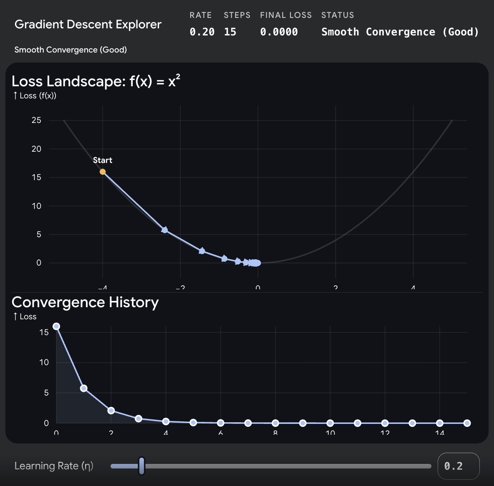
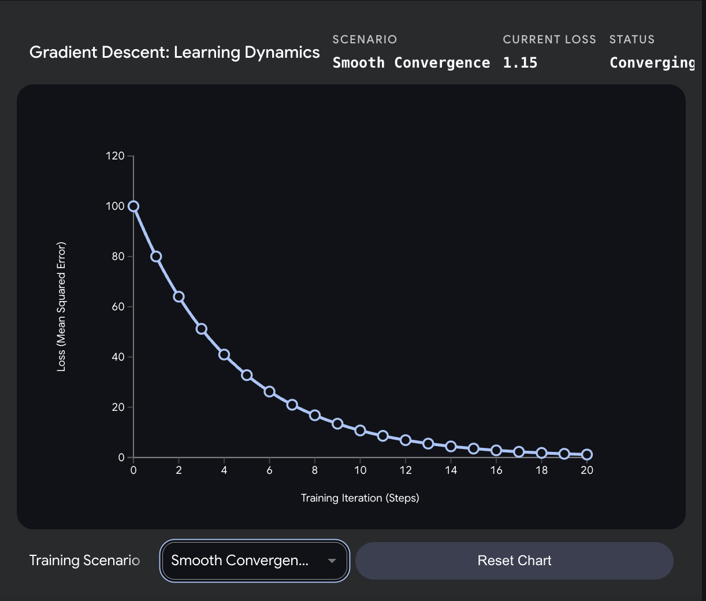
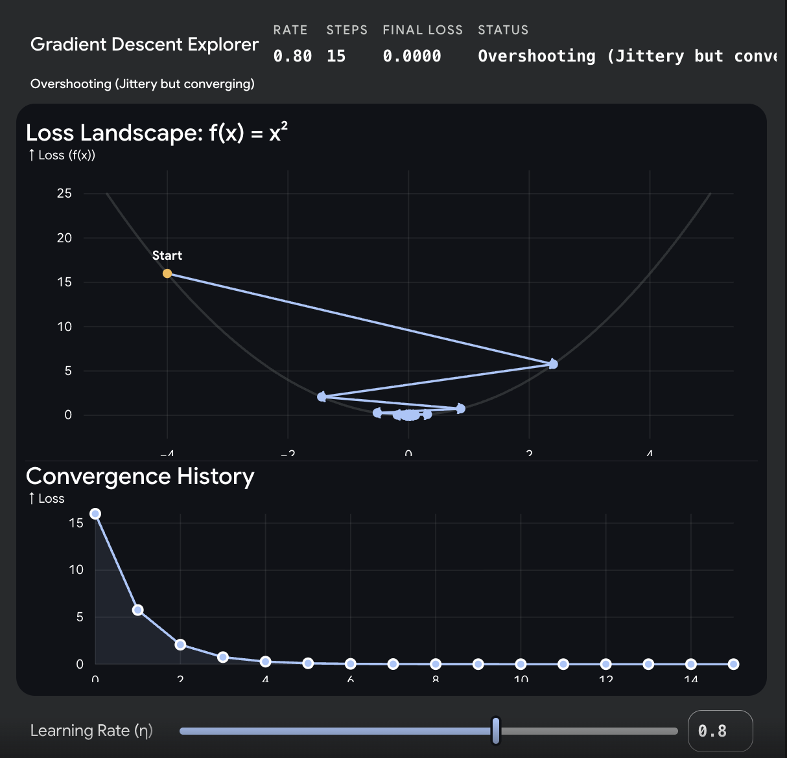
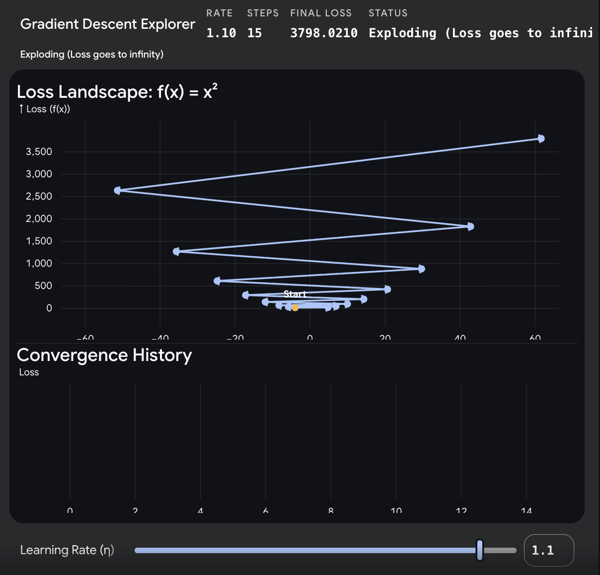
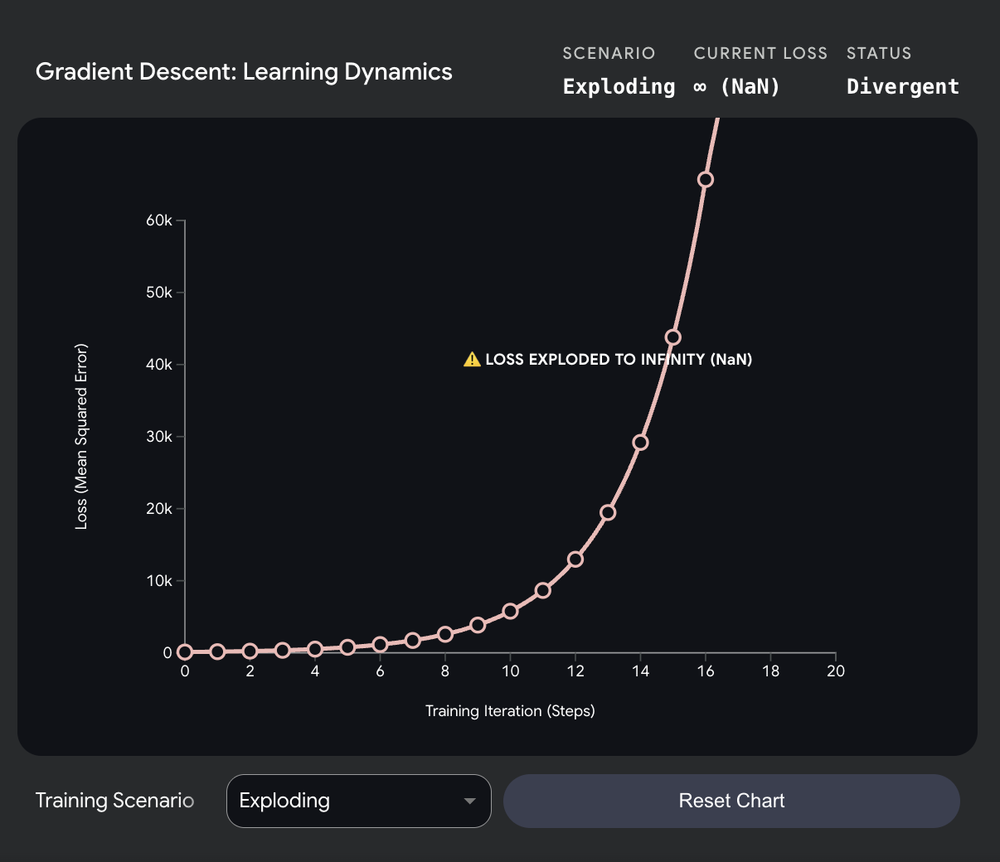

## Table of Contents

1. [What the Paper Says](#what-the-paper-says)
2. [The Learning Rate Formula](#the-learning-rate-formula)
3. [Math Example — Step by Step](#math-example--step-by-step)
4. [Why Warmup + Decay?](#why-warmup--decay)
5. [Exploding vs Overshooting — What Goes Wrong Without It](#exploding-vs-overshooting--what-goes-wrong-without-it)
6. [Code Explanation](#code-explanation)
   - [`TransformerScheduler`](#transformerscheduler)
   - [`build_optimizer`](#build_optimizer)
7. [How It Connects to the Training Loop](#how-it-connects-to-the-training-loop)
8. [How Scheduler Updates Optimizer's Learning Rate](#how-scheduler-updates-optimizers-learning-rate)
   - [What `param_groups` Is](#what-param_groups-is)
   - [What Happens Inside `scheduler.step()`](#what-happens-inside-schedulerstep)
   - [Why `lr=1.0` in Adam — The Placeholder Trick](#why-lr10-in-adam--the-placeholder-trick)
9. [References](#references)

---

# What the Paper Says

From **"Attention Is All You Need"** (Vaswani et al., 2017), Section 5.3 — Optimizer:

> "We used the Adam optimizer with β₁ = 0.9, β₂ = 0.98, ε = 10⁻⁹. We varied the learning rate over the course of training, according to the formula:
>
> lr = d_model⁻⁰·⁵ × min(step⁻⁰·⁵, step × warmup_steps⁻¹·⁵)
>
> This corresponds to increasing the learning rate linearly for the first warmup_steps training steps, and decreasing it thereafter proportionally to the inverse square root of the step number. We used warmup_steps = 4000."

---

# The Learning Rate Formula

```
lr = d_model^(-0.5) × min(step^(-0.5), step × warmup_steps^(-1.5))
     ^^^^^^^^^^^^^^^^   ^^^^^^^^^^^^^^^^^^^^^^^^^^^^^^^^^^^^^^^^^^
     scaling factor      min picks the smaller of two curves
```

Quick exponent refresher:

```
x^(-0.5) = 1/√x         (negative exponent = reciprocal)
x^(-1.5) = 1/(x × √x)   (since 1.5 = 3/2, so x^(3/2) = x × √x)
```

**Two curves inside `min()`:**

| Term | Formula | Behavior |
|---|---|---|
| Decay term | `step^(-0.5)` = `1/√step` | Decreases as step grows |
| Warmup term | `step × warmup_steps^(-1.5)` | Increases linearly with step |

`min()` picks whichever is smaller:

- **During warmup** (step < warmup_steps): warmup term is smaller → lr increases linearly
- **During decay** (step > warmup_steps): decay term is smaller → lr decreases as `1/√step`
- **At step = warmup_steps**: both terms are equal → **peak lr**

```
lr
│        peak at step 4000
│          ╱╲
│        ╱    ╲
│      ╱        ╲
│    ╱            ╲──────────
│  ╱                          ╲──────
│╱
└─────────────────────────────────── step
  warmup          decay
```

**Why `d_model` in the formula?**

Larger model → more parameters → gradients are naturally larger. So the peak lr should be smaller:

```
d_model = 512  → peak lr ≈ 0.0007
d_model = 1024 → peak lr ≈ 0.0005
```

It auto-scales — you don't have to manually tune lr for different model sizes.

---

# Math Example — Step by Step

With `d_model = 512`, `warmup_steps = 4000`:

```
lr = 512^(-0.5) × min(step^(-0.5), step × 4000^(-1.5))
     ^^^^^^^^^^^
     = 1/√512 = 0.0442
```

## Phase 1 — Warmup (step < 4000): second term wins

**At step 1:**

```
min(1^(-0.5), 1 × 4000^(-1.5))
= min(1.0, 1 × 0.00000395)
= min(1.0, 0.00000395)
= 0.00000395                    ← smaller, so this wins

lr = 0.0442 × 0.00000395 = 0.000000175
```

**At step 2000:**

```
min(2000^(-0.5), 2000 × 4000^(-1.5))
= min(0.02236, 2000 × 0.00000395)
= min(0.02236, 0.0079)
= 0.0079                        ← still smaller

lr = 0.0442 × 0.0079 = 0.000349
```

**At step 4000 (peak):**

```
min(4000^(-0.5), 4000 × 4000^(-1.5))     # 4000^(1-1.5) = 4000^(-0.5)
= min(0.01581, 4000 × 0.00000395)
= min(0.01581, 0.01581)
= 0.01581                       ← equal! this is the peak

lr = 0.0442 × 0.01581 = 0.000699   ← peak lr ≈ 0.0007
```

## Phase 2 — Decay (step > 4000): first term wins

**At step 10000:**

```
min(10000^(-0.5), 10000 × 4000^(-1.5))
= min(0.01, 0.0395)
= 0.01                          ← now first term is smaller

lr = 0.0442 × 0.01 = 0.000442
```

**At step 100000:**

```
min(100000^(-0.5), 100000 × 4000^(-1.5))
= min(0.00316, 0.395)
= 0.00316

lr = 0.0442 × 0.00316 = 0.0001397
```

## Summary Table

```
step      lr            phase
─────     ──────────    ─────
1         0.000000175   warmup (linear increase)
2000      0.000349      warmup
4000      0.000699      peak ← max lr
10000     0.000442      decay (√step decrease)
100000    0.000140      decay
```

The `min()` is the trick — during warmup the linear term (`step × warmup_steps⁻¹·⁵`) is smaller so it controls lr. After warmup the decay term (`step⁻⁰·⁵`) is smaller so it takes over. At exactly `step = warmup_steps`, they're equal — that's the peak.

---

# Why Warmup + Decay?

## Problem 1 — Early training (no warmup)

At step 1, the model's weights are random → gradients are noisy and large. A high lr would cause:

```
Random weights → huge gradients → large weight updates → loss explodes
```

Warmup fixes this: start with a tiny lr, let gradients stabilize, then gradually increase.

## Problem 2 — Late training (no decay)

After many steps, the model is close to a good solution. A high lr would:

```
Near-optimal weights → large updates → keeps overshooting → never converges
```

Decay fixes this: shrink lr over time so updates get smaller and finer.

## The two phases

```
Warmup (steps 1–4000):
  Random weights → noisy gradients → small lr → safe exploration
  lr increases linearly: "I'm getting more confident, take bigger steps"

Decay (steps 4000+):
  Trained weights → stable gradients → shrinking lr → fine-tuning
  lr decreases as 1/√step: "I'm close to the answer, take smaller steps"
```

## Why not just use a constant lr?

```
Constant small lr:    slow everywhere (takes forever to train)
Constant large lr:    explodes early, overshoots late
Warmup + decay:       safe early, fast middle, precise late
```

---

# Exploding vs Overshooting — What Goes Wrong Without It

Gradient descent tries to find the lowest point (the minimum) of a loss curve by taking steps downhill. The size of these steps is controlled by the **learning rate**. Below we show what happens on a simple loss curve (`Loss = x²`) at three different learning rates.

## Smooth Convergence (lr = 0.2)



With a small learning rate, the model walks smoothly down the loss curve without ever crossing the minimum. Each step is small and controlled.

```
Rate: 0.20 | Steps: 15 | Final Loss: 0.0000 | Status: Smooth Convergence (Good)
```



```
Loss vs Step (Smooth Convergence):

100 │●
    │ ╲
 80 │  ●
    │    ╲
 60 │     ●
    │      ╲
 40 │       ●──●
    │            ╲
 20 │             ●──●──●
    │                     ╲──●──●──●──●──●
  0 │
    └──────────────────────────────────────── step
      smooth decrease → converges to 0
```

## Overshooting (lr = 0.8)



When the learning rate is a bit too high, the steps are so large that the model **crosses over the minimum** to the other side of the curve. It bounces back and forth across the valley. It might eventually settle at the bottom, but the path is highly inefficient and jittery.

```
Rate: 0.80 | Steps: 15 | Final Loss: 0.0000 | Status: Overshooting (Jittery but converging)
```


```
Loss vs Step (Overshooting):

160 │●
    │ ╲
 80 │   ╲  ╱╲
    │    ╲╱  ╲   ╱╲
 40 │         ╲ ╱  ╲  ╱╲
    │          ╲    ╲╱  ╲──╲
  0 │                        ╲──●──●──●
    └─────────────────────────────────── step
      jittery but eventually converges
```

The math of what's happening:

```
Step 1000: weight = 2.1   (optimal is 2.0)
           update = -0.3   ← too big!
           new weight = 1.8  ← jumped past 2.0

Step 1001: weight = 1.8
           update = +0.4   ← overcorrects!
           new weight = 2.2  ← jumped past again
```

```
     2.0 = optimal
      ↓
──────╳──────
  ←2.2  1.8→    ← bouncing back and forth, never settling
```

With decay, the lr shrinks so the steps get smaller:

```
Step 10000: lr = 0.0004   → small update → lands closer
Step 20000: lr = 0.0003   → smaller update → lands even closer
Step 50000: lr = 0.0002   → tiny update → basically at optimal
```

## Exploding (lr = 1.1)



When the learning rate is **way** too high, the step size is so massive that the algorithm overshoots the minimum and lands **higher up** the curve than where it started. Because the curve is steeper higher up, the next step is even larger. It gets trapped in a vicious cycle where every step pushes it further and further away from the minimum.

```
Rate: 1.10 | Steps: 15 | Final Loss: 3798.0210 | Status: Exploding (Loss goes to infinity)
```



```
Loss vs Step (Exploding):

60k │                                          ╱
    │                                        ╱
40k │                                      ╱
    │                                   ╱
20k │                                ╱
    │                          ╱──╱
  0 │ ●──●──●──●──●──●──●──╱
    └─────────────────────────────── step
      loss shoots to infinity → NaN
```

**NaN = Not a Number.**

When a number gets too large for the computer to store (beyond ~10³⁰⁸), it becomes `inf` (infinity). Then math on `inf` produces `NaN`:

```
Step 3:  loss = 847.0
Step 4:  loss = 2,500,000.0
Step 5:  loss = inf           ← too large to represent
Step 6:  loss = inf - inf     ← undefined math
         = NaN                ← "I give up, this isn't a number"
```

Once `NaN` appears, everything it touches becomes `NaN`:

```
NaN + 5 = NaN
NaN × 0 = NaN
NaN > 0 = False
NaN == NaN = False    ← NaN isn't even equal to itself!
```

Training is dead at this point — every gradient is `NaN`, every weight update is `NaN`. You have to stop and restart with a lower learning rate.

The math of what's happening:

```
new_weight = old_weight - lr × gradient
           = 0.5 - 0.01 × 500        ← large lr × huge gradient
           = 0.5 - 5.0
           = -4.5                      ← weight jumped way too far
```

Next step, the weight is at -4.5 (a crazy place), so the gradient is even bigger → even bigger jump → even crazier weight → loss explodes:

```
Step 1: loss = 8.5
Step 2: loss = 15.2      ← getting worse
Step 3: loss = 847.0     ← way worse
Step 4: loss = NaN       ← dead
```

## How to Spot This in Real Life

If you are ever training a model and your progress bar says `Loss: 4.2` then `Loss: 18.5` then `Loss: 245.9` and finally `Loss: NaN`... you have an exploding gradient. The immediate fix is almost always to **lower your learning rate**.

## One-Line Summary

**Smooth = safe steps, reaches minimum. Overshoots = bouncing around the minimum but eventually settles. Explodes = loss goes to infinity, training is dead.**

---

# Code Explanation

## `TransformerScheduler`

```python
class TransformerScheduler:
    def __init__(self, d_model: int, warmup_steps: int = 4000):
        self.d_model = d_model
        self.warmup_steps = warmup_steps

    def __call__(self, step: int) -> float:
        step = max(step, 1)
        return self.d_model ** (-0.5) * min(step ** (-0.5), step * self.warmup_steps ** (-1.5))
```

**Why no `super().__init__()`?**

`TransformerScheduler` is a **plain Python class**, not an `nn.Module`:

```
nn.Module subclass → needs super().__init__() to register parameters, buffers, etc.
Plain class        → doesn't need it (no PyTorch machinery to initialize)
```

We don't need PyTorch to track anything here — no weights, no gradients. It's just a function with state (`d_model`, `warmup_steps`).

**Why `__call__`?**

`LambdaLR` expects a **function** that takes `step` and returns a number:

```python
# LambdaLR wants this:
scheduler = LambdaLR(optimizer, lr_lambda=some_function)
# Where some_function(step) → float
```

We could use a plain function:

```python
def schedule(step):
    step = max(step, 1)
    return 512 ** (-0.5) * min(step ** (-0.5), step * 4000 ** (-1.5))

scheduler = LambdaLR(optimizer, lr_lambda=schedule)
```

But `d_model` and `warmup_steps` are hardcoded. `__call__` makes an **object behave like a function** — a function that **remembers** its config:

```python
# Without __call__ — hardcoded:
def schedule(step):
    return 512 ** (-0.5) * min(...)    # stuck with 512

# With __call__ — configurable:
schedule = TransformerScheduler(d_model=512, warmup_steps=4000)
schedule(100)    # ← calling the object like a function
                 #   Python runs schedule.__call__(100)

schedule2 = TransformerScheduler(d_model=1024, warmup_steps=8000)
schedule2(100)   # uses 1024 — different config, same interface
```

`LambdaLR` doesn't care if it receives a function or an object — it just calls `lr_lambda(step)`. Python's `__call__` makes both work the same way.

**In our codebase**, we never needed `__call__` before because `nn.Module` handles it for us. When you do `model(x)`, PyTorch calls `model.__call__(x)` which internally calls `model.forward(x)`. So `forward` **is** the `__call__` — `nn.Module` wraps it for you. Here we're not using `nn.Module`, so we define `__call__` directly.

## `build_optimizer`

```python
def build_optimizer(
    model: nn.Module,
    d_model: int,
    betas: tuple = (0.9, 0.98),
    eps: float = 1e-9,
    warmup_steps: int = 4000,
) -> tuple:
    optimizer = Adam(
        params=model.parameters(),
        lr=1.0,
        betas=tuple(betas),
        eps=eps
    )
    scheduler = LambdaLR(optimizer, lr_lambda=TransformerScheduler(d_model, warmup_steps))
    return optimizer, scheduler
```

**Why `lr=1.0`?**

`LambdaLR` sets the actual lr by multiplying:

```
actual_lr = base_lr × lambda(step)
          = 1.0     × TransformerScheduler(step)
          = 1.0     × whatever the formula returns
          = whatever the formula returns
```

With `base_lr = 1.0`, the multiplication is a no-op — the schedule **fully** controls lr. If we set `base_lr = 0.5`, it would halve the paper's formula, which we don't want.

`lr=1.0` means: **"I'm not adding any scaling. Let the scheduler decide everything."**

**Adam hyperparameters from the paper:**

| Parameter | Paper Value | PyTorch Default | Why Different |
|---|---|---|---|
| β₁ | 0.9 | 0.9 | Same |
| β₂ | 0.98 | 0.999 | Paper uses lower β₂ |
| ε | 10⁻⁹ | 10⁻⁸ | Paper uses smaller ε |

---

# How It Connects to the Training Loop

The optimizer doesn't process data — it **updates model weights** after the loss is computed.

```
Forward pass (data flows):
  src, tgt → model.forward() → logits → loss.forward() → scalar loss

Backward pass (gradients flow):
  loss.backward() → gradients stored in each parameter's .grad

Optimizer step (weights update):
  optimizer.step() → uses .grad to update each parameter
  scheduler.step() → adjusts lr for next step
```

In the training loop (`train_utils.py`, not yet written):

```python
# Build once before training:
optimizer, scheduler = build_optimizer(model, d_model=512, warmup_steps=4000)
criterion = LabelSmoothedLoss(pad_idx=0, smoothing=0.1)

# Each training step:
logits = model(src, tgt, src_mask, tgt_mask, memory_mask)      # forward
loss = criterion(logits.view(-1, vocab_size), target.view(-1))  # compute loss
loss.backward()                  # compute gradients
optimizer.step()                 # update weights using gradients
scheduler.step()                 # adjust lr for next step
optimizer.zero_grad()            # clear gradients for next step
```

**Input:** `build_optimizer` takes the `model` — it reads `model.parameters()` to know which weights to update.

**Output:** Nothing returned to the codebase. It modifies the model's weights **in-place**. After `optimizer.step()`, the model's weights are slightly different → next forward pass produces better logits.

```
step 1: model weights = random → loss = 8.5
        optimizer.step() updates weights
step 2: model weights = slightly better → loss = 7.2
        optimizer.step() updates weights
step 3: model weights = better still → loss = 5.8
        ...
step N: model weights = trained → loss = 0.3
```

---

# How Scheduler Updates Optimizer's Learning Rate

A common question: "The scheduler computes a new LR each step — but how does the optimizer know about it?"

Answer: the scheduler **directly overwrites** the optimizer's internal `lr` value. No return value, no message passing.

## What `param_groups` Is

Every PyTorch optimizer stores its config in a list called `param_groups`:

```python
optimizer = Adam(model.parameters(), lr=1.0, betas=(0.9, 0.98), eps=1e-9)

optimizer.param_groups = [
    {
        'lr': 1.0,                    ← scheduler overwrites THIS
        'betas': (0.9, 0.98),
        'eps': 1e-9,
        'params': [all model parameters (millions of tensors)]
    }
]
```

When `optimizer.step()` runs, it reads `param_group['lr']` to compute the weight update:

```
new_weight = old_weight - lr × gradient
                          ↑
                    reads from param_groups[0]['lr']
```

## What Happens Inside `scheduler.step()`

Our scheduler is `LambdaLR` wrapping `TransformerScheduler`. When you call `scheduler.step()`, two things happen inside PyTorch's source code:

**Step 1 — Compute new LR** (`LambdaLR.get_lr()` in `lr_scheduler.py` line 373):

```python
# Inside LambdaLR
def get_lr(self):
    return [
        base_lr * lmbda(self.last_epoch)
        #  1.0   × TransformerScheduler.__call__(step)
        #  1.0   × d_model^(-0.5) × min(step^(-0.5), step × warmup^(-1.5))
        #       = the paper's formula directly
    ]
```

This calls our `TransformerScheduler.__call__(step)` — the formula from Section 5.3.

**Step 2 — Write LR into optimizer** (`LRScheduler.step()` in `lr_scheduler.py` line 245):

```python
# Inside LRScheduler (parent class)
def step(self):
    values = self.get_lr()                    # ← calls LambdaLR.get_lr() above

    for param_group, lr in zip(self.optimizer.param_groups, values):
        param_group["lr"] = lr                # ← HERE! directly overwrites optimizer's lr
```

Line 245 is where the magic happens: `param_group["lr"] = lr`. The scheduler reaches into the optimizer's internal dict and replaces the LR value.

**The full chain:**

```
scheduler.step()
    → LRScheduler.step()
        → LambdaLR.get_lr()
            → TransformerScheduler.__call__(step)
                → returns 0.000699 (at step 4000, for example)
            → 1.0 × 0.000699 = 0.000699
        → optimizer.param_groups[0]['lr'] = 0.000699    ← overwritten!
    → next optimizer.step() uses lr = 0.000699
```

## Why `lr=1.0` in Adam — The Placeholder Trick

```python
optimizer = Adam(params=model.parameters(), lr=1.0, ...)
#                                            ↑ placeholder
```

`LambdaLR` computes: `actual_lr = base_lr × lambda(step)`

```
actual_lr = 1.0 × TransformerScheduler(step)
          = 1.0 × (whatever the paper's formula returns)
          = whatever the paper's formula returns
```

With `base_lr = 1.0`, the multiplication is a no-op — the schedule **fully** controls LR. If we had set `lr=0.001` in Adam:

```
actual_lr = 0.001 × TransformerScheduler(step)
          = 0.001 × 0.000699    ← at step 4000
          = 0.000000699          ← way too small! broke the paper's formula
```

`lr=1.0` means: "I'm not adding any scaling. Let the scheduler decide everything."

**Concrete example — step 4000 (peak LR):**

```
Before scheduler.step():
    optimizer.param_groups[0]['lr'] = 0.000349    ← from step 3999

scheduler.step():
    TransformerScheduler(4000) = 256^(-0.5) × min(4000^(-0.5), 4000 × 4000^(-1.5))
                               = 0.0625 × 0.01581
                               = 0.000988
    base_lr × 0.000988 = 1.0 × 0.000988 = 0.000988

After scheduler.step():
    optimizer.param_groups[0]['lr'] = 0.000988    ← overwritten!

Next optimizer.step():
    for each parameter:
        weight -= 0.000988 × gradient    ← uses the new lr
```

---

# References

1. [Attention Is All You Need](https://arxiv.org/abs/1706.03762) — Vaswani et al., 2017 (Section 5.3: Optimizer)
2. [Mastering Learning Rate Schedulers in Deep Learning](https://medium.com/@limemanas0/mastering-learning-rate-schedulers-in-deep-learning-38790635cf71) — overview of LR schedulers including LambdaLR
